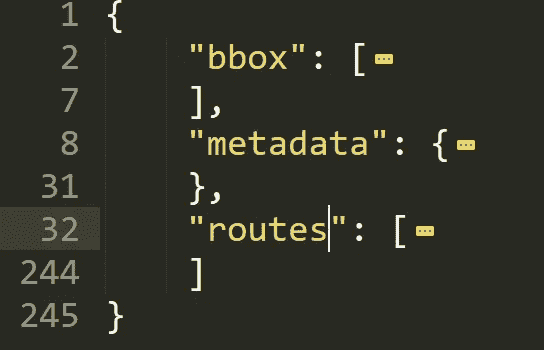
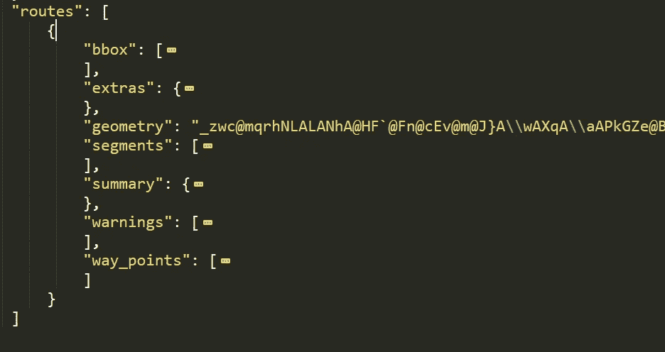
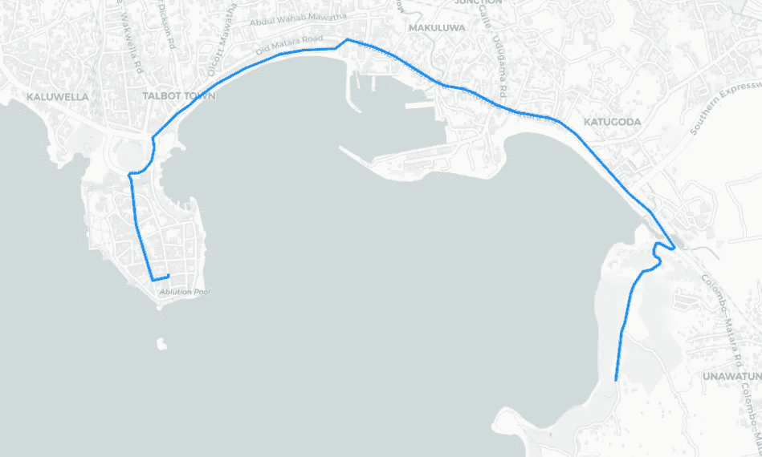
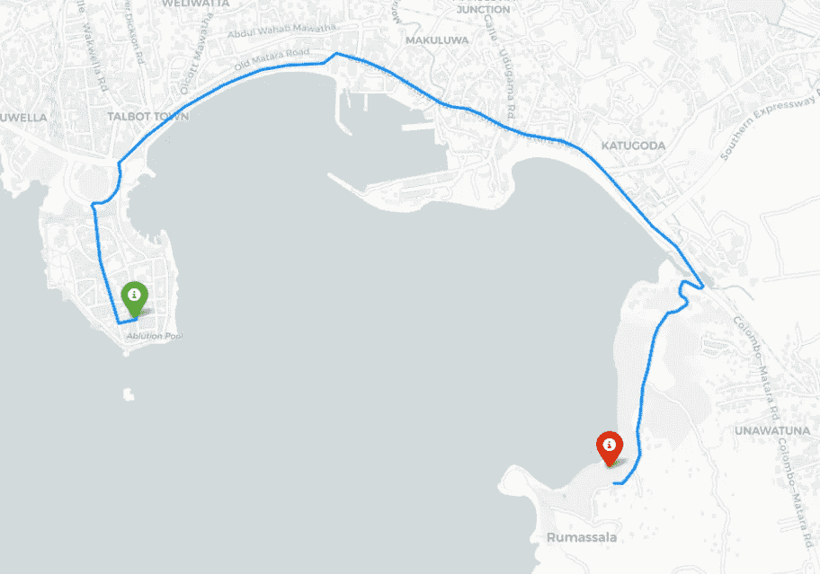
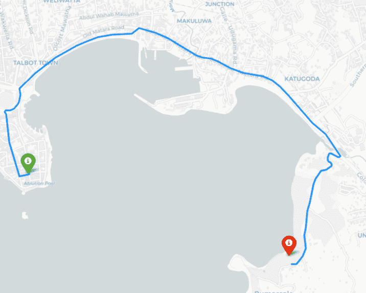
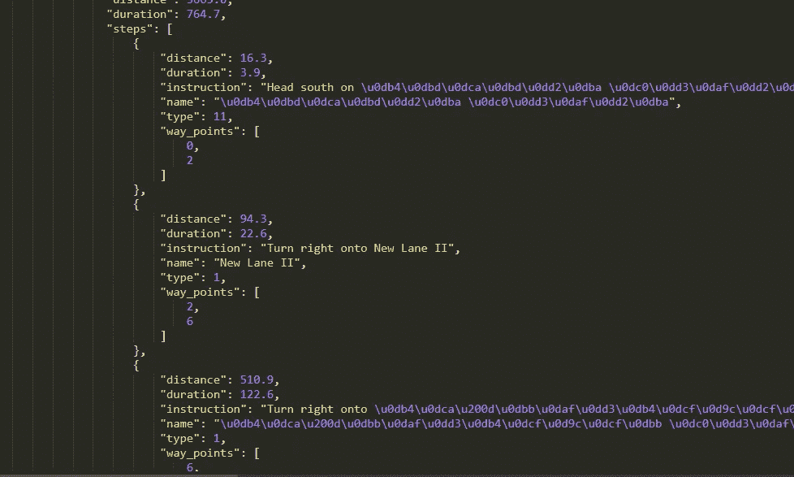

# 如何使用 Python 测量行驶距离、时间并绘制地理位置之间的路线。

> 原文：<https://medium.com/analytics-vidhya/measure-driving-distance-time-and-plot-routes-between-two-geographical-locations-using-python-39995dfea7e?source=collection_archive---------0----------------------->


曾经尝试为您的数据科学项目寻找开源工具或解决任何现实世界的路由问题吗？没有明确的想法就结束了？如果是这样，这篇快速阅读会引导你走向正确的道路。

## 我们正在使用的工具，

*   如果你是一个数据即爱好者，你可能已经听说过叶。叶是流行的[小叶. js](https://leafletjs.com/) 库的 python 包装器。这是一个易于使用和流畅的交互式地理数据可视化库。
*   [openrouteservice](https://openrouteservice.org/)——基于开放标准和开放地理数据为汽车、行人和自行车提供路线服务。

## 安装所需的库，

当我们继续使用 Python 语言时，我们可以运行，

```
pip install openrouteservice folium 
```

用于安装所需的库。

## 导入和试运行、

如果你仔细观察你的回答，你会看到下面的结构。



response.json

在我们的例子中，我们只在之后使用 routes 属性。让我们看看 routes 属性。



路线结构

因为我们的目的是在给定点之间绘制路线，所以我们可以使用路线的几何属性。默认情况下，方向 API 返回[编码的折线](https://developers.google.com/maps/documentation/utilities/polylinealgorithm)。

别担心，我们有一个内置的方法可以将其解码成 Python 字典。

```
geometry = client.directions(coords)['routes'][0]['geometry']
decoded = convert.decode_polyline(geometry)
print(decoded)
```

这将打印出我们可以在可视化部分使用的 GeoJSON 几何对象。

## 绘制路径，

这是输出。



绘制路径

用这几行代码，我们就画出了两点之间的路线。没有源点和目的点，当前的视图是不完整的。我们也来补充一下。



现在我们创建了两个地理位置的基本地图。然后，尝试添加更多的功能，比如节目时长，两点之间的行驶距离。

要访问旅行时间和持续时间，我们可以使用 summary 属性。


它以米和分钟为单位返回给定点之间的距离和持续时间。

首先，我们需要为单击路线时的弹出窗口准备文本。

```
distance_txt = "<h4> <b>Distance :&nbsp" + "<strong>"+str(round(res['routes'][0]['summary']['distance']/1000,1))+" Km </strong>" +"</h4></b>"duration_txt = "<h4> <b>Duration :&nbsp" + "<strong>"+str(round(res['routes'][0]['summary']['duration']/60,1))+" Mins. </strong>" +"</h4></b>"
```

接下来，我们可以使用以下方式将其添加到地图中，

```
folium.GeoJson(decoded).add_child(folium.Popup(distance_txt+duration_txt,max_width=300)).add_to(m)
```

最后，我们得到了这个输出。



随意使用 API 和其他响应属性，例如

```
routes[0]['segments']
```



## 完整代码，

此外，您可以根据您的用例使用一些替代方案，

*   [开源路由机器(OSRM)](http://project-osrm.org/)-现代 C++路由引擎，用于道路网络中的最短路径。

渴望知道你对这篇文章的反馈。谢谢！

***参考文献***

*   [https://github.com/GIScience/openrouteservice-py](https://github.com/GIScience/openrouteservice-py)
*   [https://auto GIS-site . readthedocs . io/en/latest/notebooks/L5/02 _ interactive-map-folio . html](https://autogis-site.readthedocs.io/en/latest/notebooks/L5/02_interactive-map-folium.html)