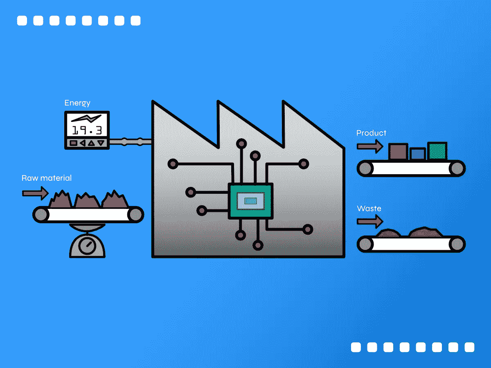
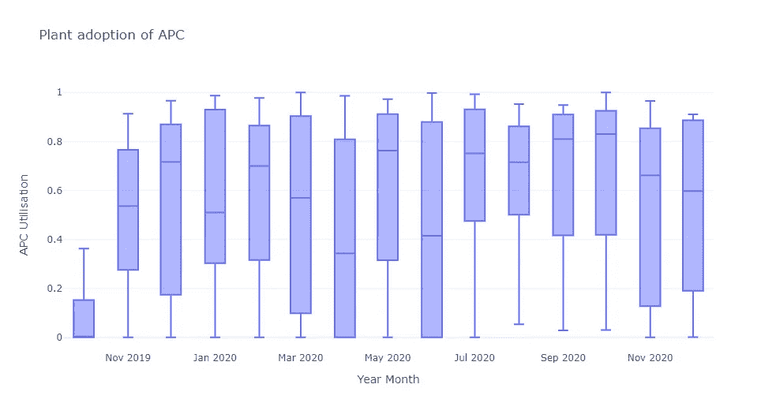
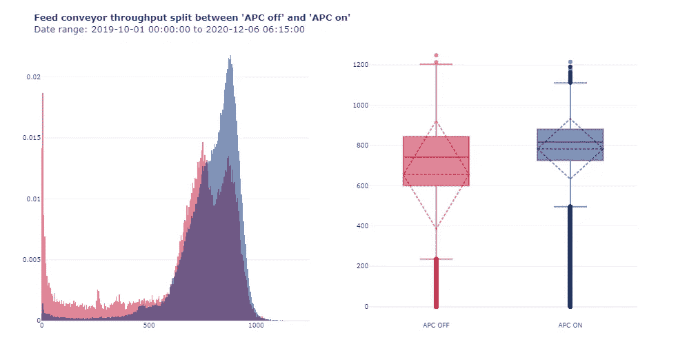
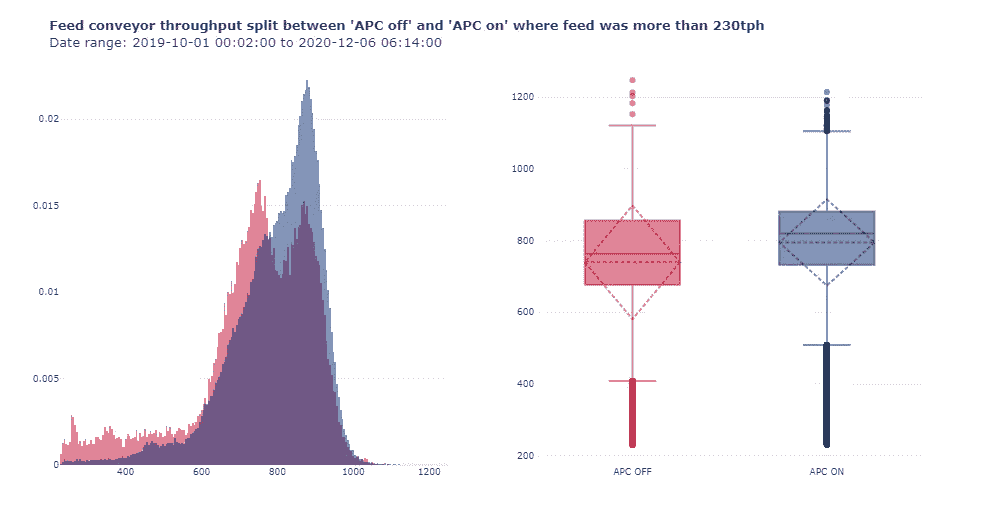
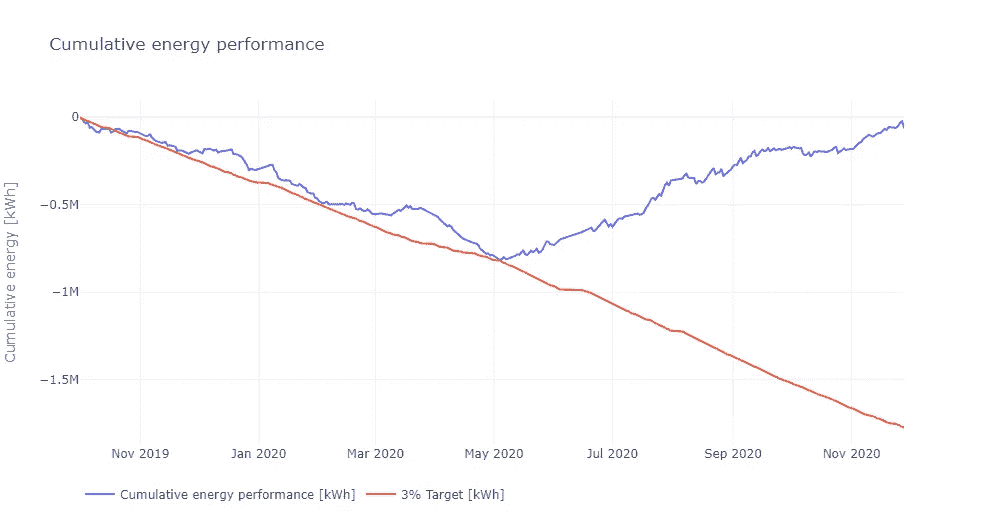

# 通过先进的过程控制衡量过程改进

> 原文：<https://medium.com/analytics-vidhya/measuring-process-improvements-with-advanced-process-control-32945f3ff2e5?source=collection_archive---------23----------------------->

***先进过程控制(或 APC)增加了一个额外的控制层，目的是提高工厂生产和能源性能。***

APC 是基本单输入单输出控制之上的附加控制层。APC 可以同时评估多个输入和输出，并将其与实时进行短期预测的能力相结合。添加 APC 层需要大量的专业知识，并且会增加流程的复杂性，那么实际上有什么好处呢？

# **APC 解决什么问题？**

下面显示了一个简化的工艺概述，其中工厂从库存中接收原材料进行加工，并通过进料输送机上的重量计进行测量。然后原料经过几个阶段的加工，得到的物流是可销售的产品(约为原料的 60%)和废物。能源消耗由工厂主电源上的能量计计量。

基本流程表示。图片作者。

工厂操作员需要连续监测和控制几个电路，并与现场人员保持联系，进行检查和维护。由于需要管理许多手动控制，操作员根本无法始终以最佳方式操作工厂，工厂性能也可能因操作员经验而异。

> APC 的目的是通过自动化手动控制，稳定工厂的进料，然后推动生产达到工厂的设计能力。

# **现实世界的数据是杂乱的**

历史过程数据最初仅在每天的时间间隔内可用，由操作员使用称重计的每日累计器标签记录在电子表格中。作为该项目的一部分，实施了一个数据历史记录程序，因此过程数据现在以一分钟为间隔进行历史记录。这是与 APC 的实施一起完成的，因此可用的粒度历史数据有限。能量计量系统每半小时提供一次能量数据，具有长期历史记录。

对于过程的分析，由于需要更详细的过程数据，所以使用了来自历史记录的更细粒度的数据。对于能源性能分析，使用每日汇总数据，以便能够使用手动记录的历史数据。由于该模型将基于整个设施，它应允许创建更好的模型，因为详细的过程变量在此时不可用。

# **工厂操作员是否采用了 APC？**

APC 实施的挑战在于观念的改变，即不再追求最高产量的瞬时指标(吨/小时),如在控制室中看到的那样，而是追求更一致的产量，这将在一天内交付总体上更多的产品。APC 与控制室内的操作员一起接受委托，以获得最大程度的认同并提供在职培训。

APC 在操作员设定的范围内运行。有时，当 APC 遇到限制时，运营商又回到了试图获得更多吞吐量的旧习惯，他们限制了操作范围。这意味着该范围没有为算法提供足够的空间来基于当前的操作条件进行稳定和优化。

使用历史记录中的数据，我们可以跟踪工厂运行时的 APC 利用率。APC 利用率是显示操作员采用水平的关键指标，因为他们需要在工厂启动后手动打开 APC 控制。

每月每日 APC 使用率。

2019 年 10 月，APC 投入使用，预计在此期间利用率会很低。此后，除了 2020 年 4 月和 2020 年 6 月，平均利用率超过 50%，第一次与 COVID 锁定有关，第二次是由于工厂关闭。

> 平均 APC 利用率表明工厂运营商采用良好。

# 与生产相关的好处是什么？

数据被过滤以包括工厂运行时的数据(基于过程运行信号)，并被分成 APC 关闭期和 APC 开启期(基于控制器模式)。这种比较是根据进入工厂的两个主要进料重量计的平均值进行的。

吞吐量的直方图和箱线图。

有一段时间，过程正在运行，但没有产品饲料，这是偏向的结果更有利于先进生产控制。值得注意的是，当过程达到一定条件时，APC 控制器将打开。为了纠正这一点，在重量计上应用了额外的过滤，以仅包括进料超过 230 吨/小时的数据(基于 APC off 数据的较低晶须)，这产生了更公平的比较。

吞吐量柱状图和箱线图，吞吐量超过 230 吨/小时。

从图表和统计数据来看，使用 APC 控制后，过程更加稳定，标准偏差降低了 24.0%，产量增加了 7.5%，从 739.2 吨/小时增加到 794.6 吨/小时。

只有 12.2%的 APC 偏离数据可能会使结果有偏差，但较小的数据选择显示了可比较的结果。另一个观察结果是，APC off 直方图显示了两种不同的模式，因为这是手动操作，而 APC on 显示了预期的更偏左的分布。这是因为 APC 的目标是最大化吞吐量以达到上限。

> 过程稳定性有所提高，工厂生产量增加了 7.5%。

# **APC 是否能提高能效？**

对过程的良好理解对于建立一个好的能量分析模型是必不可少的。这是一个简单的工厂过程，不涉及加热或冷却，因此外部温度的影响可以忽略不计。大部分能量消耗受原料的影响。根据能源管理中使用的测量和验证协议，基线期被选定为 2019 年的前九个月，因为第一个控制器于 2019 年 10 月初实施。

需要将来自几个来源的数据组合起来进行分析，其中有相当多明显的异常值不适合过程上下文。该分析仅考虑了生产期，即产量超过每天 230 吨的时期；然而，在非生产期可能有其他节能机会，但这不在本分析的范围之内。

开发了一个回归模型，该模型将预测从 2019 年 10 月起的预期能耗。累积和是预期能耗和实际能耗之间差异的累积和。负的 CUSUM 趋势(向下)表明工厂使用的能源比预期的少，因此是节约的。正向趋势表明消耗的能量比预期的多，而水平线表明预期的能量消耗和实际的能量消耗相同(或至少相似)。

累积能源性能——工厂预期和实际能源消耗之间差异的累积总和。

从 CUSUM 图中可以观察到明显的下降趋势，表明与实施 APC 时相比，能效提高了约 3%。然而，从 2020 年 5 月左右开始，能源消耗显著增加，并持续高于预期(约 6%)，呈上升趋势。

增加的原因与增加的额外设备有关，这些设备用于与电厂无关的其他工艺；然而，它是由同一个工厂供电的。在这种情况下，需要创建一个新的基线模型，通过包含相关变量或单独计量附加设备，将附加设备考虑在内。

> 在运营的前六个月，能源绩效提高了 3%。

# **结论**

随着 APC 的实施，工厂运行更加一致，生产能力也有所提高。操作员采用了新的控制技术，让他们有更多的时间专注于其他重要任务。更高的流程效率带来了更好的能源性能，但从 2020 年中期开始，初始模型不再具有代表性，需要重新审视。

*分析可在我的* [*GitHub 回购*](https://github.com/cnrd-dev/apc-process-improvement) *中获得。*