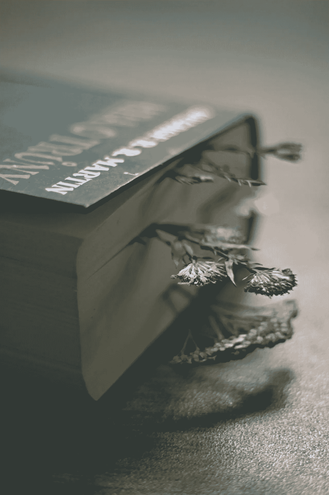
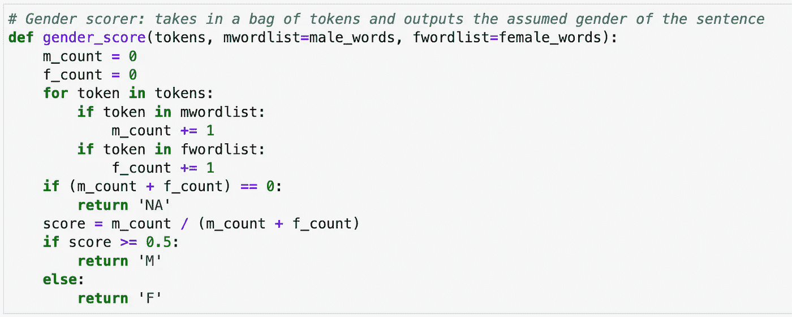
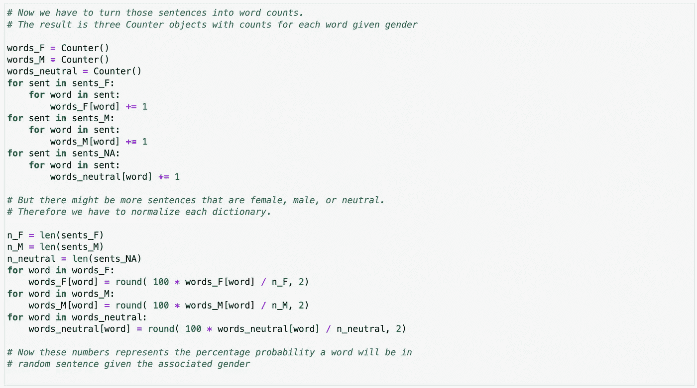
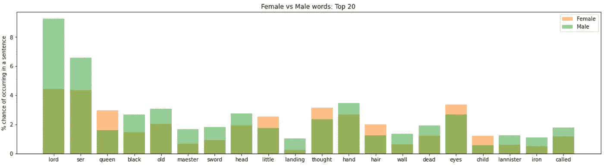
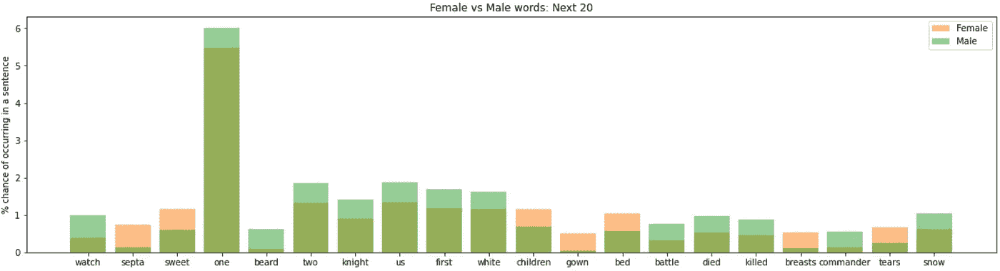

# 测量《权力的游戏》中的性别歧视

> 原文：<https://medium.com/analytics-vidhya/measuring-sexism-in-game-of-thrones-4f6dd47df09e?source=collection_archive---------15----------------------->

## 用性别情感分析法对《冰与火之歌》的简要分析。

图片由 [PetraSolajova](https://pixabay.com/users/petrasolajova-3836323/) 从 [Pixabay](https://pixabay.com/) 拍摄

乔治·r·r·马丁的《冰与火之歌》的批评常常指向小说的性别歧视本质。但是在一个发生在中世纪式社会的故事中，你如何区分世界上的性别歧视和作品中的性别歧视？

这些书的情节需要这些人物生活在一个极度厌恶女性的环境中。珊莎本质上是婚姻人质。布蕾妮因其不女性化而被嘲笑。但这并不意味着马丁必须用刻板印象的方式来描述这些人物和他们的思想。那么…他有吗？

衡量文章性别歧视的一个方法是衡量书籍的文体结构。换句话说，乔治·r·r·马丁写他的女性角色和写他的男性角色是一样的吗？

为了开始回答这个问题，我想用性别情感分析来建立一些证据，证明 ASOIAF 是否有任何文体偏见。简而言之，我会对 ASOIAF 小说中的每一句话进行情感分析，并把它分成“男性”句和“女性”句。然后，我们可以看到哪些特定的单词最突出地与每个(二元)性别相关。这不是一个万无一失的方法——即使在最好的情况下(我说的最好是指最清晰的结果),像*弱*或*弱*这样的词出现在与女性相关的句子中，这仍然有可能反映了书中的世界而不是作者。我将试图解释这些结果，但无论如何你可以得出自己的结论。作为该系列的铁杆粉丝，我意识到我自己也有一些偏见。

值得注意的是，这项分析将在性别是二元的假设下进行——这是一个有问题的假设，尤其是考虑到该系列的复杂性。但是为了性别情感分析的目的，我们必须进行简化。

## 性别计分器

下面是我为一个*性别计分器*编写的代码——它接受一个标记化的句子，并返回它是否与男性相关、与女性相关，或者都不是。为了做到这一点，我统计了一组男性和女性单词列表中单词的出现次数。这些词汇表改编自尼尔·卡隆创造的词汇表，而这些词汇表又改编自丹尼尔·苏彻创造的词汇表。

性别计分员代码

## 按性别统计字数

现在我有了一个性别计分器，下一步就是把 ASOIAF 的每个句子分成三个部分:男性相关的句子、女性相关的句子和中性句子。我在名为 **sents_F** 、 **sents_M** 和 **sents_neutral** 的 python 列表中收集了这些句子。

从性别划分的句子中，我需要提取每种类型中最常见的单词(不包括首先划分句子的性别情感单词)。我为每种类型创建了 Counter()对象，并循环遍历每个句子中的每个单词，以计算这些单词在每个句子列表中出现的次数。最后，我通过将每个计数除以相关的句子列表长度来标准化计数，然后乘以 100 得到百分比。

顺便提一下，我在计算时跳过了一些单词。这些*停用词*由过于频繁出现而无用的句法桥词组成:`the`、`and`等。我还跳过了剧中主要角色的名字。我先用名字做了一次分析，毫不奇怪地发现名字与某些性别高度相关。这是一个很好的检查，以确保性别情绪成功地识别女性和男性角色，但最终无助于解释。

最终结果是三个计数器对象，每个对象对应一种性别类型，其中每个条目都是给定句子的性别情感时该单词出现的百分比。也就是 P[字|性别]。

性别字数代码

## 结果

一旦我有了按性别分类的每个单词的概率计数，最后要做的事情就是解释结果。我用图表标出了每种性别类型的热门词汇。

在查看数据之前，重要的是要知道*你在找什么**。我将文体性别歧视的证据定义为男性句子中与力量和权力相关联的词语，以及女性句子中与无能为力相关联的词语。男性、女性和中性句子之间的高相关性表明缺乏文体性别歧视。*

**

*按性别分组的热门词汇*

*这些图表在性别分类上看起来相当相似。`one`、`lord`、`ser`占据各榜单前三名。`back`、`well`、`like`、`eyes`、`see`、`made`、`never`、`even`、`face`，以相近的概率出现在每一个榜单上。*

*最常见的男性词汇(`lord`、`ser`、`one`)在概率上比最常见的女性词汇或中性词更常见:它们出现在 6-8%的男性相关句子中，而不是 4-5%。这是一个有趣的怪癖。其他顶词每句密度差不多，而这三个词在男性句子中出现的比例相对较高。这可能并不令人惊讶，因为该系列中的许多男性角色都是领主或骑士(头衔为*爵士*)。女性角色大多没有这些头衔(尽管塔斯的布蕾妮有时非正式地称之为 ser)。`One`不过，很有意思。我想不出一个合理的解释来解释它的高男性判决概率。*

*列表中只有几个概率截然不同的词:`queen`、`little`、`old`、`black`。其中一些很简单。“女王”是女性头衔，正如“勋爵”是男性头衔一样。“黑色”可能指的是守夜人——一个全男性的秩序。*

*那么有文体性别歧视的迹象吗？在与女性相关的句子中，我们确实有更常见的单词`little`。这可能是一个小小的，降低了女性角色的假定权力和印象。话说回来，人们可能会认为女性个体的身体平均比男性个体小。这个词的目的和作用是有争议的。*

*这是数据的另一个图表:这次我按照男女单词概率的最大差异对单词进行排序。换句话说，这些是性别类别之间最具歧视性的单词。*

**

*前 20 个区别词*

**

*接下来的 20 个区别词*

*正如我们所料，我们在顶部看到了`lord`和`ser`。提到战争的词大多是男性。这并不奇怪，因为大多数男性角色都可以战斗。`maester`多为男性。在书中，学士是一个只有男人才能担任的职位。同样，`septa`是女性的位置。`iron`这个词男性色彩更浓——它可以指很多东西:铁群岛、刀剑、铁匠。*

*一些有趣的单词是身体部位。`head`、`hand`、`beard`更偏重男性，而`hair`、`eyes`、`breasts`则是女性。艾琳·戴维斯做了一个很棒的项目，是关于文学作品中对男性和女性身体的不同描述。这种模式似乎至少在一定程度上适用于 ASOIAF。*

*其他最让我跳出来的词是与女性相关的词`little`、`sweet`和`tears`。这些似乎遵循传统的女性刻板印象，是一个线索，可能有一些文体性别偏见。另一方面，只有三个突出的性别偏见的词可能不多；没什么可比较的就不好说了。这个项目的一个更全面的版本将对大量书籍进行同样的分析，以比较它们之间性别偏见词汇的存在。将《ASOIAF》与其他奇幻书籍进行比较，尤其是女性奇幻书籍，将是一个非常有趣的后续。*

## *结论*

*这一分析远非详尽无遗。虽然我无法回答《冰与火之歌》是否本质上是一部性别歧视剧的问题，但我确实设法为关于 ASOIAF 女性形象的辩论添加了一些证据。*

*事实上，我设法在乔治·马丁的作品中找到了一些文体性别歧视的小证据。女性角色的书写与男性角色略有不同——最突出的是`little`、`sweet`和`tears`等词的使用显著增加，以及身体描述的差异。然而，我怀疑这种差异不会比你在当今大多数流行小说中发现的更多。*