# 使用、开放数据、ArcGIS 和 Sklearn 测量洛杉矶的城市相似性。

> 原文：<https://medium.com/analytics-vidhya/measuring-urban-similarities-in-los-angeles-open-data-arcgis-sklearn-71b3bef53ea6?source=collection_archive---------10----------------------->

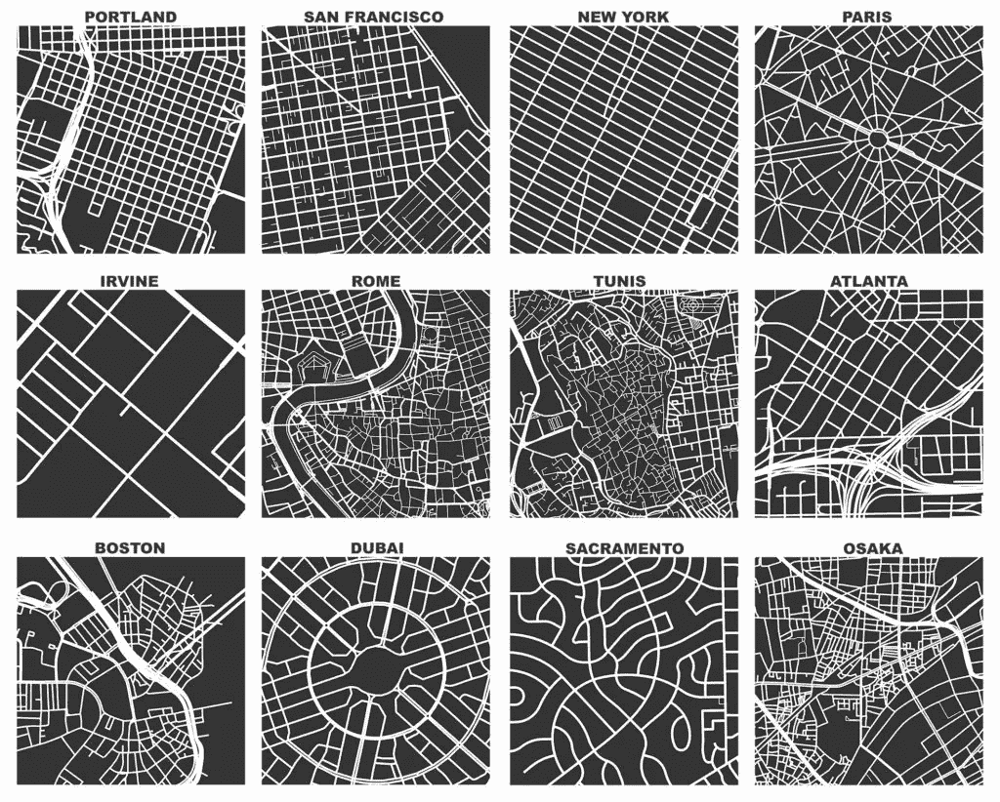

## 寻找相似的地方

在探索了测量城市幸福感的方法后， [*看看城市的空间幸福感，使用 Tweepy、文本 Blob 和 ArcGIS*](/analytics-vidhya/a-look-at-spatial-happiness-in-cities-using-tweepy-text-blob-and-arcgis-c60c50cb64b0) *，*我继续寻找使用空间数据来收集关于我们城市环境的重要信息的方法。当一位朋友提到，作为一名城市规划者，她花了很多时间来确定与她的项目类似的地方作为先例时，我很感兴趣。先例研究通常是城市规划项目的第一步。目标是从类似的项目中找出适用的想法。如果我们能够量化地点之间的相似性，这将有助于城市规划者找到新的和相似的地点作为先例。但它的用途不仅限于城市规划。这也将有助于商业和房地产。一个零售商可能想找到那些它已经成功的领域。房地产经纪人可能对快速识别客户可能喜欢的区域感兴趣。

我决定为这样一个工具快速构建一个概念证明。由于我朋友的用例激起了我的兴趣，我开始思考地点的哪些方面将为她的先例搜索定义相似性。在寻找先例时，城市规划者希望找到具有相似城市结构(街道网络、建筑结构、土地利用类型、人口密度)和人口统计数据(收入、文化、年龄)的地方。在本文中，我将介绍我所采用的量化邻里相似性的方法和决策，并展示数据科学方法如何提供关于我们城市的有用见解。

## 测量邻域

为了识别邻域之间的相似性，我们必须定义一个邻域。人们知道什么是邻里，但是一个一致的定义是难以捉摸的。为了这个项目，我借用了城市规划中常用的 10 分钟步行/ 1/2 英里半径，并创建了 1/2 SQMI 网格作为我的邻居单元。它有些粗糙，但足够精细，可以得出一些有用的见解。

下一个要回答的问题:两个邻域应该有哪些相似的特征才算相似？我们会在意这两个地方是否有相似类型的餐馆吗？我们关心街道的布局吗，例如，是否在网格中？一个地方的政治怎么样？还是别的？在这种情况下，城市结构和人口统计是最重要的衡量特征。如果某个地方有相似的结构和人，它足够相似，可以作为一个高质量的先例。如果您正在寻找房地产的相似性，例如，确定某人可能想买房子的地方，重要的特征可能会有所不同。也许你会关心学校质量或停车位。我不知道，如果你从事房地产行业，请告诉我！

决定关注结构和人口统计的相似性后，我开始收集所需的数据。为了保持工作量的可管理性并避免潜在的数据不一致，我只将我的工具集中在洛杉矶县。它是美国人口最多的县，拥有非常丰富的开放式 GIS 数据目录；这是一个开始的好地方。

**城市结构数据**

基于我在城市规划方面的经验，我选择了四个与城市结构相关的特征:人口密度、交叉口密度、地块密度和商业用地密度。在这些特征中有显著差异的地方可能会感觉彼此结构不同。人口密度与城市或农村特征有关，交叉口密度与活动交通和汽车交通优先级有关，地块密度与城市规模有关，商业密度与当地功能有关。

为了设计结构特征，我将人口普查和开放城市数据从洛杉矶县地理中心导入 ArcGIS。人口密度是通过 ESRI 的丰富工具使用 2018 年美国社区调查(ACS)的人口估计值得出的，宗地密度是从洛杉矶县税务评估员宗地数据集创建的，交叉点密度是从洛杉矶县县域地址管理系统(CAMS)街道数据集得出的，商业用地密度是从评估员宗地数据集的子集中提取的。所有特征都在 1/2 SQMI 网格上进行分析。

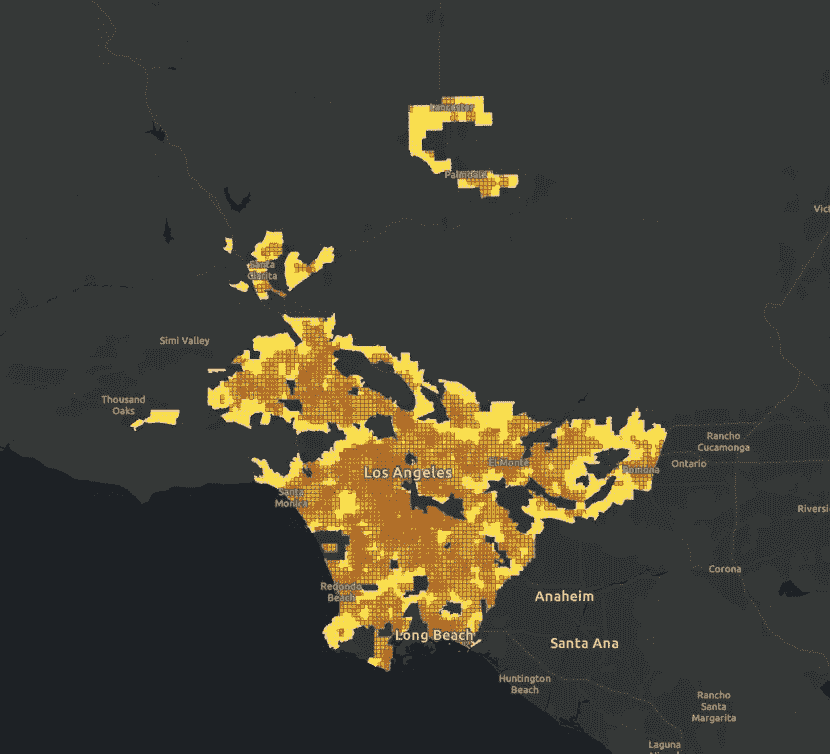

1/2 英里网格上的洛杉矶县人口密度

**人口统计数据**

为了评估邻里之间的人口统计相似性，我选定了四个特征，我认为这四个特征体现了邻里之间的文化和经验相似性:家庭收入中位数(MHHI)，平均年龄，当地白人人口的百分比，以及当地西班牙裔人口的百分比。收入显著影响邻里行为；因此，控制 MHHI 对于寻找有相似行为的邻居是很重要的。像 MHHI 一样，年龄可以决定一个社区的感觉；一个有很多 20 岁年轻人的社区和一个充满家庭或退休人员的社区感觉非常不同。最后，种族会影响社区的行为和文化。我包括了两个种族特征，因为邻里文化受到不同人口规模的影响，尤其是每个人对社区的控制。一个白人多而少数民族少的社区会比一个文化分布均等的社区感觉不同，这两个社区都会比一个少数民族占多数的社区感觉不同。这是一个非常复杂的关系，很难从数据中完全提取出来，但对邻域相似性来说非常重要。

所有人口统计要素均从 ArcGIS 的 ESRI 丰富工具中提取，并汇总到 1/2 SQMI 格网。

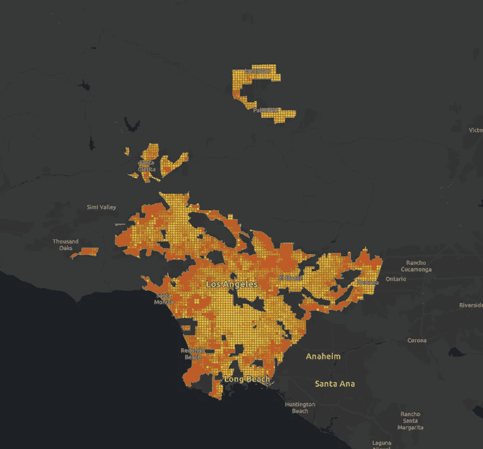

1/2 SQMI 网格上的洛杉矶县平均年龄

## 量化相似性

既然洛杉矶县网格中的每个 1/2 SQMI 邻域的结构和人口特征都已选定并导出，那么是时候讨论如何量化相似性了。概括地说，数据科学中有两种常用方法来了解样本之间的相似性:聚类算法可以智能地识别数据集中的相似样本组，距离测量可以量化样本之间的多维距离。如果我们希望通过相似性对邻域进行分组，那么聚类是最好的，如果我们希望有一种方法来量化任意两个邻域的相似性或不相似性，那么距离度量是更好的。两者各有优势，但是对于我朋友的情况，我们想要找到 N 个最相似的邻域，距离度量会更好。

有两种用于测量基于距离的相似性的常见方法:欧几里德距离和余弦距离。你可能在几何课上见过欧几里德距离。利用勾股定理，可以测出 A 点离 B 点有多远；我们可以将同样的概念扩展到多个维度。余弦距离是另一种数学方法。当特征的大小可能不重要时，它工作得最好。在我们的例子中，震级可能相当重要。一个 MHHI 为 120，000 美元的社区和一个 MHHI 为 50，000 美元的社区是非常不同的，大小很重要。考虑到这一点，我们将使用欧几里德距离来度量相似性。

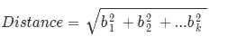

具有 k 个特征的数据的简化多维欧几里德距离公式。

## 构建工具

既然我们已经设计了我们的功能，并确定了量化样本之间相似性的方法，我们就可以开始构建工具本身了！为了简单起见，我在 Jupyter 笔记本中构建了该工具，但我打算在未来将它移动到一个交互式 Dash/Plotly web 应用程序中。

该工具应该如下工作:

1.  用户选择一个 1/2 SQMI 的邻居，他们想要与其他邻居进行比较，以便找到相似的邻居。
2.  该工具以列表和地图的形式查找洛杉矶县 N 个相似的 1/2 SQMI 街区。

首先，让我们看一下我们的数据和特性，以了解我们在处理什么。我将数据作为 geopandas 数据帧加载，然后为每个要素生成分布直方图。

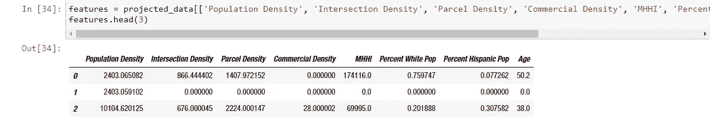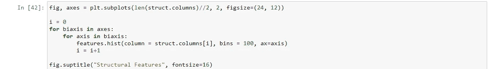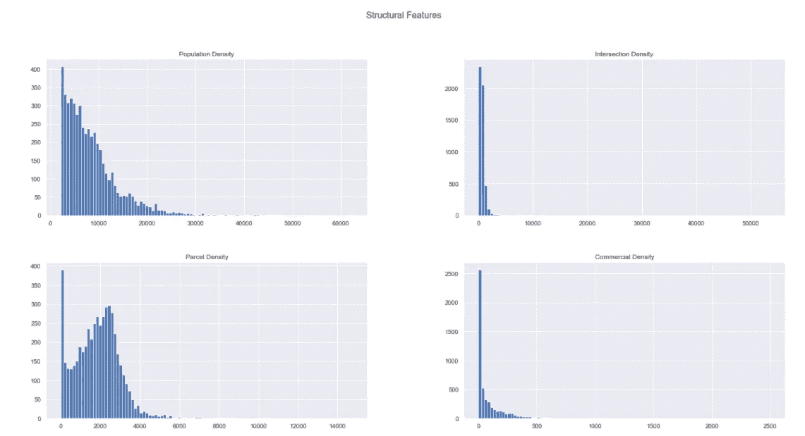

四种结构特征的样本分布

观察我们的城市形态结构特征，我们可以立即看到我们所有的结构数据都向右倾斜。这意味着小值比大值多得多。有趣的是，这几乎适用于所有的城市特征，也是城市唯一不变的法则之一。关于这一现象的更多信息，请查阅齐夫定律和杰弗里·韦斯特的书****。****

**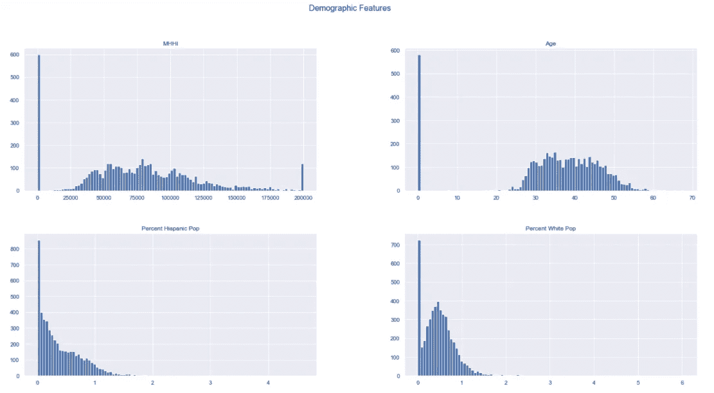**

**四个人口统计特征的样本分布**

**看看我们的人口统计特征，我们注意到 MHHI 和年龄比结构特征更正态分布。这是有意义的，因为我们正在处理关于人类的数据，在生物学中，我们期望找到正态分布。然而，种族特征表现出我们在结构特征中观察到的一些偏斜，这可能表明种族分布的结构方面。所有特征都有大量的零实例。这可以用没有固定人口的邻近地区来解释。洛杉矶县有几个社区是专门的工业区，如弗农和商业城可能占零例的一部分，而该县最北部的低密度区可能占更多。我们将把它们保留在数据集中，尽管它们看起来像异常值，因为它们在地面条件下是真实的，并且该分析不需要正态性。**

****缩放和加权****

**在计算我们的相似性之前，我们需要调整我们的数据。由于我们计划使用欧几里德距离来量化相似性，我们需要注意我们特征之间的尺度差异。让我们使用熊猫描述方法来快速了解我们的数据集在规模上的差异。**

**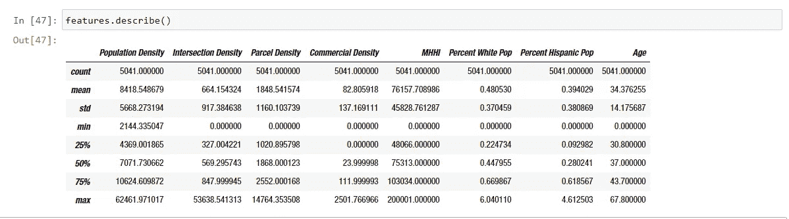**

**通过检查每个特征的描述性统计数据，我们可以看到每个特征的范围是如何彼此大相径庭的。当使用欧几里德距离时，这是一个问题，因为该公式假设所有维度的单位一致。为了说明这一点，让我们假设我们只寻找人口密度和年龄值的 2D 点之间的相似性。样本 1 的人口密度为 7000，年龄为 60 岁，样本 2 的人口密度为 7500，年龄为 36 岁。使用前面描述的公式，欧几里德距离是 500.57。你会注意到，如果我们完全忽略年龄，我们会发现距离为 500。尽管我们知道一个平均年龄为 60 岁的地方与一个平均年龄为 36 岁的地方会有很大不同，但两者如此相似的原因是因为人口密度特征的比例要大得多。它完全消除了年龄上的重要差异。因此，我们必须调整我们的数据，使我们所有的维度都有一致的单位。我们将使用 SKLearn 标准定标器方法来实现这一点。**

**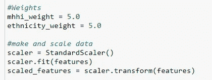**

**你会注意到我还包括了一个 MHHI 和种族的权重输入。这是因为，一旦缩放了数据，就可以控制每个变量对分析的影响。缩放后，每个要素对相似性的影响与其他每个要素相同。这可能是您想要的，但有时，就像在我们的情况下，有几个功能您希望确保得到充分考虑。在这种情况下，我觉得在邻里行为方面，MHHI 和种族的不同可能会压倒其他特征的相似性。例如，商业和人口密度相似的两个地方，只有在种族和 MHHI 也相似的情况下才会表现相似，如果它们结构相似，但种族和收入不同，我不会期望它们表现完全相似。因此，为了说明这一点，我们可以选择将收入和种族置于比其他变量更高的位置。目前，我给了它们一个 5X 权重，也就是说，其中一个单位的变化只能被未加权变量中至少五个单位的变化所抵消。**

**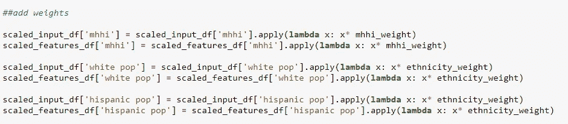**

**使用 lambda 表达式向缩放后的数据添加权重**

****计算相似度****

**一旦我们的输入被缩放和加权，我们就可以计算欧几里德距离相似性。首先，我们必须获取希望找到相似邻域的输入邻域。因为这是在 Jupyter 笔记本中构建的，所以我只将感兴趣的邻域作为引用数据中所选邻域的对象 ID。**

**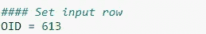**

**输入 OID 进行分析**

**然后，我们计算指定邻域和数据集中所有其他 1/2 SQMI 邻域之间的欧几里德距离。为此，我们使用 SKLearn paired_distances 方法。**

**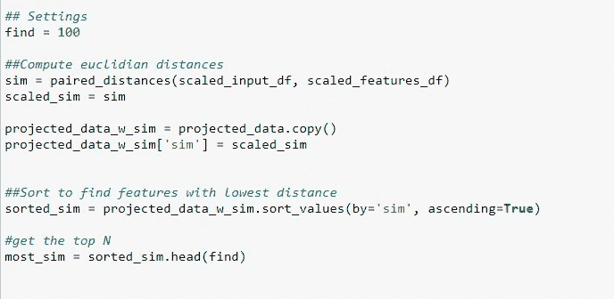**

**查找 100 个最相似的邻域的代码。**

**上面的代码返回与所选邻域最相似的 100 个邻域。有了这些数据，我们可以使用 geopandas 在地图上绘制它们，只需几行代码。**

**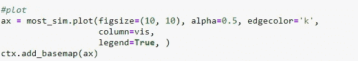****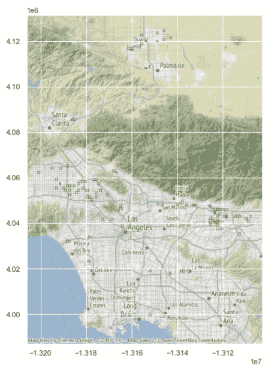**

**与所选社区最相似的 100 个区域的地图**

**在地图上，您可以快速查看与所选邻域最相似的区域。您可以通过查看返回的数据框来进一步询问结果。**

**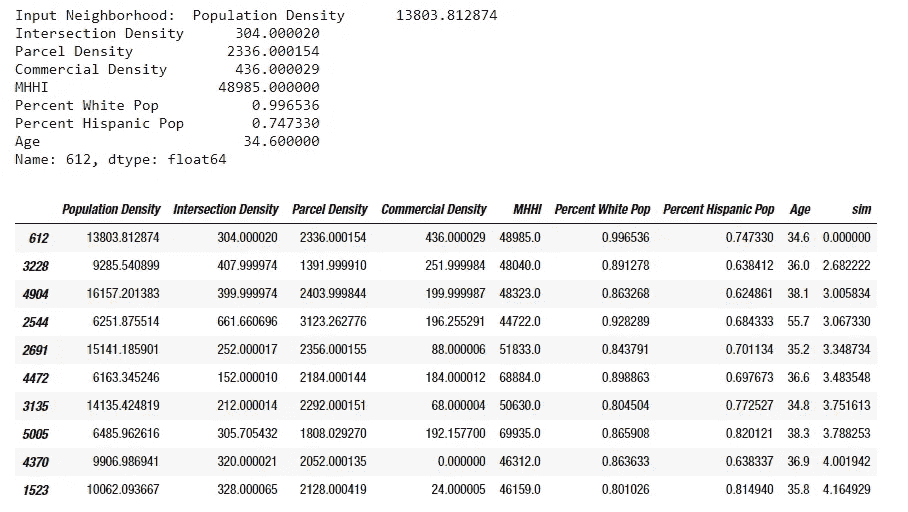**

**查看相似性数据框，我们可以看到我们的欧几里德距离相似性工作得有多好。在图像的顶部，您可以看到我们的输入邻域的特征值，下面是前 10 个最相似的邻域。第一个是选中的邻域，所以应该忽略。但从第二个开始，我们可以看到我们的相似性数量“sim”如何与我们的结构和人口特征的相似性相一致。最相似的，欧几里德距离相似性为 2.68，OID: 3228，密度稍低，但具有相当相似的交叉密度，并且在 MHHI、种族和年龄方面极其相似。当我们检查输出时，我们可以看到，正如设计的那样，该工具更重视收入和种族，而不是结构特征。将来，权重可能最好由用户来确定。但总的来说，它似乎在寻找相似的街区方面做得很好！**

## **后续步骤**

**这当然只是一个概念验证，但它为进一步的工作提供了一个有价值的起点。在未来，我认为特性集可以扩展到包括更多的结构和人口特征。该工具可以打包在 web 应用程序中，以提高可用性，并使用户能够针对其特定用途调整分析。将该工具扩展到洛杉矶地区以外也很重要。然而，还需要进行进一步的分析，以确定不同地区的邻居之间的比较效果如何。**

**一如既往，我喜欢得到反馈。希望就如何更好的衡量和分析我们的城市展开讨论！**

**请随意评论这篇文章，给我发电子邮件，或在 LinkedIn 上与我联系。很想听听大家的意见和建议！**

**电子邮件:benny.friedman2@gmail.com**

**领英:[https://www.linkedin.com/in/benjaminfriedman2/](https://www.linkedin.com/in/benjaminfriedman2/)**