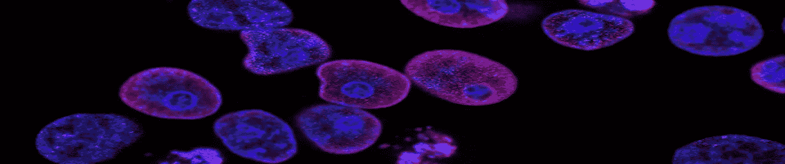

# 作用机理(MoA)预测

> 原文：<https://medium.com/analytics-vidhya/mechanism-of-action-moa-prediction-63ced9da471e?source=collection_archive---------30----------------------->

来源:Kaggle

# 导言和概述

M 过去，科学家从天然产物中提取药物，或者从传统疗法中获得灵感。非常常见的药物，如扑热息痛，在美国被称为对乙酰氨基酚，在驱动其药理活性的生物机制被了解之前几十年就被投入临床使用。今天，随着更强大技术的出现，药物发现已经从过去的偶然发现方法转变为基于对疾病潜在生物机制的理解的更有针对性的模型。在这个新的框架中，科学家们试图识别与疾病相关的蛋白质靶标，并开发出一种可以调节该蛋白质靶标的分子。

**如何确定 MoA？**

研究人员过去常常用药物处理人类细胞样本，然后用算法分析细胞反应，这些算法在大型基因组数据库中搜索与已知模式的相似性，如基因表达库或具有已知 MoAs 的药物的细胞生存模式。

# 目标

该项目的*目标*是通过快速预测药物的 MoA，使药物开发更先进、更快速。一般来说，研究人员用药物处理一个样本细胞，并在基因组数据库中找到相似性，这需要花费大量的时间和金钱，并使这个过程非常缓慢。所以，这个项目的目标是加速这个过程，使它更有效率。

# 数据

> 链接到数据集:[https://www.kaggle.com/c/lish-moa/data](https://www.kaggle.com/c/lish-moa/data)

数据集由许多 csv 文件组成，如下所示:

*   `train_features.csv` -训练集的特征。
*   `train_drug.csv` -该文件包含一个仅用于训练集的匿名 drug_id。
*   `train_targets_scored.csv` -被得分的二元 MoA 目标。
*   `train_targets_nonscored.csv` -训练数据的附加(可选)二进制 MoA 响应。这些都是不预测也不打分的。
*   `test_features.csv` -用于测试数据的特性。您必须预测测试数据中每行的每个得分 MoA 的概率。

**训练和测试集由 876 个特征组成:**

*   **第一个**列是 sig_id，是每个样品的 id。
*   **第二**列为 cp_type，表示用化合物(`cp_vehicle`)或对照微扰(`ctrl_vehicle`)处理的样品。
*   **第三个**栏是 cp_time，表示治疗持续时间(24、48、72 小时)。
*   **第四个**栏是 cp_dose，表示剂量的多少(高或低)。
*   **第 5 至第 775th】列包含关于基因的信息，列名为 g-0、g-1、g-2、…、g-771。**
*   **第 776 至第 876th】列包含有关单元格的信息，列名为 c-0、c-1、c-2、…、c-99。**

*目标设置由****207****特征组成。*第一个特征是 sig_id，所有其他 206 个特征是 MoAs 的名称。前 nfkb 抑制剂、蛋白酶体抑制剂、环加氧酶抑制剂、多巴胺受体拮抗剂、血清素受体拮抗剂等。*有****23814****数据点训练模型和****3982****数据点测试模型。*

**挑战解决**

这是一个多标签问题，因为我们必须预测 206 个目标特征。因此，这里的主要挑战是找到使用机器学习算法为这些目标变量训练一个或多个模型的方法，该算法通过提供最佳准确性来训练更快。

> 我只使用了机器学习算法来训练模型。我没有接触过以训练为目的的深度学习。

# 评估指标

*log-loss* ，我使用了 Log-loss 评估指标，因为目标集中的每个标签都高度不平衡，Log-loss 考虑了预测概率来计算损失。因此，log-loss 对于不平衡数据集是健壮的。我们还可以使用 F1 分数等其他指标进行评估。

对数损失公式

# 我的第一次切入

从读取数据集开始，然后首先我将对数据集以及基因和细胞列进行探索性数据分析(EDA)。我会把它们分开，然后把它们可视化。然后，在特征工程中，我将对数据集的分类特征进行编码，首先，我将尝试对训练和测试数据集分别应用缩放(StandardScaler 或 QuantileTransformer ),但在研究过程中，我发现分别应用缩放会大幅降低准确性，然后，我将尝试同时对训练和测试数据集应用缩放。然后，我将使用 PCA 和 VarianceThreshold 进行特征选择，之后，我将尝试通过添加一些新特征并组合所有特征(cp、基因和细胞以及新特征)来增加一些数据。最后，我将在 for 循环中将训练数据拆分为训练和验证数据集(使用简单的训练测试拆分或分层采样),并在同一个循环中进行训练和预测，这样每次迭代 for 循环时，我们都会获得不同的验证和训练数据。得到最佳算法后，我就开始在整个数据集上训练模型。由于我将主要尝试使用机器学习算法而不是深度学习，所以我将尝试不同的技术来预测这些多标签，从为每个标签创建不同的模型到尝试 scikit-MultiLearn 库。

# 探索性数据分析

本案例研究的第一步是执行 EDA，以便我们可以分析和可视化数据集的内容，并提取关于数据的有价值的信息。

**读取数据集**

我们使用熊猫图书馆来读取数据集。

读取数据集

*   定型数据集中不存在空值。

检查空值的代码

*   我们还必须检查数据集中的重复值。在我们的数据集中可能存在重复的独立变量。还可能存在具有不同特征值的重复 sig_id，并且还可能存在数据的 sig_id 不同但其余特征值相同的可能性。所以，我们会检查所有的可能性。

数据集中没有重复的行和重复的 id。

检查重复值的代码

检查重复值的代码输出

*   在检查异常值时，我们发现在所有基因和细胞列中都有*高方差*，我们不能将它们声明为异常值。通过随机绘制 50 个基因列的方框图，我们发现其值位于 10 到-10 之间，通过随机绘制 50 个细胞列的方框图，我们发现所有细胞列的值位于 6 到-10 之间。

50 个随机基因柱的分布

50 个随机单元列的分布

*   在数据集中，cp_type、cp_time 和 cp_dose 列只是分类特征，所有其他特征都是数值特征。在对每个分类特征 cp_type、cp_time 和 cp_dose 中的唯一数据点的数量进行可视化计数的过程中，我们发现，在 cp_type 特征中，trt_cp 数据点高度支配 ctl_vehicle 数据点，这使得 cp_type 特征高度不平衡。其余两个分类特征 cp_time 和 cp_dose 是平衡的。

分类列中的数据点分布

*   现在检查基因列和细胞列之间的相关性。在基因栏中，我们可以看到没有很大的相关性，但我们可以看到一些小点。放大这些小点后，我们发现有一些相关性，而这些淡色点很少，我们可以忽略它们。单元格列之间没有这种相关性。

基因列间的相关性

放大微小的光点

单元列之间的相关性

*   还有一个 csv 文件(train_drug.csv ),其中包含药品 id 和样品 id。它显示哪个样本用哪个药物处理。在这里，我们发现 drog id“cacb2b 860”最常用，其次是“87d714366”。如下图所示，使用最多的是前 9 种药物，其余药物很少使用。

药物的使用

*   为了直观显示每个样品中的氧化膜数量，首先我计算了每个样品每行中氧化膜的数量。在绘制这些计数后，我发现大多数样品具有 0、1 和 2 个 moa，也有一些样品具有 7 个 moa，极少数样品具有 3、4、5、6 和 7 个 moa。

# 特征工程

这是数据预处理中最重要的步骤之一。在这一步中，我们修改数据，并根据我们在探索性数据分析(EDA)中发现的数据做好使用准备。

*   从编码分类变量开始，cp_type 是名词性的，cp_time 和 cp_dose 是有序分类特征。在 cp_type 和 cp_dose 中有 2 个唯一值，但是在 cp_tine 中有 3 个唯一值。我将对训练和测试数据集的这些特征进行编码。

编码分类值

*   从我们的 EDA 中，我们发现在基因和细胞特征上有很大的差异。所以我们将使用*sk learn . preprocessing . quantile transformer*库来规范化它们。

规范化数字特征的代码

下面是标准化后 50 个随机基因和细胞柱的箱线图。因此，在这里我们可以看到，基因和细胞列没有很大的差异，它们都变得正常化了。

归一化后随机 50 个基因列的分布

归一化后随机 50 个单元格列的分布

*   现在，我试图在**自动编码器**的帮助下，使用原始特征生成一些特征。为了使用自动编码器，首先我只使用训练自变量来训练*编码器-解码器模型*，这意味着我将训练自变量(875 列)作为训练变量和目标变量。

编码器-解码器模型所做的是，它获取输入特征，如下图所示，在编码器部分，它试图减少特征的数量，在解码器部分，它试图重新创建与输出相同的特征。如图所示的粉色部分称为*瓶颈*。

来源:[https://towards data science . com/generating-images-with-auto encoders-77 FD 3a 8 DD 368](https://towardsdatascience.com/generating-images-with-autoencoders-77fd3a8dd368)

因此，为了生成新的功能，我只使用了编码器部分，直到瓶颈。使用 encoder section I 生成了 50 个新功能(尝试了各种数量的新功能，如 10、50、100 和 200 个，但 50 个效果最好)。现在将 50 个新生成的定型和测试数据集列与其原始列合并。合并后列数增加到 **926 列**。

编码器-解码器模型代码

编码器-解码器模型概述。

编解码模型综述

获得预训练的编码器模型后，保存该模型以备后用(在创建 web 应用程序期间),这样我就不必定期训练编码器-解码器模型。

仅保存编码器型号

加载编码器模型并生成特征

# 模型创建

由于我们已经完成了探索性数据分析、数据清洗、特征工程和所有数据预处理步骤，现在我们准备将机器学习算法应用于预处理数据集。

由于这是一个*多标签*问题，所以我尝试了各种方法来解决这个问题。但是，在这里，我将只讨论那种工作得非常好、速度快、精确度最高的方法，我将在本博客的后面讨论其他方法。

解决这种多标签问题的最佳方法是使用带有 **OneVsRestClassifier()** 的机器学习算法。

*那么，OneVsRestClassifier 是什么？*

OneVsRestClassifier 用于使机器学习算法适合多类别以及多标签问题。它也被称为一对一分类器。为了使用这种策略，目标标签应该是 2D 二进制矩阵。

> 要了解有关 OneVsRestClassifier 的更多信息，请访问:[https://scikit-learn . org/stable/modules/generated/sk learn . multi class . OneVsRestClassifier . html](https://scikit-learn.org/stable/modules/generated/sklearn.multiclass.OneVsRestClassifier.html)

我在 OneVsRestClassifier 中使用的机器学习算法有:

*   **逻辑回归**
*   **朴素贝叶斯分类器**
*   **随机森林分类器**

所有其他集合模型或 KNN 模型或 SVM 与径向基函数将需要大量的时间来训练。

## 逻辑回归

在所有算法中，逻辑回归用 OneVsRestClassifier 执行得最好。它花费较少的时间训练，并给出了非常低的日志损失。我还进行了超参数调整，以找到超参数的最佳值。

训练模型的逻辑回归代码

逻辑回归交叉验证输出

通过使用逻辑回归，我们得到了大约 0.016 的对数损失，这是非常低的，意味着我们的模型是好的。

> 由于这是一个多类问题，因此，为了计算对数损失，我们必须使用循环来计算每个标签的对数损失，最终损失将是所有损失的平均值。

## 朴素贝叶斯分类器

朴素贝叶斯分类器在这种情况下表现不佳。

训练模型的朴素贝叶斯分类器代码

朴素贝叶斯分类器交叉验证输出

通过使用朴素贝叶斯分类器，我们得到了大约 7 的对数损失，这是不好的，意味着朴素贝叶斯分类器表现不好。

## 随机森林分类器

随机森林分类器也表现良好，但不如逻辑回归好，而且需要更多的时间来训练。

训练模型的随机森林分类器代码

随机森林分类器交叉验证输出

通过使用随机森林分类器，我们得到了大约 0.020 的对数损失，这是非常低的，意味着我们的模型表现良好。

**所有型号对比**

**在所有这些模型中，以 OneVsRestClassifier 的 Logistic 回归表现最好。**

下面是我提交最终模型后在 Kaggle 上得到的分数。

Kaggle 分数

# 我们尝试过但没有成功的事情

*   **scikit-multi learn library**—我尝试用这个库来训练这个多标签问题，但是由于这个问题有大量的标签，所以这个库花了很多时间来训练模型，但是失败了。这个 scikit-multilearn 库在我们有少量标签的小数据集时工作得很好。
*   **将多标签转换为多类** —我试图将这个多标签问题转换为多类问题，它创建了许多类，几乎所有的数据点都变得唯一，变得非常难以处理。
*   **Xgboost 和 SVM 使用带有 OneVsResClassifier** 的 rbf 内核—尝试使用这些算法来训练模型，他们花费了大量时间(超过 7 个小时)来训练，但在这些时间内没有完全训练好，因此取消了训练过程。
*   **过采样** —由于我们的目标标签高度不平衡，所以我试图在训练模型之前进行过采样，但这并没有改善模型的性能，所以放弃了这个想法。
*   **PCA** —对于特征选择，我使用 PCA 来选择特征，并与原始数据集合并，但它没有提高模型性能。所以，我用自动编码器代替了它，它提高了模型的性能。

# 我们尝试过并且也成功了的事情

还有一种方法，我尝试过，效果很好，表现得和使用 OneVsRestClassifier 的逻辑回归一样好，那就是，对于每个标签，我训练了一个逻辑回归模型，训练了总共 206 个模型，并存储它们以在预测过程中使用。在预测过程中，我使用循环调用所有模型来预测每个标签的值。我没有选择这个方法的原因是它比 OneVsRestClassifier 方法花费更多的时间。

# 未来的工作

*   我想试试两步法。在这种方法中，首先我将预测样品中是否存在氧化钼，如果存在氧化钼，则进入第二步，我们将预测氧化钼。
*   我想尝试深度学习技术来解决这个问题。

# 结论

*   使用 OneVsRestClassifier 的逻辑回归表现最佳，对数损失约为 0.016，并且训练也非常快。
*   在 EDA 过程中，如果数据点远离箱线图的须状线，那么它不一定是异常值。
*   如果我们有大量特征和大量目标标签的数据集，那么时间复杂度较低的机器学习模型工作得最好，而时间复杂度较高的机器学习算法不起作用。

***感谢阅读:)***

完整的代码你可以访问我的 [***Github 仓库***](https://github.com/NIKsaurabh/Mechanism-of-Action-Predictor/tree/main/notebooks) 包含 Jupyter 笔记本，整个项目你可以访问 [***这里***](https://github.com/NIKsaurabh/Mechanism-of-Action-Predictor) 。

# 参考

*   [https://www.appliedaicourse.com/](https://www.appliedaicourse.com/)
*   [https://www.kaggle.com/c/lish-moa/data](https://www.kaggle.com/c/lish-moa/data)
*   [https://www.ncbi.nlm.nih.gov/pmc/articles/PMC147203/](https://www.ncbi.nlm.nih.gov/pmc/articles/PMC147203/)
*   https://www . ka ggle . com/viktorurushkin/scaler-PCA-cv-logistic-regression
*   [https://www.kaggle.com/maithiltandel/moa-submission](https://www.kaggle.com/maithiltandel/moa-submission)
*   [https://www . analyticsvidhya . com/blog/2017/08/introduction-to-multi-la](https://www.analyticsvidhya.com/blog/2017/08/introduction-to-multi-la)bel-class ification/

也可以在 [***linkedin***](https://linkedin.com/in/niksaurabh/) 上联系我。