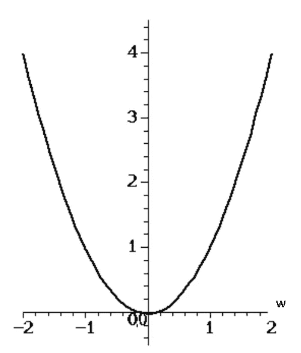
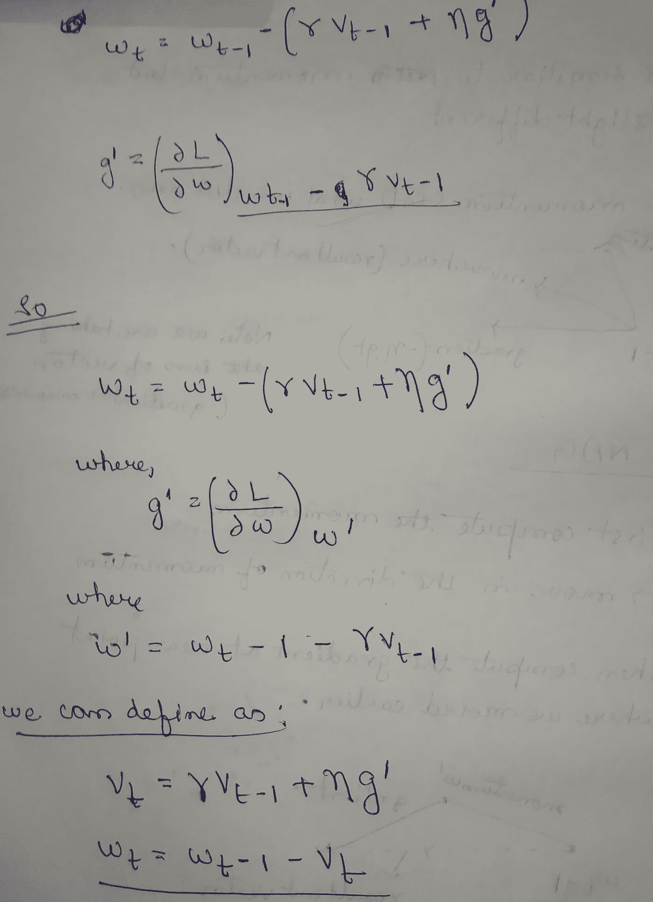

# 梯度下降优化算法的机理

> 原文：<https://medium.com/analytics-vidhya/mechanism-of-gradient-descent-optimization-algorithms-7baed9c9c35e?source=collection_archive---------12----------------------->

我们将一起探索不同类型基于梯度的优化算法。这篇文章背后的动机是给出优化算法工作背后的直觉。

**帖子如下:**

1.  **简介**
2.  **梯度下降**
3.  **带动量的新币**
4.  **内斯特罗夫加速梯度**
5.  **阿达格拉德**
6.  **Adadelta 和 RMSprop**
7.  **亚当**
8.  **如何选择算法**
9.  **结论**

# **1。简介**

**梯度下降**是一种寻找可微函数局部极小值的一阶迭代优化算法。最小化(或最大化)任何数学表达式的过程称为**优化。**

让我们从神经网络的角度来看优化。

优化器是用于改变神经网络属性的算法或方法，例如**权重【w1，w2，w3】**和**学习率** (η)以减少损失。

在我们深入算法之前，让我们看看艾萨克·牛顿和戈特弗里德·莱布尼茨给了我们什么。

是的，你答对了。让我们复习一下微积分。

# **下坡**

假设我们有一个函数 L(W ),我们想最小化它。

为了简单起见，我们假设 W 是函数 l 的标量(1-D)输入。我们可以将这一思想扩展到多维。

在 W = 0 时，我们只有一个最小值

现在，假设如果 L(W)看起来像这样。

这里我们有多个最小值和最大值。

在最小值和最大值时，dL/dW =0

切线总是平行于 X 轴，即使在鞍点。

# 凸函数

直觉。

取同一区域上的任意两点{a 和 b}，用尽可能短的直线将它们连接起来，如果直线 ab 上的所有点都在同一区域上，则它是一个凸函数。

凸函数只有一个最小值或最大值。

所有与线性回归、逻辑回归、支持向量机相关的损失函数都可以被证明是凸的。

**注意:在深度学习中是非凸曲面，这意味着我们可能有多个临界点。**

**除非是一层网，否则不凸。在一般的多层情况下，后面层的参数(权重和激活参数)可以是前面层中参数的高度递归函数。通常，由一些递归结构引入的决策变量的乘法往往会破坏凸性**

基于以上介绍，我们可以回答一个问题。

问:为什么我们使用平方损失？

Ans:)主要原因是平方损失导数产生单值参数集，因此给出一个唯一的解。

# **2。梯度下降**

1.  普通梯度下降，计算整个训练数据集的成本函数相对于参数 X 的梯度
2.  相反，随机梯度下降(SGD)随机地为每个训练样本的*执行参数更新*
3.  小批量梯度下降最终取两者之长，对数据集中 k 个点的每个随机子集进行更新。

**注意:小批量梯度下降是普通梯度下降的近似**

# **3。批量 SGD 带动量。**

正如我们可以观察到的，SGD 给了我们非常嘈杂的梯度更新，因此为了消除噪声，引入了这个**动量**。

假设使用 SGD，我们在每次迭代 t 都获得更新，如下所示:

在 t =1 时，我们得到 a_1

在 t = 2 时，我们得到 a_2

诸如此类。

现在，我们能做的是:

在 t = 1 时:

设 v_1 = a_1

在 t =2 时

设 v _ 2 =α* a _ 2 且{ 0≤α≤1 }

**情况— 1:如果 alpha == 1**

我们得到，v2 = v1+a2

**情况— 2:如果 alpha == 0**

我们得到，v2 = a2

**情况— 3:如果 alpha ==0.5**

我们得到，v2 = 0.5 * v1+a2

**注意:我们从上述 3 个案例中观察到的是，alpha 的值有助于我们量化“我们应该从以前的更新中考虑多少信息”。**

概括起来，我们得到:

1.  v1 = a1
2.  v2 =α* v1+a2
3.  v _ 3 =α* v _ 2+a _ 3

展开 v_3 我们得到:

4.v_3 = alpha(alpha*v_1+a_2)+a_3

**=阿尔法* a_1 +阿尔法* a_2 + alpha⁰ * a_3**

**所以，**

5. **v_t = alpha*v_t-1 +a_t**

注意:等式 5 本质上是递归的。

# 现在，让我们将指数加权平均的思想与 SGD 结合起来。

我们得到，

对于梯度指向相同方向的维度，动量项增加，而对于梯度改变方向的维度，动量项减少。因此，我们获得了更快的收敛和减少振荡。

# 4.内斯特罗夫加速梯度。

尤里·内斯特罗夫是俄罗斯数学家，国际公认的凸优化专家，尤其擅长开发高效算法和数值优化分析。他目前是卢万大学(UCLouvain)的教授。

我们在 NAG 的工作:

1.  首先计算动量。
2.  向动量方向移动。
3.  然后计算我们移动的新点的梯度。

**所以我们得到的是:**

NAG 首先在先前累积梯度的方向上进行大跳跃，测量梯度，然后进行校正，这导致完整的 NAG 更新。这种预先更新可以防止我们走得太快，从而提高响应能力。

# 5.阿达格拉德

在 SGD 和 SGD +动量中，学习率η =某个值，对于每个重量都是相同的。

想法:我们对每个权重都有自适应的学习速率，即每个权重都有不同的学习速率。

为什么需要这个想法？

Adagrad 的一个主要好处是，它消除了手动调整学习速率的需要。大多数实现使用默认值 0.01，并保持不变。

Adagrad 的主要缺点是它在分母中累积平方梯度:因为每个增加的项都是正的，所以累积和在训练期间保持增长。这反过来又导致学习率缩小，最终变得极小。

随着 t 增加，t-1 也增加，而η'_t 减小，因此当迭代增加时，该权重的学习速率适当地减小。

# 6.Adadelta 和 RMSprop。

因此，我们看到了 Adagrad 的问题，即 alpha_t 变得非常小，导致收敛缓慢。

RMSprop 是 Geoff Hinton 在他的 Coursera 课堂的[讲座 6e 中提出的一种方法。](http://www.cs.toronto.edu/~tijmen/csc321/slides/lecture_slides_lec6.pdf)

RMSprop 和 Adadelta 都是在同一时间独立开发的，因为需要解决 Adagrad 的学习率急剧下降的问题。RMSprop 实际上与我们上面导出的 Adadelta 的第一个更新向量相同

**想法:如果使用指数衰减法而不是我们在阿达格拉德看到的平方和，会怎么样？**

让我们看看它是如何工作的:

在 Adadelta 中，我们采用 gi 的指数平均值，而不是我们在 Adagrad 中看到的 gi 之和，以避免η'_t 中的大分母，从而避免缓慢收敛。

使用 Adadelta，我们甚至不需要设置默认的学习速率，因为它已经从更新规则中删除了。

# **7。Adam — —自适应矩估计:**

**想法:如果我们把 g_t(eda)的指数衰减平均值也存储起来会怎么样:**

让我们看看它是什么样子的:

作者建议β1β1 的默认值为 0.9，β2β2 的默认值为 0.999，ϵϵ.的默认值为 10-810-8 他们从经验上表明，Adam 在实践中表现良好，并且比其他自适应学习方法算法更好

# 8.如何选择算法

1.  在大多数情况下，Adam 比其他算法工作得更好
2.  如果我们的损失是严格凸的，那么动量会收敛得更快，但对于最小点，它可能会振荡一点
3.  如果代价函数的维数非常高，那么自适应学习也将给出一些更好的结果，因为它给了我们在每个方向上下降多少的控制。
4.  可能存在阿达德尔塔和阿达格拉德在鞍形区域被击中的情况，但是在更高维度的特征空间中，概率非常低。
5.  做梯度检查，在每个时期，看看如何优化工作与激活。有时它帮助我们发现消失梯度问题

图片借用自 cs231n.github.io

还有更多的算法可以探索，如 AdaMax，Nadam，AMSGrad。在 AMSGrad 之后，已经提出了许多其他的优化器。其中包括 AdamW，它修复了 Adam 中的重量衰减；QHAdam，它将标准 SGD 步长与动量 SGD 步长进行平均；以及 AggMo，它结合了多个动量项γγ；和其他人。

# 结论

我们已经初步研究了梯度下降的三种变体，其中小批量梯度下降是最受欢迎的。然后，我们研究了最常用于优化 SGD 的算法:动量法、内斯特罗夫加速梯度法、Adagrad、Adadelta、RMSprop、Adam。我希望这篇博文能够让你对不同优化算法的动机和行为有一些直觉。

请随意评论并指出任何错误。:)