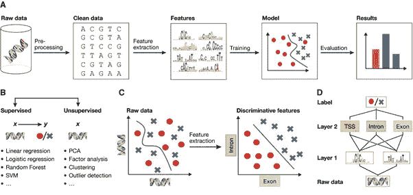
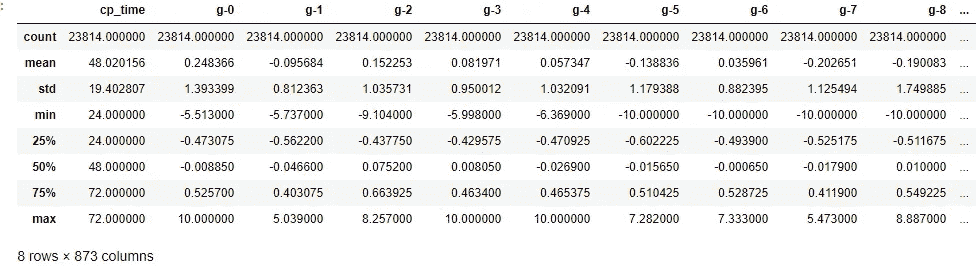
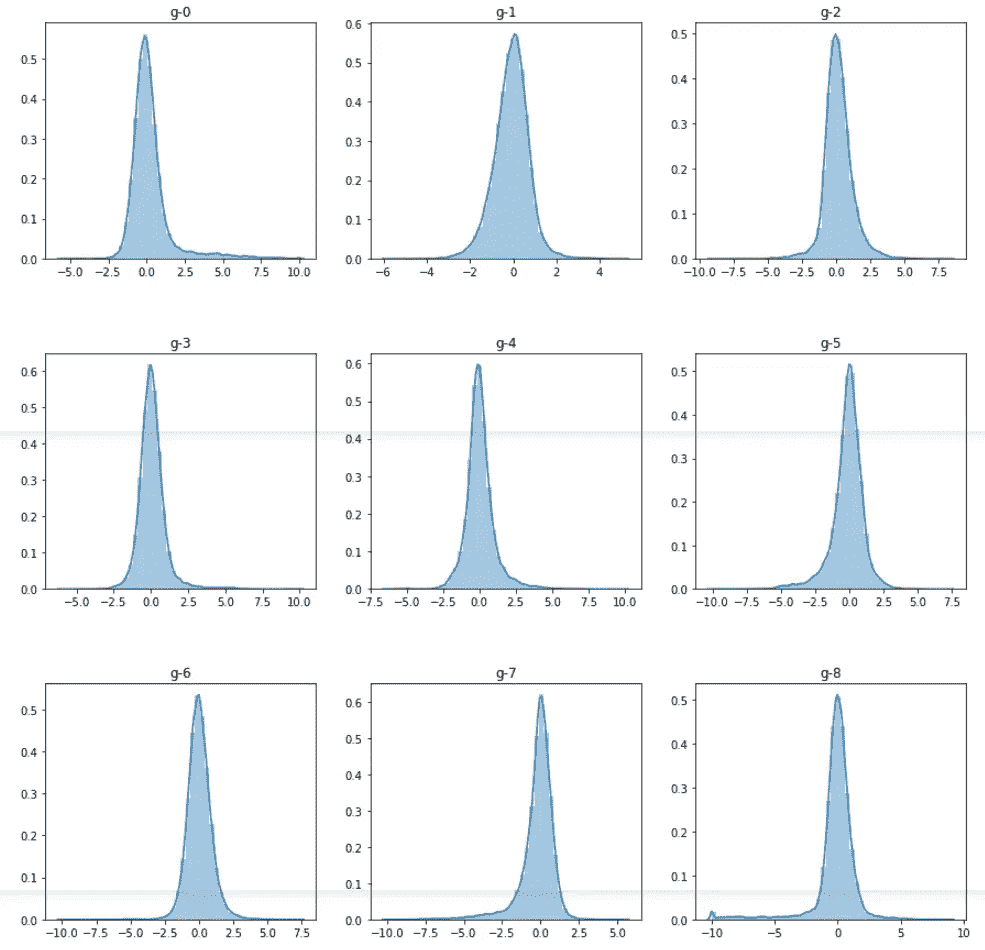
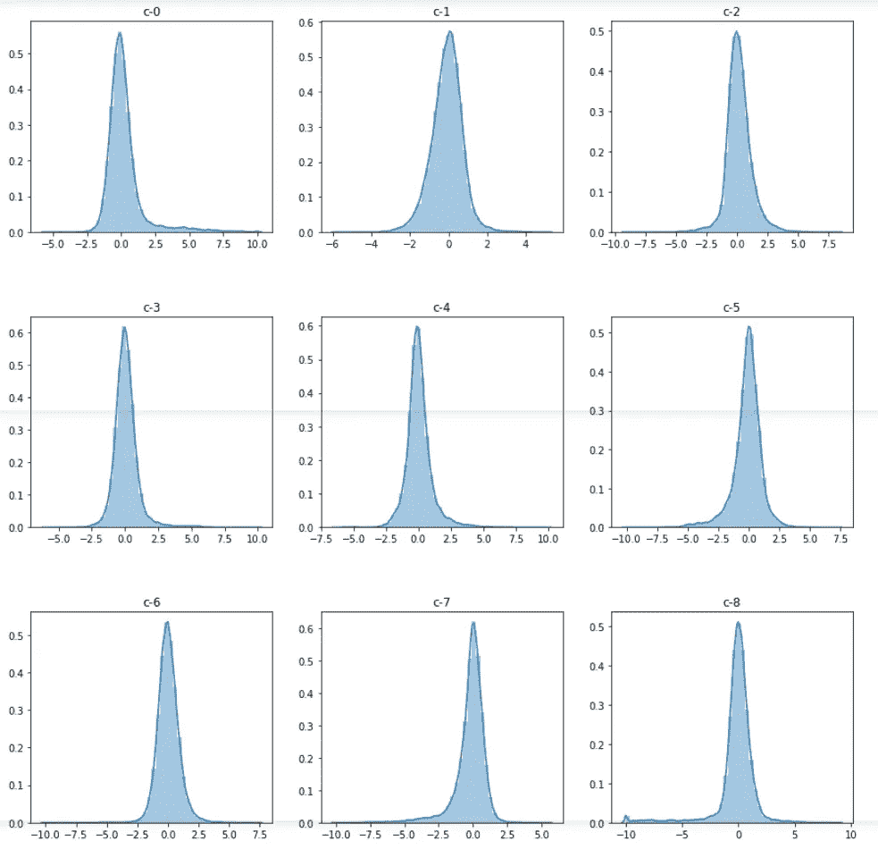
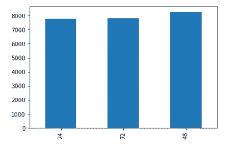
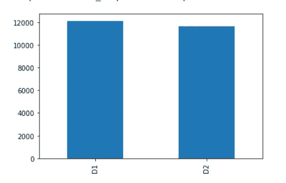
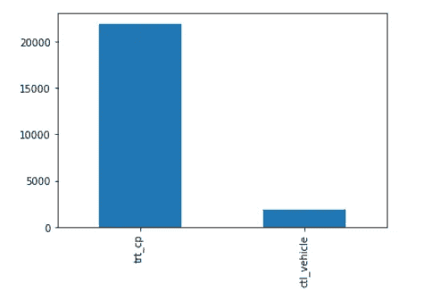
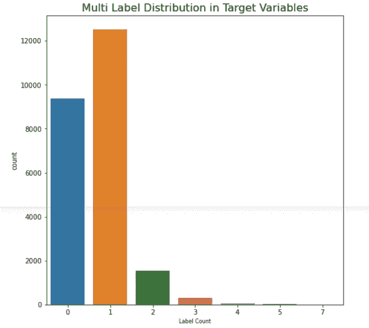
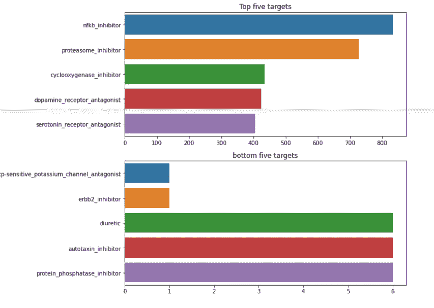
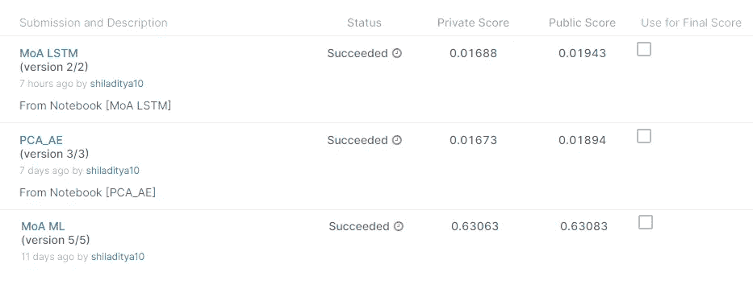

# 作用机制(MoA)预测

> 原文：<https://medium.com/analytics-vidhya/mechanisms-of-action-moa-prediction-c4fa105e0d34?source=collection_archive---------6----------------------->

基于机器学习方法的作用机制预测

# 目录

1.  介绍
2.  数据来源
3.  商业问题
4.  ML 配方
5.  目标和指标
6.  首次切割方法
7.  电子设计自动化(Electronic Design Automation)
8.  特征工程
9.  建模
10.  所有型号的比较
11.  结论和未来工作
12.  轮廓
13.  参考

# 简介:**什么是 MoA？**

在药理学中，术语[作用机制](https://en.wikipedia.org/wiki/Mechanism_of_action)是指药物产生药理作用的特定生化相互作用。作用机制通常包括提及药物结合的特定分子靶标，例如酶或受体。基于药物的化学结构以及在那里发生的特定作用，受体位点对药物具有特定的亲和力。

# **数据来源**

数据摘自以下链接的 GitHub:[https://www.kaggle.com/c/lish-moa](https://www.kaggle.com/c/lish-moa)

**关于数据集的简短介绍。**

在这个竞赛中，任务是预测不同样本的作用机制(MoA)反应的多个目标。样本是在不同时间点和剂量的药物。数据集还包括各种特征组，并且有超过 200 种酶和受体的靶标。

**功能**

*   sig_id 是唯一的样本 id
*   带有 g 前缀的特征是基因表达特征，共有 772 个(从 g-0 到 g-771)
*   带有 c 前缀的特征是细胞活力特征，有 100 个(从 c-0 到 c-99)
*   cp_type 是一个二进制分类特征，表示样本是用化合物或对照扰动(trt_cp 或 ctl_vehicle)处理的
*   cp_time 是指示治疗持续时间(24、48 或 72 小时)的分类特征
*   cp_dose 是一个二元分类特征，表示剂量是低还是高(D1 或 D2)

# **业务问题**

早些时候，科学家从自然资源中获得药物。扑热息痛(在美国通常称为对乙酰氨基酚)在其生化活性被了解之前的几十年就被用作药物。目前，随着新技术的发现，药物从以前的理论方法转变为现代的更基于应用的方法来理解其对疾病的生物学机制。由于这个原因，科学家使用作用机制来评估药物对其蛋白质靶标作用。

# **毫升配方**

在我们拥有大数据的现代，ML & AI 技术被用来通过一些算法拟合模型来预测和输出。对于现在的生物学研究来说，一天一毫升起着至关重要的作用。我们可以将 ML 公式步骤划分如下:

**数据预处理**

**建立模型&训练数据集**

**通过使用训练数据预测，预测测试数据。**

ML & AI 在药物生物反应预测中的应用越来越受到关注。我们可以使用监督学习和半监督学习进行药物靶标相互作用预测。

# **业务约束**

机器学习和最近深度学习的发展为药物发现提供了许多机会。随着更大数据集的可用性，可以预期在未来几年，ML & AI 将在生物学研究领域带来快速增长。此外，在现代计算机变得更加强大，大量的内存可以处理大量的数据，更有效。ML 模型将有意识地创造改进，新的、有趣的应用将会随之而来。

可以通过在临床前数据集上使用 ML 方法来获得药物的生化预测模型。然后可以通过使用早期临床患者样本进行交叉验证。判断其准确性后，可用于支持一种药物的临床开发，也可用于推断其作用机制。

# 机器学习方法

我们应该根据细胞活力和基因表达的可用信息以及它们的靶作用机制来确定新药的作用机制。在这个问题上，科学家们试图确定一个与疾病相关的蛋白质靶标，并开发一种可以调节该蛋白质靶标的分子。作为描述给定分子生物活性的简写，科学家们指定了一个称为作用机制或简称 MoA 的标签。这里我们的目标变量是 MoA，用于预测 MoA 的特征是细胞活力和基因表达。我们已经获得了 100 种细胞类型和 772 种基因表达的人类细胞对药物反应的信息，此外，我们还获得了 20，000 多种药物的 MoA 注释。每种药物可以有多个 MoA，因此这是一个有趣的部分，我们需要对数据进行多标签分类。

# 目标和指标

*   有两组目标特征；得分目标特征和未得分目标特征。这两组都由二元 MoA 靶组成，但只有第一组用于评分，因此这是一个多标记分类问题。
*   这是一个多标签二进制分类问题，用于评估的度量是平均列对数损失。对于每一行，必须预测样本对每个目标有正面响应的概率。对于 N 行和 M 个目标，将有 N×M 个预测。

原木损失

*   N 是行数(i=1，…，N)
*   M 是目标的数量(m=1，…，M)
*   y^i,m 是第 I 行和第 m 个目标的预测概率
*   yi，m 是第 I 行和第 m 个目标的地面真值(1 表示肯定响应，否则为 0)
*   log()是自然对数

# **第一次切割方法**

对于任何 ML 模型，最初的方法是进行 EDA，因此检查数据集的不同变量并绘制它们的图形将是第一步。它需要在跳到特定模型之前。但是，通过使用不同类型的技术，从 PCA、t-SNE 到监督技术，如 SVM 和随机森林，最后是深度学习技术，我们必须得出结论，对于我们的基线模型，深度学习技术，如 CNN(卷积神经网络)将是最佳选择。

# 探索性数据分析

对训练数据集的初步观察:数据集包含 876 列，其中 3 列是分类特征，即 sig_id、cp_type、cp_dose。有 772 个基因表达特征(从 g-0 到 g-771) & 100 个细胞活力特征(从 c-0 到 c-99)。

**基因表达特征**

基因表达是在任何给定的时间点细胞中表达的蛋白质的数量和类型。

基因表达特征

有 772 个基因表达特征，它们有 g 前缀(g-0 到 g-771)。每个基因表达特征代表一个特定基因的表达，因此在该测定中有 772 个单独的基因被监测。

**细胞生存能力特征**

细胞生存力是对群体中健康活细胞比例的度量。细胞活力测定用于确定细胞的整体健康状况，优化培养或实验条件。

细胞活力特征

有 100 种细胞活性特征，它们具有 c 前缀(c-0 至 c-99)。每个细胞活力特征代表一个特定细胞系的活力，所有实验都基于一组相似的细胞。

# 分类特征

*   有三个分类特征；cp_type、cp_time 和 cp_dose。其中两个是二元要素，一个有三个唯一值，因此这些要素之间的基数非常低。所有的分类特征在训练集中具有几乎相同的分布。

**cp_time**

*   cp_time 是数据集中的分类特征，它有三个唯一值；24、48 和 72 小时。它指示样本的处理持续时间。在不同的目标中，不同 cp_time 值的样本计数非常一致且彼此接近。样本计数要么彼此非常接近，要么 48 略高于其他值。

cp_time

**cp_dose**

*   cp_dose 是数据集中的分类特征，也是二元特征。它显示样本的剂量是低(D1)还是高(D2)。

**cp_type**

*   cp_type 是数据集中的分类特征，并且是二元特征。这意味着用化合物(trt_cp)或控制扰动(ctl_vehicle)处理样品。用对照扰动处理的样品没有 moa，因此它们的所有标记和未标记的靶标记都为零。

**了解目标变量**

目标特征分为两组；已评分和未评分的目标特征，以及这两个组中的特征都是二元的。竞争分数基于已评分的目标特征，但未评分的组仍可用于模型评估、数据分析和特征工程。

这是一个多标签分类问题，但是一个样本可以被分类到多个目标，或者也可以不被分类到任何目标。大多数情况下，样本被分类到 0 或 1 个目标，但一小部分训练集样本同时被分类到 2、3、4、5 和 7 个不同的目标。由于 0 和 1 分类目标之间存在巨大差异，所以分类目标的分布对于得分目标和未得分目标来说不是非常相似。

**攻入目标特征**

最常见的分类得分目标是 nfkb 抑制剂、蛋白酶体抑制剂、环加氧酶抑制剂、多巴胺受体拮抗剂、5-羟色胺受体拮抗剂和 dna _ 抑制剂，每种都有超过 400 个样本。分类最少的评分靶点是 atp 敏感性钾通道拮抗剂和 erbb2 抑制剂，每种只有一个样本。在测试集中预期有相似的分类分布。

有许多得分目标以相同的次数分类，这表明它们之间可能有关系。

# **特色工程**

**降维**

*   两种常见的降维技术是 PCA 和自动编码器。这些技术对比例很敏感，因此将数据标准化并使其没有单位是很重要的。为此，用标准定标器对细胞生存力和基因表达特征进行标准化。为了评估不同降维技术中的信息损失，潜在空间维度被设置为细胞生存力和基因表达维度的一半。

**PCA**

*   PCA 是将数据投影到另一个空间的线性变换，其中投影向量由数据的方差定义。PCA 结果可以用重建误差和累积百分比方差来评估。

**自动编码器**

*   自动编码器是用于将数据减少到低维潜在空间的神经网络。最重要的特征存在于这个低维的潜在空间中，因为它们能够重建它。与 PCA 相比，自动编码器速度更慢，计算量更大，而且容易过拟合。

# 模型

在数据集上应用的分类模型有以下几种:[随机森林分类器、梯度推进分类器、PCA &自动编码器降维& LSTM。](https://github.com/shiladityamajumder/mechanism-of-action)

# **所有车型对比**

# 结论和未来工作

在所有型号中，autoencoder 性能最好。对于给定的数据集，观察到应用自动编码器的神经网络模型给出了 0.0128 的 logloss 和 0.0192 的 val_loss。

从不同模型得到的结果来看，我们可以在未来的工作中使用不同的超参数调整，并尝试做一些性能优化，以获得更准确的结果。

# GitHub 知识库

 [## shiladityamajumder/作用机理

### 在药理学中，作用机制(MoA)一词是指特定的生物化学相互作用，通过这种作用，药物…

github.com](https://github.com/shiladityamajumder/mechanism-of-action) 

# LinkedIn 个人资料

 [## shiladtya Majumder-应用人工智能课程-印度西孟加拉邦加尔各答| LinkedIn

### 查看 Shiladitya Majumder 在 LinkedIn 上的职业简介。LinkedIn 是世界上最大的商业网络，帮助…

www.linkedin.com](https://www.linkedin.com/in/shiladitya-majumder/) 

# 参考

*   【https://arxiv.org/pdf/2008.09763.pdf 
*   [https://pubs.acs.org/doi/10.1021/acs.molpharmaceut.6b00248](https://pubs.acs.org/doi/10.1021/acs.molpharmaceut.6b00248)
*   [https://arxiv.org/pdf/1607.02078.pdf](https://arxiv.org/pdf/1607.02078.pdf)
*   [https://www . ka ggle . com/head sortails/explorations-of-action-moa-EDA/](https://www.kaggle.com/headsortails/explorations-of-action-moa-eda/)
*   [https://www . ka ggle . com/frankmollard/dimensionally-reduction-3d-interactive/output](https://www.kaggle.com/frankmollard/dimensionality-reduction-3d-interactive/output)