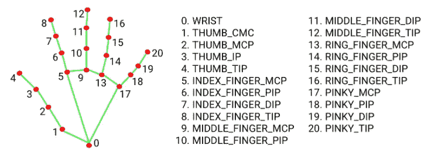
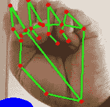
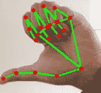

# media pipe:Python 中不带 GPU 的手指计数

> 原文：<https://medium.com/analytics-vidhya/mediapipe-fingers-counting-in-python-w-o-gpu-f9494439090c?source=collection_archive---------5----------------------->

一些在图像中计数手指的流行技术是通过训练 CNN 或使用轮廓和凸度外壳。实际上，我已经尝试了这两种技术，在这一节中，我想提到我在使用这些技术时所面临的挑战(放置链接来检查已完成的工作)。

# 实验和挑战

1.  *CNN 方法:*该模型能够达到良好的训练和验证精度。最后的剧情看起来也不错。但是，当涉及到现实生活中的图像检测时，该模型非常失败。我试着调整超参数，应用数据扩充，迁移学习，学习率衰减，调整模型架构，但是没有改进。模型在真实图像上失败的主要原因是训练和测试图像非常相似，过于简化，所以模型试图过拟合，快速学习。检查我的尝试 [1](https://www.kaggle.com/pdhruv93/fingers-count-scratch) 和 [2](https://www.kaggle.com/pdhruv93/fingers-count-scratch-edge-detection) (随时建议任何有帮助的改变)
2.  *轮廓和凸度外壳:* [与第一种方法相比，这种](https://github.com/pdhruv93/OpenCV-Gesture-Recognition)方法表现得更好。检测速度非常快，并且很有把握。这里唯一的挑战是，你必须照顾背景，不能与拥挤的背景。

所以经过这么多的调查，我遇到了 Mediapipe 库的 *Hands 模块，它令人惊讶地表现得非常好，没有我在上面遇到的任何挑战，而且它超级容易实现，不需要 GPU。*这篇文章是我之前写的* [*关于 Mediapipe 的文章*](https://dhruv-pandey93.medium.com/mediapipe-hand-gesture-based-volume-controller-in-python-w-o-gpu-67db1f30c6ed) *的延续。我强烈建议在开始这个*之前浏览一遍。*

# 对 HandDetecor 类进行微调

在开始处理手指计数器之前，您需要向您在上一篇文章中编写的现有手部检测器类添加一小段代码。你可以查看[完整的源代码](https://github.com/pdhruv93/computer-vision/tree/main/fingers-count)来找出这个修改应该放在哪里。

```
if results.multi_handedness:
    label = results.multi_handedness[handNumber].classification[0].label  # label gives if hand is left or right
    #account for inversion in webcams
    if label == "Left":
        label = "Right"
    elif label == "Right":
        label = "Left"
```

之前，我们只向调用函数发送 id、x 和 y 坐标。现在我们也发送一个字符串来表示手是左手还是右手。我们还需要考虑当你从网络摄像头读取图像时发生的横向反转。

# 实际手指计数器工作

1.  导入库并进行标准初始化(所有细节都在第一篇文章中讨论过)。

```
from handDetector import HandDetector
import cv2

handDetector = HandDetector(min_detection_confidence=0.7)
webcamFeed = cv2.VideoCapture(0)
```

2.主要逻辑在这里:

```
while True:
    status, image = webcamFeed.read()
    handLandmarks = handDetector.findHandLandMarks(image=image, draw=True)
    count=0

    if(len(handLandmarks) != 0):
        #we will get y coordinate of finger-tip and check if it lies above middle landmark of that finger
        #details: https://google.github.io/mediapipe/solutions/hands

        if handLandmarks[4][3] == "Right" and handLandmarks[4][1] > handLandmarks[3][1]:       #Right Thumb
            count = count+1
        elif handLandmarks[4][3] == "Left" and handLandmarks[4][1] < handLandmarks[3][1]:       #Left Thumb
            count = count+1
        if handLandmarks[8][2] < handLandmarks[6][2]:       #Index finger
            count = count+1
        if handLandmarks[12][2] < handLandmarks[10][2]:     #Middle finger
            count = count+1
        if handLandmarks[16][2] < handLandmarks[14][2]:     #Ring finger
            count = count+1
        if handLandmarks[20][2] < handLandmarks[18][2]:     #Little finger
            count = count+1

    cv2.putText(image, str(count), (45, 375), cv2.FONT_HERSHEY_SIMPLEX, 5, (255, 0, 0), 25)
    cv2.imshow("Volume", image)
    cv2.waitKey(1)
```

我们读取网络摄像头帧并初始化一个变量*计数。*这将是保存手指计数的最终变量。

请看这张来自 Mediapipe 手部模块的图片:



图片取自 Mediapipe 官网。请点击[这里](https://google.github.io/mediapipe/solutions/hands)查看全部工作细节。

> 我们在这里使用的逻辑是，如果任何手指的指尖的 y 坐标低于该手指的中心标志的 y 坐标，这意味着手指是闭合的。

例如:如果界标 8 的 y 坐标小于界标 6 的 y 坐标→这意味着食指闭合。

```
if handLandmarks[8][2] < handLandmarks[6][2]:
       count = count+1
```

一个*特例是针对拇指的*。如果你试着握拳，你的拇指不会像其他手指一样垂直闭合，而是水平闭合。所以你的拇指不会遵循和手指相同的规则。相反，你必须把条件放在 x 坐标上(你自己试试吧，我给了一张图片供参考)。



“0”的缩略图位置



“1”的拇指位置

```
if handLandmarks[4][3] == "Right" and handLandmarks[4][1] > handLandmarks[3][1]:       #Right Thumb
            count = count+1
        elif handLandmarks[4][3] == "Left" and handLandmarks[4][1] < handLandmarks[3][1]:       #Left Thumb
            count = count+1
```

在最后一部分，你做一些例行工作来显示你的帧计数。

这差不多就是代码。当你运行这个，你会看到计数打印在框架上。你会注意到检测非常快，没有任何滞后。

# 最后的话

看看实现一个手指计数器有多简单。写这篇文章背后的想法并不是激励你停止使用深度学习，转而使用一些第三方库。相反，在着手解决任何问题之前，只需花一些时间研究市场上的可用选项，并决定是否值得从头开始做任何事情，或者在可用资源的基础上构建一些东西。

休息一切都取决于你的意志和创造力。你可以在这里 找到这个项目的 ***代码*** [***。***](https://github.com/pdhruv93/computer-vision/tree/main/fingers-count)