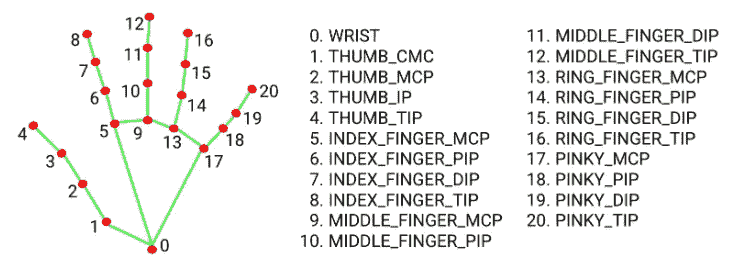
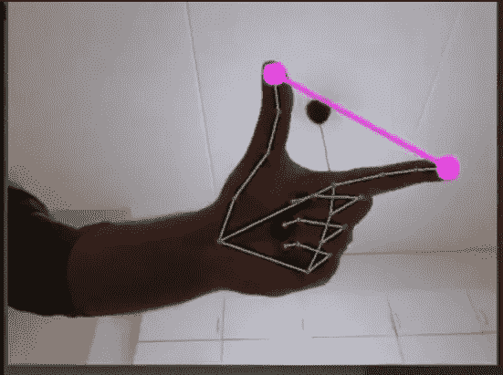

# media pipe:Python 中基于手势的音量控制器，不带 GPU

> 原文：<https://medium.com/analytics-vidhya/mediapipe-hand-gesture-based-volume-controller-in-python-w-o-gpu-67db1f30c6ed?source=collection_archive---------1----------------------->

如果我说你想用 python 做一些手势识别的事情，你脑海中会出现的第一个解决方案是什么:训练一个 CNN、contours 或凸面外壳。听起来不错，也可行，但是当实际使用这些技术时，检测并不是很好，并且需要特殊的条件(如适当的背景或您在培训时使用的类似条件)。

最近，我偶然发现了一个超级酷的叫做 [Mediapipe](https://mediapipe.dev/index.html) 的库，它让我们的事情变得非常简单。我建议你通过它的官方网站去了解更多，因为这个网站解释了图书馆提供给你的几乎所有东西。在本文中，我要做的是展示我如何使用这个库来提出一些很棒的项目，因为这是让您阅读本文的原因。

在我们开始真正的代码之前，让我们花点时间来欣赏一下这个库。我真的很着迷于使用这个库和做创新的事情是多么容易，否则我会发现从头开始编码非常困难。 ***你甚至不需要一个 GPU*** 来使用这个库，即使在普通的 CPU 上，这些东西也能非常流畅地工作。补充一下，它是由谷歌备份的，所以这给了另一个使用这个库的理由。在本文中，我将处理 Python 的东西，但是这个库支持几乎所有的[平台](https://google.github.io/mediapipe/solutions/solutions) (Android、iOS、C++)。在我写这篇文章的时候，Python 只有几个可用的模块，但是不要担心，它仍然在快速发展，你可以期待很快会有更多的模块出现。

# 介绍

在本文中，我将使用这个库的 [hands](https://google.github.io/mediapipe/solutions/hands) 模块来创建两个很酷的项目。*手部模块创建基于 21 个点的手部定位*。这意味着如果你给这个模块提供一个手的图像，它将返回一个 21 点的向量，显示你手上 21 个重要标志的坐标。如果你想知道它是如何做到这一点的，可以去查看他们页面上的文档。



图片取自 Mediapipe 官网。请点击此处的[查看全部工作细节。](https://google.github.io/mediapipe/solutions/hands)

无论输入图像如何，这些点的意义都是一样的。这意味着点 4 永远是你的拇指尖，点 8 永远是你的食指尖。所以一旦你有了 21 点向量，你创造什么样的项目就取决于你的创造力了。

# 确定手部标志

我们正在尝试通过以下手势控制我们的系统音量(注意右下角的音量变化):

在 Python 中使用 mediapipe 库之前，您必须:

```
pip install mediapipe
```

让我们创建一个名为 HandDetector 的实用程序类，它将使我们的项目模块化

1.  导入所需的包

```
import mediapipe as mp
import cv2
```

2.创建由 Mediapipe 提供的 hands 模块的实例，后跟 Mediapipe 的绘图实用程序的实例。绘图工具有助于在您的图像或帧上绘制这 21 个地标和连接这些地标的线条(您在上面的视频中已经注意到了)。

这一步几乎是不变的，必须在你的每个项目中完成。

```
mpHands = mp.solutions.hands
mpDraw = mp.solutions.drawing_utils
```

3.然后我们开始编写我们的类

```
class HandDetector:
    def __init__(self, max_num_hands=2, min_detection_confidence=0.5, min_tracking_confidence=0.5):
        self.hands = mpHands.Hands(max_num_hands=max_num_hands, min_detection_confidence=min_detection_confidence,
                                   min_tracking_confidence=min_tracking_confidence)
```

*max_num_hands* :您希望 Mediapipe 检测的手数。Mediapipe 将返回一个手的数组，数组中的每个元素(或一只手)将依次有 21 个标志点

*min_detection_confidence* ，*min _ tracking _ confidence*:media pipe 第一次启动时，检测到手。之后，它试图跟踪手，因为检测比跟踪更耗时。如果跟踪置信度下降到指定值，则再次切换回检测。

Hands()类需要所有这些参数，所以我们在下一行中将它们传递给 Hands 类。

4.接下来我们定义这个类的函数 findHandLandMarks()*，主要的事情发生在这里*

```
def findHandLandMarks(self, image, handNumber=0, draw=False):
    originalImage = image
    image = cv2.cvtColor(image, cv2.COLOR_BGR2RGB)  # mediapipe needs RGB
    results = self.hands.process(image)
    landMarkList = []

    if results.multi_hand_landmarks:  # returns None if hand is not found
        hand = results.multi_hand_landmarks[handNumber] #results.multi_hand_landmarks returns landMarks for all the hands

        for id, landMark in enumerate(hand.landmark):
            # landMark holds x,y,z ratios of single landmark
            imgH, imgW, imgC = originalImage.shape  # height, width, channel for image
            xPos, yPos = int(landMark.x * imgW), int(landMark.y * imgH)
            landMarkList.append([id, xPos, yPos])

        if draw:
            mpDraw.draw_landmarks(originalImage, hand, mpHands.HAND_CONNECTIONS)

    return landMarkList
```

函数参数:

将检测到手界标的*图像*。在图像有多只手的情况下，*手号*，所以我们的函数将只返回指定手号的地标。布尔参数 *draw* 决定我们是否希望 medapipe 在我们的图像上绘制这些地标。

下一行做所有的事情。这一小段代码实际上在幕后做了很多工作，并为您获取了所有的地标

```
results = self.hands.process(image)
```

然后，我们创建一个空列表 *landMarkList* ，其中包含从函数返回的最终结果。

如果没有检测到手，则*results . multi _ hand _ landmarks*返回 None，因此您应该将其用作故障安全条件。

*results . multi _ hand _ landMarks*返回检测到的所有手牌的界标，因此将 *handNumber* 传递给它会给出正确手牌的数据。

*手标志*给出所选手的 21 个标志。所以我们迭代这 21 个点，其中 *id* 保存每个地标的 id

> 这里需要注意的重要一点是，Mediapipe 返回的地标信息不是地标的像素位置。相反，它是图像尺寸的比率。为了获得地标像素的精确 x 和 y 坐标，我们进行以下简单计算:

```
xPos, yPos = int(landMark.x * imgW), int(landMark.y * imgH)
landMarkList.append([id, xPos, yPos])
```

然后，我们将地标的 id(0…21)以及相应的 x 和 y 坐标添加到我们之前创建的空列表中。我们将这个列表返回给调用函数。

> 这是 findHandLandMarks()将返回的内容:
> 
> 第 0 个索引→地标 id，第 1 个索引→地标 x 坐标，第 2 个索引→地标 x 坐标

如果布尔变量 *draw* 这样说，则最后一部分在图像上绘制界标

```
mpDraw.draw_landmarks(originalImage, hand, mpHands.HAND_CONNECTIONS)
```

这基本上是我们定制课程的内容。因此，您需要做的就是将您的手部图像传递给 findHandLandMarks()，您将获得包含所有 21 个地标信息的列表。

# 音量控制器

现在来看看这篇文章的主要标题。

在我们编写任何自定义代码之前，我们需要安装一个外部 python 包 [pycaw](https://github.com/AndreMiras/pycaw) 。这个库将处理我们系统的音量控制。

1.  我们首先导入在上一节中创建的自定义类和其他必需的包:

```
from handDetector import HandDetector
import cv2
import math
import numpy as np
```

此外，导入 pycaw 相关的包和类:

```
from ctypes import cast, POINTER
from comtypes import CLSCTX_ALL
from pycaw.pycaw import AudioUtilities, IAudioEndpointVolume
```

2.然后，我们创建自定义 HandDetector 类的一个实例:

```
handDetector = HandDetector(min_detection_confidence=0.7)
```

然后初始化我们的网络摄像头的标准代码:

```
webcamFeed = cv2.VideoCapture(0)
```

然后是音量控制器的一些标准初始化。这一部分我没有什么可以解释的:

```
#Volume related initializations
devices = AudioUtilities.GetSpeakers()
interface = devices.Activate(
IAudioEndpointVolume._iid_, CLSCTX_ALL, None)
volume = cast(interface, POINTER(IAudioEndpointVolume))
print(volume.GetVolumeRange()) #(-65.25, 0.0)
```

仔细看看最后一行。*卷。GetVolumeRange()* 给出您的系统支持的音量范围，-65.25 是最小值，0.0 是最大值。没有理由说明这些值是如何获得的或者它们意味着什么，它们只是最小值和最大值。在本文的后半部分，我们将需要这些值。所以请注意这些值。

3.主音量控制器的东西:

```
while True:
    status, image = webcamFeed.read()
    handLandmarks = handDetector.findHandLandMarks(image=image, draw=True)

    if(len(handLandmarks) != 0):
        #for volume control we need 4th and 8th landmark
        #details: https://google.github.io/mediapipe/solutions/hands
        x1, y1 = handLandmarks[4][1], handLandmarks[4][2]
        x2, y2 = handLandmarks[8][1], handLandmarks[8][2]
        length = math.hypot(x2-x1, y2-y1)
        print(length)

        #Hand range(length): 50-250
        #Volume Range: (-65.25, 0.0)

        volumeValue = np.interp(length, [50, 250], [-65.25, 0.0]) #coverting length to proportionate to volume range
        volume.SetMasterVolumeLevel(volumeValue, None)

        cv2.circle(image, (x1, y1), 15, (255, 0, 255), cv2.FILLED)
        cv2.circle(image, (x2, y2), 15, (255, 0, 255), cv2.FILLED)
        cv2.line(image, (x1, y1), (x2, y2), (255, 0, 255), 3)

    cv2.imshow("Volume", image)
    cv2.waitKey(1)
```

我们开始从网络摄像头读取帧，一次一帧，然后将帧图像发送到我们的 findHandLandMarks()

```
handLandmarks = handDetector.findHandLandMarks(image=image, draw=True)
```

然后我们提取拇指和食指指尖的 x 和 y 坐标(查看 youtube 视频，你会知道这里感兴趣的是拇指和食指)。

```
x1, y1 = handLandmarks[4][1], handLandmarks[4][2]
```

[4]表示我们指的是第四个地标，也就是我们的拇指尖。[1]表示我们需要位于 findHandLandMarks()返回的响应的第一个索引处的 x 坐标。剩下的你自己想办法。

然后，我们计算连接地标 4 和地标 8 的线的长度:

```
length = math.hypot(x2-x1, y2-y1)
```

*这个长度变量有什么用？*当我们的食指和拇指的指尖相互接触时，将会有一个长度值(让我们说 L1，这意味着我们想要将我们的系统音量设置为 0%)。

当你张开食指和拇指时，将会有另一个长度值(让我们说 L2，这意味着我们要将系统音量设置为 100%)。

尝试在此时运行您的代码并打印出长度。记下手指感觉舒适的 L1 和 L2 的长度值。对我来说，L1 50 岁，L2 250 岁。如果你还记得第二点，我们已经注意到了体积的最小值和最大值，让我们称它们为 V1 和 V2。

所以现在我们有 L1=50，L2=250，V1=-65.25，V2=0

因此，下一行代码将我们的长度(L1，L2)转换成与我们的音量(V1，V2)成比例

```
volumeValue = np.interp(length, [50, 250], [-65.25, 0.0])
```

一旦您获得正确的音量值，您只需使用它来设置您的系统音量:

```
volume.SetMasterVolumeLevel(volumeValue, None)
```

剩下的部分只是显示食指和拇指的指尖，为了更好的可视化，在这两点之间画一条线

这差不多就是代码。当你运行这个程序时，你会注意到系统的容量在变化，而且变化非常平稳，没有任何滞后。代码可能看起来又长又复杂，但是一旦你把它整合到一个 python 文件中，这几乎不是几行代码。



食指和拇指控制系统音量

# 最后的话

看看做一些有创意的事情是多么简单。这篇文章的目的是向你介绍这个超级棒的图书馆。休息一切都取决于你的意志和创造力。你可以在这里 找到这个项目 [***的 ***代码。抱歉 Github 不整洁，我通常会马上开始写代码，然后懒得整理东西。******](https://github.com/pdhruv93/computer-vision/tree/main/volume-controller)

再次感谢穆尔塔扎·哈桑，我是从他那里知道这个图书馆的。可以去他的[网站](https://www.murtazahassan.com/)查一些很酷的项目。这篇文章的灵感也来自于他的项目和视频。

由于这篇文章比我预期的要长，我将使用相同的库为第二个项目写一篇单独的文章: [***手指计数***](https://dhruv-pandey93.medium.com/mediapipe-fingers-counting-in-python-w-o-gpu-f9494439090c) ***。*** 不忘检查文章。