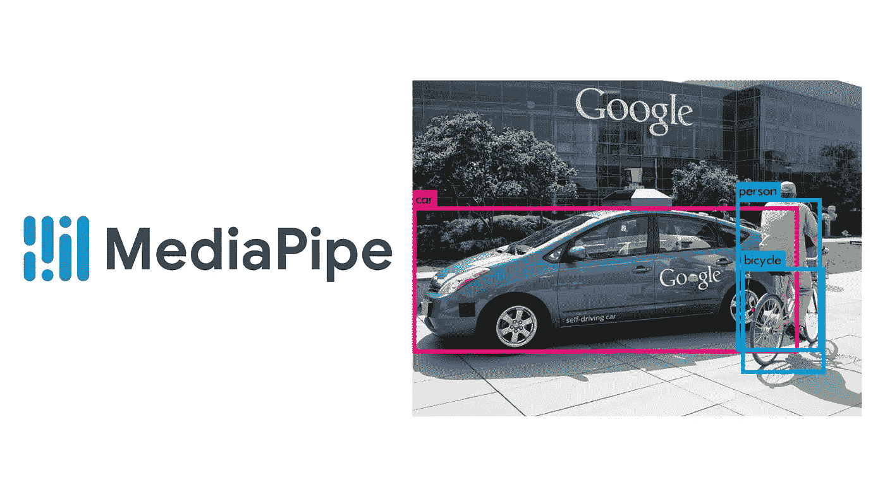
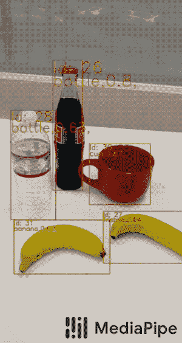
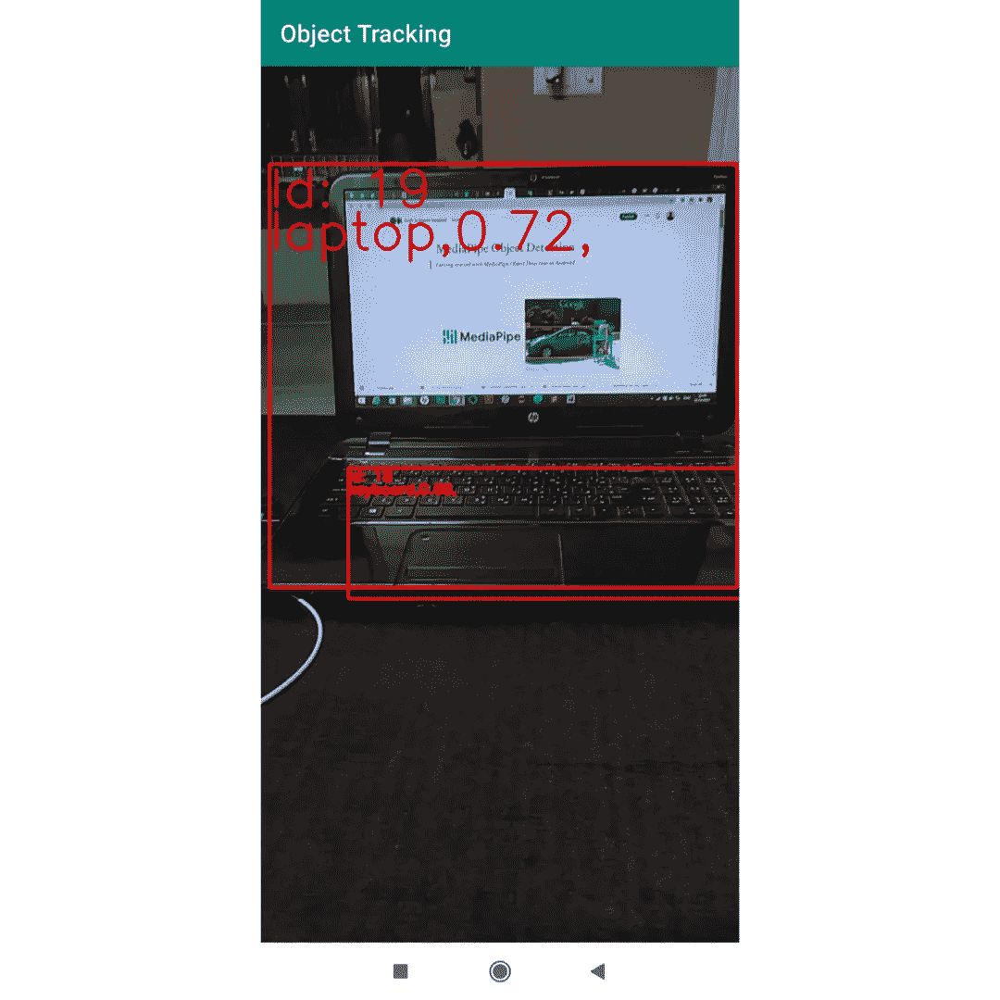

# 媒体管道对象检测和盒子跟踪

> 原文：<https://medium.com/analytics-vidhya/mediapipe-object-detection-and-box-tracking-82926abc50c2?source=collection_archive---------3----------------------->

> Android 中的 MediaPipe 对象检测和盒子跟踪入门



在从事几个个人项目后，我意识到大规模部署机器学习(ML)模型是愿意通过人工智能创造价值的学生开发人员面临的最重要挑战之一，随着模型变得越来越复杂，这只会变得越来越困难。根据最近的一项研究，ML 项目中只有很小一部分能够进入生产阶段，而其余的可能只能在 Jupyter 笔记本 xD 上完成。媒体管道框架的作用来了…

“MediaPipe 是构建管道****对任意感官数据如图像、音频流和视频流*进行推理的框架。”* MediaPipe 提供跨平台的统一解决方案，可在 Android、iOS、桌面/云、web 和物联网等设备上运行。****

****使用 MediaPipe，感知管道可以构建为模块化组件的图形，包括模型推理、媒体处理算法和数据转换。MediaPipe 是谷歌自 2012 年以来在内部用于其产品的东西，并于 2019 年 6 月在 CVPR 开源。要了解更多关于 MediaPipe 框架的概念，您可以访问这里的[](https://google.github.io/mediapipe/framework_concepts/framework_concepts.html)****。********

## ********我们今天要学什么？********

*****我们将实现由 MediaPipe 提供的对象检测和跟踪 Android 解决方案。我已经在 **Ubuntu 18.04** 中完成了这个实现，如果你正在使用任何其他操作系统，请按照这个 [***链接***](https://google.github.io/mediapipe/getting_started/install.html) 中相应的安装方法。*****

## *****步骤 1 —安装 Bazel*****

*****为了构建这个应用程序，我们将使用 Mediapipe 和 bazel。为了在 Ubuntu 中安装 bazel，我们将使用以下命令。*****

## *****a)添加 Bazel 分发 URL 作为包源*****

*******注:**这是一次性设置步骤。*****

```
***sudo apt install apt-transport-https curl gnupg
curl -fsSL https://bazel.build/bazel-release.pub.gpg | gpg --dearmor > bazel.gpg
sudo mv bazel.gpg /etc/apt/trusted.gpg.d/
echo "deb [arch=amd64] https://storage.googleapis.com/bazel-apt stable jdk1.8" | sudo tee /etc/apt/sources.list.d/bazel.list***
```

## *****b)安装和更新 Bazel*****

```
***sudo apt update && sudo apt install bazel***
```

## *****步骤 2-签出 MediaPipe 存储库*****

```
***$ cd $HOME
$ git clone https://github.com/google/mediapipe.git

# Change directory into MediaPipe root directory
$ cd mediapipe***
```

## *****步骤 3-安装 OpenCV 和 FFmpeg*****

*****使用包管理器工具安装预编译的 OpenCV 库。FFmpeg 将通过 libopencv-video-dev 安装。*****

```
***$ sudo apt-get install libopencv-core-dev libopencv-highgui-dev \
                       libopencv-calib3d-dev libopencv-features2d-dev \
                       libopencv-imgproc-dev libopencv-video-dev***
```

## *****步骤 4-用 C++运行 Hello World 示例*****

```
***$ export GLOG_logtostderr=1

# if you are running on Linux desktop with CPU only$ bazel run --define MEDIAPIPE_DISABLE_GPU=1 \
    mediapipe/examples/desktop/hello_world:hello_world

# If you are running on Linux desktop with GPU support enabled (via mesa drivers)$ bazel run --copt -DMESA_EGL_NO_X11_HEADERS --copt -DEGL_NO_X11 \
    mediapipe/examples/desktop/hello_world:hello_world# It should print:-
# Hello World!
# Hello World!
# Hello World!
# Hello World!
# Hello World!
# Hello World!
# Hello World!
# Hello World!
# Hello World!
# Hello World!***
```

*****如果您在获取上述 Hello World 输出时遇到任何问题，请访问此链接查看 [***故障排除。***](https://google.github.io/mediapipe/getting_started/troubleshooting.html)*****

*****现在我们已经完成了 MediaPipe 的常规安装，接下来的步骤是安装 Android studio 及其工具。*****

## *****步骤 5-安装 Java*****

*****在 android studio 中开发应用程序需要 Java 开发套件，您可以参考此[***链接***](https://www.youtube.com/watch?v=PpDSz9zJVYI) 在您的 Ubuntu OS 中安装 Java。*****

## *****步骤 6-安装 Android Studio*****

*****在 Ubuntu OS 中安装 android studio 可以参考这个 [***链接***](https://www.youtube.com/watch?v=x3nVHXv3oyw)*****

## *******步骤 7-安装必要的软件包(SDK 和 NDK)*******

*****MediaPipe 建议必须通过 Android Studio 设置 Android SDK 和 NDK。在 Android Studio 中*****

1.  *****点击**工具** > **SDK** 管理器*****
2.  *****在 **SDK** 平台选项卡中，选择 **Android** API 级别 28 或 29，然后点击安装。*****
3.  *****在 **SDK 工具**选项卡中，选择 **Android SDK** Build- **工具** 28 或 29*****
4.  *****选择 Android SDK **平台-工具** 28 或 29*****
5.  *****选择 Android SDK 工具 26.1.1*****
6.  *****选择安卓 NDK 17 或以上版本*****
7.  *****安装它们*****

## *****步骤 Android SDK 和 NDK 的设置路径*****

*****安装安卓 SDK 和 NDK(由安卓工作室)后，设置$安卓 _HOME 和$安卓 _NDK_HOME，用于指向已安装的 SDK 和 NDK。您将在 SDK 管理器的最上面的栏中获得这些路径。*****

```
***export ANDROID_HOME= <path to the Android SDK>
export ANDROID_NDK_HOME= <path to the Android NDK>***
```

*****在第 8 步之前，我们已经设置了从 MediaPipe 构建 Android 示例的依赖关系，现在我们可以在下列步骤的帮助下构建任何示例。*****

*****在这篇博客中，我们正在用盒子跟踪机器人的例子来构建物体检测。它使用的是已经训练好的 Tflite 模型，该模型位于 [***这里***](https://github.com/google/mediapipe/blob/master/mediapipe/models/ssdlite_object_detection.tflite)*****

*****媒体管道盒跟踪可以与 ML 推理配对，从而产生有价值且高效的管道。例如，框跟踪可以与基于 ML 的对象检测配对，以创建对象检测和跟踪管道。通过跟踪，该流水线提供了优于每帧运行检测(例如[媒体管道对象检测](https://google.github.io/mediapipe/solutions/object_detection.html))的几个优点:*****

*   *****它提供基于实例的跟踪，即跨帧维护对象 ID。*****
*   *****检测不必在每一帧都运行。这使得能够运行更精确的更重的检测模型，同时保持管道在移动设备上的轻量级和实时性。*****
*   *****在跟踪的帮助下，对象定位在时间上是一致的，这意味着跨帧可观察到更少的抖动。*****

**********

*****[*方框跟踪*](https://google.github.io/mediapipe/solutions/box_tracking.html) *配合基于 ML 的物体检测。******

## *****步骤 9-构建 Android 应用程序*****

*******选项 A)在命令行中使用 Bazel 构建*******

*****要构建一个 Android 示例应用程序，需要根据相应的`android_binary`构建目标进行构建。例如，对于媒体管道对象跟踪，目标是[构建](https://github.com/google/mediapipe/tree/master/mediapipe/examples/android/src/java/com/google/mediapipe/apps/handtrackinggpu/BUILD)文件中的`objecttrackinggpu`:*****

```
***#Use this command to build the APK for Object Tracking GPU
bazel build -c opt --config=android_arm64 [mediapipe/examples/android/src/java/com/google/mediapipe/apps/objecttrackinggpu:objecttrackinggpu](https://github.com/google/mediapipe/tree/master/mediapipe/examples/android/src/java/com/google/mediapipe/apps/objecttrackinggpu/BUILD)# On successfully building the APK, it prints
INFO: Elapsed time: 1499.898s, Critical Path: 753.09s
INFO: 2002 processes: 1849 linux-sandbox, 1 local, 152 worker.
INFO: Build completed successfully, 2140 total actions***
```

*****首次构建时，这大约需要 20-30 分钟，因为它会下载构建的所有外部依赖项。但是下一次它将使用缓存的依赖项，所以它构建得更快。*****

*****现在，我们准备运行 APK 并测试它。*****

*******安装 APK*******

*****在安装 APK 之前，请确保您的 android 设备已与系统连接，并且 *USB 调试*已打开。*****

```
***adb install bazel bin/[mediapipe/examples/android/src/java/com/google/mediapipe/apps/objecttrackinggpu/objecttrackinggpu](https://github.com/google/mediapipe/tree/master/mediapipe/examples/android/src/java/com/google/mediapipe/apps/objecttrackinggpu/BUILD).apk***
```

*****我在我的 [Note 7S](https://gadgets.ndtv.com/redmi-note-7s-price-in-india-13068) 手机上测试了这个应用程序，它以 0.6-0.8 FPS 的速度运行，并用 ID 跟踪我的笔记本电脑及其键盘。*****

**********

*****Android 中的对象检测和跟踪应用程序(Note 7s)*****

*****在这里，我们成功地在 Android 中构建了对象检测和盒子跟踪的 MediaPipe 示例。以类似的方式，我们也可以从 MediaPipe 现有的例子中实现分割和手部跟踪。*****

*****在这个 MediaPipe 博客系列的下一部分中，我们将讨论如何使用我们自己定制的 Tflite 模型进行 MediaPipe 对象检测和盒子跟踪。
敬请期待。*****

**********

## *******参考文献*******

1.  *****MediaPipe Android [***文档***](https://google.github.io/mediapipe/getting_started/android.html)*****
2.  *****MediaPipe 安装 [***指南***](https://google.github.io/mediapipe/getting_started/install.html)*****
3.  *****具有自定义 Tflite 模型的 media pipe-[***博客***](https://blog.gofynd.com/mediapipe-with-custom-tflite-model-d3ea0427b3c1)*****
4.  *****MediaPipe [***物体检测***](https://google.github.io/mediapipe/solutions/object_detection.html)[***盒子跟踪***](https://google.github.io/mediapipe/solutions/box_tracking.html) 文档*****
5.  *****Google 开发者 [***博客***](https://developers.googleblog.com/2019/12/object-detection-and-tracking-using-mediapipe.html)——使用 MediaPipe 进行物体检测和跟踪*****