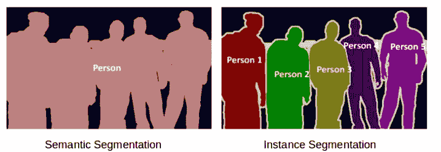
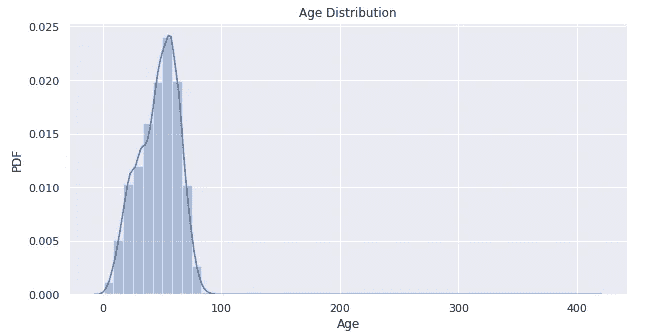
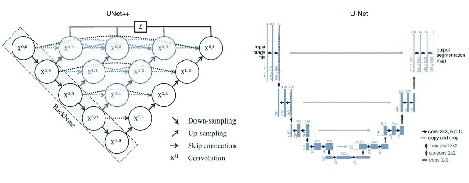
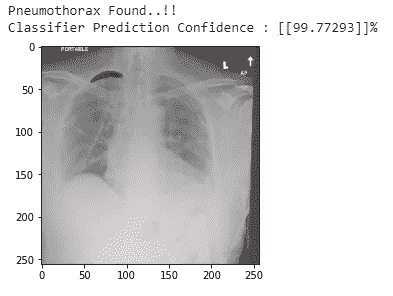

# 医学图像分类和分割——案例研究方法

> 原文：<https://medium.com/analytics-vidhya/medical-image-classification-and-segmentation-a-case-study-approach-6b5c7a73b9f5?source=collection_archive---------1----------------------->

用人工智能预测并最终阻止肺萎陷的灾难

信用:[https://www.medicalnewstoday.com/articles/318110](https://www.medicalnewstoday.com/articles/318110)

人工智能正在影响几乎每一个行业。投入到这个领域的巨大投资以及进步的速度只证明了一件事:人工智能已经存在并且正在发展..！)来颠覆每个行业的工作方式。

医疗领域和这些影响没什么区别。不同类型的应用程序现在都在使用，其中包含一些人工智能的组件。首先，我们将 RPA(机器人流程自动化)、聊天机器人和不同的医疗保健分析视为人工智能在该领域的用例。AI 还有一个很重要的操作就是医学图像分类分割。

人工智能在医学中的大多数应用都会读入某种类型的数据，要么是数字数据(如心率或血压)，要么是基于图像的数据(我们将很快讨论这种数据)。然后，算法从数据中学习并生成概率或分类，然后对受感染部分进行分割。例如，可采取行动的结果可以是给定心率和血压数据的动脉凝块的概率，或者将成像的组织样本标记为癌性或非癌性的概率。

在这篇博客中，我们将讨论一个名为“***”SIIM-ACR 气胸分割*** ”的案例研究，其中包括从胸部 x 光片中检测疾病。

# 内容:

1.  *商业问题*
2.  *将现实世界的问题映射为深度学习问题*
3.  *数据集分析*
4.  *现实世界的业务约束*
5.  *绩效指标*
6.  *现有方法*
7.  *我的第一次切入方式*
8.  埃达
9.  *预处理*
10.  *建模*
11.  *最终管线*
12.  *部署*
13.  *未来工作*
14.  *参考文献*
15.  *Github 资源库链接*
16.  *Linkedin 个人资料*

1.  **业务问题:**

在我们开始着手解决方案之前，让我们先了解一下这种临床情况。在正常情况下，肺接触胸腔壁。但是有时，空气积聚在胸壁和肺之间的空间中，即胸膜空间中。这些空气开始给肺部加压，逐渐地一部分或(有时)整个肺部可能会塌陷。这种疾病被称为气胸。气胸基本上是两个词的组合:气胸(空气)和胸腔(胸部)。因此，它也被称为肺萎陷。

一些不同的原因会导致气胸，症状也可能千差万别。气胸的原因分为*原发性自发性*、*继发性自发性*或*外伤性*。

***原发性自发性气胸*** (PSP)发生在该人没有已知肺部疾病史的情况下。PSP 的直接原因不明。

***继发性自发性气胸*** (SSP)可由多种肺部疾病和紊乱引起。SSP 比 PSP 携带更严重的症状，它更有可能导致死亡。

***创伤性气胸*** 是由于撞击或损伤造成的。潜在的原因包括胸部钝伤或损伤胸壁和胸膜空间。

气胸通常由放射科医生在胸部 x 光片上诊断，有时很难确诊。这是因为气胸的症状最初可能很难被注意到，并可能与其他疾病相混淆。一个精确的人工智能算法来检测气胸将在许多临床场景中有用。人工智能可以用于优先解释胸片，或者为非放射科医生提供更有信心的诊断。

**2** 。**将现实世界的问题映射为深度学习问题:**

我们在本案例研究中使用的方法将首先在输入的 X 射线中检测疾病的存在。如果条件存在，那么它将突出显示受感染的部分。所以，在第一阶段，我们在做一个*(气胸有无)的二元分类。根据分类模型的结果，在第二阶段，我们突出显示图像中受感染的部分，即我们使用 ***图像分割*** 技术。*

*在继续之前，让我们更好地理解图像分割的主题。*

***什么是图像分割？***

*图像分割是将图像的不同元素分类或分割成不同类别的一种方式。虽然这听起来像物体检测，但实际上比这更详细。这是因为在对象检测中，我们在给定图像中的不同对象/类别周围绘制边界框。但是在图像分割中，我们把图像的每个像素归入不同的类。所以我们可以用图像分割来实现更深入的解释。*

****图像分割的类型:****

**

*信用:[https://www . ka ggle . com/c/severstal-steel-defect-detection/discussion/108126](https://www.kaggle.com/c/severstal-steel-defect-detection/discussion/108126)*

*1.*— —语义分割——用相同的颜色识别一个对象的所有实例。例如:在上面的图片中，它将所有的人分成相同的类，因此它对所有的人使用相同的颜色段。**

**2. ***实例分割*** — —它识别图像中一个物体的每个实例。例如:在上面的图片中，它将每个人分成不同的类别。**

**在我们的案例研究中，我们将使用 ***语义分割*** 类型。**

****3。数据集分析:****

**数据集取自 Kaggle 竞赛页面。**

** [## SIIM-阿克尔气胸分割法

### 在胸片中识别气胸疾病

www.kaggle.com](https://www.kaggle.com/c/siim-acr-pneumothorax-segmentation/overview) 

数据由 DICOM 格式的图像组成，包含 ***游程编码(RLE)*** 掩码。气胸的实例由注释中的编码二进制掩码指示。一些训练图像具有描绘事件的多个位置的多个注释。没有气胸的图像的遮罩值为-1。任务是在给定的 X 射线图像中预测气胸的掩模。

a)给定的文件:

train-rle.csv，stage_2_sample_submission.csv(测试数据)，train_images，test_images。

b)总文件大小:4GB

c)记录总数:12，954(训练数据)，3204(测试数据)

d)***train-rle . CSV***包含图像 id 及其对应的 RLE 掩码，而 ***测试 CSV*** 文件仅包含图像 id。** 

****4。现实世界的商业约束:****

**a)低延迟非常重要。**

**b)错误分类/错误分割的成本相当高，因为我们正在处理医疗数据，因此对这种错误非常敏感。**

****5。绩效指标:****

## ****A)分割部分:****

1.  *****【Dice 系数(IntersectionOverUnion/IOU)***:**

*****骰子系数*** 可用于比较预测的分割与其对应的基本事实之间的逐像素一致性。该公式由下式给出:**

****

**信用:[https://en . Wikipedia . org/wiki/S % C3 % b 8 rensen % E2 % 80% 93 ice _ coefficient](https://en.wikipedia.org/wiki/S%C3%B8rensen%E2%80%93Dice_coefficient)**

**其中 X 是预测的像素集合，Y 是地面实况。当 X 和 Y 都为空时，Dice 系数定义为 1。**

**2. ***连击损失——(二元交叉熵+骰子损失/ F1 损失):*****

**对于分割模型的评估，研究人员发现 ***二进制交叉熵*** 和 ***骰子损失*** 是我们可以使用的最佳组合损失函数。这个 [***组合损失***](https://www.kaggle.com/bigironsphere/loss-function-library-keras-pytorch#BCE-Dice-Loss) 对于不平衡数据集的问题很有帮助。**

## ****B)分类部分:****

1.  *****假阴性(FN):*****

**由于我们正在处理医疗数据，我们必须 ***最大限度地减少假阴性*** ，因为如果患者*患有疾病*(即真实标签=阳性)，但模型预测他*是安全的*(即预测标签=阴性)可能会被证明是灾难性的。**

**2. ***精度或阳性预测值(PPV) :*****

**阳性预测值或精确度是预测结果为阳性的人确实患有该疾病的概率。**

****

**因此，0.71 的 PPV 意味着如果一个人被预测患有气胸，那么他实际患有该疾病的概率为 71%。**

**3. ***真阳性率(TPR)或敏感度或回忆:*****

*****灵敏度*** 或**T**rue**P**positive**R**ate 是假设情况实际上是正的，模型输出正的概率。它显示了正类的哪一部分得到了正确的分类。**

**因为我们希望大多数的正类能被正确预测。因此，我们需要高灵敏度(TPR)。**

****6。现有方法:****

**A) ***U-Net 预测气胸:*****

** [## U-Net 预测气胸

### 使用 Kaggle 笔记本探索和运行机器学习代码|使用来自多个数据源的数据

www.kaggle.com](https://www.kaggle.com/reemrashwan/u-net-to-predict-pneumothorax) 

这个内核使用普通的 unet 结构来解决分段问题。它使用具有 64–128–256–256–256–256–256 模式神经元的 6 个编码器层和具有 512–512–256–128–64 模式神经元的 5 个解码器层。它发现组合损失表现不佳，因此使用自定义指标，如自定义 IOU(intersect overunion)以及 tf 的 MeanIoU 指标。Keras.metrics 包。使用的检查点是模型检查点，用于保存最佳重量和减少 LROnPlateau，最佳耐心为 5，冷却时间为 1。这个内核中没有使用任何增强功能。

b)***Unet exception Keras 进行气胸分割:***

 [## 带高效网络编码器的嵌套 Unet

### 使用 Kaggle 笔记本探索和运行机器学习代码|使用来自多个数据源的数据

www.kaggle.com](https://www.kaggle.com/meaninglesslives/nested-unet-with-efficientnet-encoder) 

该内核使用 Unet++架构，预训练的 EfficientNetB4 模型作为编码器，残差块位于解码器部分。为了更好地收敛，他还对最后 3 层使用了随机加权平均。这个内核中使用的增强是弹性变形、网格变形、光学变形和简单的水平翻转。他分 16 批使用了尺寸为 256x256 的图像。他使用像 ModelCheckpoint 这样的回调来保存最佳模型，并使用余弦退火来定制 LearningRateSchedular。** 

****7。我的第一次切入方式:****

****一只**。由于给出的数据是图像，我们不能在这些图像上做太多的 EDA。但是图片是在。dcm 格式，这种格式存储了大量元数据。利用这些，我打算深入研究图像，以了解数据集的质量。**

****b** 。一旦我们提取并分析了元数据，我们需要将格式从。dcm 到。进一步的步骤。**

****c** 。此外，在数据中，我们提供了 rle(游程长度编码)，将数据的游程存储为单个数据值和计数，而不是原始总和。我们需要将这个 RLE 转换成进一步分割过程所需的遮罩。**

****d** 。一旦我们完成了上述步骤，我们的数据将准备好，不同的分类和分割算法可以应用于它。**

****e** 。使用日志，我们需要了解哪个模型在性能速度和指标值方面表现更好。**

****f** 。然后，我们需要部署最佳模型，以便围绕它构建端到端应用程序。**

****8。探索性数据分析:****

**让我们首先读取包含 RLEs 和 ImageId 的 CSV 文件。**

****

**输出**

**我们看到，以单个 ***ImageId*** 及其对应的***encoded pixels***的形式存在关于图像的信息，即 RLE(掩码的游程编码)。**

**让我们检查一下记录的数量。**

****

**我们一共有 ***12954 张火车图片*** 。除了这些，我们有一些明显的重复从上面。总共有 ***907*** 条记录是 ***重复*** 。删除重复的图片后，我们总共会有 ***12，047 个独特的图片*** 。**

**解压缩后我们得到的文件夹结构显示，每个图像都存在于一个单独的文件夹中。我们需要将这些图像从它们各自的文件夹移动到一个公共目录，该目录将保存所有的图像。之后，让我们将每个图像的文件路径保存在。csv 作为单独的列。这将有助于我们在后期阶段轻松访问图像。**

**这些步骤后的 CSV 如下所示:**

****

**所有列车 Dicom 图像都被移动到该公共路径“列车数据集/siim/列车 _ dicom _ 图像”。**

****DICOM 图像分析:****

**我们有文件。dcm 格式。这种格式通常用于医学成像领域，被称为 DICOM(医学数字成像和通信)。如今，几乎所有形式的医学成像都已数字化，DICOM 是用于存储此类图像(例如:X 射线扫描和 CT 扫描)以及元数据的文件格式。**

**让我们绘制一些图像，看看它们看起来怎么样。**

****

**让我们详细检查一个图像，看看它存储的元数据的类型。为此，我们在 python 中有一个库来处理 DICOM 图像，即“pydicom”。我们可以简单的用**的 *pip3 安装 pydicom 来安装。*****

**我们了解到每个病人都有很多信息。我们将只检查一些特征，如' ***年龄*** '、 ***性别*** '、 ***形态*** '、以及' ***视图位置*** '。**

****

**输出**

**创建“气胸”列的逻辑是，如果特征“编码像素”的值为“-1”，则我们指定“否”，否则为“是”。**

*****分析‘性别’字段:*****

****

**我们有 55%的记录，男性占大多数。女性( **F** )由剩余的 45%的记录组成。在提供的数据中，我们只有这两种性别。**

*****分析目标(气胸)场:*****

****

**正如预期的那样，大多数记录(77.85%)没有记录任何气胸发生。一小部分(22.15%)的记录有这种疾病。**

**因为这是医学数据，所以很有可能会严重失衡，因为它反映了现实世界的情况，即大多数接受 X 射线检查的患者并没有患有上述疾病。**

*****一起分析气胸的发生与性别:*****

****

**在男性 55%记录中，我们有 ***77.5%为健康*** 和 22.5%为气胸检测。在 *45%的女性*记录中，我们有 ***78.2%为健康*** 和 21.8%为气胸检测。**

*****分析视图位置字段:*****

****

**我们通过改变患者身体的方向和 x 射线束的方向来获得胸部的不同视图。在数据集中，我们看到两个位置——**PA**(后前)和 **AP** (前后)。在 ***PA 视图*** 中，x 射线束通过胸部的后(背)面进入，并从前(前)面射出，在此处对射线束进行检测。在 ***AP 视图*** 中，x 射线源和探测器的位置颠倒。 **AP** 胸部 x 光片*比 **PA** x 光片*更难阅读，因此一般用于患者难以获得普通胸部 x 光片的情况，例如当患者卧床不起时。我们在上图中看到了类似的趋势，其中绝大多数记录(60.38%)有 PA，只有 39.62%的记录有 AP。**

*****将视角和气胸的发生一起作为参数进行分析:*****

****

*****总结剧情:*****

**以 ***PA*** 为 viewPosition 的记录占 60.38%，以 ***AP*** 为 view position 的记录占 39.62%。在所有 PA 记录中， *76.7%* 健康，未检测到气胸。其余 23.3%的记录中有该病。在所有 AP 记录中， *80%* 健康，未检测到气胸。其余 20.4%的记录中有这种疾病。**

*****分析年龄字段:*****

****

**我们看到“年龄”的分布在 58 岁达到峰值，因为它有最大的计数。更常见的年龄段是 50-60 岁。我们还看到 1 条年龄为 413 的记录，这可能是一个异常值。**

****9。预处理:****

**在数据预处理部分，我们将做两件事:**

1.  **将 DICOM 图像转换为 PNG**
2.  **根据给定的规则创建遮罩**

**让我们从第一个任务开始，然后:**

1.  *****将 DICOM 图像转换为 PNG:*****

**既然不能用 ***。dcm*** 图像在建模过程中，所以我们需要将格式转换为 **.png.****

**在这种方法中，我们将图像大小从 1024x1024 更改为更小的(因此，在我们有限的计算资源中更易于管理) ***256x256*** 大小。与此同时，我们正在替换*中的格式。dcm 到。png* 并将新的较小尺寸的 png 图像存储在不同的文件夹中。**

**2. ***从给定的 RLEs 创建遮罩:*****

**我们有形式为 ***行程长度编码像素*** 的掩码数据，我们需要将其转换为 ***。png*** 格式，以便它们可以正确地成为每个给定的 png 图像的基础事实。*组织者提供了一个使用 RLE 为像素创建遮罩的功能。***

**现在，让我们设想一个带有地面真相遮罩的 PNG 图像:**

****

**带掩模的样品 X 射线**

***我们的结果应该给出胸部 x 光的屏蔽图像(最右边的一个)。***

****10。造型:****

***注意:本研究的目标不是获得很高的准确性或超越任何模型，而是探索模型行为* *的方式和原因，并尝试不同的架构。***

**如第 2 节所述，我们首先需要将图像分类为气胸或不气胸。根据结果，我们将继续进行分割。所以，首先，我们将建立一个*二元分类模型作为*的第一步*。***

*****A)第 1 部分——气胸分类:*****

**首先，我们将胸部 x 光分为没有气胸(标号:0)或有气胸(标号:1)。这部分是*图像分类*部分，我们使用预训练模型 **CheXNet** ( *一个在胸部 x 光图像*上微调的 121 层 DenseNet 模型)应用迁移学习技术对图像进行分类。**

**为了完成这个二进制分类任务，我们需要作为二进制标签的基本事实。目前，我们有地面真相作为 RLEs(如给定的)或面具(如上面转换的)。因此，我们需要根据给定的格式创建二进制标签。我们观察到在没有任何气胸情况的图像中，“*编码像素*”列的值为-1。否则它有必要的规则。因此，使用这个知识，我们创建二进制标签，以便我们为具有 ***非负 RLEs*** *否则* ***标签 0*** 的图像分配 ***标签 1*** 。**

**有了这个，现在我们的数据就是分类模型的格式了。让我们将现在的数据拆分为 Train 和 CV。**

**imagePath 包含单个图像的完整位置路径，格式为***Train Dataset/siim/Train _ png _ images/imageID****。***

**总训练数据集大小:10842 &总有效数据集大小:1205。**

****

**训练数据集中的类别分布**

*****处理阶级不平衡:*****

**我们有不平衡的数据，因为正类的数量远远超过负类的数量。这在医疗领域是一个很常见的事件。我们需要处理这种数据不平衡的问题，以便模型不会变得过于偏向多数阶级。为了确保两个类别对损失的贡献相等，我们给每个类别赋予权重。 ***这个权重与上课的频率成反比。*** 我们计算这个频率为***count _ of _ class/total _ records _ present。*****

****

**类别频率**

**正如预期的那样，正类的记录要少得多，因此频率也明显低于负类。这样，我们现在已经为每个类分配了权重。为了确认，让我们检查每一类对损失的贡献，以便模型对任何一类都保持无偏。我们计算每个类别 *的这个 ***贡献，作为类别 _ 权重和类别 _ 频率*** 的* ***乘积。*****

**

*现在，我们的模型不会因为阶级不平衡而出现偏差。*

****处理增强:****

***数据** **增强**用于通过添加已有图像的轻微修改副本来增加数据量。它作为一个正则化器，有助于在训练模型时减少过度拟合。我们这里使用的增强是来自 ***tf 的 *random_flip_left_right* 、 *random_contrast* 、 *random_brightness* 、 *random_saturation* 、 *random_hue* 和 *adjust_gamma* 。图像*** 管道。我们还使用随机增强，这样每张图像都可以随机选择增强。*

*因此，我们的管道是为分类模型而构建的。*

*我们使用 ***CheXNet*** 模型来构建我们的分类器。它是一个 *121 层 DenseNet* 在胸部 x 光图像上进行预训练(参考:[https://arxiv.org/abs/1711.05225](https://arxiv.org/abs/1711.05225))。*

*在构建我们的架构之前，让我们多了解一下 DenseNet。*

****DenseNet*** 是用于图像分类&物体识别的架构。它非常类似于 ResNet 架构，尽管它有一些基本的区别。ResNet 使用加法(+)将以前的层(身份)与未来的层合并，而 DenseNet 按通道连接(。)前一层与后一层的输出。*

**

*dense net:[https://arxiv.org/pdf/1608.06993.pdf](https://arxiv.org/pdf/1608.06993.pdf)*

*让我们看看我们在 DenseNet 上创建的模型结构。我们已经为我们的 DenseNet-121 架构直接加载了 ChestXNet 的权重。除此之外，我们还添加了一些额外的层，同时微调我们的模型。*

*我们可以看到，在定义 DenseNet121 时，我们给了 ***权重= None*** 和***include _ top = False***。*

*这是因为我们*没有使用 imagenet 权重* (DenseNet 最初是在 imagenet 数据集上训练的)，而是使用稍后单独加载的 CheXNet 权重。*

*通过指定 **include_top=False** 参数，我们加载了一个顶部不包含分类图层的网络。这是因为 ChexNet 被训练来分类 14 类，其中一类是气胸。因为我们在这里只处理 1 个类，所以在加载架构时不需要包含顶层。*

*在额外的层中，我们添加了一个 GlobalAveragePooling2D 和一系列 BatchNormalization、Dense 和 Dropout 层，以进一步微调模型。*

*我们使用了以下回调:*

*我们使用类似于***model check point***的回调——用于保存具有最大验证 AUC 的最佳模型， ***提前停止***——用于如果度量值(val_auc)在 6 个时期内没有变化则停止训练，以及 ***减少 lronplateau***——用于如果度量值在 3 个时期内没有变化则降低学习速率。*

*现在我们已经训练了模型，让我们检查指标值，以确定模型的表现如何。*

****评估指标值:****

**

*AUC-ROC 值:*

**

*我们在 CV 数据集上得到了 0.908 的 AUC 分数。*

**

*混淆矩阵*

*我们得到了 86.1%的验证准确率。*

****灵敏度*** (真阳性率)是假设案例实际为阳性，模型输出阳性的概率。它显示了正类的哪一部分得到了正确的分类。这也是召回。*

*阴性预测值( ***NPV*** )是预测阴性的人真正没有患病的概率。因此，NPV 为 0.914 意味着，如果预测一个人没有气胸，那么他实际上没有患病的概率为 91.4%。*

****敏感度*** 和 ***NPV*** 是最重要的度量值。由于我们正在处理医疗数据，我们必须 ***将假阴性*** 降至最低，因为患者患有疾病(即真实标签=阳性)但模型预测他是安全的(即预测标签=阴性)的情况可能被证明是灾难性的。我们还需要 ***最大化真正的阳性*** 因为我们希望大多数阳性类被正确预测。因此，我们需要一个**高灵敏度** (TPR)和一个**高净现值**。*

**

*精确召回曲线*

*我们在 CV 数据集上获得了 0.731 的平均精度分数。 ***精确-召回曲线*** (PRC)显示了精确和召回之间的权衡。曲线下的高区域表示高召回率和高精度，其中高精度与低假阳性率相关，高召回率与低假阴性率相关。两者的高分表明分类器正在返回准确的结果(高精度)，以及返回所有肯定结果的大部分(高召回)。*

*如指标值所示，该模型运行良好。*

*至此，我们完成了我们的分类部分。*

****B)第二部分——气胸分割:****

*在第二部分，也是最重要的一部分，我们建立分段模型，其中我们应用不同的架构(*嵌套 Unet* ，以及*双 Unet，预训练 VGG19* 作为骨干编码器)来预测掩码。*

1.  ****UNet++:用于医学图像分割的嵌套式 UNet 架构:****

*UNET++与 UNET 有许多相似之处，因为两者都有编码器-解码器架构。*

*现在让我们看看 UNET 和 UNET++之间的区别:*

**

*参考:生物医学图像分割:UNet++ by Jingles (Hong Jing)*

*UNET++与 UNET 相比有以下*:**

*****a)*** 它重新设计了跳过路径(显示为绿色)**

*****b)*** 它有密集的跳跃连接(显示为蓝色)**

*****c)*** 深度监督(显示为红色)**

****

**嵌套 Unet**

*****a)*** ***重新设计的跳过路径(显示为绿色):*****

**重新设计的跳过路径中存在的卷积层(如绿色所示)用于桥接编码器和解码器部分的特征集之间的语义鸿沟。**

**UNET 中的跳过连接将特定层的编码器的特征映射与相应解码器层的上采样特征映射连接起来。这可能导致融合或连接不同的特征地图。这在 UNET++中得到了弥补。同一密集块的前一卷积层的输出与较低卷积层的相应上采样输出融合。这使得所得的编码器特征映射更类似于相应解码器的特征映射。因此，当接收到语义相似的特征图时，优化更容易。**

*****b)*** ***密集跳过连接(显示为蓝色):*****

**密集跳跃连接(以蓝色显示)在编码器和解码器之间实现了跳跃路径。这些密集块的灵感来自 DenseNet，目的是提高分割精度和改善梯度流。这些连接确保当前节点中存在所有先前的特征映射。这在多个语义级别生成全分辨率特征图。**

**c) ***深度监督(显示为红色):*****

****

**参考:[https://arxiv.org/pdf/1807.10165.pdf](https://arxiv.org/pdf/1807.10165.pdf)**

**添加了深度监督(以红色显示),以便可以修剪模型来调整模型复杂性，即平衡预测时间和性能。**

**为了更好地理解 UNet++你可以访问这篇文章，[这里](https://arxiv.org/pdf/1807.10165.pdf)。**

**下面是香草 UNET++的代码，没有任何预先训练的骨干。**

**下面，是连击损失:**

**编译模型:**

**训练模型:**

**让我们绘制指标图，看看我们的模型表现如何:**

****

**评估指标**

**正如我们可以看到的，每个时期的损失都在减少，但非常缓慢。骰子分数在 0.21 以上没有太大改善。解决方案是，我们应该为进一步的时代训练模型，更积极地改变学习率，并使用预训练的模型作为编码器主干。**

**正如我们之前所说的，这篇博客的目的是实验不同的架构，看看哪一个性能更好，为什么？**

**因此，请记住，我们不会在以前的体系结构中添加任何预先训练好的主干。相反，我们将尝试以 VGG19 作为其编码器主干的双 Unet 结构。**

**2. ***双 UNET:*****

**顾名思义，这是两种 UNET 模式的结合。你可以点击查看论文[。](https://arxiv.org/ftp/arxiv/papers/2006/2006.00414.pdf)**

**作者对建筑的简短解释:**

**D *oubleU-Net 以 VGG19 作为编码器子网开始，其后是解码器子网。在网络中，输入图像被馈送到修改的 UNet(UNet1)，该 UNet 生成预测的掩模(即，输出 1)。然后，我们将输入图像与生成的掩码(即，输出 1)相乘，该掩码作为第二个修改的 U-Net(UNet2)的输入，该 U-Net 生成另一个生成的掩码(输出 2)。最后，我们连接两个掩码(输出 1 和输出 2)以获得最终的预测掩码(输出)。***

**下面是架构:**

****

**DC-UNET**

**我们可以看到，上述架构使用 4 个编码器模块和 4 个解码器模块。更多数量的这种块增加了总的可训练参数，因此需要更多的计算能力来正确训练。由于我们在访问这样的计算能力方面有限制，我们将在我们的架构中仅使用 2 个编码器和 2 个解码器模块。**

**模型建筑的 TensorFlow 代码相当大，并且在我的 Github 配置文件中有，因此我不在这里添加它。**

**让我们检查一下指标:**

****

**与 UNET++相比，在 30 个周期结束时，损耗下降得非常好。骰子分数还是不太好。我们可以训练更多的纪元来获得更好的性能。但由于时间关系，我们将只讲到这里。**

**我们来看看这个模型的预测:**

****

**红色:预测面具；绿色:原始遮罩**

**我们看到，当没有遮罩时，模型可以正确预测。对于存在屏蔽的情况，预测或多或少与地面实况相似。显然，我们可以通过更好地处理数据不平衡、为更多时期训练模型或应用上述其他技术来提高性能。**

****10。最终管线:****

**为了构建最终的推理管道，我们保存了上述两个模型权重。**

**现在让我们建立管道:**

**让我们来看看一些预测:**

*****正面预测:*****

****************

*****负面预测:*****

********

*****失败案例:*****

**展示一些失败案例是很重要的。分类器预测存在气胸，但分割模型未能突出任何部分的情况。**

****

**失败案例**

****12。部署:****

**让我们围绕该模型构建一个端到端的应用程序，并使用 Flask APIs 部署它。下面是模型运行的部署版本的视频:**

**部署的视频**

**13。 **未来工作:****

*****a)*** 我们可以使用不同的方法来处理数据不平衡，更好的增强技术等。**

*****b)*** 使用 UNET++的预训练骨干，还使用深度监督=真选项来检查模型性能如何提高。**

****14。参考文献:****

**1.双 U 网:【https://arxiv.org/pdf/2006.04868.pdf】T2**

**2.如何在 Google Colab 中运行 Flask**

**3.https://arxiv.org/abs/1807.10165 UNET ++:**

**4.[https://www . ka ggle . com/meaninglesslives/nested-unet-with-efficient net-encoder/output # Defining-ueefficient net-Model](https://www.kaggle.com/meaninglesslives/nested-unet-with-efficientnet-encoder/output#Defining-UEfficientNet-Model)**

**5.[https://www.kaggle.com/danofer/ranzcr-chexnet-starter](https://www.kaggle.com/danofer/ranzcr-chexnet-starter)**

**6.[www.appliedaicourse.com](https://www.appliedaicourse.com/)**

****15。Github 资源库链接:****

** [## NamrataThakur/SIIM-PCR-气胸-分割

### 商业问题:气胸是一种医疗状况，当空气漏入肺部和肺部之间的空间时就会出现

github.com](https://github.com/NamrataThakur/SIIM-PCR-Pneumothorax-Segmentation)** 

****16。LinkedIn 个人资料链接:****

**https://[www.linkedin.com/in/namrata-thakur893](http://www.linkedin.com/in/namrata-thakur893)**

**感谢阅读博客。我要感谢我的导师和整个应用课程团队。**

**本案例研究到此为止。如果你有任何改进的建议，请在评论中留下..！！**