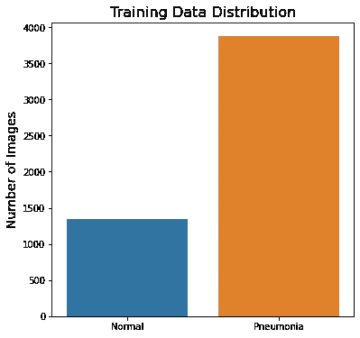
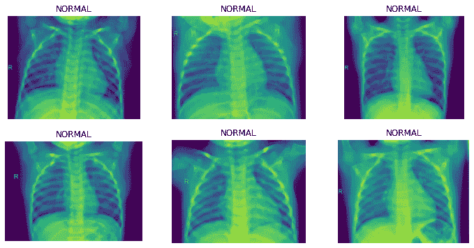
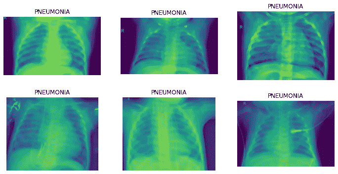
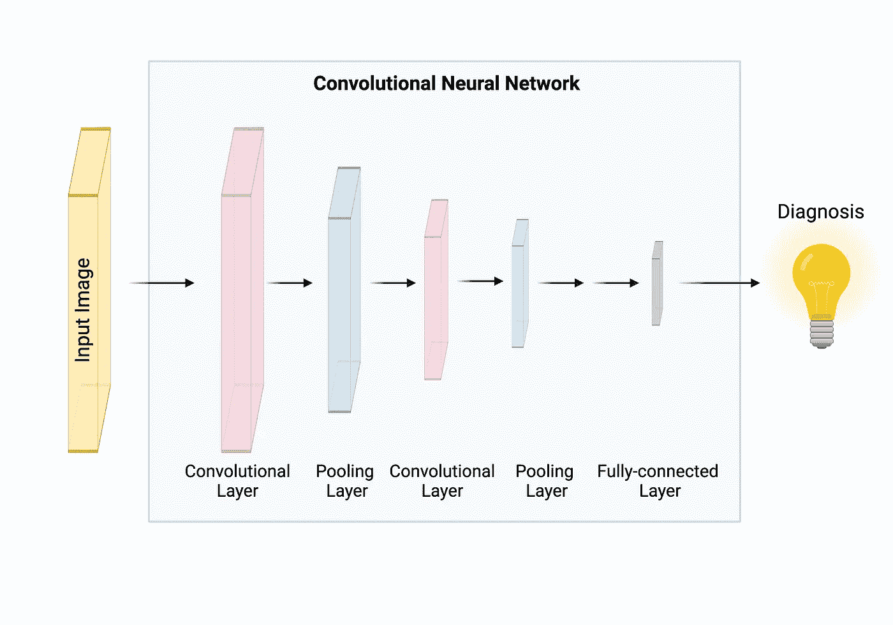
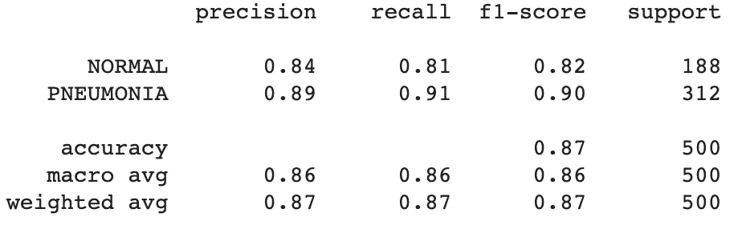
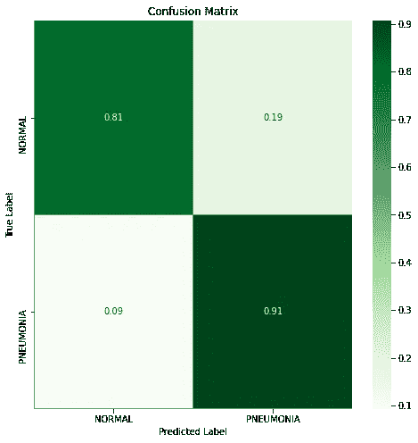
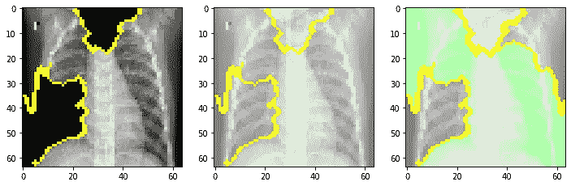

# 透过电脑镜头看医学

> 原文：<https://medium.com/analytics-vidhya/medicine-through-the-lens-of-a-computer-17474b2618de?source=collection_archive---------15----------------------->

从不同的癌症到肺炎等传染病，许多不同疾病的诊断都严重依赖于成像技术，如 x 射线、CT 扫描、核磁共振成像、超声波和活检成像。由这些技术生成的图像通常由医学专业人员读取，然后基于在图像中看到的内容做出诊断。在技术时代，开发临床决策支持工具的想法非常有吸引力，这些工具可以分析大量图像数据(以及其他数据格式)，并建议接下来的治疗步骤和标记潜在问题，从而提高医疗保健效率并减少诊断中的人为错误。但这行得通吗？作为原理证明，我使用胸部 x 光图像开发了一个机器学习模型来诊断肺炎。

肺炎是一种肺部炎症，通常由病毒或细菌感染引起。典型的症状包括干咳、胸痛、发烧和呼吸困难。严重程度是可变的，但在严重的情况下或未确诊的情况下，肺炎会导致死亡。事实上，每年全球约有 4 . 5 亿人(占总人口的 7%)感染肺炎，并导致约 400 万人死亡。然而，如果这种疾病在早期得到诊断和治疗，肺炎在很大程度上是可以治疗的。因此，开发更好的工具来简化和改善肺炎的诊断是至关重要的。

本分析/模型中使用的数据集可在 ka ggle([https://www . ka ggle . com/paultimothymiooney/chest-Xray-pneumonia](https://www.kaggle.com/paultimothymooney/chest-xray-pneumonia))上获得，包含来自健康(正常)或诊断为肺炎(肺炎)的患者的总共 5863 张胸部 x 光图像。数据集由三个子数据集组成:

训练数据集(包含 5216 幅胸部 x 光图像)

测试数据集(包含 629 幅胸部 x 光图像)

验证数据集(包含 16 幅胸部 x 光图像)

以下是归属于训练数据集中每个诊断的胸部 x 射线图像的数量:

在开始构建一个能够准确预测肺炎的复杂模型之前，了解肺炎是如何诊断的非常重要。诊断肺炎最常用的方法是胸部 x 光检查。以下是健康肺部的胸部 x 光图像:

这是肺炎患者的胸部 x 光照片:

当解释 x 光时，医生在肺部寻找识别感染的白色斑点(称为浸润)。查看我们数据集中的 x 射线图像，我们可以看到肺炎患者的胸部 x 射线显示存在白点，并且肺部的总体结构与健康人不同。因此，分析 x 射线图像是有效诊断肺炎的最可靠方法之一。

神经网络算法由多层“神经元”组成，这些神经元以一层的输入是前一层的输出的方式连接在一起。这种类型的体系结构允许神经网络灵活地很好地表示任务输入和输出之间的潜在关系。为了开发一个能够拍摄胸部 x 光图像并预测患者是否患有肺炎或健康的模型，我使用了卷积神经网络(CNN)算法。这是基于传统的神经网络，但采用了利用图像特殊属性的特定架构类型。CNN 首先使用卷积层和池层来缩小图像的大小，然后将缩小的数据提供给完全连接的层。因此，为了构建 CNN，我们需要通过为每层中的每个超参数提供指令来编译模型。

为了让 x 射线图像为建模做好准备，我使用 ImageDataGenerator 加载数据并为建模准备数据。这在处理大型数据集时非常有用，因为它允许从文件中分批渐进加载图像，检索刚好足够立即需要的数据。ImageDataGenerator 的构造函数包含许多参数，用于指定加载图像数据后如何操作图像数据，包括像素缩放和数据扩充。因此，还允许在加载时不配置关于每个图像的具体细节，而是用新的、似是而非的例子扩展训练数据集。使用这个类，我将所有数据集的原始图像中的像素数组缩放到 0 和 1 之间的像素值，这是神经网络建模的首选范围。我还使用了数据扩充方法，包括旋转、宽度和高度移动以及缩放，来创建模型可能会看到的训练集图像的变体。

如图像计数图所示，在每一类中，肺炎 x 射线比普通 x 射线多 3 倍的图像数量存在很大的不平衡。每个类别中图像数量的不平衡总是会影响模型的性能，因为它会使模型偏向更丰富的类别。为了平衡数据，我首先通过将每类 x 射线图像的数量除以图像的总数来计算每类 x 射线图像的权重。这显示了一个类相对于另一个类代表了多少。然后，我将肺炎类的权重分配给我计算的正常类的权重值，反之亦然，以同等地惩罚训练集中代表不足或代表过多的类。

现在让我们看看我的 CNN 模型是否真的可以从胸部 x 光片预测肺炎！

这个模型非常好，具有 87%的准确性，这意味着 87%的时间它可以准确地确定 x 射线图像是正常健康的肺还是肺炎患者的肺。然而，它仍然有 19%的假阳性率将正常肺诊断为肺炎。为了了解 x 射线图像的哪些特征导致了正常 x 射线被错误地诊断为肺炎，我使用了 Lime 包来描述模型在进行预测时发现最重要的特征。

显示的图像以绿色显示模型认为最重要的特征，以红色显示不太重要的特征。从这张图像中我们可以看到，CNN 模型选取了大部分横膈膜和胸骨作为做出错误预测的关键特征，这表明来自这些区域的高强度像素可能会给模型添加噪声。考虑到这一点，可以去除或抑制来自横膈膜和胸骨区域的像素强度的附加预处理方法在改进该模型以供未来临床使用方面也是有价值的。

查看我的 GitHub，看看我是如何开发这个模型的！