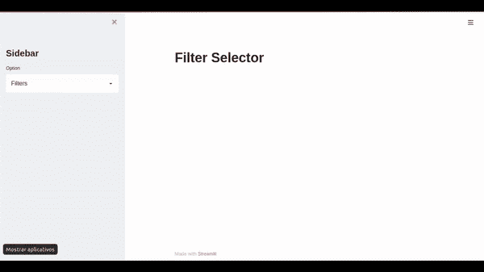
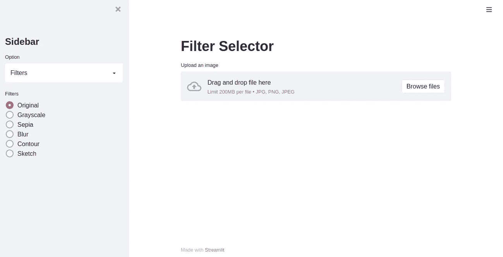
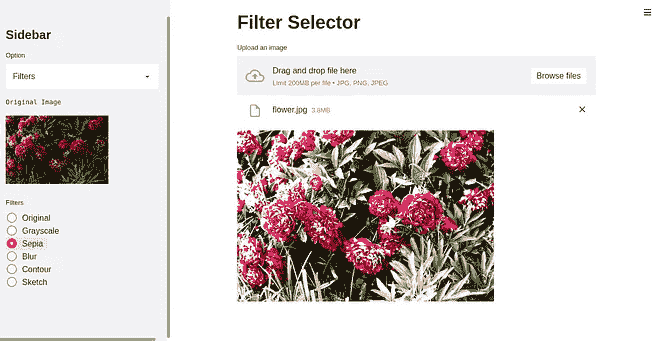
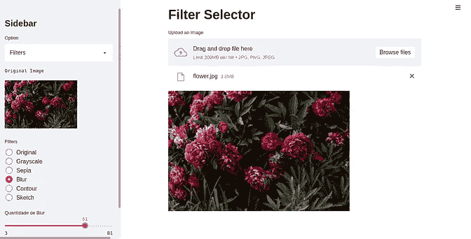
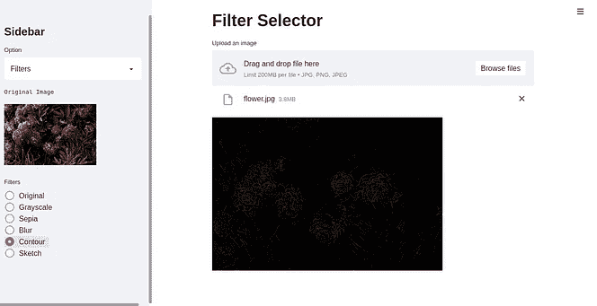
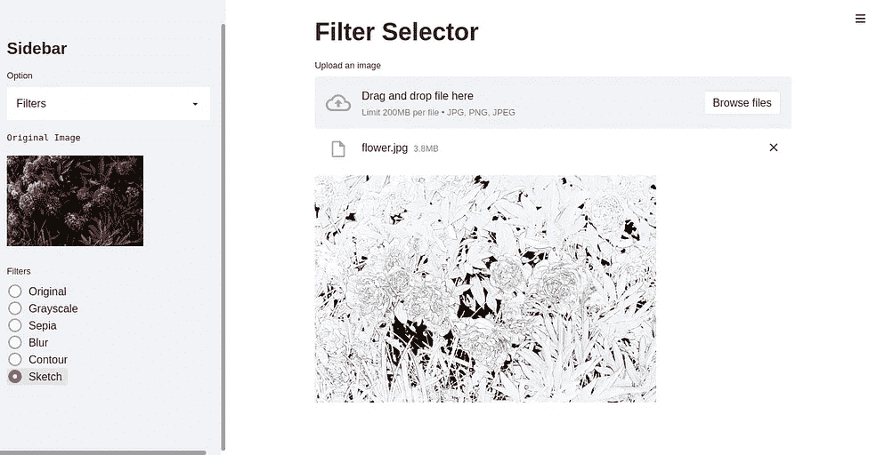
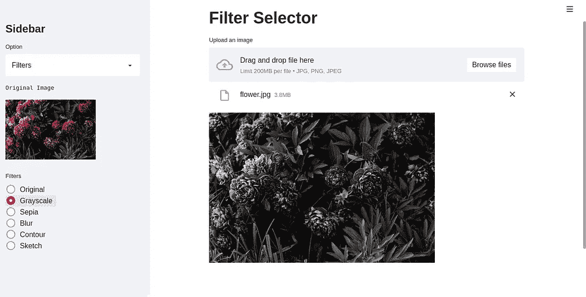
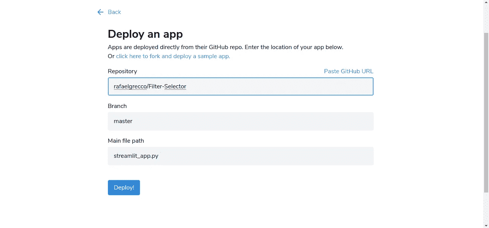
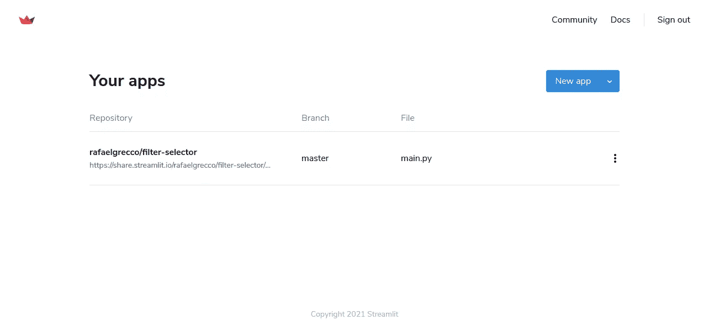

# 满足 Streamlit 共享|构建简单的照片编辑器

> 原文：<https://medium.com/analytics-vidhya/meet-streamlit-sharing-build-a-simple-photo-editor-9d9e2e8872a?source=collection_archive---------12----------------------->


依兰石科彭斯

我最近收到了 Streamlit 的邀请，测试他们的新工具 **Streamlit Sharing** ，它允许快速、简单地实现用 Streamlit 创建的应用程序，因为这个项目已经在 Github 库中。

我承认，我对自己能够实现一个项目的速度感到惊讶，以前这个项目只能在我的机器上本地运行，现在世界上任何地方的任何人都可以访问这个应用程序。

在进入代码细节之前，重要的是，这个工具不是为每个人发布的，但你可以请求访问，只需[单击此处](https://streamlit.io/sharing)，你将被重定向到 Streamlit 共享页面。

## 让我们来看看代码

完整的代码在我的 Github 上，如果你想看的话，[点击这里](https://github.com/rafaelgrecco/Filter-Selector)

要输入代码，首先，我们将了解将建立什么，这个想法是一个人可以上传一个图像，并对该图像进行一些修改，例如，应用一些过滤器，增加或减少亮度或对比度等可能的修改。这是一个非常简单的应用程序，但对于正在学习计算机视觉的人来说，它非常丰富。

像往常一样，第一步是导入将要使用的库。

在第 7 行，我已经配置了我们图像的大小，这里我留了 500，但是，你可以在你的项目中随意调整这个值。

正如我们在我的文章《Streamlit 简介》中看到的，我们应用程序的所有代码都必须在函数内部，如下所示:

如上所述，所有代码都必须在创建的函数中。

完成后，让我们创建一个将加载占位符图像的函数，这一步是必要的，因为要部署 Streamlit 共享，您的图像不能在您的计算机上，在这种情况下，我将它放在项目存储库中，并从那里使用它。你可以用同一个，只要去我一开始留的 Github 链接，这个图片在 images 文件夹里。

你可能已经注意到，这个函数在一个 *@ st.cache* 下面，这是为了在运行我们的 Streamlit 应用程序时，这个函数只加载一次，这使得应用程序的操作更加敏捷。

这个函数的基本功能是获取我们图像的 URL，正如我所说的，它在 Github 上，并返回包含在该 URL 中的图像。

现在我们已经创建了我们的函数，我们可以调用它并将我们的 URL 作为参数传递，同时，我们将把标题添加到我们的应用程序，以及它的侧边栏。

在这一步中，我还添加了将出现在侧边栏中的选项。在第 7 行，我将用户的选择存储在变量 *op* 中。

让我们看看我们的应用程序到目前为止做得怎么样:



可能会注意到，当我在菜单中选择一个选项时，没有任何变化，这是因为我们还没有为单击任何选项编写任何程序，我们将在下一步中这样做。

让我们看看当 op = Filters 时我们的代码是如何开始的

好的，最初这可能看起来像一个复杂的步骤，然而，我在这里做的非常简单，当用户设置过滤器选项时，它进入代码的那一部分，在那里她将有可能上传他的机器的图像，为此我们使用命令***ST . file _ uploader()***，作为参数我们传递我们想要出现的文本，然后将允许执行上传的文件格式，这里是主要的 3 个图像。

让我们来看看这一刻是怎样的:



请注意，我们创建的过滤器列表已经出现在侧边栏中。以及用户从他的机器上传图像的空间。

让我们做过滤器，我会添加代码，我会解释代码的每一部分。

第一个滤镜是灰度，这是最容易创建的，使用 cvtColor()函数，最后，使用命令 ***st.image()*** 我们在我们的应用 Streamlit 中显示图像。

下一个过滤器是棕褐色，要应用它，必须构建提供所需结果的内核。要找到这个内核的值，很简单，我在这里找到了它们。
使用将要放入内核的值，我们设置它，最后用***cv2 . filter 2d()***函数应用它。

现在，模糊过滤器除了其他已经提出的，最初，它是非常简单的，我们应用高斯模糊函数，但它有一个新的组件，滑块，可以改变模糊的强度将被应用。为此，我们使用 Streamlit 的滑块函数，该函数以引号中的描述作为参数，然后接下来的值是指最小值、最大值和将被设置为标准的量，最后是步长，这里的值为 2，因此模糊将从 2 变化到 2，这是因为当应用奇数的核时，高斯模糊函数的结果更令人满意。

下一个滤镜是轮廓滤镜，它的构造非常简单，遵循的步骤是首先应用模糊滤镜，然后用 ***cv2.canny()*** 函数应用 Canny 边缘检测器。

最后一个滤镜是 sketch，就是让照片看起来是画出来的，这个滤镜每一步的构造都在 Github 里，在 Support 笔记本里。但简而言之，我们把灰度图像反过来，黑色调变成白色，反之亦然。这个反转的图像就是我们要应用模糊滤镜的地方。接下来，我们将使用 cv2.divide 函数将灰度图像中的像素除以 255-blur_image，该方法返回一个类似于绘图的图像。一定要查看笔记本，在那里你可以看到这些正在进行中的图片。

如果没有选择滤镜，我们将只显示原始图像。

让我们来看看结果:



正如你所看到的，结果非常令人满意，在应用了模糊滤镜的图像中，幻灯片出现了，在这里可以控制模糊的强度。

然而，我们还有很多工作要做，我们必须安排图像校正。

我要像以前一样，展示整个代码，然后逐段注释。

在这里，MImage 变量将存储用户想要对图像应用什么样的改进，选项有:

*   对比
*   聪明
*   锐利

这一步比前一步简单，因为我们有一个模式，在变量 *enh* 中，我们将总是存储我们想要申请改进的内容，总是以同样的方式 ImageEnhance 后跟我们想要执行的改进，例如在第一种情况下我们有: ***ImageEnhance。对比*** ，然后用 enhance 函数我们已经把改进放在了滑块中的值的函数中，所有的改进都遵循相同的模式。

最后，我已经添加了信息菜单中的内容，如果我用一个简单的句子告诉你是谁开发的，请随意添加你认为相关的信息。

这些步骤都准备好了，就该开始了解 Streamlit 共享了，你的项目完成后，可以上传到 Github，记得导入 requirements.txt，可以用 pipreqs 获取，必须安装使用。这边走:

```
pip install pipreqs
pipreqs /home/project/location
```

如果你有 apt-get 需要的包，一定要用 packages.txt 上传到 Github，在 Github 链接里，我用了这个文件，检查一下是怎么用的，[点这里](https://github.com/rafaelgrecco/Filter-Selector/blob/master/packages.txt)。

在项目已经在 Github 上，并且您已经收到测试 Stramlit 共享的邀请之后，我们将部署该应用程序。

如果你的请求还没有得到答复，请再等一会儿，继续按照教程来做，看看使用起来有多简单。

点击“新建应用程序”按钮后，将会打开以下窗口:



在选择了您的应用程序所在的存储库和哪个分支之后，您将选择哪个。py 文件，因为我的只有 main.py，它已经自动识别了。

单击“deploy ”,您将等待几分钟，部署将会完成，几分钟后(根据您的应用程序的复杂程度而有所不同),部署就绪，您的应用程序已经可供所有人查看。



在 Streamlit Sharing 的初始选项卡中，您的所有应用程序都被保留。

查看本文结果，只需[点击此处](https://share.streamlit.io/rafaelgrecco/filter-selector/main.py)。

我们就要结束了，我希望这篇教程能帮助你对 Streamlit 和计算机视觉领域有更多的了解。欢迎在评论里留下建议，看看我的其他文章。好好学习！！！