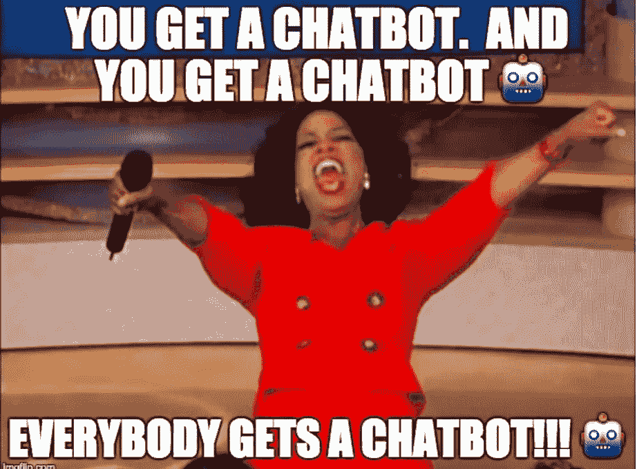
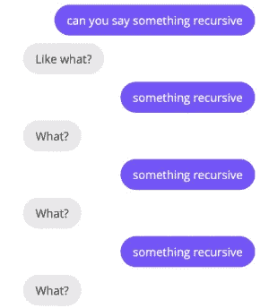
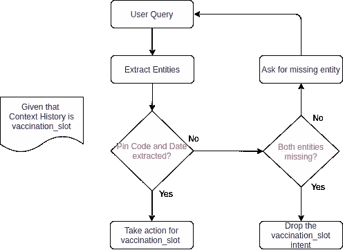
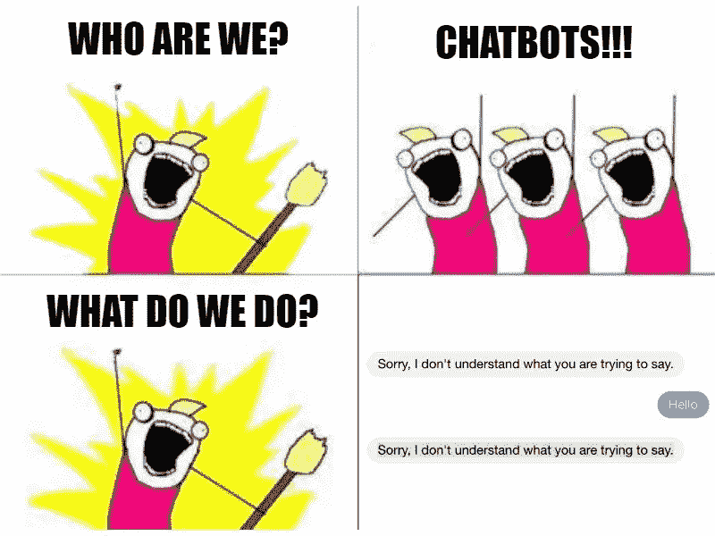
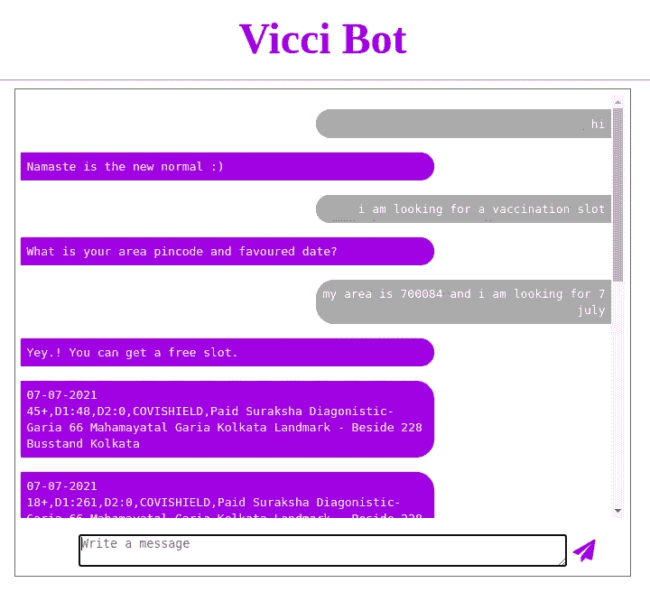
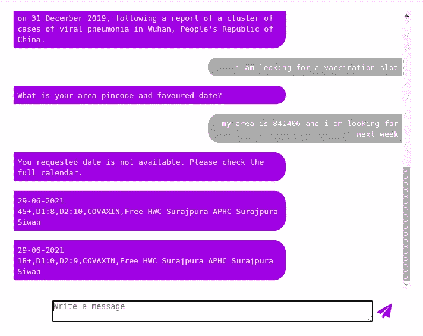
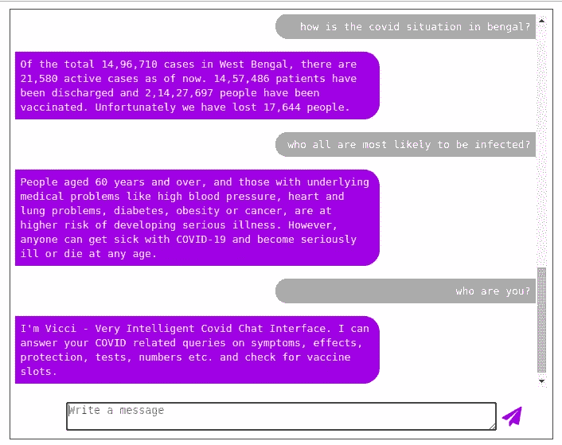
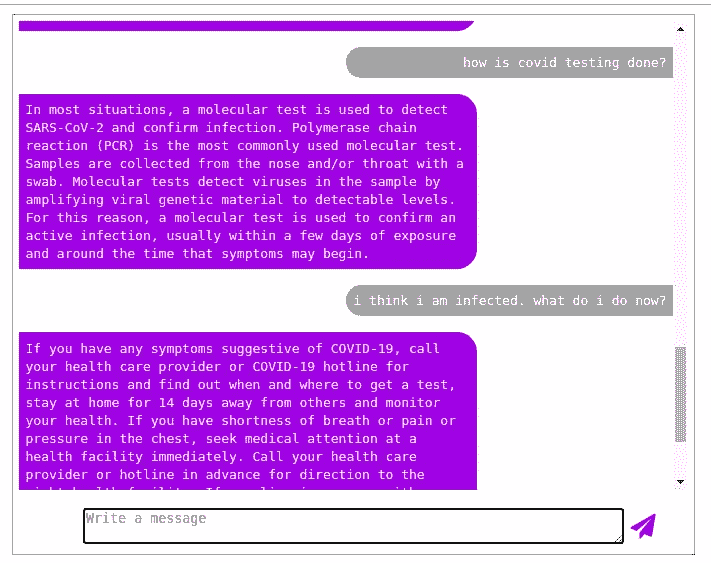
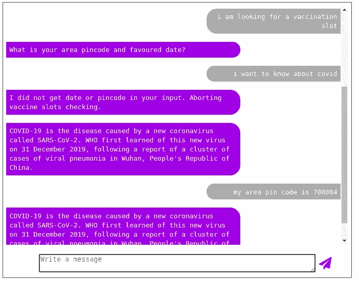
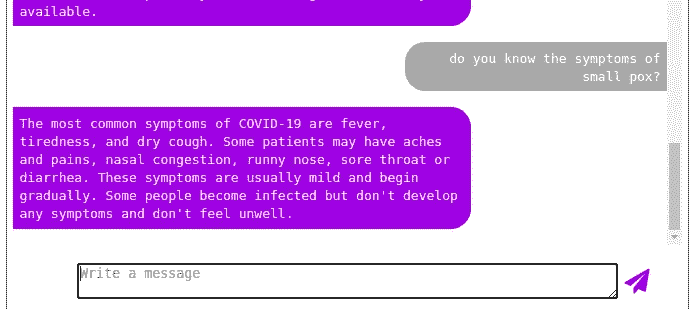

# 认识 Vicci —非常智能的 Covid 聊天界面— 2

> 原文：<https://medium.com/analytics-vidhya/meet-vicci-very-intelligent-covid-chat-interface-2-6ef26754b702?source=collection_archive---------29----------------------->

## 使用 Python 和经典 ML 设计一个 COVID 聊天机器人

在[之前的文章](/@nphard12/vicci-very-intelligent-covid-chat-interface-70b9eaeea1ae)中，我们创建了训练数据和主要意图分类模型，它们将作为我们聊天机器人的驱动模型。在本文中，我们将设计 bot 引擎，并将 bot 部署为 flask 应用程序。

# 给 Vicci 增加肌肉

我们的意图分类器将足以服务于基本意图(询问信息)。一旦我们从分类器中获得了意图类型，我们只需从映射到该意图的答案池中进行回复(参考训练数据)。简单来说，这就是基于**检索的**机器人所做的事情。

但是请记住，我们还增加了几个意图，使我们的机器人更加**面向行动。**

*covid_numbers* —这将显示来自印度政府官方[仪表板](https://www.mygov.in/covid-19#statewise-data)的特定邦的最新活跃病例、出院患者、死亡人数和接种人数。

*疫苗接种 _ 时段* —这将有助于根据用户的区域密码和首选日期为用户找到疫苗接种时段

所以当 bot 识别出这些意图时，我们就要提取出这些意图对应的相关实体，然后进一步处理。这在聊天机器人术语中称为**实体提取**。RASA 等高级聊天机器人框架使用 DIETClassifier 或 Spacy 实体识别器，但我们将尝试一些更简单的步骤。

# 实体提取

给定一个查询— *“显示来自* ***西孟加拉邦****”****，*** 我们必须从这个查询中提取 ***西孟加拉邦*** (州名)。因为我们已经知道印度所有州的名称，所以很容易简单地检查问题中是否存在任何州的名称。然而，我们不能进行简单的字符串匹配，因为有时拼写上的一个小错误会导致失败。更多的人可能会把同一个州简称为孟加拉。所以我们必须寻找模糊匹配。

为此，我们使用了 [fuzzywuzzy](https://pypi.org/project/fuzzywuzzy/) 包。我们还尝试了 [Levenshtein Distance](https://en.wikipedia.org/wiki/Levenshtein_distance) 和一些其他方法，但我们最终选择了基于令牌集比率分数的最佳匹配。如果找不到州名或者可信度低于 60(最大值为 100)，我们将显示印度的信息。

从查询中提取州名

第二个意图稍微复杂一些。我们有两个实体—日期和区号。此外，在使用聊天机器人时，不希望用户以任何特定的格式输入日期。用户可以说像“T0”、“明天”、“下周五”和“7 月 10 日”这样的短语，所以我们也必须包括这些方面。为此，我们使用一个名为 [parsedatetime](https://pypi.org/project/parsedatetime/) 的库，它可以以人类可读的格式解析日期。它并不完美，在复杂的相对日期上失败了，比如“下周五”和“下周五”，但是它在标准日期格式和短语上做得很好。

pin 码提取相当简单，因为它必须有 6 个数字，其中第一个数字不能是 0，所以我们简单地使用 regex。

为此，如果一个或两个实体缺失，我们不能做出任何随机假设。我们必须涵盖以下场景—

“*我在找明天***的接种槽。我的地区是****700084****。”*
—检测并提取实体，并提供给用户。*

**我在找* ***明天*** *的接种槽。请大家帮帮忙。”*
—检测到的日期实体。机器人应该要求一个区号。*

*对于第二种情况，典型的查询-响应设置是不行的。我们需要一种上下文管理的方式和一种查询-响应-反馈循环机制，直到用户得到服务。*

**

# *对话流和上下文管理*

***对话流**——简单来说——是用户和机器人之间自然的查询和响应交流。*

*在对话流中的每一点，机器人都有一些信息(如检测到的实体、检测到的意图、到某个时间点之前提供的意图，以及基于业务或域逻辑的某些意图-实体关系规则)，这些信息有助于机器人决定继续进行哪些选项。这统称为**上下文**。*

*除了我们在上一节提到的场景，我们的机器人还必须涵盖这些——*

*"*我在找疫苗接种槽。请大家帮帮忙。”*
—未检测到实体。机器人会询问密码和喜欢的日期。
*“我如何保护自己免受 Covid 的侵害？”* —机器人应该知道用户已经删除了之前的上下文，并做出相应的响应。*

*这一切都关系到我们为*接种疫苗 _ 槽*的意图服务。检测到*疫苗接种 _ 槽*意图后，将其保存在上下文历史中。之后，当我们得到一个新的查询时，我们按照下面的流程图中定义的步骤进行。*

**

*检测到疫苗接种 _ 插槽后会发生什么*

*bot 引擎的其余部分遵循简单的规则。如果意图被分类为置信度小于 0.3(我们不是预测标签而是概率)，机器人简单地回答它不理解查询。*

# *后端操作*

*好的。说够了。让我们看看后端会发生什么。我们是怎么得到这些信息的？为了获得 Covid 号，我们解析官方仪表板以获得相关数据。我们检查了 robots.txt，确保我们遵守了规则集。*

*为了获得与疫苗接种相关的信息，我们使用印度政府共享的[开放 API](https://apisetu.gov.in/public/marketplace/api/cowin)。我们小心翼翼地遵循上述指南，并鼓励其他人以同样的方式使用这些服务。*

**

# *将 Vicci 投入使用—部署*

*对于前端，我们使用 python flask，由简单的 HTML/CSS 和一些 JQuery 支持。*

*bot 以字符串列表的形式返回响应，我们只需将它们作为新的段落元素添加到 HTML 容器中。*

# *试运转*

*让我们带着我们的机器人去试运行吧*

********

# *改进领域*

*我们可以设计一个更好的上下文处理机制，它可以适应更长的历史，而不仅仅是以前的历史。请在下面的评论中告诉我你的想法和主意。*

**

*此外，我们的数据集中没有训练数据来使机器人识别一般情况或与 Covid 无关的查询。*

**

*在这里，因为天花从来不是训练数据的一部分，所以聊天机器人将已知的特征(或单词)——症状——与它从训练中知道的联系起来，从而做出相应的反应。*

*我们还可以尝试其他模型，如神经网络或 LSTMs，看看它们的表现如何。你可以在这里查看我们的一些探索[。](https://github.com/kr-prince/VICCI-Python-Chatbot/blob/main/experiments/model_training_tfModels.ipynb)*

*因此，我们使用基本 python 和经典 ML 技术开发聊天机器人的故事到此结束。*

*请在 Github 上查看并关注[这个项目](https://github.com/kr-prince/VICCI-Python-Chatbot)。我们喜欢拉式请求。！请在评论中告诉我们你对此的想法。*