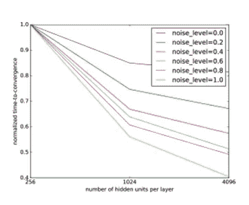
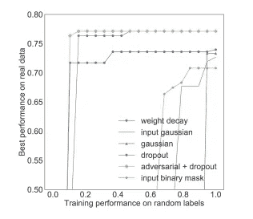

# 记忆和深度神经网络

> 原文：<https://medium.com/analytics-vidhya/memorization-and-deep-neural-networks-5b56aa9f94b8?source=collection_archive---------6----------------------->

在数据科学领域，特别是在机器学习领域，人们经常会问“隐藏层中发生了什么？”当考虑深度神经网络时。这些网络可能看起来像是“黑盒”算法，因为许多内部计算目前还没有得到很好的理解，缺乏对这些行为的理解可能会在时间、硬件和财务方面付出高昂的代价，尤其是在“大数据”领域。在[“深入观察深度网络中的记忆”中，](https://arxiv.org/pdf/1706.05394.pdf) Arpit 等人研究了用 DNNs 对真实数据和随机数据建模的差异，以了解这些模型如何检测模式以及哪些因素影响模型性能。

*在我们继续之前，我已经整理了一个与研究和理解深度神经网络相关的常用术语的简短(非详尽)列表:*

**正则化** —正则化是许多数学上下文中的一个重要概念，它意味着对函数应用“惩罚”来控制过度波动。

**记忆**——本质上是过度拟合，记忆意味着一个模型无法归纳出看不见的数据。该模型已被过度结构化，以适应它正在学习的数据。记忆更可能发生在 DNN 更深的隐藏层。

**容量**——“模型可以近似的函数类型的范围。”高容量模型非常复杂，容易过度拟合，这与其对“看到的”数据的记忆有关。低容量模型可能难以概括非常复杂的数据，但由于计算效率，它不一定是次等的。这里的关键是平衡和理解数据集！

**有效容量** —给定特定算法和特定数据集的模型性能。

**反面例子** —一个可能被“错误分类”的数据点，或者一个可能被误认为属于一个组，但实际上属于另一个组的数据点。

现在，让我们来仔细看看深层神经网络！

# **数据**

虽然这看起来很直观，但从本文详述的研究中可以看出，模型的归纳能力在很大程度上受到数据本身的影响。"训练数据本身在决定记忆程度方面起着重要的作用."dnn 能够拟合纯粹的随机信息，这就引出了一个问题，即这是否也会发生在真实数据中。在这项研究中，研究人员分析了几个模型在真实数据( [MNIST](https://deepai.org/dataset/mnist) 和 [CIFAR-10](https://www.cs.toronto.edu/~kriz/cifar.html) )和具有不同程度随机生成噪声的真实数据(真实数据集的 20%至 80%)上的性能。

两个主要指标用于分析模型性能— *损失敏感度*和*临界样本比率* (CSR)。模型容量对验证性能的影响也进行了研究，正如一些正则化技术。

# **损失敏感度**

损耗灵敏度可以用技术术语解释为“损耗梯度相对于 *x* 的导数的大小。”换句话说，数据点 *x* 的变化对损失函数的变化有多大影响？梯度下降的目的是最小化损失函数，即找到损失函数上变化为零的位置。*高损失灵敏度*意味着损失函数的变化受 *x* 变化的影响很大，或者随着 *x* 的变化，使损失函数最小化所采取的步骤很大。此处发现的结果表明，只有部分真实数据具有较高的损失敏感性，而噪声数据对 x 的变化极其敏感。这告诉我们，数据集中存在的噪声越多，模型就越有可能采取大的步骤来最大限度地减少损失。因为真实数据通常具有可区分的模式，并且这些模式需要采取越来越小的步骤，所以模型很可能不会像记忆随机数据那样记忆它(或者至少不会以相同的方式)。

# **临界样本比率**

这项研究将关键样本定义为某一组数据的子集，其中可能存在来自另一组的交叉，即，将一组数据的子集与另一组数据分开的边界更难确定，因此更难用模型概括差异。

为了识别一个*关键样本*，使用一个半径为 r 的盒子来确定边界的密度——想象一个属于 a 组的特定数据点周围的盒子。如果在这个盒子的半径内有另一个来自不同组的数据点，这个数据点就是一个*关键样本*。这决定了数据的复杂性或不同组之间的密切关系，并由此决定了他们有多容易被误认为属于错误的组。不同群体的这一点被认为是*的反面例子*。

“对立的例子最初指的是难以察觉的被错误分类的数据点。(Miyato 等人，2015 年)改为通过预测分布的变化来定义虚拟对抗示例”(Arpit 等人(2017 年))—这将 CSR 的定义扩展到未标记的数据，或其组在建模前未定义的数据。

关键样本越多，假设空间越复杂，CSR 越高，CSR 是关键样本子集与整个数据集的比率。这项研究描述了具有更高噪声水平的模型的临界样本比率增加-这些模型正在学习具有噪声数据的更复杂的模式，并且验证准确性(预测未知信息的准确性)通常随着噪声水平的增加而降低。按照这种逻辑，这表明这些模型对随机数据很敏感，因为它们必须记住特定的点，而不是由于错误分类的可能性而对它们进行归纳。

# **容量**

更高容量的模型似乎能够在不影响学习数据集的真实模式的情况下学习噪声，但是如果数据更干净，并且已经去除了离群值和噪声，则这种容量就没有必要了。*这强调了对数据有所了解以及使用适当的清理和预处理方法来最小化计算成本和减少不必要的复杂性的重要性。*

包含更多噪声的数据的*“收敛时间”*有更大的减少，或者模型到达更多训练不会显示改进的地方需要多长时间。这是因为对噪声数据的损失敏感性。也就是说，有更多的随机信息要“学习”,因此模型必须使用过拟合策略，增加节点的深度或数量来拾取噪声，并采取更大的步长来最小化损失函数。下图表明，随着噪声比例的增加，收敛所需的时间明显增加，在大型数据集中也是如此。

随着噪声比例的增加，每层单元数量的增加对含噪数据的收敛性的影响要大于对干净数据的影响。请注意黄色和蓝色地块线之间的差异。

# **正规化**

正则化是早期在许多数据科学研究中引入的概念，也就是说，引入对剧烈波动模型的惩罚来减少所述波动。这是减少记忆的一项重要技术，如下图所示。

x 轴是对随机数据的模型性能的度量，而 y 轴是对真实数据的性能。

随机数据上的低性能与真实数据上的高性能相结合是记忆减少的指标，因为该模型不能概括随机噪声——辍学正则化似乎是最有效的，其次是[对抗训练](https://en.wikipedia.org/wiki/Adversarial_machine_learning#:~:text=Adversarial%20machine%20learning%20is%20a,in%20a%20machine%20learning%20model.)，或在“欺骗性输入”上训练模型。

# **总结**

理解并扩展梯度下降和正则化的基础将有助于数据科学家描述深度神经网络的更模糊的行为。模型架构、优化和数据本身都在解开这些行为中发挥着特别重要的作用，对复杂模型进行更严格的控制可以降低计算成本，并有助于为科学家提供更清晰的大型数据集建模路线图。

**参考文献:**

“深度网络不是通过记忆来学习的，”克鲁格等人，2017 年[https://openreview.net/pdf?id=rJv6ZgHYg](https://openreview.net/pdf?id=rJv6ZgHYg)

“关于深度神经网络中的泛化和记忆的几何关系”，斯蒂芬森等人，2021 年
[https://openreview.net/forum?id=V8jrrnwGbuc](https://openreview.net/forum?id=V8jrrnwGbuc)

[http://www . cs . Cornell . edu/courses/cs 4787/2019 sp/notes/lecture 13 . pdf](http://www.cs.cornell.edu/courses/cs4787/2019sp/notes/lecture13.pdf)