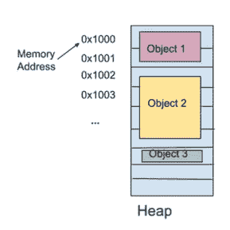
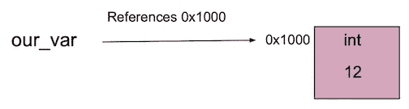
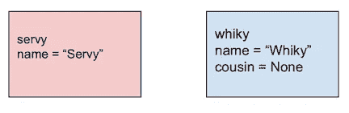
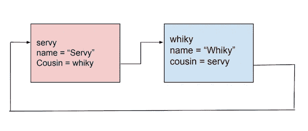

# Python 中的内存管理

> 原文：<https://medium.com/analytics-vidhya/memory-management-in-python-4332fbf95cd0?source=collection_archive---------12----------------------->


[陈虎](https://unsplash.com/@huchenme?utm_source=unsplash&utm_medium=referral&utm_content=creditCopyText)在 [Unsplash](https://unsplash.com/s/photos/elephant?utm_source=unsplash&utm_medium=referral&utm_content=creditCopyText) 上的照片

记忆对我来说一直是一个难以捉摸的话题，除了我知道在我的`C++`类中有一些术语，比如‘按值传递’，‘按引用传递’，‘析构函数’，‘seg fault’，我很明显地失败了。一年后重考这门课时，这次用 Java 语言授课，成绩很好，GPA 飙升。“内存泄漏”又是我在后来的课上听到的一个听起来不祥的术语。在此之前，我遇到过“煤气泄漏”、“水泄漏”；这种“内存泄漏”会有多严重？

这里我们将学习 Python 中的**变量**、**内存地址**、**引用计数**、**内存泄漏**和**垃圾收集**。`tracemalloc`用于到达文章末尾。

Python 中的变量是一个**引用**到**的内存地址**。那么什么是内存地址呢？嗯，内存地址是一个像**一样唯一保存对象的位置**。



带有标记内存地址的堆中对象的示意图

让我们检查这个变量赋值:

```
our_var = 12
```

这里的变量`our_var`实际上是**引用**到**保存对象的堆中的内存地址**。



显示引用存储器地址的变量的示意图

我们可以使用`id()`方法，该方法采用变量名来获取以 10 为基数的内存地址，通过引用传递。要获得十六进制的内存地址，使用`hex()`方法，该方法将来自`id()`的值作为参数，按值传递。

在 Python 中，我们不能直接访问内存。然而，我们有`ctypes`模块从内存地址获取值。

这里有一个例子:

运行该文件时，我们会得到以下结果:

```
id = 140684875197072
hex id: = 0x7ff3c002ea90
Value from address 140684875197072 is 12
```

*注意*:确保使用`ctypes.cast`时，您给出的地址是以 10 为基数的。尝试给出十六进制值，你会得到`bus error`。

为了跟踪对一个对象的引用，我们有一个叫做**引用计数**的机制。它记录了**有多少个变量**引用了一个**相同的内存地址**。

在 Python 中，我们可以通过使用两个模块`sys`和`ctype`来获得引用计数。`ctype`比`sys`少 1 个值，因为`sys`将变量名作为输入，增加 1 个值，而`ctype`直接取内存地址。

你能看出哪个是按引用传递的，哪个是按值传递的吗？

让我们看一个例子:

运行该文件时，我们得到:

```
our_var object reference count using sys module: 4
our_var object reference count using ctypes module:3🌼 Adding variable `my_var` reference to `our_var` object 🌼our_var object reference count using sys module: 5
our_var object reference count using ctypes module: 4🌺 Deleting variable `my_var` reference to `our_var` object 🌺our_var object reference count using sys module: 4
our_var object reference count using ctypes module: 3
```

你可以看到，使用`sys`和`ctypes`模块时，`our_var`对象的初始引用计数分别是 4 和 3。在添加引用相同内存地址`our_var`的`my_var`对象时，我们将引用计数增加 1。删除`my_var`对象后，我们返回到原始引用计数。

为什么使用`sys`模块的原始引用计数给出的是 4 而不是 2？*这两个引用的含义一个是被变量* `*our_var*` *引用，另一个是通过* `*our_var*` *打印*时引用。好问题！这是因为 Python 的编译器可能会有一些其他变量引用同一个字符串对象。

现在我们来看一下**垃圾收集**。

垃圾收集的工作是在**引用计数**达到 **0** 后**回收**内存地址。

Python 有一个名为`gc`的模块，让我们可以检查或配置它。让我们使用`get_objects()`方法来获得它所列出的对象的长度。

让我们看一个例子:

示意性地看一下这个类:



类 Serval 和 Cat 的实例

运行该文件时，我们得到:

```
BEFORE: 5199REFERENCE COUNT
servy's reference count: 1
whiky's reference count: 1AFTER CREATION: 5218AFTER DELETION: 5219
```

删除两个对象`servy`和`whiky`后，垃圾收集器列表中的对象只增加了 1 个(5219–5218 ),这让我有点惊讶。我的假设是，由于垃圾收集器是一个守护线程，它会以一种*自由放任*的方式找到另一个线程。也可能是编译器做了一些优化。如果你愿意，可以尝试一下。在这种情况下，`servy`和`whiky`的引用计数在删除时达到 0，因为它们的初始引用计数是 1。

然而，事实并非总是如此。我们有时会有循环引用。

以此为例:

示意性地看一下这些类:



两个类 Serval 和 Cat 之间的循环引用

在运行该文件时，我们得到

```
servy's refcount: 2
whiky's refcount: 2
AFTER DELETION OF servy
whiky's refcount: 2
```

你发现什么不对劲了吗？删除`whiky`所指向的`servy`实例后，`whiky`的引用计数仍然是 2。这叫做循环引用，导致**内存泄漏**！

因为我们特意编写了这段代码来演示它，所以我们可以通过将`whiky`的表亲分配给`None`来摆脱这种情况。

```
whiky.cousin = None
```

这使得`whiky`的引用计数为 1，之后我们可以通过删除`whiky`实例将其引用为 0。

在大型代码库中，找出哪里发生了内存泄漏可能是一项单调乏味的任务。幸运的是，我们有一个内存泄漏调试工具叫做 [**tracemalloc**](https://docs.python.org/3/library/tracemalloc.html) 。

您可以询问我们希望保存多少堆栈帧，获取感兴趣的代码区域的快照，并进行比较。我们甚至有一个属性`lineno`，它会告诉我们代码库中的哪一行占用了大量资源。因此，帮助我们缩小搜索空间，并最终达到我们的目标。

对于 python 3.4 以上的版本，垃圾收集器能够清理导致内存泄漏的对象。

如果你想看我瞎折腾，这里有一个带有`tracemalloc`模块的代码库:

输出如下所示:

```
servy's refcount: 2
whiky's refcount: 3
whiky's refcount after deleting grace: 2
whiky's refcount after deleting circular reference: 1
servy's refcount after deleting circular reference: 1
.../medium/memory_management/circular_reference_2.py:19: size=424 B (+424 B), count=1 (+1), average=424 B
.../medium/memory_management/circular_reference_2.py:18: size=424 B (+424 B), count=1 (+1), average=424 B
/Library/Frameworks/Python.framework/Versions/3.9/lib/python3.9/tracemalloc.py:423: size=88 B (+88 B), count=2 (+2), average=44 B
```

希望这是一篇有帮助的文章，并准备好深入更深层次的高级代码转换！

恭喜你，感谢你的阅读！我很快会发表下一篇文章。🐛

参考:

*   [Python 3:深潜](https://www.udemy.com/course/python-3-deep-dive-part-1/)