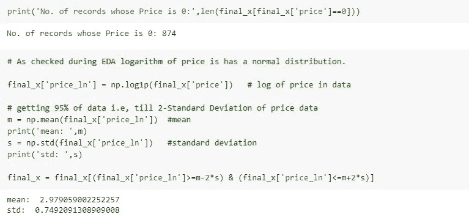

# 麦卡利价格建议卡格尔挑战

> 原文：<https://medium.com/analytics-vidhya/mercari-price-suggestion-kaggle-challenge-ea49582af5b7?source=collection_archive---------6----------------------->

Mercari 是日本最大的社区购物应用，其办公室位于日本和美国。这样，我们可以期待一个基于日本或美国产品和客户数据的电子商务相关数据集。

# **问题陈述:**

***Mercari*** 想要向**卖家**提供定价建议，仅基于产品的描述和一些附加的分类属性。卖家提供各种不同品牌的新/二手产品。
这些文件由产品列表组成。这些文件用制表符分隔。tsv 文件)
**train_id 或 test_id** —列表的 ID
**name**—列表的标题。请注意，我们已经清理了数据，删除了看起来像价格(例如$20)的文本，以避免泄漏。这些被删除的价格表示为[RM]
**item _ Condition _ id**—卖家提供的物品的条件
**category_name** —列表的类别
**brand_name** —品牌名称
**price** —物品的销售价格。这是你要预测的目标变量。单位是美元。这个列在 test.tsv 中不存在，因为这是您将要预测的。
**运费** — 1 如果运费由卖方支付，0 由买方支付
**物品 _ 描述** —物品的完整描述。请注意，我们已经清理了数据，删除了看起来像价格(例如$20)的文本，以避免泄漏。这些删除的价格表示为[rm]

**评价指标:**均方根对数误差

其中:
ϵ是 RMSLE 值(得分)
n 是(公共/私有)数据集中的观察总数，
p_i 是你对价格的预测，
a_i 是 I 的实际销售价格。
log(x)是 x 的自然对数

**为什么要日志？**
如下图所示，价格分布向右倾斜，因此为了保持价格值之间良好的方差/分布，建议使用对数来预测价格值。因为 log(0)是未定义的，所以我们给所有的值加 1。

有无对数的价格分布

# **概述:**

访问我的网站[thecuriousfalcon.com](https://thecuriousfalcon.com/mercari-price-challenge/)获得更清晰的图片和更好的解释

*   导入数据
*   探索性数据分析
    *探索分类数据
    *探索数值数据
*   特征提取、预处理和插补
    *检查重复数据
    *检查空值
    *特征提取
    *文本预处理
    *插补
*   矢量化和训练模型
    *去除异常值
    *矢量化分类数据
    *矢量化数值数据
    *训练模型
*   摘要

# **导入数据**

[数据集的标题行](https://www.kaggle.com/c/mercari-price-suggestion-challenge/data)

基本信息

根据上述信息，空值出现在如下 3 个特征中:

*   Category_name 有 6327 个空值(0.4%的数据不存在)
*   Brand_name 有 632，682 个空值(42%的数据不存在)
*   Item_description 只有 4 个空值
*   没有重复值

# **探索性数据分析**

## **探索分类数据**

**类别名称:**

**观察:**用户对该网站上的女装、美容产品和电子产品更感兴趣

**项目条件标识:**

**观察:** Item_condition_id 5 的观察/记录数量最少，仅占总数据的 0.1%

**发货:**

观察:大部分运费由买家支付

**brand_name:**
共有 4809 个品牌，以下是排名前 10 的品牌

既然 PINK、Nike 和 Victoria's Secret 是数据集中排名最高的品牌，那么让我们来看看他们提供什么样的产品

粉色主要提供女性服装

耐克提供妇女和儿童运动服装，主要是鞋子

维多利亚的秘密提供女性美容产品和服装

## **探索数值数据**

**价格:**

**观察:**

*   考虑到产品的多样性，有超过 80%的产品成本低于 50 美元
*   与仅分布价格相比，对数价格具有更好的分布和扩散。
*   基于对数的度量，如均方根对数误差，可用于预测模型的准确性。

## **特征间的相关性**

1.  从上述相关性中，可以观察到**物品状况、运输**与价格成反比。
2.  它可以解释为 **item_condition_id** 从 1 到 5 增加，价格可能降低，即 1 是最佳条件，5 是最差条件。
3.  由于观察是基于各种产品，建议根据品种，即**类别名称或品牌名称，来寻找相关性。**

## **品牌间的相关性**

## **基于类别的相关性**

*   根据上述基于品牌名称和类别的相关性，可以观察到物品状况、运输都与价格成反比。
*   它可以解释为 item_condition_id 从 1 增加到 5，价格可能会降低，即 1 是最佳条件，5 是最差条件
*   运费从 0-1 增加，也就是说，如果运费由买方支付，价格就会增加。

# **特征提取、文本预处理和插补**

## **检查重复数据:**

**观察:**

*   数据集不包含重复记录
*   当名称、项目描述被视为 0.5%数据重复时
*   当名称、项目描述、价格被视为 0.16%时，数据是重复的

## **检查空数据:**

**观察:**

*   5%的记录没有项目描述
*   42%的唱片没有品牌名称
*   0.4%的记录没有类别

## **特征提取—概要:**

*名称和项目描述连接在一起*

## **特征提取——极性、数量 _ 句子、数量 _ 变化 _ 计数、数量 _ 值 _ 总和、数量 _ 值、日期 _ 索引:**

这里使用 textblob 和 spacy 库来提取这些特征

*   **polarity =** 使用“textblob”库的“summary”的极性得分
*   **数量 _ 句子=** 摘要中的句子数量
*   num_variety_count = 各种数字数据(基数、序数、货币等)的数量。)
*   **数量值总和=** 数值数据的值总和
*   **数量值=** 汇总中产品数量
*   检查日期是否存在，然后返回 1，否则返回 0(日期指示器)

item_description 的极性可以确定产品的状况有多好，并且它可以与 item_condition_id 相关联。

在对文本数据进行预处理之前，使用**“text blob”**库找到物品描述的极性，因为文本可能包含停用词、以更强的方式表达卖家观点的特殊符号，并且我们可以获得文本的真实极性。
**观察:**极性值高，其 item_condition_id 为 1，低，其 item_condition_id 为 5，即根据用户提供的描述，item_condition_id 为 5 的产品状况不佳。

## **特征提取— cos_sim:**

利用空间库实现标题和条目描述的余弦相似度

## **特征工程:数量平均值**

*汇总文本中数值的平均值。*
数量平均值= *数量值总和/数量变化计数*

## **特征工程:log_num_avg**

*‘数量 _ 平均值’特征的对数值*
*log _ 数量 _ 总和= log(数量 _ 平均值+1)*

## **插补—品牌名称:**

由于 Brand_name 具有最多的空值，并且 Brand 可以定义产品的价格，所以必须找到填充空 Brand _ name 的方法。

1.  一种方法是在“item_description”和“name”特征中找到品牌名称。name 和 Item _ descrption 的值被连接并存储到一个名为“summary”的新功能中。

2.在这里，我将所有品牌名称存储在一个集合中，并在每个“摘要”中搜索品牌名称，还创建了一个品牌变化指示器来检查品牌是提供的(0)还是提取的(1)。

3.有时销售者可能不会花太多精力去写合适的品牌名称

例如:卖家可能会将“维多利亚的秘密”品牌写成“维多利亚的秘密”或“维多利亚的秘密”，因此我们通过深入查看“概要”功能来搜索品牌名称。
在这里，我们删除了品牌和摘要功能中的停用词和特殊字符，并添加到一个集合中，该集合用于在摘要功能中查找品牌名称。

## **特征提取:brnd_change**

*如果在插补期间添加了“品牌名称”,则这是一个指示符。*

## **文本预处理:brand_name**

*删除“品牌名称”功能中的特殊字符*

## **文本预处理:摘要**

*删除“摘要”功能中的特殊字符和停用词*

## **插补—品牌名称(深度):**

用户可以在没有任何标点符号的项目描述中输入品牌名称，所以我们在这里是在对品牌名称和摘要数据进行预处理后搜索和输入品牌名称。

## **插补— brnd_change**

*如果‘品牌名称’是通过插补过程添加的，则这是一个指示符*

在 brand_name 中发现并添加了 15000 多个品牌名称。也就是说，我们添加了将近 1%的品牌名称数据

## **文本预处理:摘要**

*预处理“概要”特征的词条化*

## **插补—类别名称:**

*根据与 category_name*
*匹配的字数填写类别名称，根据 brand_name*
填写每个类别，例如:“阿迪达斯”品牌

*   **步骤 1 :** 选择品牌名称为“adidas”且没有类别的记录。
*   **步骤 2 :** 从总数据集中创建‘adidas’类别名称集合列表。
*   **步骤 3 :** 创建一组摘要词，并迭代从步骤 2 获得的每个元素。我们交叉每个元素，并找出类别名称和摘要之间的常用词的长度。
*   **步骤 4 :** 步骤 3 中类别中最大数量的常用词可以具有该记录的类别名称。
*   **步骤 5 :** 如果没有常用词，则检查品牌名称是否是从“brnd_change”手动更改的。如果更改，则更改移除品牌名称，并在所有产品和类别中再次检查其类别。
*   **步骤 6 :** 如果是“nan”品牌名称，则检查所有类别并与摘要进行匹配，以找到适合摘要的类别

*   检查品牌方面的空类别。如果品牌有任何空的分类名称，我们检查并收集特定品牌提供哪种产品(品牌的分类名称)作为集合列表。
*   将记录的摘要拆分成一个集合，并使用分类名称集合执行**集合交集**，即找到类别和摘要之间的常用词数量。类别和摘要之间的最高常用字数，摘要将属于所选品牌的类别。

## **特征提取—类别变化**

*如果在插补期间添加了“类别名称”,则这是一个指示符。*

输入类别名称后的结果:

## **特征工程:item_condition_id**

*将数字转换为字符串，因为它只有 5 个数字形式的类别。*

## **特征提取概要**

*   汇总=连接的名称和项目说明
*   polarity =使用“textblob”库的“summary”的极性得分
*   num_sentence =总结中的句子数量
*   num_variety_count =各种数值数据的数量
*   num_value_sum =数字数据值的总和
*   数量值=产品数量
*   date_ind =如果日期存在，则为 1，否则为 0(日期指示器)
*   category_change =如果类别是在预处理后手动添加的，则为 1 否则为 0(真实类别指示符)
*   brnd_change =如果品牌是在预处理后手动添加的，则 1 else 0(真正的品牌指示器)
*   cos_sim =使用空间库的标题和项目描述的余弦相似度

## **特征工程/插补总结**

*   **插补:**品牌名称
    在摘要文本中查找品牌名称
*   **文本预处理:**摘要
    去除预处理摘要的停用词、特殊字符和词条化
*   **文本预处理:**品牌名称
    去除品牌名称中的停用词、特殊字符
*   **插补:** brand_name (deep)
    对品牌名称和摘要文本进行预处理后找到品牌名称
*   **特征工程:** brnd_name，brand_change
    调整修改后的品牌名称，删除不相关的品牌名称，并在输入“category_name”时重置品牌名称的变更指示符。
*   **特征工程:** num_avg
    汇总文本中数值的平均值。
    数量平均值=数量值总和/数量变化计数
*   **特征工程:**log _ num _ avg
    num _ avg 特征的对数值
*   **特征工程:** item_condition_id
    将数字转换为字符串，因为它只有 5 个数字形式的类别。

# **矢量化和训练模型**

## **剔除异常值**

创建具有必要特征的最终数据帧

异常值可能有两种情况:

*   如果价格为 0，则卖家免费出售该商品
*   如果价格太高，那么出售该商品的可能性就会降低。

在 EDA 期间，观察到 log(价格+1)遵循一点正态分布。因此，我们通过保留 95%的数据(即价格的第二标准差)来消除极端异常值。

**观察:**

*   有 874 条记录的价格为 0，即该项目是免费的。
*   根据价格数据的第二个标准差，剔除 5%的记录。这有助于处理极端异常数据，如价格= 0/更高的价格。

## **训练测试分割:**

75%的数据专用于训练。

## **矢量化分类数据**

**category_name:** 手工/图案/配饰在数据集
1b 中有 1 个项目。手工/图案/宝贝在数据集
中有 1 个项目，可能有一个记录在类别字段中有附件/宝贝/{任何其他非频繁类别}，但是我们可以预测“手工/图案”的产品价格，即使有任何其他非频繁类别。

**品牌名称:**

**Item_condition_id:**

**摘要:**
使用最小 df = 10 的 tfidf 矢量器对摘要文本进行矢量化。

**shipping:**
数值为[0，1]的二元分类
x _ train[' shipping ']. values . shape(-1，1)
x _ test[' shipping ']. values . shape(-1，1)

**brnd_change:**
数值为[0，1]
x _ train[' brnd _ change ']. values . shape(-1，1)
x _ test[' brnd _ change ']. values . shape(-1，1)

**category_change:**
带数值的二元分类[0，1]
x _ train[' category _ change ']. values . shape(-1，1)
x _ test[' category _ change ']. values . shape(-1，1)

**date_ind:**
具有数值的二进制类别【0，1】
x _ train[' date _ ind ']. values . shape(-1，1)
x _ test[' date _ ind ']. values . shape(-1，1)

## **对数值数据进行矢量化**

所有的数字数据都是标准化的，下面是细节。
**极性 _ 标量:**标准化‘极性’特征
**num_sent_scalar :** 标准化‘数量 _ 句子’特征
**num_var_scalar :** 标准化‘数量 _ 变化 _ 计数’特征
**qty_scalar :** 标准化‘数量 _ 值’特征
**log_scalar :** 标准化‘数量 _ 总和’特征
**cos_scalar :** 标准化‘cos

## **自定义评估指标**

由于 scikit-learn 的 [**评分参数**](https://scikit-learn.org/stable/modules/model_evaluation.html) 中没有均方根对数误差(RMSLE)，因此创建了自定义评估指标。请参考 [**链接**](https://www.kaggle.com/c/mercari-price-suggestion-challenge/overview/evaluation) 了解有关此指标的更多详细信息。

## **培训模式**

**模型的超参数调整**
对 GridSearchCV 和 RandomSearchCV 进行函数定义，将训练数据、模型及其参数作为输入，返回交叉验证分数的数据框架。

网格搜索交叉验证的函数定义:

随机搜索交叉验证的函数定义:

以下模型用于训练数据，并寻找最佳超参数以获得最佳分数，即最小 RMSLE

*   线性回归
*   里脊回归
*   XGBoost 回归器
*   XGBoost 随机森林回归器
*   随机森林
*   H1

使用 3 种不同的特征组合来训练模型和测量准确度。
**特征集 1** :cat_train_bow，brand_train_bow，summ_train_bow，item_cond_train_std，shipp_train_std，polarity_train_std，brnd_change_train_std，cat_change_train_std，num_sent_train_std，num_val_train_std，dti_train_std

**特征集 2 :** cat_train_bow，brand_train_bow，summ_train_bow，item_cond_train_std，cos_train_std，shipp _ train _ std，polarity_train_std，brnd_change_train_std，cat_change_train_std，num_sent_train_std，num_var_train_std，num_val_train_std，qty_train_std，dti_train_std，log_train_std

**特征集 3 :** cat_train_bow，brand_train_bow，summ_train_bow，item_cond_train_bow，cos_train_std，x _ train[' shipping ']. values . shape(-1，1)，polarity_train_std，x _ train[' brnd _ change ']. values . shape(-1，1)，x _ train[' category _ change ']. values . shape(-1，1)，num_sent_train_std，num_var_train_std，qty_train

访问我的网站[thecuriousfalcon.com](https://thecuriousfalcon.com/mercari-price-challenge/)，了解各种型号性能的全部细节。

**未来工作**

*   添加 Word2Vec 特性，Word2Vec 特性可以从 gensim、Spacy 库和 train 数据中获取。
*   使用注意模型和检查结果训练数据。
*   实施变异系数以获得更多详细信息，并更好地了解数据的分布。
*   使用决定系数深入检查因变量与自变量的相关性。

**结论**

Mercari 向卖家提供数据，旨在找到一个解决方案，根据产品为卖家建议一个合适的价格。我的目标是更专注于检索数据信息，并基于检索到的信息使用各种特征工程技术，这有助于获得良好的 RMSLE 分数。

我学到的教训是花更多的时间研究原始数据，想象你自己也在这个问题中，这样就更容易做出假设、类比、情景等。

**来源**

[https://thecuriousfalcon.com/mercari-price-challenge/](https://thecuriousfalcon.com/mercari-price-challenge/)
[https://towards data science . com/predict-product-success-using-NLP-models-b3e 87295d 97](https://towardsdatascience.com/predict-product-success-using-nlp-models-b3e87295d97)
[https://towards data science . com/build-and-compare-3-models-NLP-情操-预测-67320979 de 61](https://towardsdatascience.com/build-and-compare-3-models-nlp-sentiment-prediction-67320979de61)
[https://www.youtube.com/watch?v=QFR0IHbzA30](https://www.youtube.com/watch?v=QFR0IHbzA30)
[https://www.appliedaicourse.com/](https://www.appliedaicourse.com/)

> 如果你折磨数据足够长的时间，它会承认任何事情