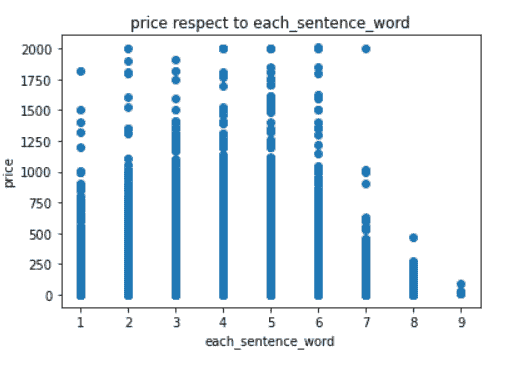
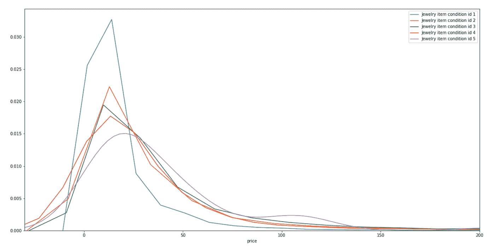
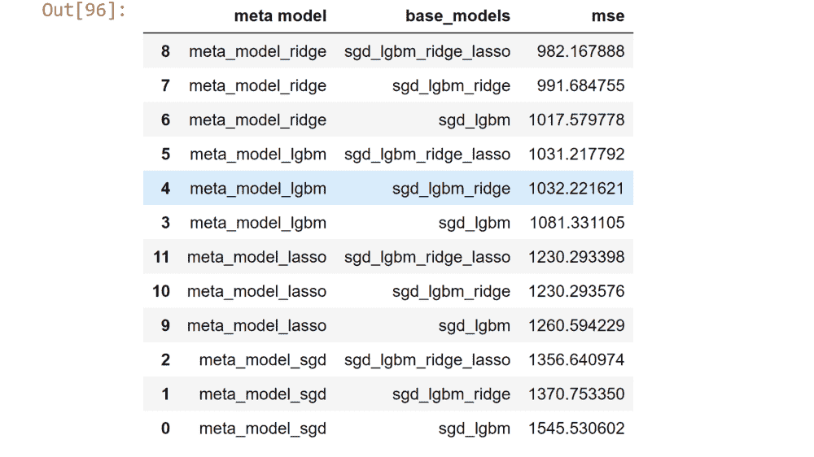

# 市场价格建议:kaggle 竞争问题

> 原文：<https://medium.com/analytics-vidhya/mercari-price-suggestion-kaggle-competition-problem-22bd5adafd26?source=collection_archive---------17----------------------->


这里我就分享一下我是怎么解决这个问题的。

所以让我们开始——

以下是路径，我将一一挑选并解释。

1.  介绍
2.  商业问题
3.  映射到 ML/DL 问题
4.  理解数据
5.  第一次切割溶液
6.  电子设计自动化(Electronic Design Automation)
7.  特征工程
8.  系统模型化
9.  结果
10.  结论和未来工作
11.  轮廓
12.  参考

让我们深入了解每一部分。

## 1.简介—

Mercari 是日本的购物应用。他们希望向卖家建议价格，但这并不容易，所以他们需要一个系统或算法来自动建议产品价格。所以他们的主人带着一些奖品把这个问题放在 kaggle 上。

基本上在这里，我必须预测产品的价格给定一些产品的信息，如产品描述，产品名称，产品品牌名称等。

## 2.商业问题—

其中一件毛衣售价 335 美元，另一件售价 9.99 美元。你能猜出哪个是哪个吗？

毛衣 _1 —绝对防御复仇者联盟男式女式休闲时尚运动衫常规合身冬季夹克男孩女孩连帽衫。

毛衣 _2 — ADRO Heartbeat Love 妈妈和爸爸设计的男女印花连帽衫/运动衫。

这是我们必须解决的问题。问题是在给定一些信息的情况下建议产品的价格。

大型电子商务公司的产品定价越来越大。因此，基本上问题是，当任何卖家在电子商务网站上列出他们的产品时，他们用来填写该产品的价格，而不是根据产品，所以这样一来，产品就卖不出去(假设任何一个人将他 10 年前的 hero bike 标价 40，000，所以很明显任何人都不想这样做，因为新的 hero bike 价格本身就接近 50，000)。当产品卖不出去，那么产品在网站上持续很长时间，所以公司(拥有该网站)不能从该产品中获利。所以如果有很多这样的产品，那么公司将不得不承担损失。这个问题可能会导致公司倒闭。因此，为了解决这个问题，我们将建立一个 ml 模型，可以预测价格的基础

在它的产品描述等功能上，为此我们将有数据来训练我们的模型。

## 3.映射到 ML/DL 问题—

这里的标签是真实值，所以这是一个回归问题。对于给定的产品特性，我们必须预测它的价格。

a.预测价格和实际价格之间的差异不能太大，否则就无法实施 ml 模型

b.没有任何严格的延迟问题，可能需要 2 到 5 秒。

c.可解释性很重要。

正如我们所知，这是一个回归问题，我们可以使用 RMSE 或 RMSE 或 MAE 或 R 平方作为性能指标。

## 4.理解数据— —

我已经下载了 kaggle 竞赛本身的数据。

你可以从[这里](https://www.kaggle.com/c/mercari-price-suggestion-challenge)下载数据。

这是关于数据的信息—

数据集中有八列。

1.Train_id —这是每个产品的 id。前任。1、2、3 等

2.名称—产品的名称。《出埃及记》MLB 辛辛那提红人 t 恤尺寸 XL。它是文本数据。

3.Item_condition_id —这是根据产品的条件对其进行的评级。《出埃及记》1、2、4 等。

4.类别名称—产品的类别。《出埃及记》男士/上衣/T 恤。这是分类数据。

5.品牌名称——产品的品牌名称。《出埃及记》阿迪达斯。这是一个分类列。

6.价格——产品的价格，这是目标特性。

7.运费——运费由卖方还是买方支付。它将是 0 或 1。

8.Item_description —这是产品的描述。《出埃及记》条纹男子连帽领红色，黑色 t 恤。这是文本数据。

## 5.第一次切割解决方案—

1.  首先，我将准备数据，这意味着我将清理数据并对其进行预处理。
2.  我会做探索性的数据分析。基于可视化移除异常值。
3.  对文本数据进行预处理，并使用 tf-idf 或 bow 或在我们的文本语料库上使用自己训练的 word2vec 将其转换为向量。对于 tf-idf 矢量化，我可以使用 sklearn tfidfvectorizer 方法。
4.  我将基于[https://arxiv.org/ftp/arxiv/papers/1612/1612.08333.pdf](https://arxiv.org/ftp/arxiv/papers/1612/1612.08333.pdf)这篇论文制作一些特征，比如我将统计产品描述中的单词并将其制作成一个特征，将描述中所有单词的词频相加并用句子长度等进行划分，我们将基于分析生成更多这样的特征。
5.  然后，我将制作一个随机模型，并找到一个度量分数，以便我们可以检查我们的下一个模型有多好。
6.  之后，我将训练一些回归模型，如岭回归，然后我也将建立一个 MLP 模型。
7.  对于训练 mlp 模型，我将首先训练关于文本描述的 word2vec cbow 模型，对于训练 word2vec 模型，我将首先使来自每个描述焦点单词的数据作为标签，上下文单词作为特征。这里，我们可以基于分析获取上下文单词。为了制作每个上下文单词的特征，我们首先制作词汇的向量大小(描述列中的单词),在上下文向量的索引上，我放置 1，在其他索引上，我放置 0，所以这将是第一个上下文单词(由二进制向量表示),假设如果我选择了上下文单词为 5，那么我们将对 5 个上下文向量中的每一个执行上述步骤，在完成所有这些之后，我将获得 5 个向量，每个向量的词汇大小。我们也将为我们的焦点单词这样做，然后给出作为那些上下文向量的输入(我们从上下文单词中得到这些向量，所以假设我们的 vocab_size=50，context_word=5，那么输入向量的总长度是 250)。我将有一个大小为 n(n 是每个单词表示向量的大小)的隐藏层，然后我有一个带有 softmax 激活函数的 vocab_size 节点的输出密集层。
8.  训练这个模型，我将得到隐藏层和输出层之间的权重向量矩阵，大小为(vocab_size，n ),每个单词有一个大小为 n 的表示向量。
9.  使用 word2vec 模型，我将把每一行(描述列)转换成 n 个大小向量。然后我将使用一个简单的 mlp 模型来训练这些新数据。
10.  根据结果，我会进一步修改。
11.  基本上我必须做大量的超高计调整。

## 6.EDA —

*   文本数据—

首先，我预处理文本数据。数据中的文本列是 item_description 和 name。

为了预处理文本数据，我做了一些函数去压缩和预处理文本数据。

Decontracted 函数——在这个函数中，我们将一些简短的形式转换为完整的形式(如果在数据中),比如将不会转换为不会等等。你可以看到下面的代码—

```
def decontracted(phrase):
    # specific
    # in this function we are converting some short form to full #     #form like won't to will not
    phrase = re.sub(r"won't", "will not", phrase)
    phrase = re.sub(r"can\'t", "can not", phrase)# general
    phrase = re.sub(r"n\'t", " not", phrase)
    phrase = re.sub(r"\'re", " are", phrase)
    phrase = re.sub(r"\'s", " is", phrase)
    phrase = re.sub(r"\'d", " would", phrase)
    phrase = re.sub(r"\'ll", " will", phrase)
    phrase = re.sub(r"\'t", " not", phrase)
    phrase = re.sub(r"\'ve", " have", phrase)
    phrase = re.sub(r"\'m", " am", phrase)
    return phrasedecontracted('this product isn't good, I can't buy it')
# output -------
# this product is not good, I can not buy it.
```

Preprocessing_text_data —在这个函数中，我们删除了 a-z 和 A-z 中的所有内容，比如删除停用词和特殊字符。基本上这可以通过这一行实现—

```
sen = re.sub(‘[^a-zA-Z \n\.]’, ‘’, sen)
# if sen ='oh no! this product is very bad,you should not buy it 😢'
# output ----
# 'oh no this product is very bad you should not buy it'
```

但是我写了这么多代码，如果你想的话，你可以注释一些行。在这一点上，我也将单词词条化，这样它就可以生成有意义的词根。这个函数返回预处理过的文本。你可以在这里看到它的代码—

```
stop_words=stopwords.words(‘english’)
lemmatizer_=WordNetLemmatizer()
def preprocess_text_data(values):
 preprocessed_text=[]
 for sen in tqdm(values):
    sen=str(sen).lower()
    sen=decontracted(sen)
 # removing special characters
 sen=sen.replace(“‘s”,’     is’).replace(“’”,’’).replace(‘!’,’’).replace(‘,’,’ ‘).replace(‘-’,’ ‘).replace(‘.’,’’).replace(‘(‘,’’).replace(‘)’,’’)\
 .replace(‘\r’,’’).replace(‘\n’,’’).replace(‘\”’,’’).replace(‘&’,’’).replace(‘=’,’’).replace(‘?’,’’).replace(‘:’,’’).replace(“‘re”,’ are’)\
 .replace(“‘ve”,’ have’).replace(“‘m”,’ am’).replace(“‘t”,’ not’).replace(“…”,’ ‘).replace(“….”,’ ‘).replace(‘\\r’,’’).replace(‘\\n’,’’)\
 .replace(‘\\’,’’).replace(‘*’,’’).replace(“‘“,’’).replace(“;”,’’).replace(“+”,’’).replace(“%”,’’).replace(“ “,’ ‘)

 sen=sen.replace(‘/’,’ ‘).replace(‘[‘,’ ‘).replace(‘]’,’ ‘).replace(‘⚡️’,’’).replace(‘✨’,’’).replace(‘❤️’,’’).replace(‘#’,’’).replace(‘$’,’’)
 # lemmatizing each word in sentences
 sen = ‘ ‘.join(lemmatizer_.lemmatize(e) for e in sen.split() if e.lower() not in stop_words and len(e)>2)
 # except a-z and A-Z remove all things from sentence.
 sen = re.sub(‘[^a-zA-Z \n\.]’, ‘’, sen)
 #sen = re.sub(“ \d+”, “ “, sen)
 # reference — #[https://stackoverflow.com/questions/33404752/removing-emojis-from-#a-string-in-python](https://stackoverflow.com/questions/33404752/removing-emojis-from-a-string-in-python)

 preprocessed_text.append(sen.strip())
 return preprocessed_textpreprocess_text_data('this's good...,I love this! ❤')
# output -----
# 'this is good I love this'
```

写完这两个函数后，我将我的每个文本列一个接一个地传递给预处理 _ 文本 _ 数据函数，该函数返回具有预处理值的相同长度的列表，最后将所有列保存到 df。你可以在下面看到这个的代码—

```
df[‘name’]=preprocess_text_data(df[‘name’].values)
df[‘item_description’]=preprocess_text_data(df[‘item_description’].values)
```

*   分类数据—

现在我将讨论分类数据。我的数据类别名称和品牌名称中有两个分类列。

我降低了品牌名称列的大小写，这样所有品牌名称行都变成了小写。我这样做是因为模特可以把阿迪达斯和阿迪达斯算作不同的品牌名称。

让我们继续讨论 category_name。在 category_name 列上，我做了同样的事情，将所有类别转换成小写。然后，我在预处理之间做了一些分析，发现类别列有最大 5 个类别和最小 3 个类别，所以我在这里想，为什么我不为类别列的每一行做五列(因为一行中可以有最大 5 个类别)，让我们直观地看一下—


我觉得现在可以理解了。我这样做是因为我可以分析类别和子类别，现在也很容易特征化。你可以在这里看到它的代码—

```
df[‘subcat1’]=df[‘category_name’].apply(lambda x:x.split(‘/’)[0])
df[‘subcat2’]=df[‘category_name’].apply(lambda x:x.split(‘/’)[1])
df[‘subcat3’]=df[‘category_name’].apply(lambda x:x.split(‘/’)[2])
def subcat4_fun(x):
 try:
   c=x.split(‘/’)[3]
 except:
   c=’nan’
 return c 

def subcat5_fun(x):
 try:
   c=x.split(‘/’)[4]
 except:
   c=’nan’
 return c
df[‘subcat4’]=df[‘category_name’].apply(subcat4_fun)
df[‘subcat5’]=df[‘category_name’].apply(subcat5_fun)
```

在这一切之后，我必须继续处理数字数据，这与数字列无关，所以就让它这样吧。

现在我将进入下一部分。

**注意—** 关于分析和可视化的代码，你可以查看 github 链接，我会粘贴在这个博客的底部。

**对数据进行 EDA 并了解每个特征—**

首先我会看到价格的分布。看这里的图表—


在这张图中，我可以看到大多数产品的价格都在 50 英镑以下，这意味着很少有产品的价格非常高。

1.  姓名栏——首先我想了解属于某个价格范围的词语，我能看到一些决定价格是低还是高的词语吗？因此，让我们绘制价格高于 50 英镑的产品名称的单词云。


在这里，我可以看到单词 bundle、Michael kor、kate spade 等很大，因此这些单词在价格高于 50 英镑的产品中非常常见。

让我们看看价格低于 50 英镑的产品名称


这很有趣。在这里我可以看到，那些在大于 50 个字的云中很大的字不在这里。这里比较常见的词是维多利亚秘密免费送货等。

从这两张图片中，我可以看到有些词正在影响价格。所以这个名字特征在决定价格上似乎很重要。

现在我根据产品名称的字数来标价格。看剧情——



我看到这里有更少的产品，价格更低，有 7，8 或 9 个单词。意味着大部分产品名称的字数较少，价格较低和较高。这似乎不是很重要，如果我计算价格和每个名称长度之间的相关性，那么我发现 0.038，这不是很好。

2.项目 _ 条件 _id —

首先查看 item_condition_id 的计数图—


具有 item_condition_id 4 和 5 的数据点非常少。

我正在绘制 item_condition_id 和价格之间的散点图。


在上面的散点图中，当 condition_id 为 5 时，价格总是小于 750，对于 condition_id 1，2，3，价格也低也高，很明显，有更多的数据点具有 item_condition_id 1，2 和 3。这个特性看起来也没那么重要。因为价格和这个特性的关联度不高。

当我看到每个 condition_id 的价格分布时，它确认了这不是那么重要。看方框图—


3.Subcat1 —

首先，我已经解释了我是如何生成这个特性的。借助于箱线图，我们来看一下每个子卡 1 的价格分布


我可以在方框图中看到，一些类别，特别是儿童和手工制品的价格分布与男性子类别略有不同，但在这两个类别之间，有一些子类别的价格完全重叠，这不是一个好现象，但在第一和最后还是有一些差异。这可能是价格预测的问题。

现在让我们向前迈出一步，绘制每个条件下的每个 subcat1 价格分布，然后查看是否有任何 subcat1 在不同条件下具有不同的价格分布。看下面的图—


在所有上述图中，没有任何图显示，在变化的条件 id 下，价格分布也在变化。有一些差异但不大。意味着在所有条件下，子类别的价格范围几乎相同。

4.Subcat2 —

为了分析 subcat2，我绘制了前 20 个 subcat2 的价格分布，这给了我一些更好的视觉效果。这是方框图——


如果你看到这个箱形图，你会发现每个子资本的价格分布有很大差异。《出埃及记》看看女性手提包和手机&配件的价格分布，有很大的差异，所以这是一个有趣的特点。

让我们看看每种情况下的前 5 种 subcat2 价格分布—



当你看到上面这些分布图时，你会注意到有一些子条件 2，每个条件在价格分布上有一些不同。《出埃及记》条件 id 为 1 的运动服装 subcat2 具有一些不同的价格分布，鞋 subcat2 在每个条件之间也有一些差异，并且条件 1 的珠宝具有不同的分布。

看到这个之后，我可以说这将是一个重要的特性。

5.Subcat3 —

我在这里也画了同样的东西，价格分布的前 5 个子 3。在顶部有一个 subcat3 other，这意味着给定产品没有第三个子类别。

让我们看看方框图——


在这个方框图中，裤子、紧身裤和打底裤的价格分布与没有给出第三层 subcat 的情况非常不同。裤子紧身裤打底裤鞋子价格分布也有一些区别。所以也是一个很好的特性。

再次绘制价格距离。前 5 个子卡特彼勒 3 的状况—


价格分布差别不大，但是看第一个剧情裤子紧身裤打底裤条件 1 和条件 4 价格分布看起来不一样。但除此之外，所有的分布几乎是相同的。

所以让我们继续前进。

6.Subcat4 —

该列/特征有六个分类值。看它们的价格分布—


看看平板电脑的分布和芭蕾，它们是完全不同的意思，如果 subcat4 是平板电脑，那么价格通常很高，subcat4 是芭蕾，那么价格很低。比较芭蕾和发球，它们也是完全不同的。

像这样对 subcat5 进行分析，看看。我已经做了，但没有在这里提到。

现在是时候看看更多的功能了—

7.品牌名称—

如果我谈论 brand_name 特性，我注意到的第一件事是它有许多缺失值或 nan 值，在数据中 42%的行没有品牌名称。怎么处理？我稍后会谈到这一点，现在看到的分析与南值。

在进行分析之前，我已经将我的 nan 行转换为 nan 字符串，只是为了像对待一个类别一样对待它。

现在让我们看看前 10 个最常见的品牌名称的价格分布—


现在看看分布。看到苹果和迈克高仕分布在那里的价格范围很广，那里的价格也相当高，看到粉红色，intendo 和永远 21，他们的价格范围低。每个品牌都有自己不同的价格分布。这是一个非常好的特性。如果我们将苹果作为品牌名称，那么价格高的可能性很大，但如果品牌名称是 forever 21，那么价格高的可能性就很小。所以这是一个很好的预测价格范围的特征。

现在来看看前 10 名品牌的价格分布情况


现在，如果我看到上面的分布，并根据其条件获得 lululemon 价格分布，那么我会看到条件 5 的 lululemon 与条件 1 的 lululemon 具有不同的分布，就像你可以看到苹果和迈克高仕相对于其条件的价格分布，看到迈克高仕条件 5 的分布和迈克高仕条件 1 的分布，它们是多么不同(意味着条件 1 的迈克高仕的价格比条件 5 的迈克高仕更高)。你也可以在苹果的价格分布中看到这些东西。

现在看看，如果有任何影响航运和品牌名称的价格。我已经画出了十大品牌在运输方面的价格范围。先看方框图—


如果你看到所有的方框图，那么在每个方框图中有一个共同点，我可以在这里看到每个蓝色方框稍微领先于每个橙色方框，这意味着当运费由买家支付时，价格就很高，如果我们看到每个运费(0 和 1)的美国鹰品牌名称的价格范围与迈克高仕和 lululemon 的价格范围不同，我们可以看到更多这样的关系。

8.航运—

有两个值，0 表示运费由买方支付，1 表示运费由卖方支付。

如果运费由卖方支付，则平均价格较低，而当运费由买方支付时，则成本稍高。你可以在每个发货 id 0 和 1 的价格分布图中看到这一点。


如果我们看到价格和运输之间的相关性，它几乎是-0。24.这很好。

9.项目描述—

这完全是文本特征。我在 item_description 中绘制了价格和字数之间的散点图，得到了这个图。


从上面的情节我可以说两件事。首先，有详细描述的数据较少，其次，有详细描述的数据价格较低，而有详细描述的数据价格较低，所有类型的价格都意味着低和高。就是这样。

这些都在 EDA 部分。你可以做得更多。

让我们看看功能和价格之间的关联热图


这里有一些彼此高度相关的特征。我将移除其中一个高度相关的要素，因为多重共线性是不好的。运输与价格高度相关。

最后，我选择了 15 个特征。这里你可以看到—


## 7.特征工程—

从前面的分析中，我们知道品牌名称的不可用性确实会影响价格，所以我认为如果我创建一个只有 0 和 1 的新功能会怎么样，如果给定了品牌名称，我会将其设为 1，如果没有，我会将其设为 0(看这里，我没有删除原始功能品牌名称，我正在创建一个新功能，让我们将其命名为品牌名称存在编码器)。添加这个特性后，当我计算这个特性和价格之间的相关性时，我得到的值几乎是 0.21，这相当不错。

所以现在我们又多了一个功能 brand_name_exist_encoder。

但是，我没有使用这个功能，因为当我训练我的模型时，我的系统似乎被关闭了，因为它占用了我所有的内存。因为数据很大，差不多 140 万我处理不了。顺便说一下，我已经成功地训练了一些模型，与此相比，它给了我更好的结果(我将向你展示)。更好的结果背后的原因可能是更多的数据和一个与价格有很好相关性的特征(brand_name_exist_encoder)。所以如果你的笔记本有更多的内存，你可以试试这个。

在进行特征化之前，我将把我的数据分成训练集和测试集。

现在，在这一节中，我将用三种方法进行特征化。

1.一个热编码

2.TF-IDF 矢量器

3.Word2Vec

我可以做 tf-idf word2vec，但仅限于我自己用这三个。

基本上我已经用每种方法做出了特征。

在分类数据上，我只应用了一种热编码，但是对于文本，我应用了这三种方法，并建立了三个特征集

(train_ohe，test_ohe)，(train_tfidf，test_tfidf)和(train_w2v，test_w2v)。

注意——在这里，我将所有编码器安装在唯一的训练上，并转换训练和测试以防止数据泄漏。

1.  一个热门的编码—

一个热编码意味着什么，假设我有一个列 brand_name，它有三个频繁出现的值，假设我有十行，这里我有三个唯一的值，所以我将这三个唯一的 brand_name 值组成三列 name，现在我将选择第一列，并检查行(实际 brand_name)的值是否与 first_column name 相同，我将它设为 1，否则设为 0。我将对剩下的两列进行同样的处理。你可以通过这张图片更好地理解它—


在上图中，A 列表示品牌名称 A 出现的位置和不出现的位置。

首先，我用一个 hot 编码创建特性，这意味着我将对文本和分类数据应用 onehotencoder。

我将使用堆栈来堆叠所有要素，包括数字要素，并将其保存为 train_ohe 和 test_ohe。

2.TF-IDF 矢量器—

现在我已经对分类数据进行了一次热编码，所以不需要再做一次。这里我只需要对文本数据(name 和 item_description)进行 tfi-df 矢量化。

tf-idf 表示-术语频率*逆文档频率。

术语频率公式为-

一个词的词频=该词在句子中出现的次数/句子中的总字数。

单词的 IDF = log(语料库中句子的数量/出现单词的语料库的数量)。

在这里，TF 给予频繁出现在句子中的单词更多的重要性，而 IDF 给予出现在语料库中很少的句子中的重要单词。在 IDF 公式中，有一个用于标准化数值的对数，如果没有对数，那么数值的范围将会太大，这对我们的模型不利。

让我们看一个 tf-idf 矢量器的例子—

科珀斯——你好，你真有趣，他也很有趣

现在计算 TF(你在你好吗中)=1/3 和 idf(你)=log(3/2)

所以我们在句子“你好吗”中的 tf-idf 值是(1/3)*log(3/2)。

现在我将创建一个向量，这个向量的大小将等于语料库的 vocab 大小。在我的例子中，vocab 的大小是 7。所以向量看起来像(how，are，you，so，滑稽，he，is)。现在句子“how are you”的向量表示会是这样的(tf-idf(how)，tf-idf(are)，tf-idf(you)=(1/3)*log(3/2)，tf-idf(so)，……。，tf-idf(is))。

现在同样的事情，我将堆栈所有的功能，包括一个数字也使用堆栈，我将它保存为 train_tfidf 和 test_tfidf，这样我就不必再次运行它。

3.Word2Vec —

我只在文本数据上应用 word2vec，基本上我会将每个单词转换成一个句子的向量并求和。所以它将代表我们的一个文本。

看到下面的图片，你会明白—


现在的问题是，我将如何生成 d-dim 向量，所以这里我选择将其转换为 100 维向量，我已经用预训练的手套向量完成了它，一旦你下载了这个预训练的手套向量模型，然后你可以给出一个单词，它将返回 100 维向量。你可以在代码中看到如何做，是的，你可以从[这里](https://www.kaggle.com/rtatman/glove-global-vectors-for-word-representation)从 kaggle 下载手套向量模型，或者你可以在谷歌上搜索“手套向量 100 d kaggle 下载”，你会找到它。让我们看看代码—

我就存成 train_w2v，test_w2v。

现在我们的所有功能集都准备好了，所以从这里我们将继续第一次削减模型。

## 8.建模—

在 kaggle 比赛中他们建议使用 RMSLE 作为度量，为什么？因为 RMSLE 受异常值的影响较小，如果我们说我的数据中有异常值，现在如果我们计算 mse，那么误差会非常高，所以如果我们使用 mse 或任何没有记录的数据，那么我们得到的误差，基于该误差，我们不能说我的模型是好是坏。 举例来说，假设我们在 x_test 中有三个数据，它们现在都是内联的，如果你的模型很好，那么它会给出很少的误差，现在如果我添加第四个 x_test 数据，它是离群值，那么现在当你评估你的模型时，你会得到很高的误差，你会认为模型很差，现在如果你用误差的对数代替误差，那么对数会做什么，它会压缩误差，并向你显示更好的误差。

在上面的例子中，你可以看到我是如何认为我的模型是不好的，因为那个异常点，但那是错误的，所以这就是 log 所做的事情。

在这里，我将在 y_train 和 x_train 上进行最小最大缩放，我将只在 y_train 上拟合最小最大值，并转换 y_train，在这里，我不会触摸 y_test。参见代码—

```
scaler=MinMaxScaler()
scaler.fit(np.array(y_train).reshape(-1,1))
y_train_minmax=scaler.transform(np.array(y_train).reshape(-1,1))
```

现在的问题是我将如何评估我的模型，因为现在我的模型预测价格是按比例调整的格式，我们的 y_test 是原始的(未按比例调整),因此为此我将保存我们的 y_train min 和 max，现在如果我有 y_train 的 max 和 min，那么我可以按原始价格的比例转换我们的预测输出价格。

```
y_pred=model.predict(test_tfidf)# converting out y_pred to original scale.
y_pred1=(y_pred*y_train.max())-y_train.min()# calculating mse
mean_squared_error(y_test,y_pred1)
```

现在，首先我会做一个随机模型(像哑模型)，这样我们就可以看到我们的第一次切割模型比随机模型好，或者比随机模型差。

在随机模型中，我将取 y_train 的平均值，并将其作为整个 x_test 的预测价格，然后计算 mse，参见此处的代码——

```
avg_price=y_test_minmax.mean()
predicted_y = [avg_price for i in range(test_tfidf.shape[0])]
y_pred1=(np.array(predicted_y)*y_train.max())-y_train.min()
print("mean_squared_error on Test Data using Random Model",mean_squared_error(y_test, y_pred1))
```

当你运行这个程序的时候，你会得到*。46860 . 68868888661*

现在你有一条线，你知道在这条线以下，你的模型是愚蠢的。

1.  SGDRegression model —
    我用超参数调整将我的三个训练集(OHE、TF-IDF、WORD2VEC)逐一拟合在这个模型上。在这里，我得到了 OHE 数据的 mse 为 1185，TFIDF 数据的 MSE 为 1263，W2V 数据的 MSE 为 1366。我可以看到 OHE 的数据给出了更好的结果。
2.  LGBMRegressor 模型—
    在这里，我得到了 OHE 数据的 mse 为 1041，TFIDF 数据的 MSE 为 1002，W2V 数据的 MSE 为 1065。我可以看到 OHE 的数据给出了更好的结果。在这里，我得到了 tfidf 数据的最佳结果。
3.  岭回归模型—
    这里我在 OHE 数据上得到了 1108，在 TFIDF 数据上得到了 1157，在 W2V 数据上得到了 1303。我可以看到 OHE 的数据给出了更好的结果。在这里，我得到了 OHE 数据的最佳结果。
4.  Lasso 回归模型—
    这里我得到了 OHE 数据的 mse 为 1592，TFIDF 数据的 MSE 为 1672，W2V 数据的 MSE 为 1644。我可以看到 OHE 的数据给出了更好的结果。在这里，我得到了 OHE 数据的最佳结果。这是迄今为止最差的型号。
5.  XGBRegressor 模型—
    在这里，我得到了 OHE 数据的 mse 为 1210，TFIDF 数据的 MSE 为 1236，W2V 数据的 MSE 为 1278。我可以看到 OHE 的数据给出了更好的结果。在这里，我得到了 OHE 数据的最佳结果。

这五个模型我已经尝试作为我的第一个削减模型，为更多的改善，这些结果你可以做更多的超参数调整，也许你应该得到一些更好的结果。

现在，在一个地方查看所有型号的性能，这是迄今为止最好的结果—


在上面我可以看到最好的模型和它的参数，所以最好的模型是 LGBMRegressor，它给我们 1002 的误差，根据 tf-idf 数据训练，超参数是{'boosting_type': 'gbdt '，' learning_rate': 0.1，' max_depth': 8，' n_estimators': 200，' num_leaves': 60}。

## 使用一些堆叠技术—

**集成技术—**

现在继续，我已经实现了集成技术，作为集成技术，我已经使用了堆叠，并且我已经从我自己开始编码，首先做超参数调谐。我在 meta_model、sample_size(在此基础上训练了我的基本模型)和 base_models 上进行了超参数调优。我已经在每个特性集(ohe、tfidf 和 w2v 数据)上这样做了。

基本上，为了做到这一点，我做了一些函数，通过调用它三次，我得到了三个带有超参数和错误的表(对于 ohe 数据、tfidf 数据和 w2v 数据),我将向您展示下面的代码和结果→

当我在 OHE 数据的叠加回归量之上训练时，我得到了结果—


在 tf-idf 数据上—


在 word2vec 数据上—


当数据为 OHE 时，最好的结果为 1009，基本模型为 sgd_lgbm_ridge_lasso，每个样本大小为 250000，元模型为岭回归模型。

**使用带超参数调节的 StackingCVRegressor 进行堆叠—**

现在我将使用 **StackingCVRegressor，**使用它我可以更好地进行超参数调优。点击阅读**StackingCVRegressor**[**。**](http://rasbt.github.io/mlxtend/user_guide/regressor/StackingCVRegressor/)

**参见下面的实现—**

**当我在 OHE 数据上拟合上述实现时，我得到了这个结果—**

****

**在 tf-idf 数据上—**

****

**在 word2vec 数据上—**

****

**在上述结果中，当基本模型是 sgd_lgbm_ridge_lasso 且元模型是 ridge 时，OHE 数据的最佳结果是 982。**

**这是目前为止最好的结果。**

**现在，我将在神经网络上拟合我的 word2vec 数据。**

## **实现深度学习模型—**

**对于深度学习模型，首先我将使用我的 word2vec 数据来训练它。我已经有 w2v 数据了。这是神经网络结构和神经网络训练的代码—**

**为了训练神经网络，我使用了数据加载器，因为它在任何特定的时间占用较少的内存。**

**通过在 w2v 数据上训练这个神经网络，我得到了 mse 1011，这不是最好的结果，记住我在堆栈实现中得到了几乎 982。**

****具有嵌入层的神经网络—****

**现在，我不会使用预先训练的 word2vec 来训练神经网络，我将通过嵌入层为每个单词(在分类和文本数据中)学习自己的向量。**

**为了训练这个神经网络，我必须首先将每个分类列和文本列转换为整数序列，这是在 keras 预处理的帮助下完成的。假设我必须将 item_description 转换为 sequence，为此，我首先将 train_item_desc 列与 tokenizer(keras . preprocessing . tokenizer . fit _ on _ texts(x _ train))相匹配，然后使用 texts_to_sequences 将 train_item_desc 和 test_item_desc 列转换为 sequence，之后我使用 pad_sequencs 方法对 train 和 text 进行填充，以便 train_item_desc 和 test_item_desc 中的每个数据长度相同。让我们看看下面的图片，以便更好地理解—**

****

**现在我已经完成了所有文本和分类列的编码，我还堆叠了所有数字列(你可以看到下面的代码部分)。**

**让我们来看看模型结构的代码和拟合模型上的数据——**

**在训练这个神经网络时，我得到了 mse 893，这是迄今为止最小的误差。**

**最初，当你训练这个网络时，你会过度拟合你的数据，所以在遭遇中，我使用了不同的初始化器、退出和提前停止。**

## **9.结果—**

**下表显示了基于数据的模型最佳性能。**

****

**最佳模型是带嵌入层的神经网络模型，误差为 893.9278**

**我已经在 kaggle 上提交了我的模型预测价格，我得到了 0.65249 的 RMSLE。**

****

## **10.结论和未来工作—**

1.  **我们可以通过增加一个特征来改进我们的模型，这个特征将决定品牌名称是否存在。《出埃及记》如果品牌名称存在，则为 1，如果不存在，则为 0。如果我们这样做，那么误差可能会减少。**
2.  **在这里，我没有使用 tf-idf 加权 word2vec 进行特征化，我们可以这样做，看看所有模型的表现如何。**
3.  **为了填充缺失的品牌名称值，我们可以使用基于模型预测的填充技术。我们可以将 brand_name 出现的所有数据作为 train_data，将 brand_name 缺失的数据作为测试数据，现在根据训练数据拟合模型并预测测试数据。但这将是一个棘手的问题，因为这里我们将 brand_name 作为 target_variable，它是分类的，有这么多类别。我能想到的一种方法是，您可以从 x_train 中删除那些 brand _ name 在 train 中很少出现的行，例如。您可以删除出现少于 5 或 10 个的与 brand_name 相关的数据点，这样您可以减少 target_variable 中的类的数量。**

## **11.个人资料—**

**我的 linkedin 个人资料—[https://www.linkedin.com/in/vishwas-upadhyay-36b94b1b6/](https://www.linkedin.com/in/vishwas-upadhyay-36b94b1b6/)**

**代码的 Github 链接—[https://github . com/vish was-upadhyaya/mercari _ price _ suggestion](https://github.com/vishwas-upadhyaya/mercari_price_suggestion)**

## **12.参考文献—**

1.  **[https://www . Applied ai course . com/course/11/Applied-Machine-learning-course](https://www.appliedaicourse.com/course/11/Applied-Machine-learning-course)**
2.  **https://machinelearningmastery.com/category/deep-learning/**