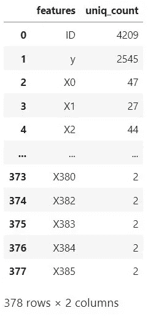

# 奔驰绿色制造——机器学习案例研究(上)

> 原文：<https://medium.com/analytics-vidhya/mercedes-benz-greener-manufacturing-a-machine-learning-case-study-part-1-f6a5ddb60394?source=collection_archive---------1----------------------->


图片来源:[https://www . rad-ab . com/2016/12/23/Mercedes-benz-auf-DEM-pruefstand/](https://www.rad-ab.com/2016/12/23/mercedes-benz-auf-dem-pruefstand/)

**内容概述—**

第 1 部分—抽象→业务问题→ ML 公式→数据→现有解决方案→性能指标→ EDA→第一步方法→特征工程

第 2 部分— ML 模型选择/训练/评分→实验→观察→预测系统→结论→未来工作

# 摘要

梅赛德斯·奔驰是高档汽车的制造商。戴姆勒的梅赛德斯-奔驰是欧洲高档汽车制造商中的佼佼者。这在质量研究、工程、制造和测试中已经成为可能。他们还为客户提供各种功能来定制他们的梅赛德斯-奔驰。现在，所有这些汽车都必须测试车内设备的功能。它们还必须满足质量标准和安全要求，以在上路时实现最佳性能。这就要求工厂内的测试线具有通用性，能够处理每一辆独特的汽车。

为了解决各种汽车的测试，公司工程师建立了一个强大的测试系统，可以处理汽车的每一个独特的配置。测试线必须高效运行，因为汽车花在测试上的时间越多，产生的碳排放就越多。优化测试速度保持生产线环保。对于公司来说，为如此多的可能特性组合优化测试系统的速度是一个相当大的挑战。如果没有智能的数值方法，这将是复杂和耗时的。作为世界上最大的汽车制造商，拥有一条高效且能控制温室气体排放的生产线至关重要。

一篇在奔驰进行测试的文章:[https://www . rad-ab . com/2016/12/23/Mercedes-Benz-auf-DEM-pruefstand/](https://www.rad-ab.com/2016/12/23/mercedes-benz-auf-dem-pruefstand/)

# 商业问题

公司需要控制生产时间，因为这样可以减少碳排放。汽车测试时间是最重要的，因为它对公司的碳足迹有影响。因此控制它为绿色制造让路。为了帮助提高测试系统的速度，了解汽车配置如何影响处理时间以及影响的程度非常重要。

在这里，我们需要了解有许多汽车配置是可能的，它们可能是独特的，这取决于客户的选择。为每一种可能的配置配置一个测试系统是不经济的。因此，必须有更少的或者如果可能的话，一个测试系统能够处理所有汽车配置的测试。根据市场需求，工厂生产的汽车排队通过装配线。

组装结束后，汽车进入测试台。但是如果前一辆车具有不同的配置，则该车必须等待测试系统为其配置进行设置。因此，我们可以看到试验台必须经历这样的循环:

为独特的汽车设置试验台>>测试汽车>>设置>>测试>>设置>>测试>>设置>>测试>>测试> >…..

花费时间来设置测试台，以处理即将进行测试的特定独特汽车。然后，汽车会在测试台上花一定的时间，这是它的配置所特有的。因此，总测试时间=设置时间+实际汽车测试时间。为了优化总测试时间，我们需要考虑两个方面:

设置—这将取决于选择和组织测试独特汽车配置所需的工具。

实际测试——这将取决于工具在测试台上获得汽车特定测试结果的速度。

(注意:对于当前的问题，测试的自动化水平是未知的)

如果我们知道配置如何影响测试时间，那么可以修改以上两个方面来优化测试时间。这将有助于测试团队相应地计划和重组测试平台。因此，我们需要根据汽车配置来评估/预测测试时间。可以将测量的测试时间与预测的时间进行比较，以查看是否存在延迟。这可以监视测试台的性能。

如果为汽车提供的每个功能的测试时间是固定的，那么汽车的总测试时间就是所选功能的测试时间的总和。但事实并非如此。我们有的只是每辆车的一套配置和整体测试时间。(我们将在数据部分研究数据)

现在，该公司向客户提供了数百种配置。预测每种可能配置的测试时间并不是一件容易的事情。

让我们考虑一个简单的例子:假设我们有 50 个特性可以提供，而一个人只能选择他/她选择的 10 个特性。可能的组合数为 10，272，278，170 (50C10)。这是一个很大的数字。

现在，当提供的功能数量不仅仅是 50 个并且选择不受限制时，考虑一个总的组合。可能的组合数量将急剧增加。

我们需要一种系统的、更智能的方法来快速预测任何功能/配置组合的时间。机器学习(ML)是一种最先进的技术，可以洞察汽车配置对测试时间的影响。

因此，我们手头的业务问题是想出一种方法来预测汽车通过给定配置的测试所需的时间。因此，该公司举办了一场 kaggle 比赛来解决这个问题，这可以在链接-[https://www . ka ggle . com/c/Mercedes-benz-greener-manufacturing/overview 中找到。](https://www.kaggle.com/c/mercedes-benz-greener-manufacturing/overview.)

竞赛排行榜注意事项:

公共排行榜是用大约 19%的测试数据计算出来的。

私人排行榜是用剩下的 81%的测试数据计算出来的。

# 商业问题的 ML 公式

公司提供具有特定配置的多辆汽车的测试时间信息。我们必须训练机器学习模型，该模型必须预测给定标记特征的汽车测试时间的真实值输出，该给定标记特征代表一组汽车配置。这是一个回归问题。必须使用决定系数(R 值)来测量模型的性能。模型应该是可解释的，这样就可以提取出影响测试时间的特征。

机器学习模型对于预测的测试时间应该具有高的度量分数。当模型性能提高时，预测时间更加准确，这使得汽车测试更加有组织，测试速度也得到提高。从而减少汽车测试过程中的碳排放。

# 业务限制

*   预测在具有高 R 值的汽车上花费的测试时间。
*   没有严格的延迟限制。

# 数据

来源:[https://www . ka ggle . com/c/梅赛德斯-奔驰-更绿色-制造/概述。](https://www.kaggle.com/c/mercedes-benz-greener-manufacturing/overview.)

提供以下文件用于分析:

*   train.csv
*   test.csv
*   sample_submission.csv

**train.csv** 文件由 4209 行，378 列组成。每行代表汽车，每列代表其配置和时间。配置被编码为标签下的类别，其中一个功能具有标签 ID，其他功能具有“X”后跟一个数字作为标签。地面实况标记为“y ”,代表汽车通过特定功能配置测试所用的时间(秒)。

**test.csv** 包含大小为(4210，377)的数据，具有列 ID 和特性 X0 到 X385。该文件中未提供时间。我们训练的模型必须预测 test.csv 中配置的时间。这将用于评估 kaggle 中的模型，以将最佳模型放在领先板上。这些数据不能用来提高我们的绩效，因为我们没有 y 数据。

**sample_submission.csv** 捕获提交竞赛的测试数据预测的格式。

# 现有解决方案和要点

因为我所考虑的问题是一场智力竞赛，所以有一些解决方案赢得了这场竞赛。第一名获奖者和少数其他人采用的方法的关键思想要点如下:

[Kaggle 第一名解决方案](https://www.kaggle.com/c/mercedes-benz-greener-manufacturing/discussion/37700)

[Kaggle 第二名解决方案](https://www.kaggle.com/c/mercedes-benz-greener-manufacturing/discussion/36390)

[Kaggle 季军解](https://www.kaggle.com/c/mercedes-benz-greener-manufacturing/discussion/36126)

[Harshwardhan Jadhav 的博客](/swlh/greener-manufacturing-with-machine-learning-6ec77d0e7a91)

[Nitish Sawants 博客](/analytics-vidhya/detailed-solution-to-mercedes-benz-green-manufacturing-competition-on-kaggle-7b85c84a3ff5)

[阿迪蒂亚·潘迪的博客](/analytics-vidhya/mercedes-benz-greener-manufacturing-74a932ae0693)

以上解决问题的要点:

*   基于特征重要性的树模型特征约简过滤技术。
*   双向和三向特征交互是有帮助的
*   基于决策树的模型，如随机森林、梯度推进、XGBoost 回归等，能够得到较好的 R 值。
*   降维特性很有帮助。
*   具有 K 倍交叉验证的堆叠回归模型有助于获得良好的 R 值。
*   一个热编码和标签编码用于分类特征

我们必须单独使用 4209 行(train.csv)来训练和测试。我们拥有的数据量很小。获得良好模型性能的最佳方法是进行交叉验证。

# 探索解决问题的其他途径

在我们的分析中，我们将考虑分类特征的二进制编码和目标编码。在上述解决方案中没有考虑这些。降维特征基于目标编码特征。

我们将根据与目标变量 y 的相关性来识别双向和三向交互特征

我们将考虑弹性网模型。我们将考虑基于局部异常因子值移除异常值。

# 绩效指标:

为了衡量模型的性能，我们需要将其预测与实际情况进行比较。在给定的数据集中，我们有连续的目标变量“y”。对于连续值预测，我们可以评估均方差/RMSE、平均绝对误差或 R 平方(决定系数)来检查模型的性能。作为 kaggle 竞赛的一部分，我们需要评估 Rsquared 分数。在研究中，我们将考虑额外的度量 RMSE 来检查模型性能和比较不同的模型。

研究中考虑的指标:

*   r 平方分数

从这个分数，我们可以很快判断出这个模型有多好。我们不必与其他模型分数相比较。这里，分数本身是通过将模型的误差与始终预测平均值的模型进行比较来评估的。

因此我们有，

R = 1 ->最佳模型

R = 0 ->最差模型，最差模型将有 SS_r = SS_t，这意味着我们的模型等价于均值预测模型。

*   均方根误差

RMSE = 0 ->最佳模特

RMSE =高价值->最差模型

与 Rsquared value 不同，我们无法通过查看 RMSE 值来判断模型有多差。

# EDA —探索性数据分析

在这里，我们将研究给定的数据，并试图理解特征及其与目标变量的关系。

用于 EDA 的 Python 模块

```
**import** pandas **as** pd
**import** numpy **as** np
**import** matplotlib.pyplot **as** plt
**import** seaborn **as** sb
**import** category_encoders **as** ce
```

正如前面在“数据”一节中提到的，我们得到了由 4209 行× 378 列组成的汽车数据


来自 train.csv 的数据

4209 是汽车的数量

378 是与汽车相关的信息

没有重复的行。

给定数据的列描述-

*   ID-对于每一行都是唯一的-类型:整数
*   y —它捕获测试时间—类型:float
*   X0、X1、X2、X3、X4、X5、X6 和 X8 的类型是:object。这些特征是绝对的。
*   X10 到 X385 是 368 个整数类型的特征。



左侧的表格显示了要素的唯一值计数。

378 列中的 12 列具有单一值并且等于零。已识别的特征如下所列:X11、X93、X107、X233、X235、X268、X289、X290、X293、X297、X330、X347

这 12 个特征是没有用的，因为它们不会因每辆车而异。在训练 ML 模型时，我们可以忽略这些特征。

剩余的 356 个特征是占用值 0 或 1 的二进制。它可以表示特定特征对于特定汽车是否存在

现在，我们将探究每个特性栏。

**1。目标变量—‘y’**

y 的值是实数值。我们将研究数据行中值的分布。


目标变量的直方图和 PDF 图。

观察结果:

*   分布不正常。
*   密度有多个峰值。
*   平均值分布约为 100 秒
*   在 75、90 和 110 秒左右有峰值
*   最小值为 72 秒
*   最大值为 265 秒
*   50%的数据的测试时间在[90.82，109]秒范围内(四分位数范围内)

现在，我们将开始研究其他特性列，它们如何随目标变量而变化。

**2。特征' ID'**

ID 特征是唯一整数的集合。因此，我们将检查 y 与 ID 的 scater 图


特征 ID 与目标变量的散点图

从上图我们可以看出，ID 和 y 之间没有关系。

比较 train.csv 和 test.csv 数据中的 ID 列，我们观察到 train 数据中 ID 列缺失的序列值在 test 数据中可用。由此我们可以推断，ID 是观察数据的行号序列，它被随机拆分以进行训练和测试。因此，特征 ID 在预测 y 值时没有用。

**3。分类特征**

X0、X1、X2、X3、X4、X5、X6 和 X8 是绝对的。

我们将绘制箱线图，以了解一个分类特征列中的每个类别如何影响“y”

箱线图:


特征 X0 和 X1 的曲线


特写 X2 和 X3 的情节


特征 X4 和 X5 的曲线图


特征 X6 和 X8 的图

箱线图观察:

*   从上面的图中我们可以看出，分类特征下的每个类别都有不同的目标值分布。IQR 山脉占据了不同地区的多个类别。我们可以看到哪些类别可能是 y 值分布中 3 个峰值的原因。
*   X0、X1 和 X2:对于 y(测试时间)值，每一类特征都有其自己的分布
*   X3:不同类别的 IQR 价值观非常接近。但是中间值是变化的。
*   X4:只有一个类别有箱线图。该特征可以被认为是跨行的常数，其仅具有类别“d”的分布，而其他类别没有分布。类别“a”仅适用于两行数据，而“b”和“c”仅适用于一行数据。


*   X5:大多数图的 IQR 在同一范围内。
*   与其他类别相比，X6: 2 类别(“e”和“f”)的 IQR 范围较小。
*   X8:不同类别的 IQR 值非常接近。但是中间值是变化的。

现在，我们将检查与每个类别相关联的中值对于给定特征是如何变化的。

中值图:


特征 X0 和 X1 的中值图


特征 X2 和 X3 的中间图


特征 X5 和 X6 的中值图


特征 X8 的中值图

观察结果:

*   X0，X2:标识与“y”分布中不同峰值相关联的特征类别
*   X1，X3，X6，X8:以中值的递增顺序标识类别
*   X5:与特征 X0 和 X2 不同，在 X5 中，大多数类别的中位数集中在 100 左右。它似乎在不同的类别中保持不变。但是我们考虑的是分布的中值，所以我们不能断定在这个特性中使用任何类别都会预测相同的值
*   基于上述观察，我们可以认为目标编码是分类特征的有用转换

在目标编码后，我们将检查分类特征之间是否存在相关性。


特征相关热图

该图像捕捉了两个特征之间的皮尔逊相关性。“0”表示没有相关性。‘1’表示高度相关。我们看到特征 X0 和 X2 具有 0.61 的相关性。特征 X1、X3 和 X8 与 X0 和 X2 具有低的值相关性。

我们将检查多变量图，以查看两个特征如何针对特征集 X0、X1、X2、X3 和 X8 进行交互。


目标编码特征的多元图

从上面的等高线图中，我们看到选择的特征分离出 y 的峰值区域

在所有特性中，X2 vs X0 捕捉到了沿 45 度线分布的关系。

*   特征 X2 平均值更多地集中在 95 和 105 秒左右。
*   而特征 X0 的平均值分布在 3 个区域:大约 90°、105°和 110°以上

除了 X0 和 X2 这两个特征之外，其他特征都在 XY 平面上展开。特性之间没有太多的交互。

虽然特征 X0 和 X2 具有 0.61 的相关性，但是我们不会忽略它们中的任何一个。因为相关性不是太高，并且两者都可能有助于预测目标值。

除 X4 之外的所有分类特征都被认为是重要的。

**4。二元特征**

X10 到 X385 是二进制特征。

我们将检查随机二元特征的方框图。


绘制箱线图以了解每个特征对目标变量的影响是很麻烦的。我们需要提出一个特征过滤器来选择一个对目标变量有影响的过滤器。

我们需要了解给定特征的 1 和 0 的分布。

如果大多数行具有相同的值，即 0 或 1，那么该特定特征可以被认为是整个数据的常数。

我们将绘制条形图来显示特定功能的 0 和 1 的计数。


二进制特征的零和一的计数

观察结果:

*   在这里，我们观察到有许多特征的多数计数为零。这些特征在预测目标变量时没有用，因为它们在大多数行中保持不变。
*   我们将检查这些特征的方差，并拒绝那些低价值的特征。

# 首次切割方法

基于之前的解决方案，在完成 EDA 之后，我计划遵循以下步骤:

1.  移除重复要素。
2.  检查具有二进制值的要素的方差，并移除值非常低的要素。
3.  移除相关特征。
4.  根据二元特征对随机森林回归模型 R 分数的影响向下选择二元特征。我们将根据 kaggle 第二篇文章中提到的方法进行前向特征选择。
5.  输入到 ML 模型中的分类特征编码。
6.  我们将考虑过滤后的特征集，并进行降维以获得新的特征
7.  基于与目标变量的相关性(相关性> 0.65)选择的双向和三向交互的新特征
8.  识别异常值。

*   对用于分析的要素进行分组:

特征集 1 (F1) -二进制编码分类特征+过滤特征

特征集 2 (F2) -目标编码分类特征+过滤特征

特征集 3(F3)-目标编码分类特征+过滤特征+ 2/3 向特征交互

特征集 4 (F4)-目标编码分类特征的降维特征

特征集 5(F5)-目标编码分类特征的降维特征+ 2/3 向特征交互

*   我们将考虑对以下列出的模型进行上述各项功能的培训(F1 至 F5):

随机森林，

梯度推进决策树，

树外和

弹性网

上述模型的堆叠模型

# 特征工程

正如 Firstcut 中指出的，我们将过滤和修改特征—

1.  **掉落特征**

在 EDA 中，我们确定了某些无用的特征——“ID”和“X4”。

我们将删除重复的功能。

```
*# Identifying the duplicate feature names and storing them in numpy array* duplicate_feat **=** car_data_new_X**.**T[car_data_new_X**.**T**.**duplicated()]**.**index**.**to_numpy()*# Dropping Duplicate features from dataset*
car_data_new_X **=** car_data_new_X**.**drop(duplicate_feat,axis**=**1)
```

以下特征是重复的—

```
‘X35’, ‘X37’, ‘X39’, ‘X76’, ‘X84’, ‘X93’, ‘X94’, ‘X102’, ‘X107’, ‘X113’, ‘X119’, ‘X122’, ‘X134’, ‘X146’, ‘X147’, ‘X172’, ‘X199’, ‘X213’, ‘X214’, ‘X216’, ‘X222’, ‘X226’, ‘X227’, ‘X232’, ‘X233’, ‘X235’, ‘X239’, ‘X242’, ‘X243’, ‘X244’, ‘X245’, ‘X247’, ‘X248’, ‘X253’, ‘X254’, ‘X262’, ‘X266’, ‘X268’, ‘X279’, ‘X289’, ‘X290’, ‘X293’, ‘X296’, ‘X297’, ‘X299’, ‘X302’, ‘X320’, ‘X324’, ‘X326’, ‘X330’, ‘X347’, ‘X360’, ‘X364’, ‘X365’, ‘X382’, ‘X385’
```

现在，我们的模型需要在提供给我们的测试数据(test.csv)上表现良好。我们需要用所有的训练数据来训练我们的模型。只有在 kaggle 上提交测试数据的模型预测，才能知道模型性能。

但是，为了亲自检查一个训练好的模型的性能，我们需要在具有目标变量的看不见的数据上测试该模型。为此，我们将利用训练数据本身。

因此，在对功能进行进一步修改之前，我们将把 train.csv 中的数据拆分为训练和测试数据。我们将把提供给我们的 10%的训练数据视为测试数据。

特征工程将在列车数据上完成。测试数据将是我们的模型看不见的数据，我们可以检查模型的性能。

```
**from** sklearn.model_selection **import** train_test_split*# Train test split of data after duplicate feature removal*
X_train, X_test, y_train, y_test **=** train_test_split(car_data_new_X, 
                                                    car_data_new_y, 
                                                    test_size**=**0.1, 
                                                    random_state**=**42)
```

为了进一步处理，我们将考虑 X_train。

**2。丢弃具有低方差的二进制特征**

我们检查所有二元特征的方差。


二元特征方差。(x 轴是特征列表)

从图中我们可以观察到，有许多特征的方差接近于零(我们在柱状图中的推断)。我们将丢弃方差接近于零的特征

让我们将最大方差(0.25)的 5%(任意)视为低方差阈值，即 0.0125

当我们选择方差> 0.05*0.25 的特征时，我们有以下具有新的低方差值的特征。

```
Feature Variance
X47     0.013029
X106    0.013029
X211    0.013543
X159    0.013543
X371    0.013799
```

让我们看看 0 和 1 在最小和最大方差特征中的分布情况。

```
*# Following two features were identified to have minimum and maximum variance* *# value count of least variance feature*
X_train['X106'].value_counts()output:0    3738
1      50*# value count of max variance feature*
X_train['X127'].value_counts()output:0    1907
1    1881
```

我们可以确保要素类别(0/1)的人口数至少为 50。具有最大方差的一个将具有几乎相等的 0 和 1 类别的数字。

以下 121 个特征由于低方差而被拒绝。

```
'X10', 'X11', 'X15', 'X16', 'X17', 'X18', 'X21', 'X24', 'X26', 'X30', 'X32', 'X33', 'X34', 'X36', 'X40', 'X41', 'X42', 'X44', 'X53', 'X55', 'X57', 'X59', 'X60', 'X62', 'X63', 'X65', 'X67', 'X74', 'X77', 'X78', 'X83', 'X86', 'X87', 'X88', 'X89', 'X90', 'X91', 'X92', 'X95', 'X97', 'X99', 'X104', 'X105', 'X110', 'X112', 'X123', 'X124', 'X125', 'X145', 'X153', 'X160', 'X165', 'X167', 'X169', 'X173', 'X183', 'X184', 'X190', 'X192', 'X195', 'X196', 'X200', 'X204', 'X205', 'X207', 'X210', 'X212', 'X217', 'X221', 'X230', 'X236', 'X237', 'X240', 'X249', 'X252', 'X257', 'X258', 'X259', 'X260', 'X267', 'X269', 'X270', 'X271', 'X274', 'X277', 'X278', 'X280', 'X281', 'X282', 'X288', 'X291', 'X292', 'X295', 'X298', 'X305', 'X307', 'X308', 'X309', 'X310', 'X312', 'X317', 'X318', 'X319', 'X323', 'X325', 'X332', 'X335', 'X338', 'X339', 'X341', 'X344', 'X353', 'X357', 'X366', 'X369', 'X370', 'X372', 'X379', 'X380', 'X383', 'X384'*# Droping Rejected from Train data*
car_data_X_train = X_train.drop(Feature_Bi_reject,axis =1)
```

**3。特征关联**

我们需要检查彼此相关的特征，因为其中一个是冗余特征。检查两个特征之间关系的一种方法是找出它们的相关性。我们将评估大熊猫特征的皮尔逊相关性。

如果相关性在范围[0，1]内，则两个特征以正斜率彼此线性相关，否则，如果相关性在范围[-1，0]内，则两个特征以负斜率彼此线性相关，如果斜率为零，则没有相关性。

这是使用 seaborn 得到的热图

```
*# correlation evaluation of filtered dataset*
Correlation_mat = car_data_X_train.corr('pearson')*# Correlation heatmap on subset of features. Example plot as the feature size is large.*
plt.figure(figsize=(8,6))
sb.heatmap(abs(Correlation_mat.iloc[120:130,120:130]),annot=**True**)
plt.title('Correlation plot of selected features')
plt.show()
```


二元特征相关矩阵的热图

上面的图只捕捉到几个特征。为了得到相关性高于 0.9 的特征列表，我们可以扫描完整相关性矩阵的下三角矩阵。

例如，在上面的图中，我们将考虑在下三角形中有 0.99 的“X229”，并将其从特性列表中删除，同时保留特性“X228”。类似地，功能“X251”将被删除。

以下 34 个特征被识别为与其他特征相关。我们将拒绝这些功能。

```
'X54', 'X66', 'X101', 'X120', 'X129', 'X137', 'X140', 'X150', 'X162', 'X166', 'X194', 'X198', 'X215', 'X238', 'X250', 'X251', 'X263', 'X264', 'X265', 'X272', 'X276', 'X311', 'X314', 'X328', 'X346', 'X348', 'X352', 'X358', 'X362', 'X363', 'X367', 'X368',
'X371', 'X378'
```

经过上述步骤，我们在数据中有 164 个特征，其中有 7 个分类特征和 157 个二元特征。

**4。特征过滤**

给定数据可能包含对预测影响不大/没有贡献的二元特征。移除这样的特征加速了计算。但是我们不能简单地放弃功能。我们将考虑通过选择有助于提高 ML 模型的 R 值的特征来减少特征的数量。我们将考虑随机森林回归模型进行过滤。我们将在 Randomforest 中使用 100 棵树作为估计值，最大深度为 10，最小样本分裂计数为 5。树的分裂标准是均方误差。

所采用的过滤方法—

*   特征最初被赋予统一的权重。对于前 25 个时期，用随机选择的 10 个特征(统一权重= 1/157 = 0.00636)训练模型，并记录分数。在 25 个时期后，我们开始将每个时期的分数与前 25 个时期的平均分数进行比较，并观察该特定时期的分数是否有提高。
*   如上所述，所选特征的权重值基于其在每个时期对模型分数的影响而增加或减少 0.2 倍。分数是 3 倍交叉验证 r2 分数的平均值。在每个历元中的权重修改之后，权重被归一化。随着权重的修改，在接下来的迭代中基于其权重选择特征。
*   多次迭代后，当权重超过阈值(0.1)时，该特征被选为最佳特征，并将从特征列表中移除，从而为选择其他重要特征腾出空间。这些特征经历了 2000 个时代。如果在 2000 个纪元完成之前选择了 100 个特征，我们将结束迭代。

注:使用的模型不是数据的最佳模型。在这里，我们通过比较随机选择的特征集得分之间的差异来识别特征。诸如时期数、增量因子、阈值等参数是任意选择。

这种正向特征选择的方法参考:[https://www . ka ggle . com/c/Mercedes-benz-greener-manufacturing/discussion/36390](https://www.kaggle.com/c/mercedes-benz-greener-manufacturing/discussion/36390)

```
*# Getting the best binary features from car_data_X_train using feature filter which is run for 2000 epochs*
best_features,scores = feature_filter(car_data_X_train.iloc[:,7:],y_train,2000)
```

2000 个纪元后选择的特征数量为:95(如下所列)

```
'X189', 'X261', 'X127', 'X313', 'X316', 'X29', 'X136', 'X128', 'X191', 'X350', 'X157', 'X159', 'X234', 'X275', 'X171', 'X156', 'X178', 'X31', 'X315', 'X118', 'X48', 'X148', 'X223', 'X103', 'X185', 'X28', 'X43', 'X334', 'X186', 'X224', 'X187', 'X14', 'X132', 'X51', 'X80', 'X256', 'X46', 'X108', 'X300', 'X286', 'X47', 'X218', 'X180', 'X337', 'X100', 'X64', 'X377', 'X354', 'X168', 'X158', 'X163', 'X273', 'X114', 'X246', 'X304', 'X351', 'X179', 'X45', 'X115', 'X155', 'X19', 'X202', 'X12', 'X126', 'X49', 'X355', 'X349', 'X336', 'X151', 'X98', 'X331', 'X81', 'X142', 'X130', 'X306', 'X22', 'X69', 'X96', 'X111', 'X220', 'X376', 'X68', 'X13', 'X75', 'X85', 'X343', 'X255', 'X203', 'X71', 'X197', 'X61', 'X301', 'X285', 'X27', 'X208'
```

让我们画出每个时期的分数


这里我们看到 r2 分数随着时期数增加超过 200 而降低。我们可以推断，对分数具有高影响的特征随着时期的数量而减少。因此，我们可以得出结论，过滤工作符合预期。

在 250 个时期内选择得分高于 0.3 特征。

因此，过滤后我们有 7 个分类特征和 95 个最佳二进制特征。总共 102 个特征。

**5。特征编码**

现在我们将修改分类特征。分类要素具有文本格式的变量。这些文本必须转换成数值，以便由 ML 模型处理。在将特征类别转换为数字时，我们需要保持特征的含义。我们可以使用二进制编码或目标编码。我们将使用这两种编码并检查模型的性能。

二进制编码:

在这种编码中，要素的类别被转换为二进制值，其中值对于类别是唯一的。长度将等于表示要素中唯一值总数的最大二进制值长度。

例如，我们可以考虑具有总共 47 个独特类别的特征 X0。在下图中，我们可以看到第一行训练数据中的类别被转换为二进制值 1，第二行是二进制值 2，依此类推。这些二进制数被转换成多个二进制特征。这里我们看到特征 X0 由 6 个新特征表示。这需要代表 47 个独特的类别。以类似的方式，其他特征被转换。

下面的代码显示了编码器的定义

```
*# Binary Encoder Definition for categorical feature.* 
*# drop_invariant set to true to avoid generating columns with no variance*
Bi_encoder_X0 **=** ce**.**BinaryEncoder(drop_invariant**=True**)*# Fitting encoder and Transforming the categorical feature in train data*
X0_bi **=** Bi_encoder_X0**.**fit_transform(car_data_X_train['X0'])# Similarly for other features seperate encoders are defined to fit particular feature
```


目标编码:

这种编码将特征的类别转换为值，该值是给定目标值属于该类别的目标变量的平均值。考虑特征 X1，该特征的类别“aa”被替换为平均目标值 99.9451(这是被选择的属于组“aa”的那些目标变量的平均值)。

```
*# Target Encoder definition*
X0_encdr **=** ce**.**TargetEncoder()*# Fit and Transform train data using the above encoder*
X0_enc_ft **=** X0_encdr**.**fit_transform(X_train['X0'],y_train)# Similarly for other features seperate encoders are defined to fit particular feature
```


**6。维度缩减**

我们将考虑使用 PCA、SVD 和 ICA 技术对特征矩阵进行降维。

这些技术将数据转换为一组新的维度，这些维度具有相互正交/独立的基向量。

我们将为每种缩减技术选择 20 个组件，因为它们捕获总方差的 95%以上，并对过滤的特征和目标编码特征进行拟合和变换。

最后将所有 60 个特征(20x3)组合起来作为我们数据的新特征。我们将检查并移除相关特征。这些过滤后特征集将用于模型训练。

```
*# Percentage of total variance of original data explained by 20 tSVD components*
sum(tSVD.explained_variance_ratio_)output: 0.9799840598582905
```

使用' *get_corr_features'* 函数识别相关特征。以下特征的相关性高于 0.9。因此它们被拒绝。

```
'tSVD_0','tSVD_1','tSVD_2','tSVD_3','tSVD_7','tSVD_9',                      'tSVD_10','tSVD_11','tSVD_12','tSVD_14','tSVD_15','tSVD_17',                      'tSVD_18','tSVD_19'
```

**7。二元特征的双向和三向交互**

为了找到最佳的双向和三向特征交互，我们将使用 itertools 模块，以元组的形式列出两个和三个特征的可能组合，如下所示。

[('X10 '，' X11 ')，(' X10 '，' X12')]，
[('X10 '，' X11 '，' X12 ')，(' X10 '，' X11 '，' X13')])

总数如下所示。

```
**from** **itertools** **import** combinations*# Generating tuples of two and three feature combination using column names* two_feat_combi = list(combinations(Binary_ft,2))
three_feat_combi = list(combinations(Binary_ft,3))
```

可能的两个特征组合的数量:48516
可能的三个特征组合的数量:5013320

对于每个组合，特征值被加总，并且其与目标变量的相关性被评估。相关性> 0.65 的组合被视为新特征。

确定了以下两个特征组合

```
X136_X314 
X263_X314
X314_X315
```

对于三个特征相互作用，识别出 334 个组合。当我们增加现有的维度时，我们不能考虑所有的组合。我们将考虑三种功能交互的前 10 种组合。这个数字是任意选择的。

该列表如下所示。

```
X47_X263_X314
X62_X263_X314
X136_X221_X314
X136_X261_X315
X136_X314_X315
X221_X263_X314
X261_X263_X315
X263_X267_X314
X263_X314_X315
X263_X314_X344
```

**8。局部异常因素**

为了避免在离群数据上拟合模型，我们需要识别离群数据。识别异常值的方法是评估给定数据的 LOF 值。

Xi 的 LOF =(Xi 邻居的平均 LRD)/(Xi 的 LRD)

在哪里，

LRD =局部可达性密度=(给定点的邻域数/可达性距离之和)

可达性距离=从给定点到邻居的最大距离。

LRD 表示所选点附近的拥挤程度。当 LRD 对于邻居来说很高而对于给定点来说相对较小时，那么该给定点可能是异常值。

我们将考虑给定数据点的 10 个邻居来评估 LOF 值

评估每一行的局部异常值因子，其中一个具有远离一个的值(LOF≥|1.5|)

我们将分别检查目标编码数据和二进制编码数据中的异常值。

对于目标编码数据—

```
**from** **sklearn.neighbors** **import** LocalOutlierFactor*# defining LOF evaluator function and predicting outliers*
LOF_clf = LocalOutlierFactor(n_neighbors=10)
LOF_pred = LOF_clf.fit_predict(car_data_X_train_enc,y_train)*# Storing identified outlier rows by the LOF classifier*
outlier_car_row = []
**for** i **in** range(len(car_data_X_train_enc)):
    **if** LOF_pred[i] == -1 :
        outlier_car_row.append(i)print('Outliers index identified by model fit_predict :**\n**',outlier_car_row)
```

285 行被识别为目标编码+最佳特征数据集的异常值

对于二进制编码的数据—

```
LOF_clf_bi = LocalOutlierFactor(n_neighbors=10,) 
LOF_pred_bi = LOF_clf_bi.fit_predict(car_data_X_train,y_train)*# Storing identified outlier rows by the LOF classifier*
outlier_car_row_bi = []
**for** i **in** range(len(car_data_X_train)):
    **if** LOF_pred_bi[i] == -1 :
        outlier_car_row_bi.append(i)print('Outliers index identified by model fit_predict :**\n**',outlier_car_row_bi)
```

对于二进制编码+最佳特征数据集，96 行被识别为异常值

异常值预测器识别异常值的行号。我们需要获取这些行的索引来删除 pandas train 数据集中的特定行。

我们可以研究带有异常值的模型性能，然后我们可以移除异常值以检查其对性能的影响。

我们将以此结束特征工程部分。

**我们将在本研究的第二部分深入探讨 ML 模型的培训及其表现……**

转到第二部分([链接 T7)](https://sachinbu.medium.com/mercedes-benz-greener-manufacturing-a-machine-learning-case-study-part-2-1f4e7a1ef8a8)

# 参考

*   应用人工智能课程—[https://www.appliedaicourse.com/](https://www.appliedaicourse.com/)
*   [https://www . ka ggle . com/c/Mercedes-benz-greener-manufacturing/data](https://www.kaggle.com/c/mercedes-benz-greener-manufacturing/data)
*   [Kaggle 第一名解决方案](https://www.kaggle.com/c/mercedes-benz-greener-manufacturing/discussion/37700)
*   [Kaggle 第二名解决方案](https://www.kaggle.com/c/mercedes-benz-greener-manufacturing/discussion/36390)
*   [Kaggle 第三名解决方案](https://www.kaggle.com/c/mercedes-benz-greener-manufacturing/discussion/36126)
*   [Harshwardhan Jadhav 的博客](/swlh/greener-manufacturing-with-machine-learning-6ec77d0e7a91)
*   [Nitish Sawants 博客](/analytics-vidhya/detailed-solution-to-mercedes-benz-green-manufacturing-competition-on-kaggle-7b85c84a3ff5)
*   [阿迪蒂亚·潘迪的博客](/analytics-vidhya/mercedes-benz-greener-manufacturing-74a932ae0693)
*   r _ squared—[https://en.wikipedia.org/wiki/Coefficient_of_determination](https://en.wikipedia.org/wiki/Coefficient_of_determination)
*   方差—[https://en.wikipedia.org/wiki/Variance](https://en.wikipedia.org/wiki/Variance)
*   相关性—[https://en.wikipedia.org/wiki/Correlation](https://en.wikipedia.org/wiki/Correlation)
*   PCA-[https://www.youtube.com/watch?v=fkf4IBRSeEc](https://www.youtube.com/watch?v=fkf4IBRSeEc)
*   奇异值分解—[https://www.youtube.com/watch?v=nbBvuuNVfco](https://www.youtube.com/watch?v=nbBvuuNVfco)，[https://www.youtube.com/watch?v=9vJDjkx825k&t = 81s](https://www.youtube.com/watch?v=9vJDjkx825k&t=81s)[https://www.youtube.com/watch?v=epoHE2rex0g](https://www.youtube.com/watch?v=epoHE2rex0g)
*   ICA—[https://en . Wikipedia . org/wiki/Independent _ component _ analysis](https://en.wikipedia.org/wiki/Independent_component_analysis)
*   https://en.wikipedia.org/wiki/Local_outlier_factor-[LOF](https://en.wikipedia.org/wiki/Local_outlier_factor)

我感谢应用人工智能课程团队和导师 Amar Sharma 在案例研究中对我的指导。

# 开源代码库

本案例研究的第 1 部分和第 2 部分的完整分析详情记录在我的 Github 页面上的 Jupyter 笔记本中。

[](https://github.com/sain1905/ML_Case_Study_Merc_Benz_Green_Mfg) [## GitHub-sain 1905/ML _ Case _ Study _ Merc _ Benz _ Green _ Mfg:机器学习笔记本

### 此时您不能执行该操作。您已使用另一个标签页或窗口登录。您已在另一个选项卡中注销，或者…

github.com](https://github.com/sain1905/ML_Case_Study_Merc_Benz_Green_Mfg) 

支持文件:

上述所有 EDA 和特征工程都包含在 Case _ Study _ 1 _ EDA _ FE _ Sachin _ BU _ 1 . ipynb 中

要旨—[https://gist.github.com/sain1905](https://gist.github.com/sain1905)

# 商务化人际关系网

[](https://www.linkedin.com/in/sachin-b-u-9075a57b/) [## Sachin B U -产品开发工程师-外科硕士| LinkedIn

### 查看 Sachin B U 在全球最大的职业社区 LinkedIn 上的个人资料。Sachin 有 3 份工作列在他们的…

www.linkedin.com](https://www.linkedin.com/in/sachin-b-u-9075a57b/) 

请分享你的评论。

你可以通过邮件联系到我——sain1905@gmail.com