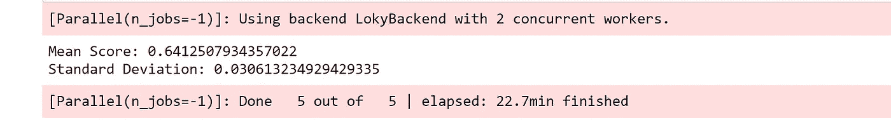

# 梅赛德斯-奔驰绿色制造

> 原文：<https://medium.com/analytics-vidhya/mercedes-benz-greener-manufacturing-eed66a52403?source=collection_archive---------6----------------------->

***能不能削减一辆奔驰花在测试台上的时间？***


**目录:**

1.  商业问题
2.  项目目标
3.  数据描述
4.  首次切割方法
5.  探索数据分析
6.  解决问题的现有方法
7.  特征工程第 1 部分
8.  特征工程第 2 部分
9.  特征工程第 3 部分
10.  模型选择和超参数调整
11.  模型比较
12.  Kaggle 提交
13.  未来的工作
14.  参考

# **1。商务问题:**

## **1.1 简介:**

自从 1886 年第一辆汽车——奔驰专利汽车问世以来，梅赛德斯-奔驰一直代表着重要的汽车创新。例如，这包括带有防撞缓冲区的乘客安全单元、安全气囊和智能辅助系统。梅赛德斯-奔驰每年申请近 2000 项专利，使该品牌成为欧洲高档汽车制造商的领导者。戴姆勒的梅赛德斯-奔驰汽车是高档汽车行业的领导者。凭借丰富的功能和选项，客户可以选择他们梦想中的定制梅赛德斯-奔驰。

为了确保每一个独特的汽车配置在上路前的安全性和可靠性，戴姆勒的工程师们开发了一个强大的测试系统。但是，如果没有强大的算法方法，为如此多可能的功能组合优化测试系统的速度是复杂和耗时的。作为世界上最大的高档汽车制造商之一，安全和效率是戴姆勒生产线的重中之重。

在这场比赛中，戴姆勒正在挑战卡格勒，以解决维度的诅咒，并减少汽车在测试台上花费的时间。竞争对手将使用代表梅赛德斯-奔驰汽车功能不同排列的数据集来预测通过测试所需的时间。获胜的算法将有助于加快测试速度，从而在不降低戴姆勒标准的情况下降低二氧化碳排放。

## **1.2 项目概述:**

在汽车工业中，有一个测试部门，生产制造出来的每辆车都在这个部门。安全可靠的测试是汽车制造过程中至关重要的一部分。

梅赛德斯-奔驰汽车工业每天都在生产大量的汽车，并送往测试部门，这是生产的最后阶段。每一种可能的车辆组合都必须经过测试台，以确保车辆足够坚固，能够保证乘客的安全并承受日常使用。更多的测试导致在测试台上花费更多的时间，增加了公司的成本，并产生二氧化碳，一种污染性的温室气体。

# **2。项目目标:**

该项目的主要目标是优化或减少测试台下每辆量产车的测试时间。通过这种优化，它肯定会减少与测试过程相关的二氧化碳排放。

我们将使用给定的数据集，并将创建稳健的机器学习算法，预测测试汽车的时间。

我们将下载数据集，并从下面的链接获得问题的概述。

[](https://www.kaggle.com/c/mercedes-benz-greener-manufacturing) [## 梅赛德斯-奔驰绿色制造

### 你能减少一辆奔驰花在测试台上的时间吗？

www.kaggle.com](https://www.kaggle.com/c/mercedes-benz-greener-manufacturing) 

# **3。数据描述:**

带字母的变量是分类变量。带有 0/1 的变量是二进制值。

*   train.csv 训练集
*   test.csv —测试集，您必须预测该文件中“ID”的“y”变量
*   地面实况标记为“y ”,代表汽车通过每个变量测试的时间(秒)。
*   **R2(决定系数):**用于评估的度量是决定系数(也称为 R 平方)。它是预测分数和实际分数(范围 0-1)之间相关性的平方。简单来说，模型用样本数据训练后预测一个真实值数据的接近程度。


- **平方公制**

# **4。第一次切割方法:**

由于‘y’是一个连续变量，所以它是一个回归问题。最初，我可以将决策树回归方法视为我的基准模型，因为它是我们拥有的最简单的回归算法。

# **5。探索性数据分析**:

***“给我六个小时去砍树，我会把前四个小时用来磨斧子。*——亚伯拉罕·林肯**

探索性数据分析是机器学习中一个核心而重要的概念。大多数数据科学家将 80%的时间花在探索性数据分析上，以了解数据、数据如何分布、数据行为和许多其他事情，我们对数据了解得越多，就越会使用一些方面，如我们选择了哪种类型的模型，哪种功能工程将会执行。

## **5.1 导入、可视化和理解数据:**


```
#Check the Shape of the test and train data
print('train data shape - ', train.shape)
print('test data shape  - ', test.shape)
```


```
#Check duplicates columns in the test and train data
print("Duplicate in trainData columns -",(train.columns.duplicated))
print("Duplicate in testData  columns -"(test.columns.duplicated))
```


我们在训练数据集中有 4209 个数据点和 378 个特征。测试数据集中的 4209 个点和 377 个特征。

训练数据包含 369 个二元特征、1 个类别标签和 8 个分类特征。测试数据包含 369 个二元特征和 8 个分类特征。

从上面的结论可以看出，训练数据和测试数据中没有空值，数据集中没有重复的列和行。

## **5.2Y 标签分析:**

让我们在 y 标签中执行不同的直方图变换和 CDF。检查 Y 标签是如何分布的，什么是第 50 和第 95 百分位。我们将应用不同的变换方法来降低偏度和峰度。

**汽车测试时间直方图:**


**对数变换汽车测试时间直方图:**


**BoxCox 变换汽车测试时间直方图:**


【YeoJohnson 变换汽车测试时间直方图:


我们可以从上面的图中看到，Y 标签是高度偏斜的，并且具有很高的峰度值。我们应用不同的变换来降低峰度，如对数变换、box cox 变换和 yeo-Johnson 变换。

我们从上面的图中观察到，与对数变换和 box cox 变换相比，yeo-Johnson 变换得到了最好的结果- **0.015639 偏斜度和 0.397150 峰度**

**汽车测试时间 CDF:**


我们可以看到 y 特征的 CDF 图。我们可以看到图中的红线表示第 95 百分位。

**95%的汽车测试时间低于 121 秒，只有 5%的汽车测试时间高于 121 秒。它可能是一个异常值。**

50%的汽车测试时间低于 100 秒。

## **5.3 二元特征分析:**

我们的第一步是检查二元特征中值的数量。我们总共有 369 个二进制特征，我们使用随机森林算法来选择对该任务最重要的前 15 个特征。

**二元特征的特征重要性:**


15 大重要特性

我们看到 **X314** 和 **X315** 是它们中最重要的特性。我们将使用这个顶级特征来创建合成特征。

**盘点剧情顶尖重要二进制特征:**


前 15 项功能的计数图

**二元特征计数图:**


我们看到 75%以上的二进制特征具有超过 50%的零值，我们得出结论，更多数量的特征具有零值，更少数量的特征具有一个值。

## **5.4 分类特征分析**:

分类特征在数据集中非常重要。训练和测试集包含总共 8 个分类特征，其在特征中包含 a、c、d、ab 类值。我们对分类特征进行了单变量和双变量分析。

**分类特征的计数图:**


分类特征的计数图

我们从上述分类特征的计数图中观察到，一些特征如 **X4、X2** 具有恒定值，这些特征不会提高模型性能。所以我们不会使用这些特性来创建新特性。

我们对分类特征、y 标签和分类特征之间的关系进行了双变量分析。除了**【X4】**特征外，大部分特征与 y 标记关系良好。有些点超过了**150 秒**，超出了我们 95%的范围，这可能是异常值。

**分类特征散点图:**


**分类特征的箱线图:**


我们观察到**‘X4’**与其他分类特征相比具有非常低的方差。因此，它对建模没有用处。

## **EDA 结论:**

y 标签是高度倾斜的，它会降低模型的性能。因此，我们转换我们的标签数据，并减少偏斜度和峰度。

我们将使用前 15 个二元特征进行特征工程，我们将进一步使用所有分类特征，除了**“X4”**。

# 6.现有方法:

[](/analytics-vidhya/mercedes-benz-greener-manufacturing-kaggle-competition-1c25c89e012) [## 梅赛德斯-奔驰绿色制造-卡格尔竞赛

### 优化测试平台下车辆各配置的测试时间

medium.com](/analytics-vidhya/mercedes-benz-greener-manufacturing-kaggle-competition-1c25c89e012) 

这是迪利普人解决问题的方法，

根据他的特点，工程和造型如下

技术 1:使用 PCA 降维。

技术 2:分析特性并添加新的交互特性。

技巧 3:使用 SelectKBest 选择技巧 2 中的顶级特性。

对于分类特征，

1.  标签编码
2.  频率编码
3.  平均编码

他使用基于树的算法，如随机森林，XG-Boost 额外树算法和堆叠回归。

# **7。特征工程第 1 部分:**

在特征工程第 1 部分中，我们将在分类特征中使用标签编码。


使用 PCA 方法，我们将创建新的合成 5 特征。


对于其余的功能，我们将使用一些功能工程的方法，如差异率，二次编码和 cos 编码。

## **7.1 差值比率编码:**

```
def difference_ratio(data, col1, col2, col3, col4):

    ''' Using data's different columns, combine and divide it
        data -- datasets
        col1, col2, col3, col4 = dataset's different columns
        '''
    array = (data[col1] + data[col2]) / (data[col3] + data[col4] + 1 ) 
    return array# function apply on the train data's different columns
train_1['X315_314_51_299']  = difference_ratio(train_1, 'X315', 'X314', 'X51', 'X299')train_1['X299_300_301_271'] = difference_ratio(train_1, 'X299', 'X300', 'X301', 'X271')train_1['X50_88_51_31']     = difference_ratio(train_1, 'X50', 'X88', 'X51', 'X31')train_1['X46_263_119_261']  = difference_ratio(train_1, 'X46', 'X263', 'X118', 'X261')train_1['X136_118_136_60']  = difference_ratio(train_1, 'X136', 'X118', 'X136', 'X60')# function apply on the test data's different columns
test_1['X315_314_51_299']  = difference_ratio(test_1, 'X315', 'X314', 'X51', 'X299')test_1['X299_300_301_271'] = difference_ratio(test_1, 'X299', 'X300', 'X301', 'X271')test_1['X50_88_51_31']     = difference_ratio(test_1, 'X50', 'X88', 'X51', 'X31')test_1['X46_263_119_261']  = difference_ratio(test_1, 'X46', 'X263', 'X118', 'X261')test_1['X136_118_136_60']  = difference_ratio(test_1, 'X136', 'X118', 'X136', 'X60')train_1['X136_118_136_60'].head()
```


## **7.2 二次编码:**

```
def quadratic_encode(data, col1, col2):        ''' Using quadaric formula and apply on the dataset different columns and some weights(values) '''

    array = data[col1]**2 + 5 * data[col1] + 8
    return array# apply function and create new train data features
train_1['qua_encode_1'] = quadratic_encode(train_1, 'pca_feature1', 'X50_88_51_31')train_1['qua_encode_2'] = quadratic_encode(train_1, 'pca_feature3', 'X270')train_1['qua_encode_3'] = quadratic_encode(train_1, 'pca_feature0', 'X300')train_1['qua_encode_4'] = quadratic_encode(train_1, 'X50_88_51_31', 'X315_314_51_299')# apply function and create new test data features
test_1['qua_encode_1'] = quadratic_encode(test_1, 'pca_feature1', 'X50_88_51_31')test_1['qua_encode_2'] = quadratic_encode(test_1, 'pca_feature3', 'X270')test_1['qua_encode_3'] = quadratic_encode(test_1, 'pca_feature0', 'X300')test_1['qua_encode_4'] = quadratic_encode(test_1, 'X50_88_51_31', 'X315_314_51_299')train_1[['qua_encode_3']].head()
```


## **7.3 Cos 编码:**

```
def cos_encode(data, col1, col2, col3, col4):

    aa = ((data[col1] + 0.8) + np.cos(data[col2] + 0.5)) 
    bb = ((data[col3] + 3.5) + np.cos(data[col4] + 5.0))
    array = (aa / bb)
    return array# apply function and create new train data features
train_1['cos_encode_1'] = cos_encode(train_1, 'X315_314_51_299', 'X50_88_51_31', 'qua_encode_3', 'qua_encode_2')train_1['cos_encode_2'] = cos_encode(train_1, 'X136_118_136_60','X315', 'qua_encode_1', 'qua_encode_4')train_1['cos_encode_3'] = cos_encode(train_1, 'X300', 'X299_300_301_271', 'qua_encode_3', 'qua_encode_2')train_1['cos_encode_4'] = cos_encode(train_1, 'X50_88_51_31', 'X315_314_51_299', 'X118', 'X46_263_119_261')# apply function and create new test data features
test_1['cos_encode_1'] = cos_encode(test_1, 'X315_314_51_299', 'X50_88_51_31', 'qua_encode_3', 'qua_encode_2')test_1['cos_encode_2'] = cos_encode(test_1, 'X136_118_136_60','X315', 'qua_encode_1', 'qua_encode_4')test_1['cos_encode_3'] = cos_encode(test_1, 'X300', 'X299_300_301_271', 'qua_encode_3', 'qua_encode_2')test_1['cos_encode_4'] = cos_encode(test_1, 'X50_88_51_31', 'X315_314_51_299', 'X118', 'X46_263_119_261')train_1['cos_encode_4'].head()
```


## **7.4 不同算法的特征重要性:**


我们对特征重要性使用不同的算法，我们观察到我们创建的合成特征在轻型 GBM 和随机森林中表现良好，PCA 特征和合成特征在 Ada-Boost 模型中表现良好，二值特征和 PCA 特征在 GBT 和 XG-Boost 中表现良好。

我们创建了一个包含 PCA 特征+标签编码特征+合成特征的数据集。

# 8。特征工程第二部分:

我们将进行特征工程的这一部分，我们去除低于 0.01 方差值的二进制特征。

我们将删除具有常量值的分类特征，如**‘X4’**特征。

我们去除了二进制特征，这些特征具有低于 0.01 的方差。我们移除了**“X4”**分类特征。并使用标签编码方法将分类特征转换成标签。

应用差分比、cos 编码器、二次编码方法，创建综合特征。使用 PCA 方法，我们创建了前 100 个特征。

# 9。特征工程第三部分:

在特征工程的这一部分中，我们使用特征工程第 2 部分数据集，并使用 SelectKBest 方法存储 250 个特征。

特征化后，我们有 4 个特色数据集，我们可以在上面尝试我们的模型。这些措施如下:

1.  标签特征+ PCA (5)特征+合成特征
2.  标签特征+ PCA (5)特征+合成特征+ Y 剪辑 150 秒
3.  标注要素+ PCA (100)要素+合成要素+无低方差二元要素+ Y 剪辑 150 秒
4.  由 SelectKBest 选择的前 250 个功能

# 10。型号选择和超参数调整:

我们将使用基于树的模型，因为它对异常值是鲁棒的，并且在高维数据中表现很好。我们将使用下面的算法来完成这项任务。

1.  决策树(基线模型)
2.  随机森林
3.  XG 升压
4.  Ada 增强
5.  轻型 GBM
6.  马恩岛
7.  堆积回归器

我们使用决策树作为这项任务的基线模型，因为它是最简单的回归模型。因为我们有 300 多个特性，所以决策树回归将给我们一个不错的基线分数，以供进一步参考和改进。

## **10.1 决策树:**

```
clf = DecisionTreeRegressor(criterion='mse',
                            max_depth=3,
                            max_features='auto',
                            min_samples_leaf=1, 
                            min_samples_split=2,
                            presort='deprecated',
                            splitter='best')

params = {'max_depth' : [2,3,4,8,10,15],
          'max_features' : ['auto', 'sqrt', 'log2'],
          'random_state' : [5,10,20,30]}kfold_grid_search(clf, params, x2, y2, 10, kfold = 15, 
search= 'random')
```


## **10.2 随机森林:**

```
clf =  RandomForestRegressor(bootstrap=True,
                             criterion='mse',
                             max_depth=5, 
                             max_features=0.95,
                             min_impurity_decrease=0.001,
                             min_samples_leaf=2,
                             min_samples_split=8, 
                             min_weight_fraction_leaf=0.0,
                             n_estimators=70,)params = {'n_estimators':[40,50,60,70,100],
             'max_depth':[3,5,6,7,8],
             'min_samples_split':[2,3,4,5,6,7,8,9,10],
             'max_features': [0.80,.95, 1.0],
             'min_samples_leaf': [1, 2,3,4,5,6,7,8,9],
             'min_impurity_decrease':[1e-5,1e-4,1e-3,1e-2,1e-1,0,1,10]}kfold_grid_search(clf, params, x2, y2, fold = 10, kfold=15, 
                  search= 'random' )
```


## 10.3 XG-Boost:

```
clf = XGBRFRegressor(colsample_bylevel=1,
                     colsample_bynode=0.8, 
                     colsample_bytree=1,
                     learning_rate=1,
                     max_depth=5,
                     max_features=0.95, 
                     min_child_weight=1, 
                     min_impurity_decrease=1,
                     min_samples_leaf=1, 
                     min_samples_split=5,
                     n_estimators=100, 
                     n_jobs=1, 
                     objective='reg:linear',
                     reg_lambda=1, 
                     scale_pos_weight=1,
                     silent=True, 
                     subsample=0.8, 
                     verbosity=1)xparams = {'learning_rate':[0.1,0.5,0.8,1],
             'n_estimators':[70,80,100],
             'max_depth':[2,3,4],
             'colsample_bytree':[0.1,0.5,0.7,0.9,1],
             'subsample':[0.2,0.3,0.5,1],
             'gamma':[0.0001,0.001,0,0.1,0.01,0.5,1],
             'reg_alpha':[0.00001,0.0001,0.001,0.01,0.1]}kfold_grid_search(clf, params, x2, y2, fold = 10, kfold=15, 
search= False )
```


## **10.4 Ada-Boost :**

```
clf = AdaBoostRegressor(learning_rate=0.0001,
                        n_estimators=300, 
                        loss= 'linear')params = {'n_estimators'  : [100, 150, 200, ],
          'learning_rate' :[0.0001,0.001,0.01, 0.1],
          'loss' : [ 'linear', 'square', 'exponential'],
          'random_state' : [10,20,30]}kfold_grid_search(clf, params, x2, y2, fold = 10, kfold = 15, 
search = 'random')
```


## 10.5 梯度增强:

```
clf = GradientBoostingRegressor(alpha=0.9,
                                criterion='friedman_mse',
                                learning_rate=0.01, loss='huber',
                                max_depth=3,
                                min_samples_leaf=1, 
                                min_samples_split=2,
                                n_estimators=800,
                                n_iter_no_change=11,  
                                presort='deprecated',
                                random_state=10, 
                                subsample=1.0, 
                                tol=0.0001,
                                validation_fraction=0.1, 
                                verbose=0, 
                                warm_start=False)params = {'n_estimators' : [500,800,1000, 1500, 2000],
          'loss' : [ 'huber', 'exponential'],
          'learning_rate' : [0.01, 0.01, 0.1],
          'max_depth' : [3,4,5,7]}kfold_grid_search(clf, params, x2, y2, fold = 10, kfold = 15, 
search = 'random')
```


## **10.6 轻型 GBM :**

```
clf =  LGBMRegressor(boosting_type='gbdt', 
                     colsample_bytree=1.0,
                     importance_type='split', 
                     learning_rate=0.01, 
                     max_depth=5,
                     min_child_samples=50, 
                     min_child_weight=0.001, 
                     min_split_gain=0.0,
                     n_estimators=1000, 
                     n_jobs=-1, 
                     num_leaves=5,
                     reg_alpha=0.0, 
                     reg_lambda=0.0,
                     subsample=1.0, 
                     subsample_for_bin=200000)params = {'min_child_samples' : [10, 20,50],
          'num_leaves' : [5,6],
          'max_depth' : [2, 3, 5],
          'n_estimators' : [1000,2000,4000,5000],
          'learning_rate' : [0.0001,0.001,0.01,0.1]
          }kfold_grid_search(clf, params, x2, y2.ravel(), fold = 10, 
kfold = 15, search = 'random')
```


## **10.7 叠加回归量:**

我们使用 XG-Boost、Light GBM 和 Random Forest 作为堆叠回归器，并作为基本的学习者岭回归器。

```
stack = StackingRegressor(estimators= estimators,
                          final_estimator= Ridge())cv_score = cross_val_score(stack, x2, y2.ravel(), 
                           scoring='r2', cv= 5, 
                           verbose=5, n_jobs=-1)print('Mean Score:',cv_score.mean())
print('Standard Deviation:',cv_score.std())
```



# 11.型号对比:

在这个数据集中，我们有 5 个 PCA 特征，所有二进制特征，标签编码特征和合成特征。


该数据集包含 5 个 PCA 特征、所有二元特征、标签编码特征和合成特征，并且在 150 秒时在 y 目标剪辑中获得 150 秒以上的值。


该数据集包含 100 个 PCA 特征，移除方差低于 0.01 的二元特征，标注编码特征和合成特征，以及在 150 秒时在 y 目标剪辑中获得高于 150 秒的值。


该数据集是使用要素选择方法创建的，使用 SelectKBest 方法选择 250 个要素。


我们从堆叠回归因子 **0.54951** 得到的最好分数超过了我们的随机森林回归因子结果。


# 12.Kaggle 提交:

在比赛中，私人排行榜是用大约 81%的测试数据和 19%的训练数据计算出来的。

我的提交分数:


# 13.未来作品:

1.  通过定义适当的层和超参数来实现神经网络，将能够在 score 中获得好的结果。
2.  实现了超级学习器机器学习技术，并取得了较好的效果。

# **14。参考:**

1.  [https://ieeexplore.ieee.org/document/7506650](https://ieeexplore.ieee.org/document/7506650)
2.  [https://www.appliedaicourse.com/](https://www.appliedaicourse.com/)
3.  [https://www . ka ggle . com/c/Mercedes-benz-greener-manufacturing/discussion](https://www.kaggle.com/c/mercedes-benz-greener-manufacturing/discussion)
4.  [https://www . ka ggle . com/c/Mercedes-benz-greener-manufacturing/discussion/36390](https://www.kaggle.com/c/mercedes-benz-greener-manufacturing/discussion/36390)
5.  [https://medium . com/analytics-vid hya/Mercedes-benz-greener-manufacturing-ka ggle-competition-1c 25 c 89 e 012](/analytics-vidhya/mercedes-benz-greener-manufacturing-kaggle-competition-1c25c89e012)

**LinkedIn 个人资料:**

[](https://www.linkedin.com/in/tank-mitesh-329677180/) [## Tank Mitesh -高级质量保证工程师-印度 Bhavani Industries | LinkedIn

### 查看 Tank Mitesh 在全球最大的职业社区 LinkedIn 上的个人资料。坦克有一个工作列在他们的…

www.linkedin.com](https://www.linkedin.com/in/tank-mitesh-329677180/) 

**GitHub :**

[](https://github.com/tankmitesh/Mercedes-Benz-Greener-Manufacturing-case-study) [## tankmitesh/梅赛德斯-奔驰-绿色制造-案例研究

### 梅赛德斯-奔驰绿色制造梅赛德斯-奔驰汽车以世界顶级汽车排行榜的名义出现，梅赛德斯-奔驰的…

github.com](https://github.com/tankmitesh/Mercedes-Benz-Greener-Manufacturing-case-study)