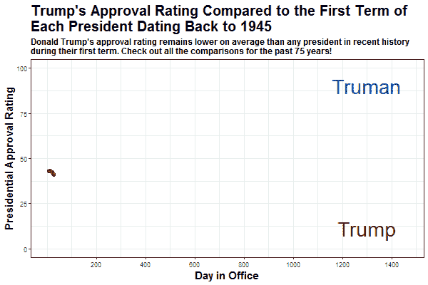
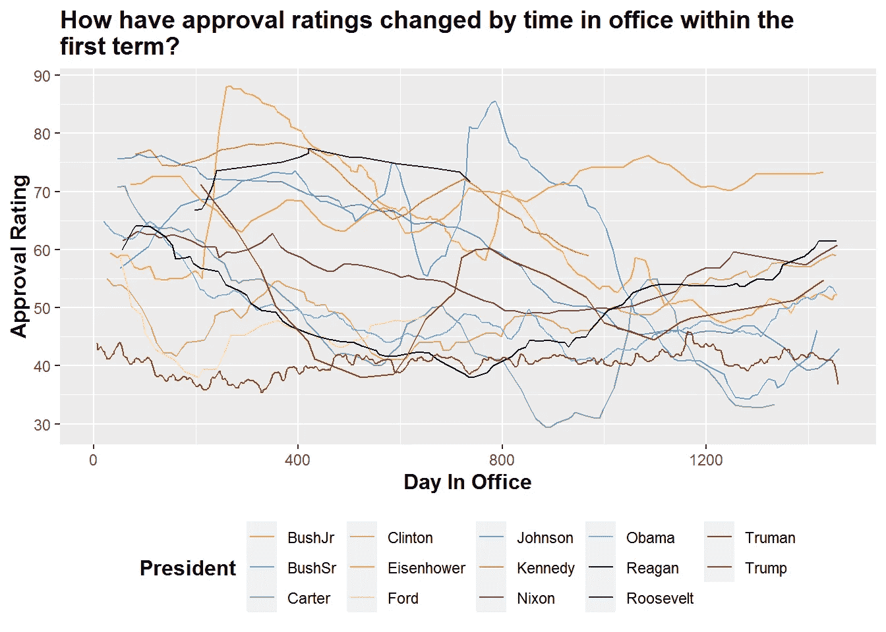

# 用 R 中的动画图形和 gif 迷惑你的读者

> 原文：<https://medium.com/analytics-vidhya/mesmerize-your-readers-with-animated-graphs-gifs-in-r-d29229f1a104?source=collection_archive---------13----------------------->

## 从讲故事总统支持率到与 R！

在我的上一篇文章中，我展示了如何创建**图表和文本**来讲述一个关于美国公众对过去 14 任总统有多满意的故事！那么，我们让这些信息看起来更有趣怎么样？

幸运的是，R 可以做到这一点。有了`gganimate`和`magick`
包，GIF 构建变得简单而有效。让我们先看看最后的结果，这样我就可以让你自己做这个了。



图 1-对比唐纳德·特朗普上任四年来每位总统的支持率的动画图表

这张 GIF 显示了特朗普的支持率与过去 75 年来每一位总统的支持率在个人一对一比较中的对比。通过使用 x 轴上的**任职日**数字，我们可以显示从**第 1 天**到**第 1461 天**(前四年，或第一个总统任期)每位总统的支持率与特朗普有何不同。虽然我在这篇帖子/教程中比较了特朗普，但你可以用其他任何一位前任总统来替换这些数据。

值得注意的是，我在本教程中制作了另一个图形，但这都是为了让你理解决定什么时候动画化，什么时候不动画化的过程。

# 步骤 1:包和数据加载

像往常一样，**加载包和数据**。我们将在本教程中使用的主要软件包是`tidyverse`(一如既往)、`gganimate`和 magick。`gganimate`软件包非常适合制作经典的`ggplot`图表。与此同时，magick 是我一直以来最喜欢的用来改进你的图表、情节和图片的软件包之一。在本教程中，它允许我们改变图片的大小，编辑特征，并把它们组合成一个长的 GIF。

就数据而言，我特别借鉴了我在上一节课中使用的数据集，但包括了总统在任的天数和滚动批准(从 5 个连续的数据点计算)。数据已经清理完毕，可以在[我的 Github 仓库](https://github.com/danderson222/animating-approval-rating-graphs/tree/main/data)中获得，所以我建议在那里下载 csv 文件！

```
**if(!require(“tidyverse”)) install.packages(“tidyverse”)** # Our rock in data analysis (includes ggplot2)
**if(!require(“ggsci”)) install.packages(“ggsci”)** # Provides awesome color palettes
**if(!require(“gganimate”)) install.packages(“gganimate”)** # Makes animating ggplot graphs easy!!!!
**if(!require(“magick”)) install.packages(“magick”)** # One of my favourite packages ever. All about editing pictures, plots and making GIFs like magic# Load the data
df <- readRDS(“data/CombinedPresidentialApproval.rds”)
# The csv file is also there if you want
# df <- read.csv(“data/CombinedPresidentialApproval.csv”)
```

# 步骤 2:清理数据

现在是任何分析的最重要的部分，**清理数据**。当我们查看数据集时，我们注意到唐纳德·特朗普的大量数据点。因为我们将会比较每一位前任总统执政的前 4 年，我们可能想要减少不必要的噪音，因此使我们的数据帧更快的图形化和动画化。

因此，为了清理数据，我们每隔一天删除一半的特朗普支持率数据点。然后，我们选择适当的列进行分析，过滤掉前四年后的所有数据点，并去掉任何没有信息的行。

```
# We will cut every other day from Trump's approval ratings (which is fair given the lack of variation in the approval rating)
**df.trump <- which(df$president == "Trump")** # Figure out what rows contain Trump's data
# Pick every other number and add back the number of rows before the Trump data (1716)
toDelete <- seq(1, nrow(df[c(df.trump[1]:df.trump[1459]),]), 2) + 1716 
df <- df[-toDelete, ] # Delete the rows identified
rm(df.trump, toDelete)# Cut df.days by only days in office, president and rolling approval & limit it to first 4  (less than 1461 days)
**df <- df %>% 
  mutate(days_in_office=as.numeric(days_in_office)) %>%** # Turn the days in office to numeric
  **select(president, term.start, days_in_office, rolling_approval) %>%** # Select the columns you need for the animated charts
 **filter(days_in_office<1461) %>%** # Filger the days in office to bet the first 4 years (1461 days!)
  na.omit(df)
```

# 第三步:我们应该如何形象化？

可视化的第一步是找出做这件事的最佳方法。这很难和**需要练习、思考和大量的尝试**。

因此，如果我们想出如何将每位总统在任的前四年形象化，首先要做的是尝试一个折线图。在这里，我将在一张图表上标出所有 14 位总统。

```
# Let's try to plot the data to see how it shows up. For this I am just doing a simple ggplot
**static.plot <- df %>% 
  ggplot(aes(x = days_in_office, y = rolling_approval, color = as.factor(president),
             text = paste(
               "President: ", president, " - ", round(rolling_approval, digits = 1), "%",
               sep = "")
  )) +
  ggsci::scale_color_simpsons() +** # Love this color palette because it has a ton of colors
  **geom_line(aes(group = president)) +
  scale_x_continuous(breaks = c(0, 400, 800, 1200, 1600)) +
  labs(x = "Day In Office", 
       y = "Approval Rating",
       title = "How have approval ratings changed by time in office within the first term?",
       color = "President") +
  theme(plot.title = element_text(face="bold", size =14), 
        axis.title.x = element_text(face="bold", size = 12),
        axis.title.y = element_text(face="bold", size = 12),
        legend.title = element_text(face="bold", size = 12),
        legend.position = "bottom")**
static.plot
```



图 2——比较 14 位不同总统的混乱图表。不理想…

我的反应？**哎哟！**这张图表太杂乱，难以阅读，让我重新思考如何讲述每位总统前四年的故事……

# 步骤 4:将这些数据制成动画

正如前面的图所示，14 位总统太多了，无法在一张图中展示，因为当图中杂乱无章时，很难进行比较。因此，因为我想专注于将过去的总统批准与特朗普进行比较，所以我专注于用两条线(问题中的总统和唐纳德·特朗普)创建情节。我还会将它制作成动画，这样你就可以看到随着时间的推移，我与特朗普相比的任何一位总统之间的进展差异。为此，我创建了一个函数，这是用 R 编写代码的关键部分！

该函数做多件事:

*   首先，它**创建了一个所有总统名字的向量**，除了特朗普。这使我们能够创建一个循环，遍历每位总统的所有名字
*   然后，创建一个循环，**为唐纳德·川普和有问题的总统**过滤数据，**绘制数据**。特朗普的支持率显示为深红色，其他总统的支持率显示为深蓝色
*   然后我们使用`transition_reveal`函数**来制作这些创建的图的动画**
*   然后使用`animate`功能**改变每个情节的大小和动画设置**
*   然后**创建一个新文件夹，并将每个动画情节保存在那里**
*   循环`for`会这样做，并在初始向量中为每位总统创建一个动画情节

**Tada 你有 12 个过去 75 年里每个总统任期前四年的动画情节！另外值得注意的是，这个功能运行起来需要几分钟，**所以请耐心等待。****

```
# Note that this function takes about two minutes to run on my machine. You can play with the frame rates, number of frames and the sizes as well to make it faster/ slower 
**president_linecharts <- function(x) {
**  
  # Vector of president names except Trump
  **compare_presidents <- unique(x[order(x$term.start),]$president)[-c(1,14)]**

  # A loop to produce ggplot2 graphs
 **for (i in seq_along(compare_presidents)) {**    
    # make plots; note data = args in each geom
    **plot <- x %>% 
      filter(president=='Trump' | president==compare_presidents[i]) %>% 
      ggplot(aes(x=days_in_office, y=rolling_approval, group=president, colour=president)) +
      geom_point(aes(group = seq_along(days_in_office)),
                 size = 1, alpha = 1, show.legend = FALSE) +
      geom_line(size = 2, show.legend = FALSE) +
      scale_color_manual(values = c("darkblue", "darkred")) +
      scale_x_continuous(breaks=c(200, 400, 600, 800, 1000, 1200, 1400)) +
      ylim(0,100) +
      labs(x = "Day in Office", 
           y = "Presidential Approval Rating",
           title = paste0("Trump's Approval Rating Compared to the First Term of \nEach President Dating Back to 1945"),
           subtitle = "Donald Trump's approval rating remains lower on average than any president in recent history \nduring their first term. Check out all the comparisons for the past 75 years!") +
      annotate(geom="text", x=c(1300, 1300), y=c(10,90), 
               label=c("Trump", compare_presidents[i]),
               color=c("darkred", "darkblue"),
               size = 10, fontface = 'bold', parse = TRUE) +
      theme_bw() +
      theme(plot.title = element_text(face="bold", size = 20), 
            plot.subtitle = element_text(face="bold", size = 12),
            axis.title.x = element_text(face="bold", size = 15),
            axis.title.y = element_text(face="bold", size = 15),
            legend.position = "none")**

    # Animate the plot
 **animated.plot <- plot + 
      transition_reveal(along = days_in_office)**

    # Adjust the animation settings 
 **animate(animated.plot, 
            width = 600,** # 900px wide **height = 400,** # 600px high **nframes = 30,** # 30 frames **fps = 10)** # 10 frames per second    
    # create folder to save the plots to
 **if (dir.exists("animations")) { } 
    else {dir.create("animations")}**

    # save plots to the 'output' folder
 **anim_save(filename = paste0("animations/",
                                compare_presidents[i],
                                "_comparison.gif"))**

    # print each plot to screen
    **print(plot)
  }
}
president_linecharts(df)**
```

# **第五步:合并图片**

**这最后一部分花了我几个小时才想出来！**如何将多张 gif 合成一张？****

**嗯，在创建了我所有新的动画情节文件的列表后，我使用`image_read`函数按照总统任职的时间顺序(从杜鲁门到奥巴马)读入了每个动画情节 GIF。读入之后，我们**使用** `**image_join**` **函数组合 gif 并保存整体输出。****

**这是关键部分，也是我经过几个小时的研究后了解到的。因为读入 R 的 GIF 相当于一个数据帧，你可以像平常一样连接它，它会连续运行。值得注意的是，标题将保持与第一个情节相同，所以这就是为什么它们没有改变，为什么我在图表中而不是在图例中包括总统的名字。**

```
# Create a list of all the animation files in the "animations" folder
**gif_list <- list.files(path="animations", pattern = '*.gif', full.names = TRUE)
gif_list**# Read in each gif from the folder by order of year (Truman to Obama)
# I did this manually, although I'm sure there is a way to automate it...
**gif1 <- image_read(gif_list[12])
gif2 <- image_read(gif_list[5])
gif3 <- image_read(gif_list[8])
gif4 <- image_read(gif_list[7])
gif5 <- image_read(gif_list[9])
gif6 <- image_read(gif_list[6])
gif7 <- image_read(gif_list[3])
gif8 <- image_read(gif_list[11])
gif9 <- image_read(gif_list[2])
gif10 <- image_read(gif_list[4])
gif11 <- image_read(gif_list[1])
gif12 <- image_read(gif_list[10])**# Combine all the animated plot GIFs into one, in order of service date
**presidential_approval <- image_join(gif1, gif2, gif3, gif4, gif5, gif6, gif7, gif8, gif9, gif10, gif11, gif12)**
# Call your new GIF
**presidential_approval** # Save your new GIF!
**image_write(presidential_approval, path = "presidential_approval.gif")**
```

****

**图 3——再一次，你有了完整的动画和组合的 GIF，准备好展示了！**

**现在你知道了！**这就是如何创建多个动画数据图，并将它们组合成一个更长的 GIF 图**。随意修改数据和动画设置，享受 GIF 的乐趣。**

**在我接下来的两篇文章中，我将会:1)通过在 GameStop 丑闻期间抓取 Twitter，对罗宾汉做一个情绪分析；以及 2)评估/可视化 Joe Biden 上任第一个月的行政审批。如果你感兴趣，给我一个关注，我会在接下来的几个帖子里再见到你！**

****参考文献:**
【1】FiveThirtyEight、 [Donald Trump 支持率](https://projects.fivethirtyeight.com/trump-approval-ratings/adults/)、【2021】
【2】美国总统项目[总统工作批准](https://www.presidency.ucsb.edu/statistics/data/presidential-job-approval)、【2021】**

**我是 Monitor Deloitte 的模拟战略顾问，我使用统计和分析为数字孪生模型提供信息，这些模型重新发明了公司进行战略决策的方式。在我的空闲时间，我痴迷于政治和政策，一直在 [*数字政策*](http://www.policyinnumbers.com) *写博客。你可以在那里或者在我的*[*LinkedIn*](https://www.linkedin.com/in/dylansjanderson/)*和*[*Twitter*](https://twitter.com/dylansjanderson)*账号找到我(随意连接或者给我一个关注)。***