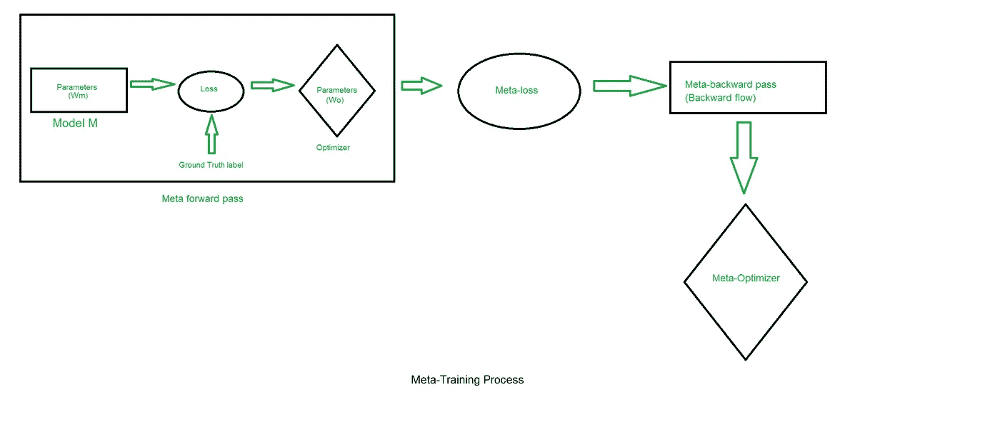
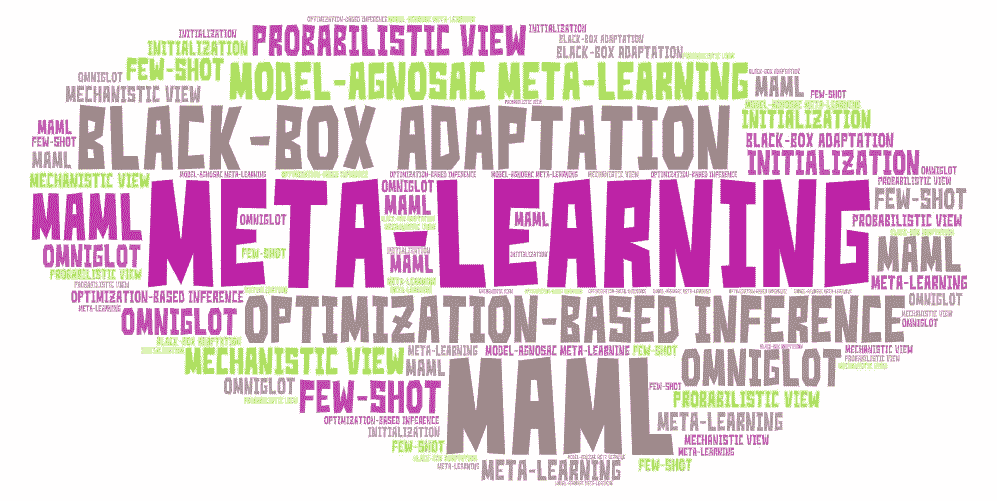
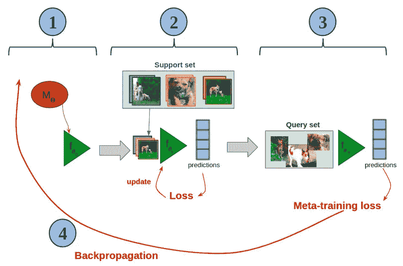
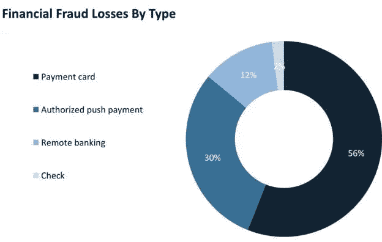

# 欺诈检测的元学习结构

> 原文：<https://medium.com/analytics-vidhya/meta-learning-structure-for-fraud-detection-i-c362e78cb018?source=collection_archive---------3----------------------->

在传统的机器学习领域，我们通常采用特定于特定任务的庞大数据集，并希望使用该数据集训练用于回归/分类目的的模型。这与人类如何利用过去的经验，仅从一堆例子中快速学习一项新任务相去甚远。

这是一个非常复杂的过程。它与人类获取新信息和学习新技能的方式形成对比。人类不需要大量的例子就能知道，我们可以从少量的例子中快速有效地学习。从人类如何学习中获得灵感，元学习试图自动化传统的机器学习挑战。它试图应用机器学习来学习最适合给定任务的参数和算法。

它会分配相关的任务，并利用这些经验来提高未来的学习成绩。这种“从学习到学习”可以带来各种好处，如数据和计算效率，并且它与人类和动物的学习更好地结合，其中学习策略在一生和进化时间尺度上都有所改善。

学习模型的性能取决于它的训练数据集——算法和算法的参数。需要许多实验来找到最佳执行算法和算法的参数。元学习方法有助于发现这些问题并优化实验的数量。简而言之，这导致了更好的预测。

# **什么是 Meta？**

Meta 指的是上面的一个级别。

元通常意味着将抽象层次提高一个层次，通常指的是关于其他东西的信息。

例如，您可能熟悉“*元数据*，它是关于数据的数据。

您将数据存储在文件中，元数据的一个常见示例是关于存储在文件中的数据的数据，例如:

*   文件的名称。
*   文件的大小。
*   文件的创建日期。
*   上次修改文件的日期。
*   文件的类型。
*   文件的路径。

现在我们已经熟悉了“*元*的概念，让我们考虑一下这个术语在机器学习中的使用，比如“*元学习*”

# **什么是元学习？**

在形式上，它可以被定义为使用算法或模型的元数据来理解自动学习如何在解决学习问题时变得灵活，从而提高现有学习算法的性能或学习(归纳)学习算法本身。

元学习是人工智能的一个高级领域，其中应用自动学习算法来为一组学习算法获取学习经验，以提高学习性能。一种流行的元学习方法是基于交叉验证的，特别是对于不同机器学习模型之间的选择过程。但挑战在于，在大数据集，尤其是高噪音的金融大数据中，做模型间的交叉验证是非常耗时的。

元学习影响学习算法的假设空间(机器学习模型可能返回的所有假设的集合)。这可能是通过调整超参数或选择特征来实现的。它还可以通过改变算法搜索假设空间的方式来改变算法的学习规则。

元学习提供了一种替代范式，其中机器学习模型通过多次学习获得经验。非常简单的定义，元学习就是学会学习。这是一个学习过程，适用于理解元数据的算法。元数据是描述其他数据的数据。

它利用元数据，如算法属性(性能测量和准确性)，或先前从数据中导出的模式，来学习、选择、改变或组合不同的学习算法，以有效地解决给定的学习问题。

每个学习算法都基于一组关于数据的假设，称为其**归纳偏差**。

学会学习的过程或元训练过程可以粗略地概括为下图。

# **元学习的三个主要步骤。**

*   **动态归纳偏差:**归纳偏差是学习算法用来进行预测的一组假设。这是当算法得到它从未遇到过的输入时。动态偏差归纳是指偏差被构建为学习任务的函数。这仅仅意味着学习者的归纳偏差被改变以匹配给定的任务。学习者的基本方面可以被改变以实现动态归纳偏差。这些方面包括假设或参数的表示。
*   **从模型的元数据中提取有用的知识和经验:**元数据包括关于先前学习事件的知识，并用于有效地开发新任务的有效假设。这也是**感应转移的一种形式。人工智能可以掌握一些非常复杂的任务，但它们需要大量的数据，并且在多任务处理方面非常糟糕。因此，对于人工智能代理来说，“学会如何学习”以收集更多的知识并变得更加灵巧是很重要的。**
*   **包含学习子模型。**

# **元学习算法的方法**

## 优化元学习

[超参数](https://en.wikipedia.org/wiki/Hyperparameter_(machine_learning))是一个参数，其值用于控制学习过程。它是在学习过程开始之前定义的参数。超参数对训练过程的质量有直接影响。超参数可以调整。超参数的一个例子是决策树中的分支数量。

许多机器学习模型都有许多可优化的超参数。我们提到过超参数对训练过程有很大的影响。这意味着选择超参数的过程会极大地影响算法的学习效果。

然而，随着模型越来越复杂，尤其是神经网络，出现了挑战。模型的复杂性使得它们越来越难以配置。考虑一个神经网络。人类工程师可以优化一些配置参数。这是通过实验完成的。然而，深度神经网络有数百个超参数。这样的系统已经变得太复杂，人类无法完全优化。

存在许多优化超参数的方法。我们将给出两种方法的简单定义，并在以后的文章中详细介绍它们。

**网格搜索:**该方法利用手动预定的超参数。在预定参数组中搜索性能最好的参数。网格搜索包括尝试超参数值的所有可能组合。该模型然后决定最适合的超参数值。然而，这种方法被称为传统方法，因为它非常耗时且效率低下。

**随机搜索**:网格搜索是一种穷举方法。它包括所有可能的价值组合。随机搜索方法用随机搜索代替了这种穷举过程。该模型进行随机组合，并尝试拟合数据集以测试准确性。由于搜索是随机的，因此模型有可能错过一些潜在的最佳组合。从好的方面来说，与网格搜索相比，它使用的时间要少得多，并且经常给出理想的解决方案。随机搜索可以胜过网格搜索。这是在需要几个超参数来优化算法的条件下。

我们将在另一篇文章中讨论这两种以及其他优化方法。但是现在，要了解更多关于网格搜索和随机搜索的知识，请查看这个[超参数调优概念指南](https://nanonets.com/blog/hyperparameter-optimization/)。

## 少量元学习

深度学习算法非常擅长通过使用相当大的数据集来执行一项任务。即便如此，还是希望能够训练神经网络，以便在每个任务中使用少量数据示例来学习多个任务。少数元学习算法帮助我们实现这一愿望。

少量元学习的目的是训练一个能快速适应新任务的模型。这将通过在训练中使用少量数据点和迭代来实现。元学习阶段用于在给定数量的任务上训练模型。我们的期望是，经过训练的模型将通过少量试验或训练示例快速适应新任务。在元学习中，整个任务被当作训练样本。

少数元学习的一个例子是使用[记忆增强神经网络](http://proceedings.mlr.press/v48/santoro16.pdf)。

梯度下降通过反复向最陡下降的方向移动来最小化给定的函数。它用于更新模型的参数。传统的梯度下降网络需要大量的数据来学习。培训过程是广泛和反复的。当暴露于新数据时，模型必须再次学习它们的参数以快速添加新信息。这是一个非常低效的过程。

与传统模型相比，记忆能力增强的神经网络可以快速编码和获取新信息。记忆增强的神经网络可以理解新数据。他们可以利用这些数据做出高度准确的预测。这只是使用了几个培训示例。增强记忆架构的一个例子是[神经调谐机](https://towardsdatascience.com/hands-on-memory-augmented-neural-networks-implementation-part-one-a6a4a88beba3#:~:text=Memory-augmented%20Neural%20Network%20%28MANN%29%2C%20which%20is%20extensively%20used,new%20addressing%20schema%20called%20least%20recently%20used%20access.)。神经调谐机指的是一种算法，具有从存储器中存储和获取信息的能力。NTM 用外部记忆增强了神经网络。上面的链接提供了 NTM 建筑的详细描述。

## 模型不可知元学习

模型不可知元学习(MAML)指的是一个适用于任何使用梯度下降训练的模型的框架。我们可以说这类似于或不同于一次性元学习。像少数元学习一样，目标是学习一个通用模型，可以简单地对几个不同的任务进行微调。这包括训练数据不足的情况。让我们想象一下 MAML 框架。

*MAML 进场*

从图像来看，符号θ代表模型的参数。粗黑线代表元学习阶段。如果我们的任务 1、2 和 3 互不相同，那么对这三个任务采用梯度步长。灰色线条代表这一点。

MAML 给出了一个很好的模型参数的初始化。因此，在一个新的任务上，用少量的梯度步骤获得快速和最佳的学习。关于模型不可知元学习的更多内容可以在本文中找到。本文还对上面的图像进行了深入的解释。

# **元流:用于欺诈检测的元学习**

欺诈是一种必须降低的重大业务风险。基于操作系统的交易数据模型，设计和实施良好的欺诈检测系统可以显著降低组织内发生欺诈的机会。欺诈迹象越早出现，挽回损失和解决控制薄弱环节的机会就越大。及时发现欺诈会直接影响底线，减少组织的损失。有效的检测技术对潜在的欺诈者起到威慑作用。

财务欺诈会对一个组织的长期可持续性产生严重影响，并对其员工和投资者以及整个经济产生不利影响。美国历史上几起最大的破产案都涉及到严重欺诈的公司。因此，人们相当重视开发用于检测金融欺诈的自动化方法。然而，大多数方法产生的性能结果并不理想。因此，金融欺诈检测仍然是商业智能技术的一个重要挑战。

随着法规要求和法规遵从性需求的增加，决策不再是组织是否应该实施完整的欺诈检测和预防计划，而是如何快速地利用技术来检测金融欺诈。技术的使用对于最大限度地提高欺诈检测的效率和有效性至关重要，元学习在这里是一个游戏规则改变者。

在另一篇文章中，我们将探索通过“从学习到学习”来检测金融欺诈的框架。

敬请期待！

在 LinkedIn:【https://www.linkedin.com/in/grace-kolawole/】的[和 Twitter:【https://twitter.com/Graceblarc_】的](https://www.linkedin.com/in/grace-kolawole/)[与我联系](https://twitter.com/Graceblarc_)