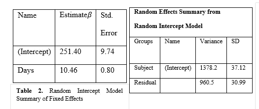

# 如何对集群数据建模？

> 原文：<https://medium.com/analytics-vidhya/methods-to-analyze-clustered-data-3bc67f63cddb?source=collection_archive---------11----------------------->

在本视频中，我解释了混合模型方法背后的数学原理，我们将执行该方法来分析聚类数据。

其中一个问题出现在生物学领域，从相关单位的重复测量集群中进行观察。因此，线性混合效应模型(LMM)是一个既有固定效应又有随机效应的模型，当重复测量或聚类内的观测值的相关性违反 OLS 回归的独立性假设时使用。

**案例分析:**

此处`Reaction`变量:对每个受试者重复测量 10 次。这就是为什么数据是纵向的，因为每个受试者都被测量了多次。在这种情况下，`Reaction`变量是测量对象在某一天的反应时间。

Belenky 等人[2003]考虑了在试验的前 10 天中限制每晚睡眠 3 小时的 18 名受试者。

2 协变量是天数(睡眠剥夺的天数)和受试者(**每次测量发生在**的哪一天)

(固定效应预测变量)天数:范围(0 到 9)。

(预测变量和随机效应)受试者:编号为 308，309，310，330，331，332，333，334，335，337，349，350，351，352，369，370，371，372。

目标:准确模拟睡眠剥夺对受试者不睡觉天数的影响。

**问题**:对每个受试者进行多次观察，这违反了独立性假设**。**

**模型和方法**

类内相关分析

1 在混合效应模型中绘制部分池

2.随机截距，个体水平的固定预测值

***model_null < - lmer(反应~ 1 + (1 |主题)，数据=sleepDat)***

#组内相关系数< 0.5 hence,

poor reliability

Adjusted ICC: 0.395

Conditional ICC: 0.395

**可视化部分池模型:**

该模型需要估计固定效应周围的可变性，这样我们就可以将所有线路的信息汇集在一起，对各个线路进行随机估计。因为我们有 18 条参与者的趋势线，所以我们也可以猜测新参与者的趋势线。

***lmer(反应~ 1 +天+ (1 +天|主题)***

在这里，我们可以看到估计值正拉向日食中心，日食中心是由`**椭圆**()`[它采用协方差矩阵、中心值和分位数/置信水平，并返回给定置信水平下围绕中心的椭圆上的点],因为在 250–275 附近有收缩

1.**随机截距，个体水平的固定预测值**，即随机效应将考虑不同受试者之间的差异。

睡眠模式 2

From the table, the variance of the random effect accounts i.e. Subject accounts for the total variance explained by the fixed effect, Days, and here residual variance is the variance which is not explained by the model, The differences between subjects account for 59% of the variance.

From the Coefficients, for the random intercept model, it's evident that each subject has a different intercept but the same slope to help account for differences between subjects.

**讨论**

随机截距模型显示*每个受试者都有不同的开始反应时间，但所有受试者的反应时间都随着睡眠剥夺天数的增加而增加。*

参考资料:

 [## 固定效果模型-维基百科

### 在统计学中，固定效应模型是指模型参数固定或非随机的统计模型

en.wikipedia.org](https://en.wikipedia.org/wiki/Fixed_effects_model)  [## lmer 函数-r 文档

### lmer(formula，data = NULL，REML = TRUE，control = lmerControl()，start = NULL，verbose = 0L，subset，weights…

www.rdocumentation.org](https://www.rdocumentation.org/packages/lme4/versions/1.1-26/topics/lmer)  [## 睡眠限制期间的表现退化和恢复模式以及随后的…

### 格雷戈里·贝伦基，医学博士，上校，美国陆军医疗队，沃尔特·里德陆军研究所神经精神病学分部…

onlinelibrary.wiley.com](https://onlinelibrary.wiley.com/doi/full/10.1046/j.1365-2869.2003.00337.x) 

[https://en . Wikipedia . org/wiki/Mixed _ model #:~:text = A % 20 Mixed % 20 model % 2C % 20 Mixed % 2d effects，physical % 2C % 20 biological % 20 and % 20 social % 20 sciences](https://en.wikipedia.org/wiki/Mixed_model#:~:text=A%20mixed%20model%2C%20mixed%2Deffects,physical%2C%20biological%20and%20social%20sciences)。