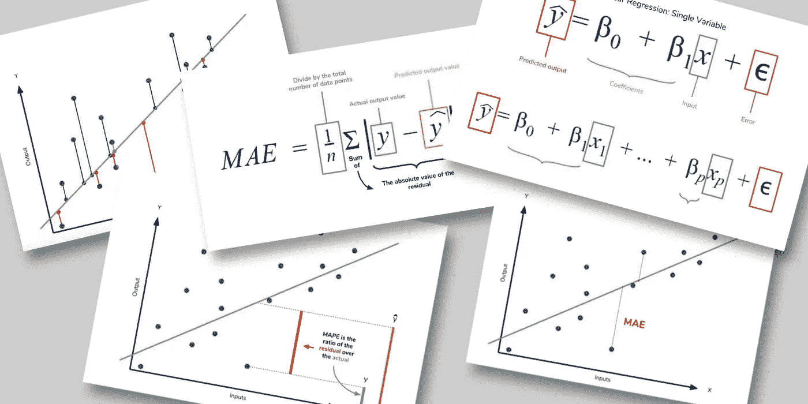
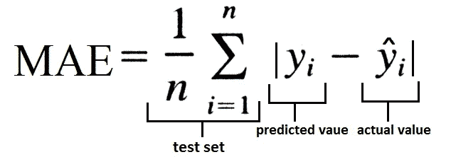
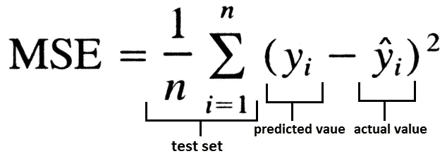
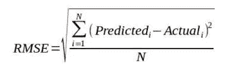
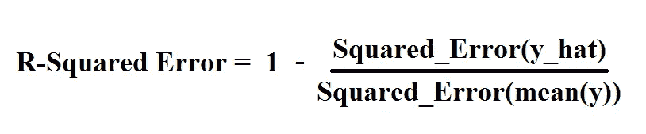
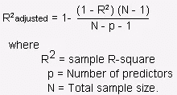

# 回归模型的度量

> 原文：<https://medium.com/analytics-vidhya/metrics-for-regression-model-84e3bc28fc7f?source=collection_archive---------13----------------------->



评估 ML 模型的性能是任何项目中非常重要的一部分。回归和分类模型有许多不同的评估标准。在这篇博客中，我们将学习回归模型的度量标准。

回归模型有许多流行的指标来评估模型性能。任何模型的性能指标都应该根据其目的、领域和目标来选择。以下是评估回归模型性能的一些指标:

*   **平均绝对误差(MAE)** :误差基本上是模型的实际值和预测值的绝对差值。因此，平均绝对误差或 MAE 是从数据集中的每个样本中取该误差平均值的误差。



这可以使用 sklearn 库来实现:

```
from sklearn.metrics import mean_absolute_error
mean_absolute_error(actual_value, predicted_value)
```

MAE 测量一组预测中误差的平均大小，而不考虑它们的方向。MAE 可能不是一个好的评估指标，因为它不能让我们了解模型的欠拟合和过拟合。与 MSE 相比，它对异常值不是很敏感，因为它没有惩罚巨大的错误。它通常用于在连续变量数据上测量性能。它给出了一个线性值，平均加权个体差异。该值越低，模型的性能越好。

*   **均方误差(MSE)** : MSE 是取实际值和预测值之差的平方的平均值计算出来的误差。



这可以使用 sklearn 库来实现:

```
from sklearn.metrics import mean_squared_error
mean_squared_error(actual_values, predicted_values)
```

MSE 告诉你回归线离一组点有多近。均方差越小，就越接近找到最佳拟合线。根据您的数据，可能无法获得非常小的均方误差值。这是最常用的指标之一，但当一个错误的预测会破坏整个模型的预测能力时，也就是当数据集包含大量噪声时，它的用处最小。当数据集包含异常值或意外值(过高或过低的值)时，它最有用。

*   **均方根误差(RMSE)** : RMSE 是对数据集进行预测时出现的误差的标准偏差。这与 MSE(均方误差)相同，但在确定模型的准确性时会考虑值的根。



这可以使用 sklearn 库来实现:

```
from sklearn.metrics import mean_squared_error
from math import sqrt
mean_squared_error(actual_values, predicted_values)
# taking root of mean squared error
root_mean_squared_error = sqrt(mean_squared_error)
```

当标准化观测和预报用作 RMSE 输入时，与相关系数有直接关系。例如，如果相关系数为 1，RMSE 将为 0，因为所有点都位于回归线上(因此没有误差)。RMSE 是对这些残差(预测误差)分布程度的一种度量。换句话说，它告诉你数据在最佳拟合线周围的集中程度。均方根误差常用于预测和回归分析，以验证实验结果。

*   **R 的平方** : R 的平方也被称为决定系数。R 的平方值介于 0 和 1 之间，其中 0 表示该模型不符合给定的数据，1 表示该模型完全符合所提供的数据集。



```
from sklearn.linear_model import LinearRegression
from sklearn.cross_validation import cross_val_score
scores = cross_val_score(LinearRegression(), X, y,scoring='r2')
```

r 平方是线性回归模型的拟合优度度量。该统计表明自变量共同解释的因变量方差的百分比。

*   **调整后的 R 平方**:调整后的 R 平方是已经针对模型中的预测器数量进行了调整的 R 平方的修改版本。只有当新项对模型的改善程度超过偶然情况下的预期时，调整后的 R 平方才会增加。当预测者偶然对模型的改进小于预期时，它减少。调整后的 R 平方可以是负值，但通常不是。它总是低于 R 的平方。



**结论**:在本文中，我们已经看到了用于评估回归模型的不同类型的度量标准以及它们的用例。

希望这篇文章对你有所帮助。继续学习！