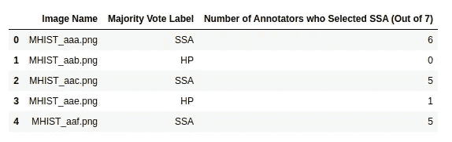
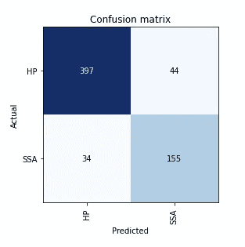

# MHIST 是 ML 社区的一个新的公共组织病理学图像数据集。

> 原文：<https://medium.com/analytics-vidhya/mhist-a-new-public-histopathological-image-dataset-for-ml-community-22e557aa2e3?source=collection_archive---------17----------------------->

一个 **m** 最小的**历史**病理图像分析数据集(MHIST)

MNIST 是机器学习实践者最受欢迎的基准数据集之一。到目前为止，由于各种原因，组织病理学图像没有这样的标准化数据集。

2021 年 1 月 29 日，来自达特茅斯学院和达特茅斯-希区柯克医疗中心的研究人员在 arXiv.org 预印本托存处发布了一篇[论文](https://arxiv.org/abs/2101.12355)，描述了一个新的 MHIST 数据集和基本的基准数据。他们在 GitHub 网站上向 ML 社区免费提供 MHIST 数据集。

MHIST 是一个二元分类数据集，包含 3，152 个固定大小(224 x 224 像素)的结肠直肠息肉图像，每个图像都有一个由七名委员会认证的胃肠病理学家的多数投票决定的黄金标准标签。MHIST 还包括每个图像的注释者协议级别。作为一个极简数据集，MHIST 占用了 354 MB 的磁盘空间。

这两类图像是增生性息肉和无柄锯齿状腺瘤。前者是良性的，后者是结肠的癌前病变。鉴别增生性息肉和无柄锯齿状腺瘤有时很困难。在他们的论文中，作者报告说，在 16.7 %的病例中，七分之四的病理学家建议一个实体，三名病理学家建议另一个实体。值得庆幸的是，他们有七个而不是六个病理学家对病变进行分类，以符合疑难病例的大多数诊断。

作者进行了各种 ML 实验，用预处理的 ResNet18 获得了最好的结果(AUC 92.7%)。

要访问 MHIST 数据集，您必须通过提供下图中列出的个人数据在他们的 [GitHub 网站](https://bmirds.github.io/MHIST/)上注册，并同意[数据集研究使用协议](https://bmirds.github.io/MHIST/Dataset%20Research%20Use%20Agreement.pdf)。

[https://bmirds.github.io/MHIST/](https://bmirds.github.io/MHIST/)

一旦获得批准，您就可以访问数据集文件，包括 annotations.csv、image.zip 和 MD5SUMs.txt 文件。annotations.csv 文件包含图像文件名、相应的多数投票标签和病理学家的同意程度。image.zip 文件包含 3，152 个图像文件，MD5SUMs.txt 包含一个校验和，可用于验证数据集的内容是否正确下载。

批注. csv

在 MHIST 数据集中，增生性息肉(HP)是无柄锯齿状腺瘤性息肉(SSA)的两倍。

无柄锯齿状腺瘤的诊断有时很困难，即使对有经验的病理学家来说也是如此，如下图所示。在 200 多个病例中，只有七分之四的病理学家认为息肉是无柄锯齿状腺瘤。

为了快速检查数据集，我使用迁移学习运行了一个 ML 模型，对 100 个时期进行了预训练 ResNet18。

混淆矩阵

这个简单的模型达到了 88%的准确率。

尽管前景看好，但机器学习在医疗保健和其他相关领域显示；有一个瓶颈减缓了进展的速度。瓶颈是获取训练和测试机器学习算法所需的高质量数据集。存在大量数据集，但很少能被研究人员轻松获取。这种情况主要是由于医疗数据集本身的性质；数据集中的可识别信息意味着对数据的访问受到多种措施的保护，以维护患者的隐私。

在我之前的一篇文章中，我描述了我和我的同事为 ML 研究人员提供的肺癌和结肠癌数据集(LC25000)。我相信任何 ML 研究者都会欢迎新的 MHIST 数据集，它是标准化的，可以作为新 ML 算法创建和模型基准测试的可行工具。

感谢你花时间阅读这篇文章。

安德鲁

@tampapath

参考:魏，杰瑞；阿里夫·苏里亚维纳塔；任，兵；刘、小英；米哈伊尔·利索夫斯基；路易·维克斯；查尔斯·布朗；贝克，迈克尔；富田直文；洛伦佐·托雷萨尼；魏、贾森；赛义德·哈桑波儿。用于组织病理学图像分析的培养皿。eprint [arXiv:2101.12355](https://arxiv.org/abs/2101.12355)