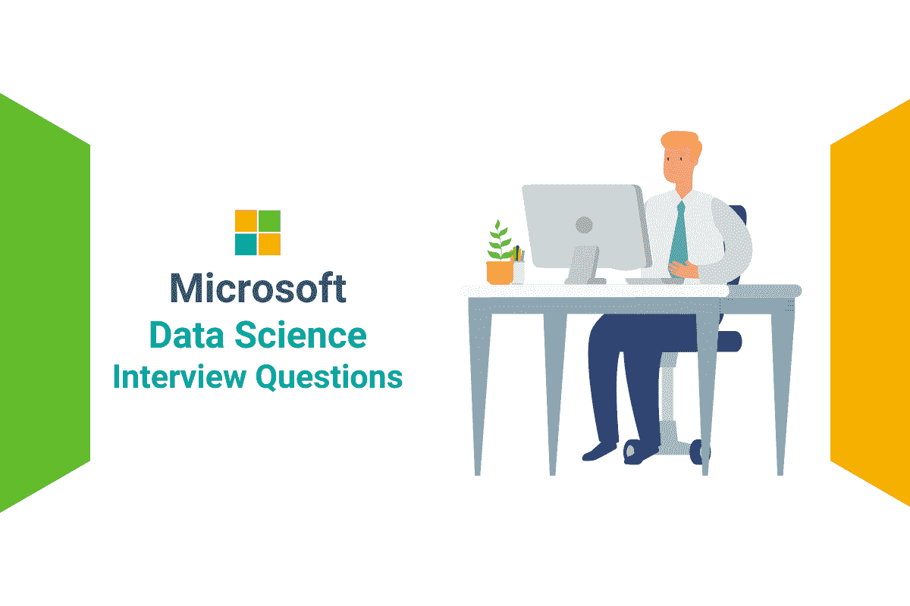
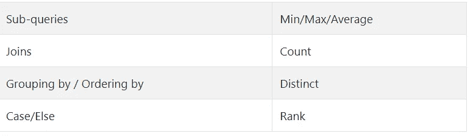
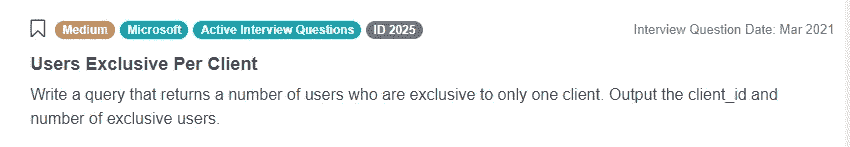
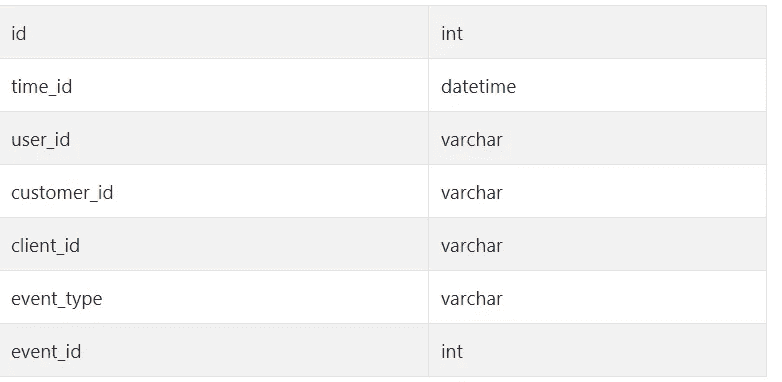
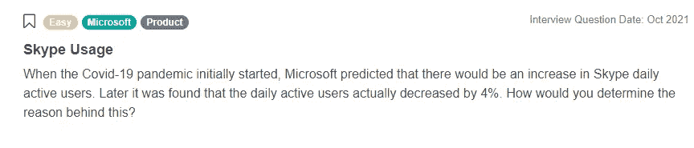

# 微软数据科学面试问题

> 原文：<https://medium.com/analytics-vidhya/microsoft-data-science-interview-questions-6564a50d6781?source=collection_archive---------0----------------------->

我们将分析微软数据科学面试问题，并为您准备一些面试中经常出现的概念。



作者在 [Canva](https://canva.com/) 上创建的图片

微软是科技的代名词。三十多年来，微软一直是科技行业的巨擘，是软件、消费电子和数据领域的领导者。微软的 Windows 是世界上最受欢迎的操作系统，他们的 Office 套件在全球的商业、教育和个人项目中使用。2010 年 2 月，微软推出了 Azure(今天称为微软 Azure，当时称为 Windows Azure)，并在此后的几年里定期优化了 Azure 环境的 SaaS(软件即服务)、PaaS(平台即服务)和 IaaS(基础设施即服务)元素。例如，Azure 已经将机器学习中的流行任务简化为 GUI“拖放”界面，熟悉一般概念就足以训练、测试和部署机器学习模型。

微软为众多团队雇佣数据科学家，包括 Xbox 游戏数据服务(GDS)、Azure 数据科学团队和客户成功工程。微软的数据科学家解决的问题从改善应用程序中的客户体验到开发推荐模型以向产品用户推荐相关内容。微软每年吸引成千上万的申请人，我们 StrataScratch 知道，申请人了解微软公开数据科学家职位面试中的当前问题非常重要。

本文涵盖了今年的微软数据科学面试问题。我们将分析这些数据科学面试问题，并指导您找到解决方案，同时让您了解一些在面试中经常出现的概念。

# 在微软数据科学家和数据分析师面试问题中测试的技术概念

为了更好地准备微软数据科学技术面试，您应该熟悉面试中经常测试的概念。对于[微软 SQL 面试问题](https://www.stratascratch.com/blog/microsoft-sql-interview-questions-for-data-science-position/?utm_source=blog&utm_medium=click&utm_campaign=medium)，这包括连接、子查询、分组和基本 SQL 计算。了解这些因素是如何相互作用的，有助于提高候选人成功回答面试问题的可能性。

下表显示了微软数据科学面试问题中常见的测试概念:



经过测试的概念根据确定的标准操纵数据或计算洞察力，有时您会被要求在同一个查询中完成这两项工作。例如，可能会要求您计算订阅多个 Microsoft 服务的用户份额，并在结果中输出某些数据。要回答这些问题，您需要理解一些技术概念，包括子查询、连接、分组、计数、区分等。

接下来，我们将回顾一个微软数据科学面试问题，并考察我们如何处理和实施 SQL 解决方案。

# 微软数据科学面试问题


作者在 [Canva](https://canva.com/) 上创建的图像

**每客户端独占用户数**



截图来自 [StrataScratch](https://www.stratascratch.com/?utm_source=blog&utm_medium=click&utm_campaign=medium)

问题链接:[https://platform . stratascratch . com/coding/2025-users-exclusive-per-client](https://platform.stratascratch.com/coding/2025-users-exclusive-per-client?python=&utm_source=blog&utm_medium=click&utm_campaign=medium)

编写一个查询，返回仅属于一个客户端的用户数量。输出客户端 ID 和独占用户的数量。

**为成功做好准备**

首先，向面试官复述这个问题。这提供了一个确认你理解问题的机会。对于这个 Microsoft data science 采访问题，我们会说类似于“为了确认，我们想返回只在一个客户端上工作的用户的客户端 ID 和独占用户数量。这是正确的吗？”。此外，如果对数据集有任何不清楚的地方，这是询问任何澄清问题的好时机。例如,“客户端”一词可以指特定的最终用户帐户或访问方法(即移动、桌面等)。).在这种情况下，它指的是后者。也有可能面试官的回答会帮助你找到正确的方向。利用这个额外的时间和机会来提高你对这个问题的理解。

接下来，让我们看一下模式。我们将在不预览表格的情况下完成此操作，因为您在访谈过程中通常无法访问填充的观察结果。因此，您需要对数据集的行为做出假设。还是那句话，不要害怕提问。例如，指定数据集中重复项的详细信息可能会显著影响预期结果。

**表格模式**

*事实 _ 事件*



在提供的表模式中:

*   我们的“id”和“event_id”列是整数
*   “用户标识”、“客户标识”、“客户端标识”和“事件类型”列中的可变大小字符串(varchar)
*   我们的“时间标识”列是日期时间

首先，澄清“id”列应该是什么是有帮助的，因为我们已经有了时间、用户、客户端和事件的 id。在查看样本数据后(也可以询问采访者)，‘id’似乎是一个标识符，保证每个观察都是唯一的。冗余的“id”值可能表示重复数据。

接下来，让我们考虑“time_id”列。正如您所料，“time_id”以“yyyy-mm-dd”格式存储时间戳。没有小时、分钟或秒的数据，但这与我们的问题无关，因为我们不需要做任何涉及日期的事情。知道如何回答问题的一部分是知道忽略什么，这里我们可以暂时忽略这一点。

“user_id”列存储了一个用户 ID-key，该 ID-key 由 4 个数值组成，用破折号分隔，后跟 5 个字母。该列中的值可以重复。

“customer_id”列包含以文本形式存储的客户名称。值包括“Sendit”、“Zoomit”和“Connectix”。

“client_id”是指通信是通过手机还是台式机进行的。

“事件类型”列描述了通信的类型。例如“消息已发送”、“文件已接收”和“语音通话已开始”。

最后一列是整数形式的“event_id”。这些值的范围从 1 到 9。

我们的访问问题只涉及“用户标识”和“客户标识”列，因此我们将使用它们。

**逻辑**

为了解决面试问题，把你的逻辑写出来可能会有帮助。

1.  首先，我们知道我们对作为输出的 client_id 和 user_id 感兴趣，我们需要选择这些列
2.  我们只想包括不同客户端 id 的计数等于 1 的用户 id
3.  我们希望显示这些结果与 client_id 的关系

写完你的逻辑后，问问你的面试官是否同意你的方法。他们可能会突出你没有考虑到的情况。密切注意他们所说的，因为他们在这里为你提供了有价值的信息。一旦大家一致认为你的方法是正确的，就该编码了。

**方法和解决方案**

为了清晰地思考，在面试过程中保持冷静是很重要的。这是一个相当简单的查询，我们已经充分讨论了解决方案的逻辑。剩下要做的就是编程了。

虽然这个 Microsoft data science 面试问题有许多可能的解决方案，但下面的解决方案非常容易阅读，并且简明地回答了问题。

我们首先选择相关字段，“客户端标识”和“用户标识”。因为我们只对用户数量感兴趣，所以计算不同的“user_id”值的数量。

接下来，让我们解决子查询。我们感兴趣的是“user_id”实例，其中使用的客户端数等于 1。这是通过从我们一直使用的“事实 _ 事件”表中选择“用户 _id ”,对“用户 _id”进行分组，并使用“having”函数过滤我们的结果，使其只包括客户端数为 1 的“用户 _id”。

```
(SELECT user_id
 FROM fact_events
 Group By user_id
 HAVING count(DISTINCT client_id) = 1) 
```

最后，我们将它添加到现有的查询中。由于我们希望看到我们的结果以及它与客户的关系，我们根据“client_id”对结果进行分组。

```
SELECT client_id,
       count(DISTINCT user_id)
FROM fact_events
WHERE user_id in
    (SELECT user_id
     FROM fact_events
     Group By user_id
     Having count(DISTINCT client_id) = 1)
GROUP BY client_id
```

*查看我们之前的文章* [*微软数据科学家面试问题*](https://www.stratascratch.com/blog/microsoft-data-scientist-interview-questions/?utm_source=blog&utm_medium=click&utm_campaign=medium) *找到更多来自微软的面试问题。*

# 微软数据科学非编码面试问题

除了像上面这样的数据科学编码面试问题，候选人还可能被问到概念性问题，以测试他们对一般分析原则的知识。例如，下面 2021 年 9 月的问题要求候选人描述一种方法来确定 Skype 日活跃用户减少 4%的原因。虽然这个数据科学面试问题有许多可能的答案，但面试官最终是在测试申请人的逻辑推理。



截图来自 [StrataScratch](https://www.stratascratch.com/?utm_source=blog&utm_medium=click&utm_campaign=medium)

链接到这个微软数据科学面试问题:[https://platform . stratascratch . com/technical/2321-Skype-usage](https://platform.stratascratch.com/technical/2321-skype-usage?utm_source=blog&utm_medium=click&utm_campaign=medium)

## 结论

本文涵盖了最近的微软数据科学面试问题，但同样的方法适用于所有的[数据科学面试](https://www.stratascratch.com/blog/data-science-interview-guide-questions-from-80-different-companies/?utm_source=blog&utm_medium=click&utm_campaign=medium)。

收到您的问题后:

1.  重申问题，以确保您完全理解所提的问题。
2.  讨论假设以澄清任何不确定性，并收集有关潜在解决方案的更多信息
3.  在编写解决方案之前，先演练一下解决问题的逻辑
4.  一边编码一边解释。如果你在解释时犯了一个简单的错误，面试官可能会帮助你！

提高面试表现的秘诀是练习和重复。通过 StrataScratch 易于使用的平台和包括微软、亚马逊和 Spotify 在内的顶级雇主的历史面试问题，候选人可以使用真实世界的面试问题进行准备。新的问题会定期添加，并且可以用 Python 或 SQL 解决。

*最初发表于*[*【https://www.stratascratch.com】*](https://www.stratascratch.com/blog/microsoft-data-science-interview-questions/?utm_source=blog&utm_medium=click&utm_campaign=medium)*。*