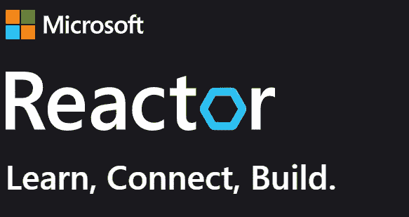

# 微软反应器 NLP 系列

> 原文：<https://medium.com/analytics-vidhya/microsoft-london-reactor-nlp-series-e2404887fabc?source=collection_archive---------5----------------------->

[伦敦地区的微软反应器](https://developer.microsoft.com/en-us/reactor/)在 2021 年 4 月至 5 月期间在[举办了 NLP 网络研讨会系列](https://developer.microsoft.com/en-us/reactor/eventseries/NaturalLanguage)。我和我的同事做了八次演讲，从介绍到高级主题，从文本分类、主题建模、语音转文本、文本挖掘、问答和语言模型。全部内容可以在[这里找到。](https://developer.microsoft.com/en-us/reactor/eventseries/NaturalLanguage)

在这篇文章中，我提供了我自己演讲的摘要和链接:

## **Azure NLP 解决方案概述—1 级**

在这次演讲中，我们将简要介绍人工智能和自然语言处理技术，并概述微软 Azure 解决方案的每个行业支柱用例。然后，我们将提供 NLP 应用程序和 Azure AI 解决方案之间的全面映射，并呈现一个包含微软产品官方存储库链接的 repo。

将涵盖以下领域:

*   人工智能和自然语言处理时间线介绍
*   自然语言处理技术综述
*   Azure 解决方案概述及其与 NLP 的映射
*   介绍公共 github，其中包含所有到微软产品官方仓库的链接。

该会议面向对使用 Azure 平台作为 NLP 用例感兴趣的新数据科学家、专家和利益相关者。

## **自然语言处理中的问答应用:CORD-19 Kaggle 竞赛概述—第二级**

在这次演讲中，我们将首先概述自然语言处理中问答技术的工作原理。然后，我们将展示一个提交给卡格尔·新冠肺炎公开研究数据集挑战赛(CORD)的解决方案，概述竞赛形式，然后描述结合使用单词嵌入和微调 BERT 的代码。我们将在最后讨论结果。

将涵盖以下领域:

*   自然语言处理中的问答
*   Word2Vec 嵌入
*   微调 BERT 语言模型

本课程面向具有一定 NLP 入门水平的新数据科学家，以及对开发 QA 应用感兴趣的老数据科学家。

## **最先进的语言模型—3 级**

语言建模是预测下一个单词是什么的任务。在正式定义中，给定一个单词序列，语言模型计算下一个单词的概率。语言模型最适合用于词性标注、命名实体识别、句子分类、文本摘要、文本生成和问题回答。在本节中，我们简要回顾了 n 元语言模型和递归神经网络(RNN ),它们是构建语言模型的传统方法，存在消失梯度问题。然后，我们将讨论从以前的 ML 架构中显著发展而来的变形金刚架构师。鉴于基于变形金刚的建筑师，我们介绍了由 OpenAI 生成预训练变形金刚(GPT)模型，并将审查其优点和缺点。

将涵盖以下领域:

*   RNNs 架构师简介
*   基于变形金刚的建筑师综述
*   GPT 一号、GPT 二号、GPT 三号概述

本课程面向具有一定 NLP 入门水平的新数据科学家，以及对使用最新语言模型 API 开发简单模型感兴趣的老数据科学家。