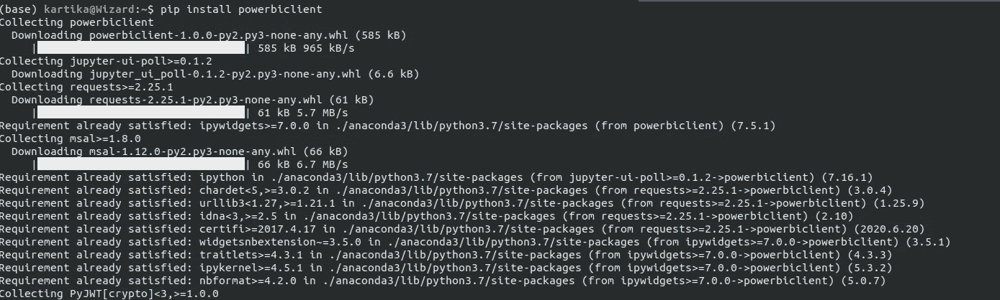
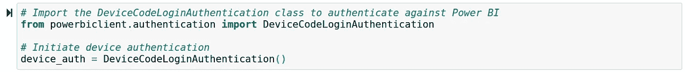
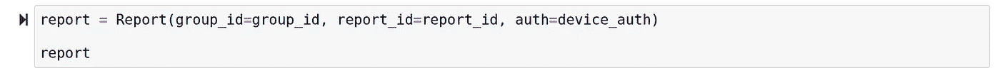

# 微软 Power Bi 在 Jupyter 笔记本中发布

> 原文：<https://medium.com/analytics-vidhya/microsoft-power-bi-released-in-jupyter-notebook-e7bb6947f1f2?source=collection_archive---------10----------------------->

微软终于在 Jupyter 笔记本中发布了 Power Bi。

Power BI 是微软基于云的业务分析服务，使任何人都能以更快的速度、更高的效率和更好的理解来可视化和分析数据。因此，微软推出了一个新的软件包，用于创建出色的 power bi 报告、仪表盘和报告视觉效果。他们还将 Power BI 报告视觉效果中的数据导出到 Jupyter 笔记本电脑中，以便进行更深入的分析。您还可以利用书签来应用保存的视图或过滤报告以进行快速分析。

您现在可以从 [PyPI](https://pypi.org/project/powerbiclient/) 安装带有更新包的 Jupyter Power BI 客户端。

所以可以使用 pip 安装这个包。pip 是 python 中的一种工具，它允许您下载和管理标准库中不包含的库和依赖项。

***命令:pip 安装 powerbiclient***

将以下内容添加到您的笔记本中，powerbi 将提供一个令人惊叹的仪表板。

1.  导入包的报表类和模型:

2.使用 Azure Active Directory 对 Power BI 进行身份验证:

3.按如下方式设置要嵌入的工作区和报表 id:

4.创建一个 Power BI 报表实例，并将其导入到输出单元格中:

***参考****-*[*PowerBi.Microsoft.com*](https://powerbi.microsoft.com/en-us/blog/announcing-power-bi-in-jupyter-notebooks/)

“永远不要停止学习”