# 使用 SQL Server 迁移助手将 Oracle 数据库迁移到 SQL Server。

> 原文：<https://medium.com/analytics-vidhya/migrate-oracle-database-to-sql-server-using-sql-server-migration-assistant-for-oracle-8537e3fe7274?source=collection_archive---------3----------------------->

**先决条件:**

*   Oracle 数据库 19c
*   用于 Oracle 的 SQL Server 迁移助手
*   用于 Oracle 的 SQL Server 开发人员工具
*   SQL Server 2016
*   SQL Server Management Studio

**迁移的步骤。**

第一步。

安装和配置 Oracle 数据库 19c。

创建一个示例数据库和表。

第二步。

安装并配置 SQL Server 2016。

创建一个示例数据库。

第三步。

在源机器中打开 SSMA。

使用目标 SQL Server 2016 创建新项目。

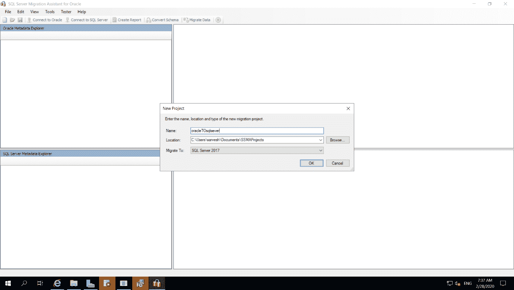

第四步。

选择源**甲骨文**。

提供身份证明并选择对象。

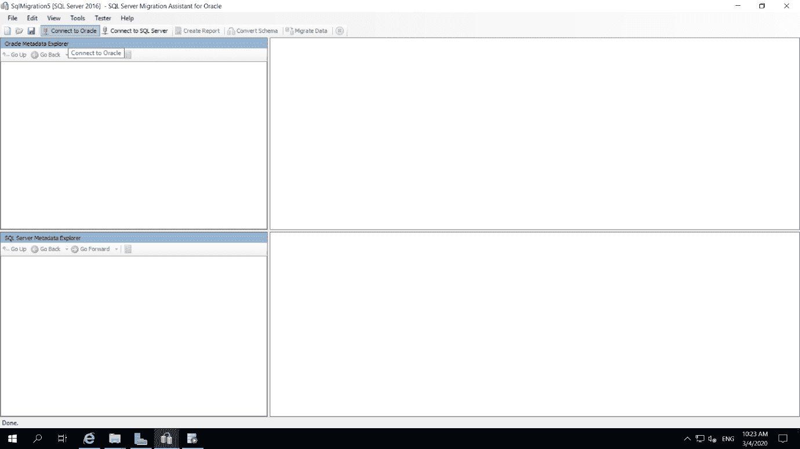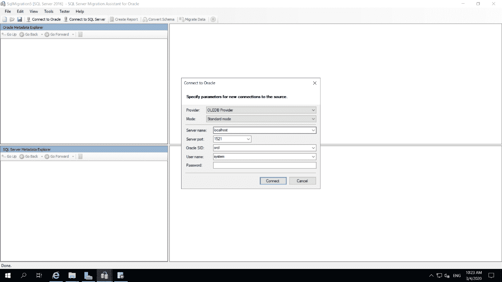

第五步。

选择要迁移的表。

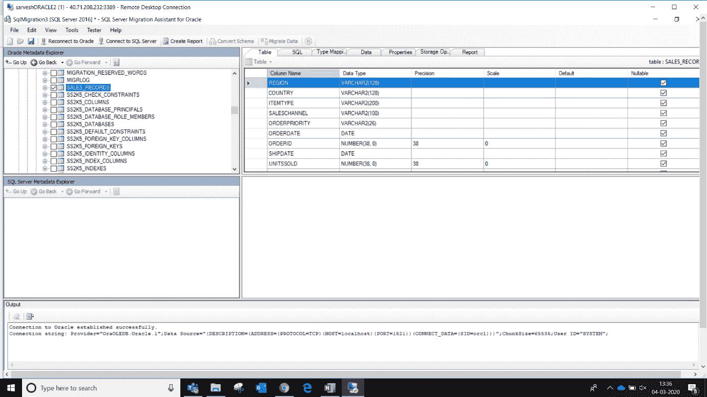

第六步。

点击**创建报告**。

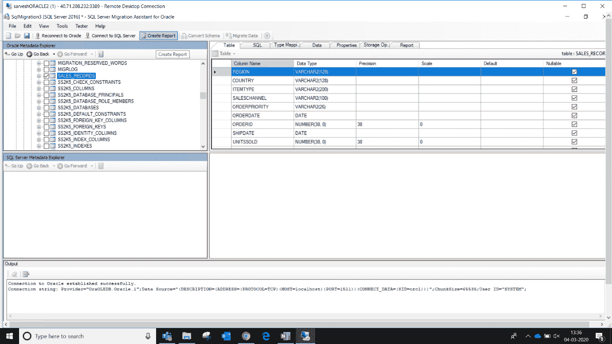

第七步。

单击目标“ **SQL Server** ”。

提供其证书

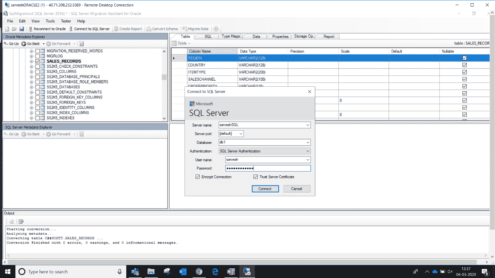

第八步。

转到要迁移数据的数据库。

选择源数据库，点击**转换模式**。

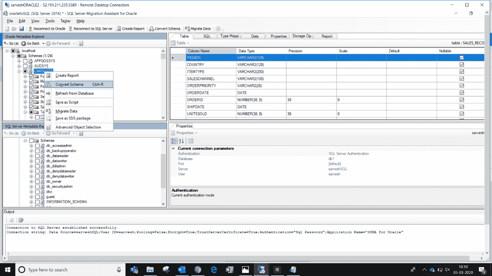

第九步。

选择目标数据库，然后转到工具并点击“**同步数据库**”。

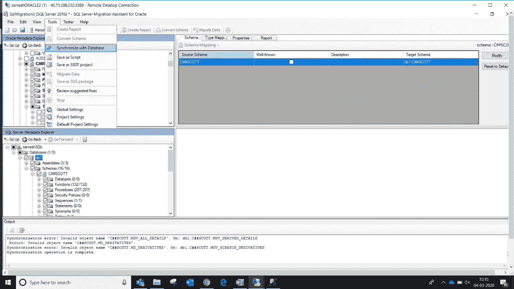

点击**确定。**

第十步。

转到目标机器，登录到服务器并检查表格中的数据。

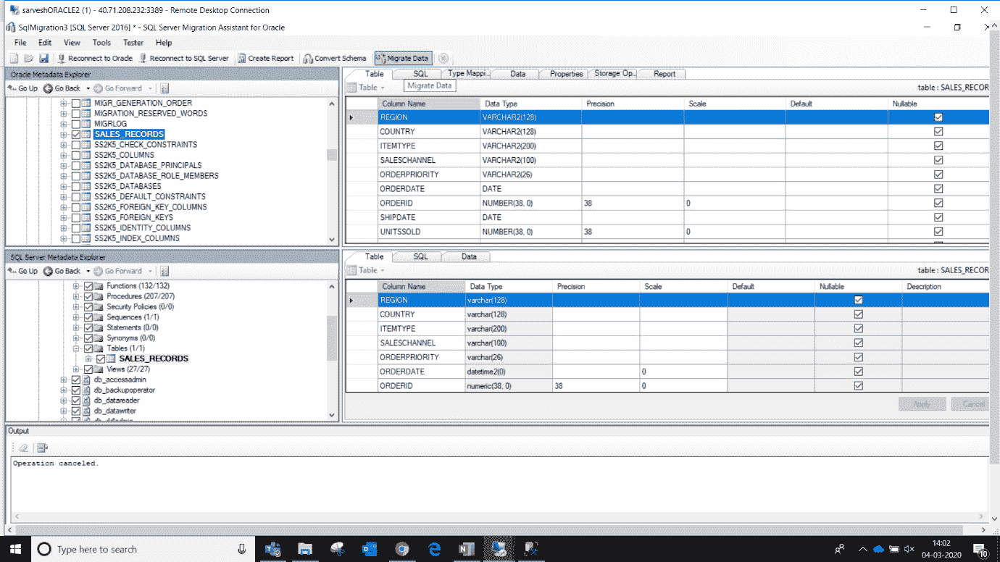

输入源凭据和目标凭据。

第十一步。

数据库已成功迁移。

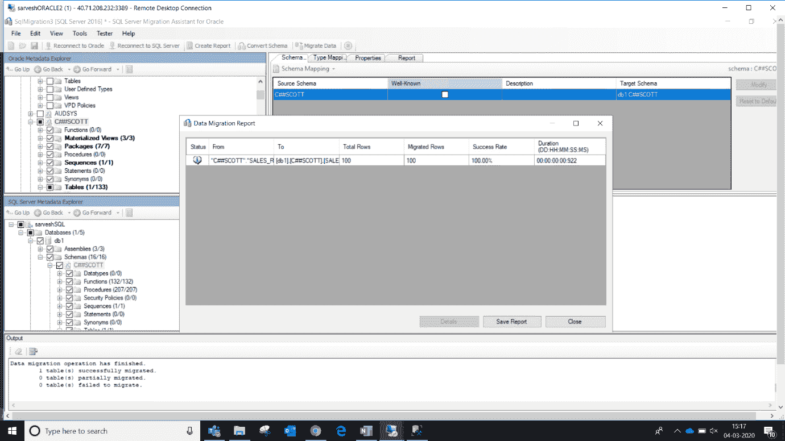

> **错误**

错误 1

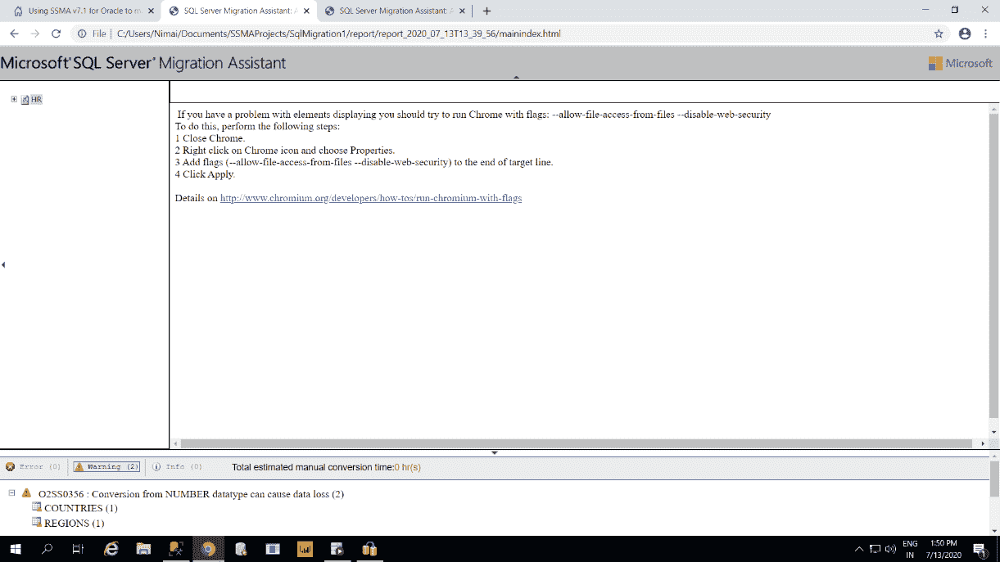

没有错误，但是有两个警告，说明如果我们想从 Oracle 转换到 SQL，我们需要改变数据类型

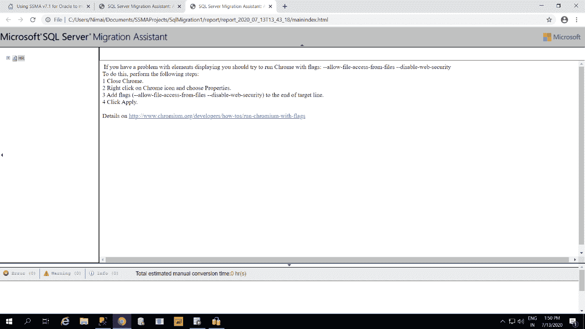

**解决方法**

我们可以通过改变数据类型映射来解决这个错误

错误 2

当我们以没有足够权限执行该模式的用户身份登录时，就会发生这种情况。

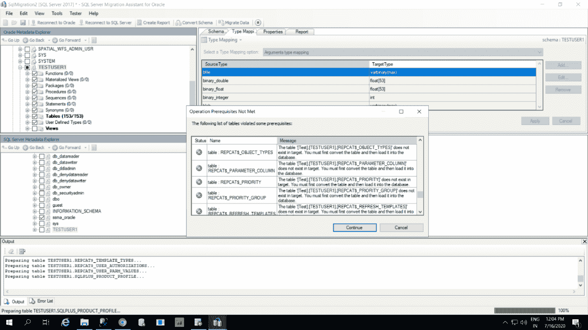

**解决方法**

大多数时候，如果可能，我们必须使用 system 和 SYS 登录。

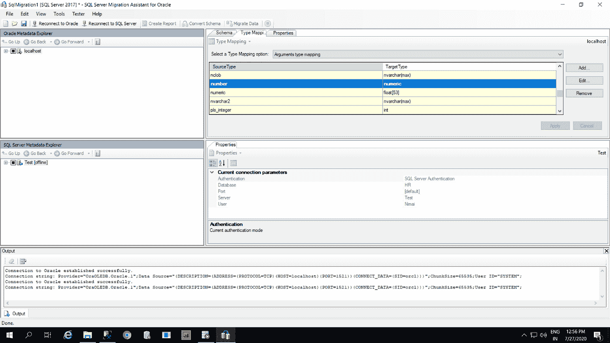