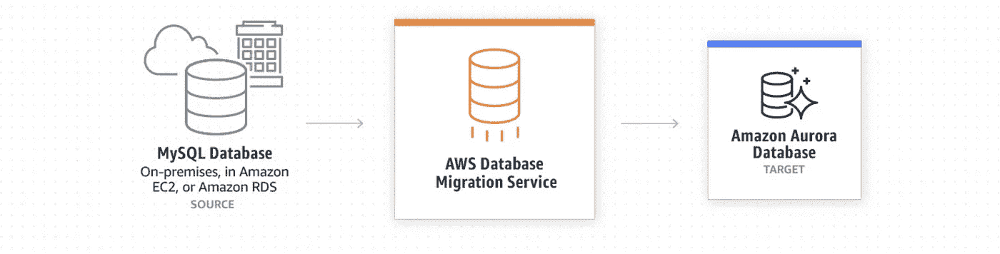

# 使用 AWS 数据库迁移将 EC2 托管的 MySQL 迁移到 Amazon Aurora MySQL

> 原文：<https://medium.com/analytics-vidhya/migrating-ec2-managed-mysql-to-amazon-aurora-mysql-using-aws-database-migration-84a8cdfd59d7?source=collection_archive---------3----------------------->

我们在 EC2 实例上为我们的应用程序运行 MySQL 数据库，这在我们开始时是一个很好的选择，但在我们的应用程序开始增长并开始接收更多数据后，我们管理 MySQL 服务器变得更加困难，因此我们决定将所有数据从自我管理的 MySQL(EC2 上的 MySQL)迁移到 AWS Aurora MySQL。



AWS 数据库迁移服务

# 使用 Aurora MySQL 的优势:

1.  可用且耐用
2.  更高的安全性
3.  高可扩展性和高性能
4.  与 MySQL 兼容
5.  全面管理

Amazon Aurora 具有分布式、容错、自我修复的存储系统。它通过多达 15 个低延迟读取副本、时间点恢复、到亚马逊 S3 的连续备份以及跨三个可用性区域(AZs)的复制，提供了高性能和高可用性。

我们使用 AWS 数据库迁移服务(DMS)来迁移我们的数据库。在这篇博文中，我将讨论我们如何使用 AWS DMS 将我们的生产数据库迁移到 Aurora MySQL。

**注意:** **—** 我强烈建议您首先在开发或试运行环境中尝试这些步骤，然后在生产环境中尝试。我所执行的所有步骤对您来说也没有必要完全相同。AWS DMS 只是将数据从源数据库迁移到目标数据库的一个工具，还有其他工具。我和 [Shatrujeet Kumar Sah](https://medium.com/u/867fa51fc0f3?source=post_page-----84a8cdfd59d7--------------------------------) 已经探索了这个工具，它在我们的用例中运行得非常好。

# 关于我们 EC2 MySQL 的一些要点

1.  带有使用 2 个 EC2 实例的编写器和副本的 MySQL
2.  大约 350 多张桌子
3.  数据库大小约为 400GB，并且是实时生产数据库，因此数据库的大小不断增加。
4.  表之间的多个外键关系
5.  表上的多个索引

# AWS 数据库迁移服务

AWS 数据库迁移服务帮助您快速安全地将数据库迁移到 AWS。在迁移过程中，源数据库保持完全正常运行，最大限度地减少了依赖该数据库的应用程序的停机时间。

AWS DMS 有两个选项来迁移您的数据:

1.  **迁移现有数据(满载)** —执行从源端点到目标端点的一次性迁移。在这种方法中，您停止向数据库写入数据(停机几个小时)，然后使用 DMS 迁移到目标数据库。一旦完成，您可以在配置文件中更改端点，然后开始使用新的数据库。
2.  **迁移现有数据并复制正在进行的更改(满载+ CDC)** —执行从源到目标的一次性迁移，然后继续将数据更改从源复制到目标。在这种方法中，您继续写入源数据库，让 DMS 迁移您的数据，然后在某个时间点停止写入源数据库，停机几分钟，然后更改配置文件中的端点并开始使用新数据库。

这完全取决于您应该采取哪种方法的用例。在我们的案例中，我们使用了第二个选项，因为它是我们的生产数据库，我们无法承受几个小时的停机时间。

因此，我将讨论我们采取了哪些步骤来使用第二种方法有效地将我们的数据库迁移到 Aurora MySQL。

# 执行迁移前的先决条件

要将 DMS 与 Full load + CDC 一起使用，需要在源数据库的 MySQL 配置文件中进行一些配置更改/验证。确保您的 MySQL 配置文件中有以下键值对。

*   server_id —将该参数设置为 1 或更大的值。
*   log-bin —设置二进制日志文件的路径(不包括文件扩展名。)
*   binlog_format —将该参数设置为`ROW`
*   expire_logs_days —将此参数设置为 1 或更大的值。为了防止过度使用磁盘空间，我们建议您不要使用默认值 0。
*   binlog_checksum —将该参数设置为`NONE`
*   binlog_row_image —将该参数设置为`FULL`
*   log_slave_updates —如果使用 MySQL 或 MariaDB 读取副本作为源，则将此参数设置为`TRUE`

以上 K/V 直接来自 [AWS DMS 文档](https://docs.aws.amazon.com/dms/latest/userguide/CHAP_Source.MySQL.html#CHAP_Source.MySQL.CustomerManaged)。在我们的例子中，我们没有配置第 7 个参数，因为我们的源不是读取副本。

> **注意:**如果您在 MySQL 配置文件中做了任何更改，请确保重新启动 MySQL 服务。这可能需要您的应用程序停机几分钟，因此请做好相应的计划。

# **创建 DMS 源端点**

*   转到端点并单击创建端点
*   选择端点类型为“源端点”
*   在端点配置—端点标识符(源端点的唯一名称)、源引擎(选择 MySQL)中，选择手动提供访问信息(服务器名称-> EC2 MySQL 的私有 IP，根据您的数据库输入端口、用户名和密码)
*   点击创建端点

# **创建 DMS 目标端点**

*   转到端点并单击创建端点
*   选择端点类型为“目标端点”
*   点击“选择 RDS 数据库实例”复选框—选择您的目标 Aurora MySql RDS 数据库。
*   填写所有必填字段，然后单击“创建端点”

# **创建 DMS 复制实例**

*   转到复制实例，然后单击创建复制实例
*   输入复制实例的名称和描述
*   在实例类中，选择所需的实例类(对于生产数据库迁移，建议选择较高的实例类，因为我们的迁移任务在此实例上运行，如果选择较小的实例类，可能会影响性能，并且可能需要较长的时间来完成迁移)
*   在分配的存储(GiB)中，我也建议分配大量的存储容量，因为 AWS DMS 在复制任务进行过程中使用此存储来存储日志文件和缓存事务。
*   选择您的 VPC(确保源数据库、复制实例和目标数据库位于同一个 VPC)
*   建议为生产迁移启用多 AZ，因为如果您的迁移任务需要很长时间才能完成，并且如果复制实例出现问题，它将自动进行故障切换
*   根据您的要求选择是否应该公开访问。
*   点击创建

# 测试电路

创建复制实例后，转到端点并测试源端点和目标端点的连接。该测试将确保您的复制实例能够连接到源数据库和目标数据库。

***恭喜你！！*** 你已经成功完成第一阶段

我们几乎完成了 DMS 的配置，并且我们已经测试了我们的 DMS 可以连接到我们的源数据库和目标数据库，只剩下一项工作，即在 DMS 中创建迁移任务。

使用 AWS DMS 任务，您可以指定要迁移的模式和迁移类型。您定义要迁移哪些表，迁移到哪里，以及如何迁移。

现在，在创建迁移任务之前，我们将执行一些手动步骤。

**注意:——**我在博客中提到的方法并不一定要你遵循同样的步骤。没有必要执行手动步骤，如果需要，您可以直接创建并运行迁移任务。我们之所以执行这些步骤，是因为我们有多个外键约束，源数据库和 DMS 上的默认值在执行迁移之前不会在表之间创建这些关系。它会尝试并行迁移所有表，因此您可能会从 MySQL 的目标数据库中获得外键约束违规的错误。

# 从源数据库导出模式并删除外键约束

我们将只从转储文件中的源数据库导出模式，然后从转储文件中删除外键约束，最后将模式应用到目标数据库

要导出模式，请运行以下命令:

```
mysqldump -u [your_user] -h [your_host] --no-data -p [your_database] > database.sql 
```

一旦运行上述命令，它将只包括您在命令中指定的数据库的模式，如果您有多个数据库，通过更改 **< your_database >** 运行上述命令，并导出每个数据库的模式。

导出模式后，删除外键约束、删除操作等并保存文件。

**注意:** **—** 我建议不要修改原始模式文件，创建它的副本，然后删除约束。

现在，既然我们已经准备好了数据库模式，我们将把它应用到我们的目标数据库。使用以下命令将模式应用到目标数据库。

```
mysql -u [your_user] -h [your_host] -p [your_database] < database_without_constraint.sql 
```

验证源和目标 MySQL 中的表的数量。在源数据库和目标数据库中运行以下查询。

```
SELECT count(*) AS TOTALNUMBEROFTABLES FROM INFORMATION_SCHEMA.TABLES WHERE TABLE_SCHEMA = '<your_database>';
```

一旦 DMS 任务完成了我们的**满负荷**，我们将改变目标数据库上的表，并将外键约束应用于我们的表。

**牛逼！！**我们已经成功创建了目标数据库的模式，并验证了表的数量，现在是创建 DMS 迁移任务的时候了。

# 创建 AWS DMS 任务

单击数据库迁移任务，然后单击创建任务按钮。

*   **任务配置**

a.任务标识->输入任务名称

b.复制实例->选择您的复制实例

c.源数据库端点->选择您的源数据库端点

d.目标数据库端点->选择您的目标数据库端点

e.迁移类型->选择**迁移现有数据并复制正在进行的更改**

*   **任务设置**

a.目标表准备模式-> Select**Truncate**(AWS DMS 保留表及其元数据，但删除其中的数据。)您可以根据您的使用案例进行选择。

b.满载完成后停止任务->选择**应用缓存更改后停止**(应用缓存更改后停止任务。这将允许您添加外键、触发器等)。一旦全部加载完成，我们将自动停止我们的任务，然后我们将应用 alter table 命令在目标数据库中的表上创建外键，然后我们将启动 CDC(复制正在进行的更改)。)

c.在复制中包含 LOB 列->选择**完全 LOB 模式**(如果在源数据库中有 LOB 对象)

d.点击启用 CloudWatch 日志复选框->这将有助于您在出现问题时调试问题。

*   **表格映射**

表映射告诉 AWS DMS 任务应该将哪些表从源迁移到目标。DMS 不会迁移 MySQL 创建的某些**系统模式**，如果您尝试迁移它，它会给出错误。所以我们要做的是创建**表映射**，并通过指定**包含规则**告诉 DMS 任务只迁移**我们的模式**和我们模式表中的数据。指定表名时，可以使用**" "**作为通配符值。

*   模式名->输入您的数据库名
*   表名->输入**" " "**(该模式中的所有表)
*   操作->选择包括

如果您有多个数据库，请添加多个规则。

*   **迁移任务启动配置**

您可以决定何时开始迁移任务，可以在创建后自动开始，也可以手动开始。

点击**创建任务**按钮。

**恭喜你！！！🥳** 您已经成功创建了 DMS 迁移任务，现在根据您的启动配置，它将开始执行从源数据库到目标数据库的**满负荷**，并且一旦根据我们的配置完成，它将**自动停止**。

**深呼吸，放松，直到完成全部负荷。**

一旦完全加载完成，DMS 任务将自动停止，不要担心，当 DMS 任务处于停止状态时，您不会丢失数据，DMS 知道它何时开始任务，何时停止，以及直到什么点数据被迁移。

现在，我们将修改目标数据库上的表，以添加外键约束。

要运行以下命令，请确保使用 MySQL 客户端 CLI 连接到目标数据库。如果你有**删除**约束，确保你也添加了它。

**注意:** **—** 您可以查看您的原始模式文件，并从中创建 ALTER TABLE 命令来添加外键常量

```
# make sure you select your database firstALTER TABLE <table1_name> ADD CONSTRAINT <constraint_name> FOREIGN KEY (column_name) REFERENCES table2_name(column_name);
```

如果您有多个带有外键的表，那么您可以在 SQL 文件中编写所有的 alter 查询，然后运行以下命令。如果您有多个数据库，您可以使用相关的 alter 命令创建多个文件

```
mysql -u [your_user] -h [your_host] -p [your_database] < database1_alter_table.sql 
```

一旦执行了所有的变更查询，转到 DMS 任务页面，单击您的任务定义和**“Resume”**您的任务**(从它停止的地方开始)。**恢复 AWS DMS 任务后，它将执行 **CDC 操作**。任务状态将类似于**“复制正在进行的变更”**。

现在，它已经开始将正在进行的更改从我们的源数据库复制到目标数据库，您可以想运行多久就运行多久(几个小时或几天)。

# 切换数据库连接端点

现在问题来了，我们什么时候真正切换数据库连接，以便我们的应用程序可以将数据写入我们的新数据库？

我们可以通过查看**CDC latency source(latency source)**和**CDC latency target(latency target)**指标来观察任务的总延迟或副本延迟。

在某些时候，你必须**做出决定**，当你想要**停止**时，你**停止将**写入你的**源数据库**。一旦停止对源数据库的写操作，度量值 **CDCLatencySource** 和 **CDCLatencyTarget** 将变为 **0(零)**。

一旦上述指标的值达到 0，我们就可以说，现在源数据库和目标数据库之间没有复制延迟，所有数据都已迁移到新的目标数据库。现在您**停止您的 AWS DMS 任务**，在您的配置文件中更改端点，以便您的应用程序可以指向新的 AWS RDS MySQL 数据库，并且它将开始使用您的新数据库。