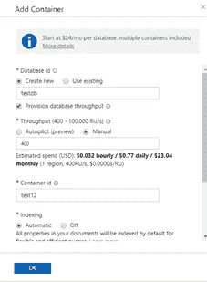
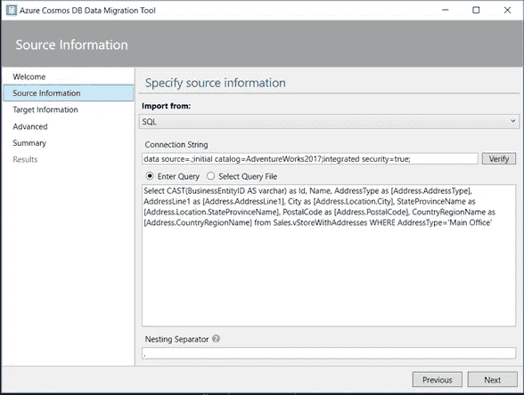
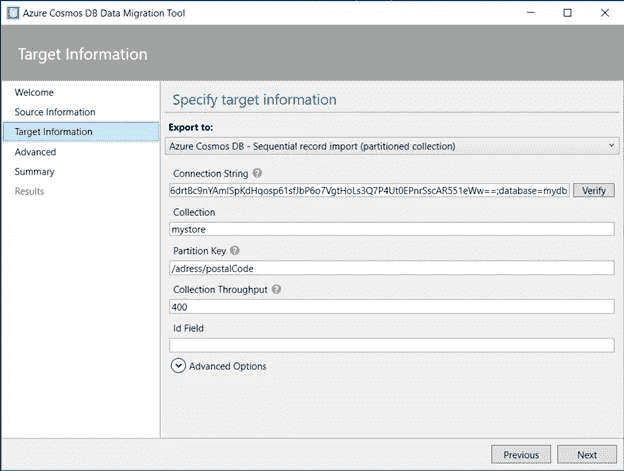
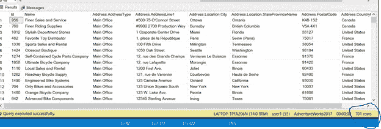
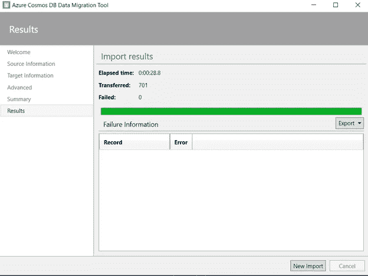
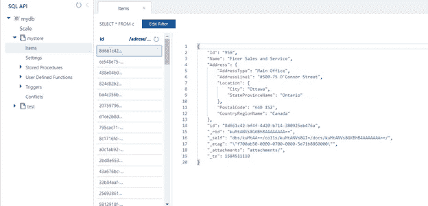

# 使用迁移工具将 SQL 数据库迁移到 Azure Cosmos DB

> 原文：<https://medium.com/analytics-vidhya/migrating-sql-database-to-azure-cosmos-db-using-migration-tool-19ddaa06792c?source=collection_archive---------22----------------------->

当今的应用程序需要高度响应且始终在线。为了实现低延迟和高可用性，这些应用程序的实例需要部署在靠近用户的数据中心。应用程序需要实时响应高峰时段使用量的巨大变化，存储不断增长的数据量，并在几毫秒内将这些数据提供给用户。

> 这是一个由 Azure 提供的名为 Cosmos DB 的 NoSQL 数据库

NoSQL 数据库的优势

*   向外扩展
*   模式自由
*   分布式(副本)

利用 Azure 开发 NoSQL 宇宙数据库的优势

*   低延迟
*   高可用性
*   多 API(核心 SQL API)
*   没有模式管理

在 **Cosmos DB** 中，我们需要**容器**来保存数据——在容器中，数据以分区的形式保存，如果数据增加，Azure 会自动增加分区。

我们还可以为不同的数据获取多个容器，因为数据可以存储在相同的容器中，但在不同的分区中，但有些数据必须用更多的 Ru 处理，而有些则用更少的 Ru 处理，因此从技术上来说，我们选择不同的容器。

我们还必须在制作容器时指定分区键，这是针对 SQL API 的。如果我们部署一个 MongoDB API，那么我们必须使用集合而不是容器

**从 SQL Server 迁移数据**

正如我们所知，cosmos DB 是一个非结构化的数据库，因此当从 SQL Server 迁移时，我们将关注模式是否定义良好，因为在 cosmos DB 中我们不能创建连接，因此需要在文档之间建立良好的关系。

我们将需要迁移工具- Azure 宇宙数据库数据迁移工具

**第一步:**

我们需要选择迁移选项作为 SQL，并将连接字符串作为 **data source=。；初始目录= AdventureWorks2017 集成安全性= true**

在将查询粘贴到框中之前，请记住创建一个包含所有相关信息的 normalize 视图，行数将定义要创建的文档数，我们必须使用(**)。操作符来创建分区，因为 Cosmos DB 将使用该操作符来区分嵌套的属性。**

**第二步:**

现在，我们将放置 cosmos DB 的连接字符串，我们将选择主连接字符串，因为它使我们能够完全访问我们将从门户中的密钥部分获得的帐户

粘贴连接字符串后，必须先创建一个数据库，因为它不会自动生成

不需要选择高级选项并开始导入，要验证导入是否正确，我们可以通过运行上面的查询(预期 701 行)看到已传输的项目数与 SSMS 的行数相同。

**第三步:**

然后，我们可以前往门户网站，检查迁移是否成功。

