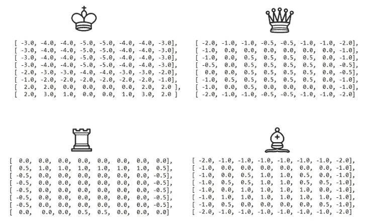
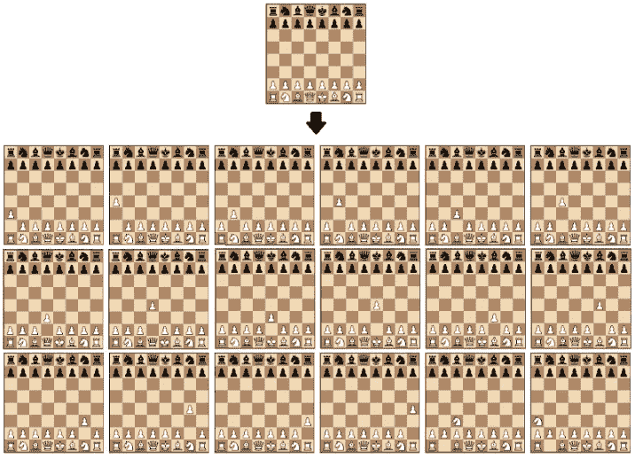
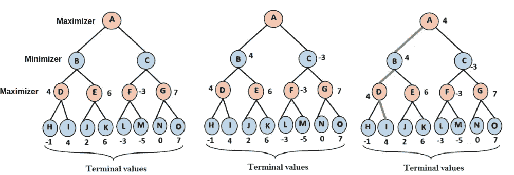
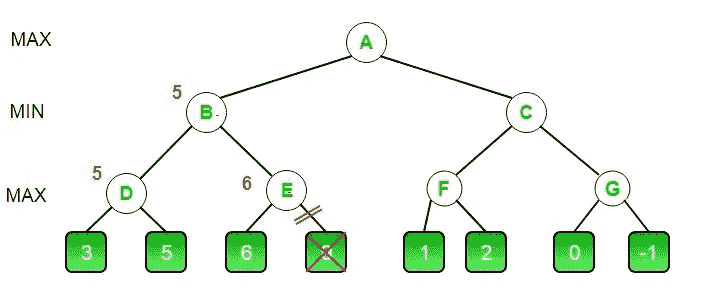

# 迷你-最大

> 原文：<https://medium.com/analytics-vidhya/mini-max-acc8d6b88cb1?source=collection_archive---------2----------------------->

当有人谈到人工智能时，人们只会想到一些像回归模型或分类技术这样的与机器学习最相关的方法。但是正如我在以前的文章中提到的，假设这些方法是人工智能的总簇是不明智的。有许多不同的方法、算法、模型需要或不需要训练数据集，甚至像人工智能学科中的余弦相似性这样的基本数学公式。机器学习课上一般不会提到的这些算法之一就是 *Mini-Max* 算法。这种算法不仅用于人工智能，还用于其他领域，如博弈论、决策理论、统计学，甚至哲学。在这篇文章中，我从人工智能和博弈论的角度举例说明。

# 定义

如果你想了解什么是 *Mini-Max* 算法，你可以在一个游戏板上定义它，两个对手在比赛，其中一个想最大化总得分，另一个试图最小化总得分。对于玩家 P1 来说，在棋盘上抓住对手的*主教*可以赢得 100 分。她的对手 P2 可能会失去-100 分，如果他从他这边做出同样的举动。重要的一点是，P2 满足于丢分，因为他想最小化总分，而 P1 试图最大化总分。在这种情况下，价值的积极或消极并不意味着价值的巨大，但它标志着玩家的一面。

# 得分

仅使用一种评分方法不是强制性的。您还可以添加其他得分层，不仅可以捕捉棋子，还可以捕捉棋子在棋盘上的位置，以及棋盘上每个方块的值。在国际象棋比赛中，有时玩家会牺牲自己的棋子以获得未来更好的收益。在这种情况下，如果你打算在下一回合拿下对手的*皇后*，失去一个*主教*可能不是最糟糕的情况。因此，在这种情况下，您可以使用棋盘上棋子位置的值矩阵来为模型提供这种智能。有一些网站解释了棋盘中每个方格的重要性值，它们共享一个基于每个棋子重要性分数的值矩阵，如图 1 所示。

图 1:每个棋子的棋盘价值矩阵。此图片是从[【s*source】*](https://www.freecodecamp.org/news/simple-chess-ai-step-by-step-1d55a9266977/)*检索而来，仅用于教育目的。*

您可以使用图 1 中的精确矩阵或其他矩阵。你甚至不需要使用它。您可能更喜欢使用另一个评分层。例如，不使用位置矩阵，你可以直接使用棋子的值列表，比如一个*棋子*值 1 分，一个*皇后*值 10 分。但是这一次你的人工智能模型专注于捕捉棋子而忽略了位置。在这种情况下，你可以看到一个*国王*移动到棋盘的中央，只是为了抓住一个*棋子。但是在大多数时候，将你的*王*放在一个更安全的区域(而不是中心)是更明智的选择。正如你所看到的，人工智能模型可能会根据你在算法中的选择而表现不同。你改变模型的*智能*(或*特征*)。这就是人工智能的美妙之处。*

你必须通过考虑主要目的来仔细指定算法的需求。在国际象棋的例子中，捕获对手的棋子是一个目的。但这不是主要目的。主要目的是用将死击败你的对手。捕捉一块是较低的焦点。因此，我认为在你的评分层中添加一个职位值矩阵，而不是直接使用一个计件值列表，是一个更好的解决问题的方法。

# 深度

对于任何使用 *Mini-Max* 算法的游戏，都有一个名为*‘depth’*的参数，这个参数大部分是由游戏的角色用户声明的。当轮到你出牌，到了人工智能模型出牌的时候，模型会为每个合法的走法模拟游戏。对于每次移动，它都会计算该移动对模型的输出值。它还会在对手可能的移动后为对手方不断模拟游戏。然后它假设两个招式(AI 一个，对手一个)后，模拟第三个招式(这次是 AI)。不断重复此过程，直到达到参数*深度*为止。然后从*最深*开始计算棋盘各状态的分数。如果模型是博弈的最大化方，它认为它需要为对手的移动取最小值(如果模型是最大化方，那么它的对手是最小化方)和最大值。你可以把它想象成模型的*假设*模拟。

增加模型的深度会导致复杂度以对数方式增加。因此，将深度增加到严肃的数字是一个艰难的决定。因为由于计算部分增长巨大，你需要确保你有一台计算机可以在几秒钟内处理这个过程，否则你可能要等上几个小时才能从模型中移出。此外，很高兴知道在一场国际象棋比赛中，3 步后共有 8，902 个位置，而在围棋比赛中，这个数字会急剧增加。在一个典型的深度为 150 步的围棋游戏中，大约有 250 个⁵⁰，或者 10 个⁶⁰可能的走法。详细信息可以查看[环节 1](https://www.chess.com/forum/view/general/i-need-a-math-genius-to-explain-how-many-chess-positions-there-are#:~:text=There%20are%205%2C362%20distinct%20chess,and%20two%20moves%20for%20Black).) 和[环节 2](https://www.scientificamerican.com/article/how-the-computer-beat-the-go-master/#:~:text=But%20go's%20complexity%20is%20bigger,or%2010360%20possible%20moves.) 。

图 2:白方第一步棋棋盘的可能状态。此图片来自[【源】](https://www.freecodecamp.org/news/simple-chess-ai-step-by-step-1d55a9266977/) *仅供教育之用。*

可以像图 3 中一样说明*最小-最大*算法。请记住，在最大化步骤中，模型选择在最小化步骤中给出最大数量和最小数量的节点。最后，它根据所选节点的状态进行移动。

图 3:最小最大算法的图示。此图片是从[【s*source】*](https://neelshelar.com/minimax-algorithm-alpha-beta-pruning-adversarial-search/)*检索而来，仅用于教育目的。*

# 阿尔法-贝塔剪枝

当一个模型模拟 *Mini-Max* 算法的场景时，它可能必须进行巨大的计算，尤其是当*深度*非常高的时候。并且观察到，即使保证不选择，该模型也计算状态。通过将同一行最小化(或最大化)状态中的当前节点的值与前一个上层节点的决策进行比较，您可以确定计算是不必要的，该上层节点通过在其子节点之间选择一个数字来声明该值。

在图 4 中，有一个 *Alpha-Beta 剪枝*方法的图示。首先， *Mini-Max* 模型执行的计算是计算节点 d 下左侧节点的值。其值计算为 3。第二步是计算节点 D 下的右节点，其值为 5。所以节点 D 的值是 5，因为它是最大化节点，并且数字 3 和 5 之间的最大值是 5。下一步是计算节点 E 下左侧节点的值，其值计算为 6。因此，模型知道节点 E 的任何值必须大于或等于 6，因为节点 E 是另一个最大化节点，并且它已经有一个值为 6 的子节点。未来节点 B 要在节点 D 和节点 e 之间选择一个值，由于节点 B 是极小节点，所以需要选择值 5 或 6≥。现在节点 B 的选择是 5，节点 B 的值是 5。如你所见，由于 *Alpha-Beta 修剪*，该模型没有计算 E 下右边节点的值。让我们想象一个场景，其中没有使用这种方法，模型计算每一步，而不管是否需要这样做。此外，在这种情况下,*深度*很高。这两个因素的结合导致处理时间如此之长。

图 4:Alpha-Beta 修剪方法的图示。此图片是从[【s*source】*](https://www.geeksforgeeks.org/minimax-algorithm-in-game-theory-set-4-alpha-beta-pruning/)*检索而来，仅用于教育目的。*

# 摘要

你可以在本文中找到关于 *Mini-Max* 算法和 *Alpha-Beta 修剪*的基本信息。你也可以有一个基本的理解，以便在你完整地阅读完这篇文章之后，实现一个在任何编程语言中使用这些方法的模型。

查看我的 Github repos，在那里你可以通过使用链接或卡片找到[象棋游戏](https://github.com/yesyigitcan/Minimax-Chess)和 [TicTacToe 游戏](https://github.com/yesyigitcan/MiniMax-TicTacToe)上 *Mini-Max* 和 *Alpha-Beta 修剪*的代码实现。

 [## GitHub——yesyigitcan/Minimax-Chess:在国际象棋游戏中使用……

### 此时您不能执行该操作。您已使用另一个标签页或窗口登录。您已在另一个选项卡中注销，或者…

github.com](https://github.com/yesyigitcan/Minimax-Chess)  [## GitHub——yesyigitcan/MiniMax-TIC tactoe:在一个井字游戏上的智能实现模型

### 通过使用最小最大算法在一个井字游戏上实现模型智能你在你的终端上玩游戏…

github.com](https://github.com/yesyigitcan/MiniMax-TicTacToe)