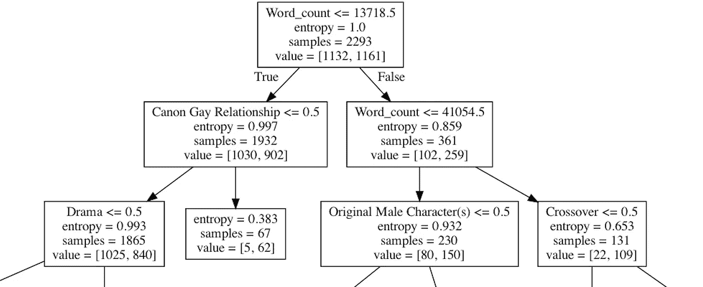
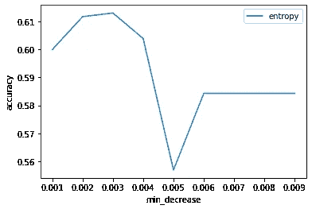
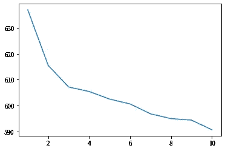
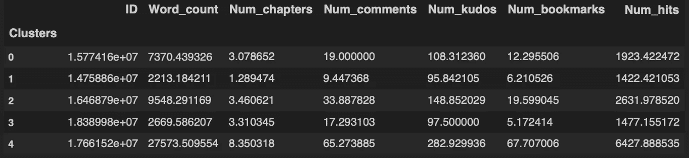

# AO3 粉丝挖掘第三部分:基于决策树和聚类的英汉文本分析

> 原文：<https://medium.com/analytics-vidhya/mining-fanfics-on-ao3-part-3-english-chinese-text-analysis-with-decision-tree-clustering-6dcaa0e8a7a6?source=collection_archive---------17----------------------->

首先，让我们回顾一下迄今为止从 AO3 收集的数据:

```
Title                     object
Author                    object
ID                         int64
Date_updated      datetime64[ns]
Rating                    object
Pairing                   object
Warning                   object
Complete                  object
Language                  object
Word_count                 int64
Num_chapters               int64
Num_comments               int64
Num_kudos                  int64
Num_bookmarks              int64
Num_hits                   int64
Tags                      object
Summary                   object
Date_published    datetime64[ns]
Content                   object
Comments                  object
```

(数据收集过程见[第 1 部分](https://moinmoin150.medium.com/mining-fanfics-on-ao3-part-1-data-collection-eac8b5d7a7fa))

在第 2 部分中，我们将重点放在了更结构化的数据上，忽略了标签、摘要、内容(实际上是虚构的文本)和注释。这些将是这篇文章的重点。

除了简单的词频统计，我首先探索了将决策树(DT)应用于标签的可能性，这样我们就可以将小说分为高流行和低流行两类。然后，我尝试了带摘要的 k-means 聚类。

# 决策图表

这本由 [Gustavo Hideo](https://medium.com/u/d7e4530589?source=post_page-----6dcaa0e8a7a6--------------------------------) 撰写的 [DT 实施指南](https://towardsdatascience.com/decision-tree-build-prune-and-visualize-it-using-python-12ceee9af752)给了我很大的帮助。理解 sk learn DT 分类器中的各种可用参数很有帮助。有一次，我不得不用 Python 从头开始构建 DT 模型，但它的灵活性和细微差别远远不及 sklearn 的“罐装”模型所能提供的所有修剪选项。简直是天赐良机。

这是我们在这一部分需要的东西:

```
from sklearn import tree
from sklearn.tree import DecisionTreeClassifier
from sklearn.model_selection import train_test_split
from sklearn.metrics import confusion_matrix
from sklearn.tree import export_graphviz
import pydotplus
import matplotlib.pyplot as plt
import matplotlib.image as pltimg
from sklearn.metrics import accuracy_score
import pandas as pd
import numpy as np
```

## 数据操作

为了应用 DT，我们需要为手头的文本数据创建虚拟变量。此外，标签以逗号分隔的字符串格式存储，例如

> G 对暴力、主要人物死亡、另一个宇宙、POV 第一人称、交叉的图形描述……

因此，在应用 pandas 的 get_dummies()函数之前，它们需要一些额外的处理来将它们转换成列表:

```
df.Tags = df.Tags.apply(lambda x: x.split(','))# first option
t = pd.get_dummies(pd.DataFrame(df.Tags.values.tolist()), prefix_sep='', prefix='')
```

第一个选项没有像预期的那样工作，主要是因为它用重复值扩大了列。对于有组织的、有序的或单值的列，它应该工作得很好，但是对于不同长度的无序列表，考虑每一列(垂直对齐)，然后依次“虚拟化”它们会导致意想不到的结果。

```
# second option
t2 = df.Tags.astype(str).str.strip('[]').str.get_dummies(', ')
```

这第二个选项使用 [pd。Series.str.get_dummies()](https://pandas.pydata.org/pandas-docs/stable/reference/api/pandas.Series.str.get_dummies.html) 采用了一种更复杂的方法，但在这种情况下可以按预期工作。

你可能想数一下最受欢迎的标签。虽然有许多其他方法可以做到这一点，但由于我们手头已经有了这个虚拟表，我们可以像这样构建一个字典:

```
dic = {}
for val, i in zip(t2.sum(axis=0), t2.sum(axis=0).index):
    dic[i] = val
dic
```

我们的树的特征列表可以被预先修剪。我认为一开始去掉极其罕见的标签是有意义的，但这是否有必要，是否是最佳实践还有待讨论。

```
# I examined the number of rare tags and found the cutoff point I'm most happy with
len([key for key, val in dic.items() if val < 30])t2 = t2.drop([key for key, val in dic.items() if val < 30], axis=1)# You may also want to exclude other non-informative tags, such as ['Creator Chose Not To Use Archive Warnings','No Archive Warnings Apply', 'Don't copy to another site'], which turned out to skew the result a lot
```

我的数据没有任何预定义的分类标签。出于我自己的探索目的，我任意创建了一个由高于中值的工藤数定义的“成功”变量:

```
mark = np.median(df.Num_kudos)
df['Success'] = df.Num_kudos.apply(lambda x: int(x>=mark))
```

然后，我将这个变量以及其他感兴趣的变量添加到我的虚拟表中:

```
for_tree = pd.concat([df[['Success','Word_count']],t2], axis=1)
```

## 训练和评估模型

我们需要定义预测值(x)和预测值(y ),然后将它们分成训练集和测试集:

```
X = for_tree.iloc[:,1:]
y = for_tree[['Success']]
X_train, X_test, y_train, y_test = train_test_split(X, y, random_state=1) #default 75% train
```

我们可以训练我们的模型—

```
dt = DecisionTreeClassifier(criterion="entropy", max_depth=5, min_impurity_decrease=0.003)
dt.fit(X_train, y_train)
```

然后，我们可以看到哪些特征在分类中被认为是最重要的，即在分割后最有效地使组更纯:

```
for i in dt.feature_importances_.argsort()[:-20:-1]: # Top 20
    print(X.columns[i])
```

我们还可以通过以下方式检查深度

```
dt.get_depth() # when max_depth is set low (to improve interpretability in my case), it usually reaches the maximum, but in some cases it might not.
```

为了评估我们的模型在分类方面的表现，混淆矩阵就派上了用场:

```
y_pred = dt.predict(X_test)
a = confusion_matrix(y_test, y_pred)
np.diag(a).sum()/a.sum() # percent of accurately classified fictions
```

## 解释结果

由于 DT 在视觉表现上有优势，我们可能希望在树形图中看到我们的最终结果，并试图解释它。

```
data = tree.export_graphviz(dt, out_file=None, feature_names=list(X.columns))
graph = pydotplus.graph_from_dot_data(data)
graph.write_png('mydecisiontree.png')# I encounter "ValueError: Program dot not found in path" when running this. Using "brew install" instead of "pip" somehow solved the issue for me.
```



结果树图的一部分

按照这个图，我们只需要记住，对于标签伪变量，不包含它(0)导致左树，包含它(1)导致右树。在“value = [a，b]”中，a 表示“假”(0)的数量，而 b 给出还有多少“真”(1)。(经验法则:左边总是更小)

从上面的图表中我们可以看到，字数似乎比任何标签都重要，并且该树将小说分为 14k 字以下、14k 到 41k 之间和 41k 以上。对于不同长度的小说，包含某些标签会导致完全不同的结果。例如，对于较短的小说，包括“佳能同性恋关系”似乎是一个好主意。但是这决不是规定性的，因为我们不能在这里建立因果关系。但我们确实可以从数据中观察到一般读者的偏好。

你可能想知道我是如何为 DT 分类器选择参数值的。为什么是熵而不是基尼？事实上，这些选择可能会严重影响模型性能。我们可以使用一个循环来收集不同值的影响。例如，min _ infinity _ decrease 作为是否会发生分裂的阈值是非常有影响的。我们可以检查并想象它的效果，以选择最佳方案:

```
min_decrease = []

for i in range(1,10):
    dtree = DecisionTreeClassifier(criterion='entropy', max_depth=20, min_impurity_decrease=i/1000)
    dtree.fit(X_train, y_train)
    pred = dtree.predict(X_test)
    acc_entropy.append(accuracy_score(y_test, pred))

    min_decrease.append(i)d = pd.DataFrame({'acc_entropy':pd.Series(acc_entropy), 'min_decrease':pd.Series([i/1000 for i in min_decrease])})
plt.plot('min_decrease','acc_entropy', data=d, label='entropy')
plt.xlabel('min_decrease')
plt.ylabel('accuracy')
plt.legend()
```



我们可以构建多线图表来比较基尼系数和熵与不同深度或分割阈值的关系。前面提到的文章更详细地说明了这个过程。

# k 均值聚类

我还对小说作者在这个爱好者圈子里写的主题感兴趣，而对小说文本进行聚类将是一项要求过高的工作，可能会烧坏我可怜的笔记本电脑——*对我来说，对像小说这样的长文本进行聚类是否是一件标准/明智/可行的事情仍然不清楚。*

为了保持这个项目的胃口，我决定先把摘要聚集起来，希望它们能为真实的小说提供一个很好的预览。

以下是所需的附加库:

```
import nltk
import re
from sklearn import feature_extraction
from sklearn.feature_extraction.text import TfidfVectorizer
from sklearn.metrics.pairwise import cosine_similarity
from sklearn.cluster import KMeans
from nltk.stem.snowball import SnowballStemmer
# from gensim import corpora, models, similarities <-- use if LDA
```

## 数据操作

自然语言处理和信息检索的理论我就不深究了。一个简化的过程包括标记化、词干化、删除停用词和矢量化。

以下是英语的流程:

我们构建了自定义的停用词表、标记器和词干分析器，以输入到 TfidfVectorizer 中，然后使用它依次对每个摘要进行编码。结果将是形状的稀疏矩阵—(文档数、特征数)。

你可以深入研究 TfidfVectorizer 的[文档](https://scikit-learn.org/stable/modules/generated/sklearn.feature_extraction.text.TfidfVectorizer.html)来寻找更多的杠杆。例如，Max_df=0.8 表示我不会查看在超过 80%的文档中出现的术语(这可能不会提供太多有用的信息)。min_df=5 表示该术语需要出现在 5 个以上的文档中才能被认为是有价值的。

以下是获取这些功能的方法:

```
terms = tfidf_vectorizer.get_feature_names()
```

我们使用 TF-IDF(术语频率乘以逆文档频率)而不是简单的计数，因为它考虑了术语在特定文档中的重要性及其相对于整个语料库的重要性。这个想法是，如果一个在整个语料库中罕见的术语确实出现在某个文档中，它一定对该文档有特殊的意义。因此，我们降低了出现在大多数文档中的标记的权重，同时突出了更有意义的标记。

由于我们的 tfidf_matrix 中的值表示它们的相对重要性，我们甚至可以通过以下方式找到某个文档的关键字——

```
for i in tfidf_matrix[your document's index].toarray()[0].argsort()[::-1][:30]:
    print(terms[i])
```

我们还可以使用余弦相似度来查找最接近的文档，但我不会在这里详细介绍:

```
cosine_similarity(tfidf_matrix)[your document's index].argsort()[:-5:-1] # top 4 neighbors since the first would always be itself
```

此外，这里有一个关于[使用停用词](https://scikit-learn.org/stable/modules/feature_extraction.html#stop-words)的有用说明，因为我一路上遇到了很多这样的警告:

> Y 您还应该确保停用词表已经应用了与矢量器中使用的相同的预处理和标记化。单词*we have*被 CountVectorizer 的默认标记器拆分为 *we* 和 *ve* ，因此如果*we have*在`stop_words`中，而 *ve* 不在，那么在转换后的文本中，将从*we have*中保留 *ve* 。我们的矢量器将试图识别和警告某些类型的不一致。

Processing Chinese summaries is a totally different story. While English has clearly space-delimited words as tokens, Chinese token definition can be a little complicated. More than one characters can stick together to constitute one token, such as ‘学校’ for ‘school’ — either of these characters alone wouldn’t carry the intended meaning.

它还需要一组不同的停用词、句尾和正则表达式模式匹配规则。幸运的是，我们有很多可用的好资源:

> 停字:[https://github.com/stopwords-iso/stopwords-zh](https://github.com/stopwords-iso/stopwords-zh)
> 
> unicode 中的汉字:【https://github.com/tsroten/zhon/blob/develop/zhon/hanzi.py 
> 
> 标记化:【https://github.com/fxsjy/jieba】T4
> 
> 深度学习:[https://github.com/PaddlePaddle/Paddle](https://github.com/PaddlePaddle/Paddle)

要加载的其他工具包可能需要先安装:

```
import jieba
from __future__ import unicode_literals
import paddle
```

中国人的流程是这样的:

对于这两种语言，下面的过程是相同的。

## 构建模型

为了检查最佳的集群数量，我们可以通过以下方式建立一个肘形图

```
km = [KMeans(n_clusters=i) for i in range(1,11)]
score = [k.fit(tfidf_matrix).inertia_ for k in km]
plt.plot(range(1,11),score)
```



虽然看起来只有 3 个集群是最佳的，但经过几次尝试后，我发现 5 个集群的解决方案是最合理的。

```
km = KMeans(n_clusters=5)
km.fit(tfidf_matrix)# append cluster labels back to the dataframe
clusters = km.labels_.tolist()
eng_sum['Clusters'] = clusters# compare each cluster's centrality measures
grouped = eng_sum.groupby('Clusters') # or chi_sum
grouped.mean()
```



```
# to know how many members each cluster has
grouped.size()
```

## 解释结果

为了理解这些聚类，我们可以按照 TF-IDF 值以及几个有代表性的假设来查看每个聚类的关键字:

```
importance_by_cluster = km.cluster_centers_.argsort()[:, ::-1] for i in range(5):
    print("Cluster {} words:".format(i))

    for ind in importance_by_cluster[i, :20]:
        print(terms[ind]+', ', end=' ') # top 20 words
        # terms are the list of features

    subset = eng_sum[eng_sum.Clusters==i].copy() # or chi_sum
    subset = subset.sort_values(by='Num_hits', ascending=False)
    print(subset.iloc[:10,[0,2]]) # print out most popular fictions belong to the cluster as representatives
```

例如，在我探索的粉丝圈中，我发现了一个关注哈利·波特和伏地魔之间互动的集群，关键词是“哈利、世界、波特、巫师、汤姆、黑暗、时间、生命、死亡、霍格沃茨、伏地魔、魔法、riddl、活着、力量，”另一个集群显然从 tumblr 的写作提示中获得了灵感——“提示、提示吻、吻、符号、Tumblr、drabbl、exchang、challeng，”还有另一个情感丰富的作者群触摸着厄里斯之镜——“镜子、镜子厄里斯、厄里斯、看见、袜子、看镜子

While Chinese and English topics are vastly different, interestingly, they both had one cluster dedicated to the mirror of erised. The Chinese version has somewhat similar keywords — “厄里斯 (erised), 魔镜 (mirror), 自我, 站, 恨, 邓校, 欺骗, 厌弃, 年少轻狂, 少不更事, 德姆斯特朗, 看到 (see), 撒谎 (lie), 面前 (front).” (overlapping ones translated)

我们可以将我们从查看这些关键字中获得的对聚类的理解与来自其他数值变量的中心性度量结合起来，以得出更有见地的结论，例如什么主题会引发最多的反应，以及哪些主题会是更好的点击诱饵。

虽然我另外尝试了主题建模，但它基本上证实了来自集群的见解，所以我不会在这里介绍它。

当然还有更多的可能性可以玩。我会继续探索新的选择😊