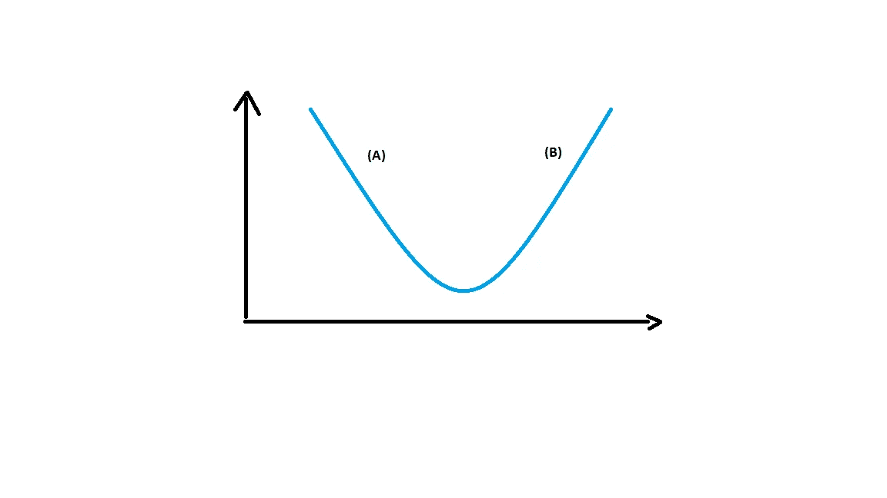

# 梯度下降中的负值

> 原文：<https://medium.com/analytics-vidhya/minus-in-gradient-descent-319fe4282f55?source=collection_archive---------11----------------------->

快速和更好的数学直觉…

图片来自 [ResearchGate](https://www.researchgate.net/publication/325142728_Spatial_Uncertainty_Sampling_for_End-to-End_Control/figures?lo=1)

# 介绍

本文以数学上直观的方式解释了梯度下降(GD)算法。文章的主要重点是用最少的文字和资源(方程式和图表)彻底解释这个概念。

不管你是否知道算法，你都应该读到最后。你可能会理解得更清楚，或者找到更好的解释方式。

# 直觉

让我们首先来看一下算法。

图一。梯度下降算法，其中学习率为 *α*

图 1 中的等式一直运行到收敛。换句话说，这个等式将继续运行，直到导数变为零或斜率变为零

图 2。摘自 [rasbt.github.io](http://rasbt.github.io/mlxtend/user_guide/general_concepts/gradient-optimization/)

该图清楚地说明了算法的目的。 ***目标是使其达到最小值*** 并停在那里。球在一步或一次迭代中沿 x 方向移动的量称为学习率。斜率是在特定时刻绘制的切线。

为了解释的目的，我们假设梯度下降是优化线性回归，用 ***J*** 作为成本函数。所以，如果我们用文字来写这个数学方程式，它会是

图 3。词的梯度下降

以稍微不同的方式写这个等式。

图 4。以稍微不同的方式书写的梯度下降

现在，你可能会想这有什么区别。嗯，有。
实际上，梯度下降*使*球在当前坡度的**相反方向向最小值**移动。让我解释一下。

图 5。基本凸曲线

让我们考虑图 5 中给出的凸曲线。从图中我们可以看出，最小值是斜率/导数从负变为正的点。斜率/导数最小值为零。

## 的情况

*   **案例一:**
    假设你在图的(A)边。如果我们试图对这一边的任何一点求导，斜率或导数将是负的。当我们将导数值输入 GD 时，它会将球向右移动。当球进一步向最小值移动时，这是正确的。
*   **案例二:** 假设你在图的(B)边。如果我们试图对这一边的任何一点求导，斜率或导数将是正的。当我们将导数值输入 GD 时，它会将球向左移动。当球进一步向最小值移动时，这是正确的。

这就是为什么，重要的是把 GD 写成图 4 的形式，弄清楚斜率的*负值是如何在算法中使用的。*

# 结论

总之，我要说的是，知道*负号*如何影响梯度下降到最小值的运动是很重要的。我建议的方法可以帮助你快速记住并解释它。

这是我的第一篇文章，我期待着建设性的批评，并希望知道你的建议。我希望我的文章清楚地表达了这一点，即以稍微不同的方式书写梯度下降。

你可以在 [Twitter](https://twitter.com/MundadaM) 或者 [GitHub](https://github.com/AlKun25) 上和我联系。