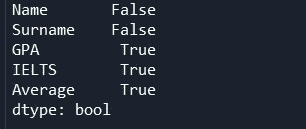
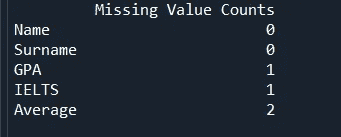

# 数据科学中缺失的价值

> 原文：<https://medium.com/analytics-vidhya/missing-values-in-data-science-8e3989fc5e79?source=collection_archive---------12----------------------->


Abbasgulu Allahverdili 摄

几乎每个数据集都包含缺失数据，这不应该被轻易考虑，因为它们的存在是最重要的问题之一。有问题的原因是在计算过程中获得的结果可能误导，并且没有提出处理它们的最佳方式。

在本文中，将提供一些丢失数据的一般描述以及可能的解决方案。

## **什么是缺失数据？**

缺失值是指在观察过程中没有存储在数据集中的值。D.B .鲁宾在 1976 年对缺失值进行了分类。他认为每个数据点都有可能丢失。这些类别如下:

完全随机失踪(MCAR)

随机失踪(三月)

非随机缺失(MNAR)

## **班级:**

## 完全随机失踪(MCAR):

在这种情况下，丢失的值与观测值无关。如果所有情况下被遗漏的可能性相等，则数据被完全随机遗漏。然而，MCAR 的数据在实践中极不寻常。

例如，在人口调查期间，如果有任何回答丢失，那么它们将被完全随机地遗漏。

## 随机缺失(三月):

当丢失的变量可以由另一个变量定义，而不是由丢失的值本身定义时，就会出现这种情况。

例如，在关于两性抑郁水平的调查中，与女性相比，男性不太可能回答关于抑郁水平的问题。因此，缺失值仅取决于性别。这个案子被标记了

## 非随机缺失(MNAR):

这个类的另一个调用是“不要随意丢失(NMAR)”。这里，丢失的值由于未知的原因而丢失。这些价值观丢失的原因之一可能是回答者的拒绝。MNAR 是一个复杂的案件，因为这个案件的处理比其他案件更困难。没有办法在不给数据集引入偏差的情况下丢弃或估算这些值，这可能会改变结果并在将来误导我们。

工作场所的调查问卷就是一个很好的例子，在这种情况下，雇员或雇主不会回答有关他们工资的问题。

## **识别:**

用 Python 识别缺失值很容易，因为它很简单。首先，应该导入 apt 库并读取数据集。

```
import pandas as pd
df = pd.read_excel(r'...dataset.xlsx')
```

缺失数据识别的第一种方法是:

```
df.isna().isany()
```

它返回列的布尔输出(“真”或“假”)。在为“真”的情况下，列包含缺失值。另一方面，“False”表示不存在缺失值。



缺失数据识别的第二种方法是:

```
df.isna().sum()
```

它返回列中缺失值的数量。



## **处理:**

提出了处理缺失值的各种方法。处理缺失数据的方法主要有两种，即:简易和专业。

## **简单易行:**

忽略缺少值的元组:当给定的数据集很大并且缺少几个值时，这种方法是合适的。

删除缺失值:仅适用于数据较大的情况。

## **删除:**

删除本身分为 4 个不同的类别:

Listwise:对于存在 MCAR 的大型数据集，这是一个简单的解决方案，也称为“完全案例分析”。对于小规模数据集，它会产生偏差并误导结果。在这种情况下，整个变量都将被删除。

成对:当存在一些丢失的数据时，删除发生。应该考虑具有完整病例的子集，因为它保留了更多的信息。

整个变量:如果一列包含 60%的缺失值，那么这一列可以完全删除。

删除:删除整行数据的过程。

## **职业方式:**

尽管丢弃是处理丢失数据的一种方法，但它有一个非常重要的缺点。由于缺少一个值，整个数据将被删除，这在求解过程中是很有价值的。这就是为什么输入(填充)丢失的值是更好的选择，而不是丢弃。

## **插补:**

插补是处理缺失值的最佳策略。提出了不同的估算方法，从简单到复杂。

## **平均值/中值/众数:**

插补方法之一是使用平均值或中间值。应该计算特定列的平均值和中值，然后填充缺失的数据。然而，对于分类数据，使用了 mode 函数。

```
#impute by mean
missing_col = ['GPA']
for i in missing_col:
    df.loc[df.loc[:,i].isnull(),i]=df.loc[:,i].mean()#impute by median
missing_col = ['IELTS']
for i in missing_col:
    df.loc[df.loc[:,i].isnull(),i]=df.loc[:,i].median()
```

## **优点:**

它又快又简单。

当平均值被估算时，整个列的平均值不变。

使用平均值是有意义的，因为它是随机选择的观察值的合理估计。

## **缺点:**

对于分类特征，它可能给出较差的结果。

方差减小，扭曲了其余变量之间的协方差。

## **线性回归:**

线性回归可以按以下方式使用。通过现有变量，预测值将在数据集中进行计算和估算。变量之间的关系将被保留。然而，这种方法的缺点是在每种情况下都要考虑线性回归，并且会降低标准误差。

## **KNN 最近算法**

这种方法需要 k 个最相似的观测值和邻居的平均值/中值/众数来估算缺失值。这是一种用于简单分类的算法，使用“特征相似性”来预测新数据集的值。变量之间的距离是使用 kNN 算法的重要参数之一。但是这种算法计算量很大，所以不太推荐。

## **随机回归:**

在这种情况下，计算的预测值和残差相加。它类似于线性回归方法，但增加了随机成分，这也是这种方法的一个优点。

## **链式方程多重插补(小鼠):**

要考虑的一个方面是数据集和若干计算的分布。应该单独创建数据集以获得参数估计值。与其他方法相比，该方法可以逼近更好的值。

还存在其他几种输入缺失值的方法。然而，尽管有所有这些方法，数据集的性质要重要得多，因为插补无法给出确切的值。