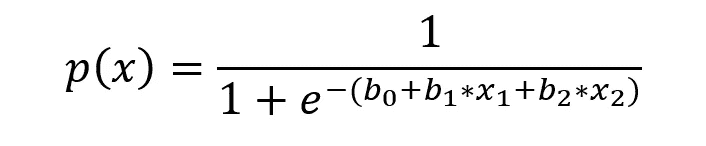

# 逻辑回归

> 原文：<https://medium.com/analytics-vidhya/ml-algorithms-from-scratch-2-2c1aea2bff3b?source=collection_archive---------7----------------------->

## 从零开始的机器学习算法

> "我相信我们不知道什么是肯定的，但一切都是可能的."
> ― **克里斯蒂安·惠更斯，作品完成**

我们已经学习了回归算法的一个基础，现在是时候看看我们是否能在分类算法中占有一席之地了。分类算法有助于将数据集分为不同的类别。举个例子，我们把垃圾分为湿垃圾和干垃圾，这是分类问题的一个典型例子。

任何分类算法的主要任务都是预测哪个数据集属于哪个类别，(在我们的例子中，哪个垃圾去了哪里)。市场上有成吨的分类算法，让我们从一个基本的开始，逻辑回归。逻辑回归是一个二元分类器，即它以 0 和 1 的形式陈述预测，即真或假。它是在特征变量的帮助下计算目标变量的概率。它在基础中使用了概率，正如你所猜测的，这是从概率中借用的许多主题之一。

闲聊太多，让我们来刨根问底吧！

# **什么是 Logistic 回归？**

逻辑回归也称为 Logit 回归。它通常用于估计一个实例属于某个特定案例的概率。让我们举一个例子来更好地理解这一点，如果你的收件箱中有 10 封电子邮件，邮件系统将如何将这些邮件分类为垃圾邮件或非垃圾邮件。它将首先扫描邮件并检测垃圾邮件中使用的常用词，然后将这十封邮件分类为垃圾邮件和非垃圾邮件文件夹，可能邮件系统正在使用逻辑回归。该算法的基本工作是，如果估计的概率大于阈值，比如 60%，那么它将预测该实例属于特定类别(比如正类别，标记为 1)，否则它将该实例分类为另一个类别(比如负类别，标记为 0)。我们可以说，逻辑回归也是一种二元分类器，因为它将数据集分类为 0 和 1。通常，逻辑回归用于两类值。

逻辑回归使用 sigmoid 函数来预测特定类别的概率。

Sigmoid 函数

由于逻辑回归借用了概率，因此 sigmoid 函数返回 0 到 1 范围内的值。通常使用的阈值是，如果该值大于或等于 0.5，则为阳性，否则为阴性。你现在可能会发现所有这些乱七八糟的东西，让我们动手操作一下，这样我们就能更仔细更好地了解算法。

# 履行

我们将通过导入所需的库来开始我们的项目，这里我们使用:

*   [熊猫](https://pandas.pydata.org/):用于数据处理和操作
*   [Numpy](https://numpy.org/) :用于数学运算
*   [Matplotlib](https://matplotlib.org/) :用于数据可视化
*   [load_iris](https://scikit-learn.org/stable/modules/generated/sklearn.datasets.load_iris.html) :我们将从这里使用预先存在的数据集。
*   [train_test_split](https://scikit-learn.org/stable/modules/generated/sklearn.model_selection.train_test_split.html) :用于将数据拆分为训练集和测试集。

导入数据后，我们将看到我们的数据实际上是什么样子，因为我们是从 sklearn 导入数据的，我们不需要格式化数据，这已经是一种理想的方式了。

但是，由于我们要用逻辑回归来训练数据，逻辑回归是一个二元分类器，所以我们将以目标变量是二元的方式来创建数据。

有四个特性名称可供我们使用，但是我们将只使用数据中的两个名称，`Petal Length`和`Petal Width`，也正如我们在将目标变量转换为二进制数据之前所讲的那样。

因此，我们要预测一朵鸢尾花是否属于北美鸢尾。

然后，我们将把我们的原始数据转换成一个数据帧，有 3 列，花瓣长度，花瓣宽度和 Virginica。

有了数据框后，我们将使用 train_test_split 函数将数据分成训练集和测试集，在此之前，我们将把数据分成特征和目标变量。

所以现在我们的数据已经准备好接受逻辑回归训练了。在继续之前，让我们看看实际上将要发生什么。

Sigmoid 函数

我们已经讨论过我们的 sigmoid 函数，我们看过这个图形，这是这个函数在数字形式下的样子，我们不能直接使用这个方程，所以我们要稍微修改一下这个方程。

逻辑回归预测

我们将使用上面的等式来进行预测，等式几乎是相同的，我们只是添加我们的权重(b0，b1，b2)。这些重量会帮助我们做出准确的预测。这些权重将首先在某个点被初始化(假设所有都等于 0)，然后使用另一个等式来更新这些权重的值。

首先，我们有一个预测，因为我们已经将所有权重初始化为 0，无论数据是什么，预测结果都是 0.5。

所以现在，是时候改善了。

在提高权值的同时，我们要指定学习率，我选了 0.3。然后，我们将插入其他值，从而在更新值的同时更新我们的值。

现在我们知道了如何更新权重，以及如何进行预测，让我们把所有这些东西放在一起，创建一个相同的函数。

上面的函数首先将数据转换为 NumPy 数组，然后循环给定数量的 epoch，在该循环中，我们还有另一个循环，它循环数据，进行预测并不断更新数据，为了方便起见，我为权重创建了一个空列表，我们可以在其中查看稍后给出的权重值。

在找到各代的权重值后，我们现在需要进行预测，以了解这些值有多理想。

上面的函数将创建一个列表`pred_list`，其中包含使用权重进行的预测。

sigmoid 函数所做的预测将介于 0 和 1 之间，但我们需要的值要么是 0，要么是 1。因此，我们将有另一个清晰的函数，将值转换成我们需要的格式。

如果该值大于或等于 0.5，则它将是正类，否则它将是负类。

现在我们的预测已经准备好了，现在我们必须将预测与真实值进行比较，以便了解模型的表现如何。为此，我们有另一个函数。

这个函数将计算我们的模型的准确率。

如果我们一个接一个地运行这些函数。(在这种情况下，我选择了 35 个纪元。)我们会得到我们的预测分数。

呜哇！！我们以 82%的准确率预测了花的种类。这是一件了不起的事情！

# 结论

*耶！我们做到了，*我们使用逻辑回归方法的随机梯度下降来使用花瓣长度和宽度预测鸢尾花的种类。总而言之，我们将数据分为训练集和测试集，然后使用 sigmoid 函数来计算预测，然后更新权重，直到获得更好的预测。

你也可以看看包含我在博客中使用的代码和数据的 [GitHub 库](https://github.com/rithurajnambiar17/iris-flower-classification)。

*非常感谢阅读到最后！*

> 如果你需要任何进一步的信息，请不要犹豫与我联系。
> 
> 作品集:[rithurajnambiar 17 . github . io](http://rithurajnambiar17.github.io/)
> 
> 领英:[https://www.linkedin.com/in/rithuraj-nambiar/](https://www.linkedin.com/in/rithuraj-nambiar/)
> 
> GitHub:[https://www.github.com/rithurajnambiar17/](https://www.github.com/rithurajnambiar17/)
> 
> 电子邮件:[rithurajnambiar17@gmail.com](mailto:rithurajnambiar17@gmail.com)