# 最大似然算法——优缺点和适用场合

> 原文：<https://medium.com/analytics-vidhya/ml-algorithms-pros-cons-and-suitable-usages-b377c3c09f1b?source=collection_archive---------2----------------------->

原故事:[https://www . technoskool . com/post/introduction-to-ml-algorithms](https://www.technoskool.com/post/introduction-to-ml-algorithms)

# 决策图表

**上市日期:**“决策树”方法可以追溯到 1959 年，英国研究员威廉·贝尔森发表了一篇题为《生物分类原理的匹配和预测》的论文，他在文中描述了决策树

**训练类型:**监督算法

**优势和局限:**

*   **优势:**
*   **简单易懂，易于解读。**经过简单的解释，人们能够理解决策树模型。树也可以用非专家也能理解的方式用图形显示。
*   **能够处理数值型和** [**分类型**](https://en.wikipedia.org/wiki/Categorical_variable) **数据。**其他技术通常专门用于分析只有一种变量的数据集。(例如，关系规则只能用于名义变量，而神经网络只能用于转换为 0-1 值的数值变量或类别。)早期的决策树只能处理分类变量，但是最近的版本没有这种限制。
*   **需要很少的数据准备。**其他技术通常需要数据规范化。由于树可以处理定性预测，因此没有必要创建[虚拟变量](https://en.wikipedia.org/wiki/Dummy_variable_(statistics))。
*   **采用的是** [**白盒**](https://en.wikipedia.org/wiki/White_box_(software_engineering)) **或开盒模型。**如果给定的情况在模型中是可观察的，那么对该情况的解释很容易用布尔逻辑来解释。相比之下，在[黑盒](https://en.wikipedia.org/wiki/Black_box)模型中，对结果的解释通常难以理解，例如用[人工神经网络](https://en.wikipedia.org/wiki/Artificial_neural_network)。
*   **可以使用统计测试来验证模型。这使得解释模型的可靠性成为可能。**
*   不假设训练数据或预测残差的非参数方法；例如，没有分布、独立性或恒定方差假设
*   在处理大型数据集时表现出色。可以使用标准计算资源在合理的时间内分析大量数据。
*   **比其他方法更能反映人类的决策。**这在模拟人类决策/行为时可能会很有用。
*   **抗共线性能力强，特别是升压**
*   **内置** [**功能选择**](https://en.wikipedia.org/wiki/Feature_selection) 。额外的不相关特性将会减少使用，以便在后续运行中删除。决策树中属性的层次结构反映了属性的重要性。这意味着最上面的特征是最能提供信息的。
*   **决策树可以近似任何** [**布尔函数**](https://en.wikipedia.org/wiki/Boolean_function) **例如** [**异或**](https://en.wikipedia.org/wiki/Exclusive_or) **。**
*   **限制:**
*   树木可能非常不健壮。[训练数据](https://en.wikipedia.org/wiki/Training,_test,_and_validation_sets)的微小变化会导致树的巨大变化，从而导致最终预测的巨大变化。
*   已知学习最优决策树的问题在最优性的几个方面下是 [NP 完全的](https://en.wikipedia.org/wiki/NP-complete)，甚至对于简单的概念也是如此。因此，实际的决策树学习算法是基于试探法，例如[贪婪算法](https://en.wikipedia.org/wiki/Greedy_algorithm)，其中在每个节点做出局部最优决策。这种算法不能保证返回全局最优的决策树。为了减少局部最优的贪婪效应，提出了一些方法，如对偶信息距离(DID)树
*   决策树学习者可以创建过于复杂的树，这些树不能很好地从训练数据中归纳出来。(这被称为[过拟合](https://en.wikipedia.org/wiki/Overfitting))像[修剪](https://en.wikipedia.org/wiki/Pruning_(decision_trees))这样的机制对于避免这个问题是必要的(除了一些算法，比如条件推理方法，它不需要修剪)
*   在各种分裂标准下，由直到分类的节点或测试的数量定义的树的平均深度不能保证是最小的或小的。
*   对于包含具有不同层数的分类变量的数据，决策树中的[信息增益偏向于具有更多层的属性。然而，条件推理方法、两阶段方法或自适应留一特征选择避免了有偏预测器选择的问题。](https://en.wikipedia.org/wiki/Information_gain_in_decision_trees)

**适用用法:**

*   决策树兼容两种类型的任务——回归和分类
*   决策树具有内存中的分类模型，它们不会带来高计算成本，因为它们不需要频繁的数据库查找
*   决策树带来了处理具有高度错误和缺失值的数据集的能力
*   由于决策树是成批工作的，他们一次对一组训练观察进行建模。因此，他们不适合渐进式学习。
*   决策树可以处理带有数字和名义输入属性的数据

**包含该算法的库:**

*   Scikit 学习(Python 实现)
*   方库(R 实现)

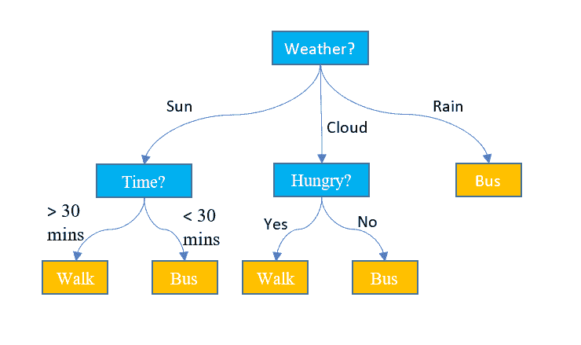

________________________________________________________________________

# 随机森林(装袋)

**上市日期:2001 年(**[**)https://www.stat.berkeley.edu/~breiman/randomforest2001.pdf**](https://www.stat.berkeley.edu/~breiman/randomforest2001.pdf)**)**

**训练类型:**监督算法

**优势与局限:**

*   **优势:**
*   它减少了决策树中的过拟合，有助于提高准确性
*   随机森林也是一种非常方便的算法，因为它使用的默认超参数通常会产生良好的预测结果。理解超参数是非常简单的，而且也不是很多
*   随机森林最大的优势之一就是通用性。它可用于回归和分类任务，并且也很容易查看它赋予输入要素的相对重要性
*   不需要对数据进行标准化，因为它使用基于规则的方法
*   **限制:**
*   复杂性:随机森林创建了许多树(不像决策树只有一棵树)并组合它们的输出。默认情况下，它在 Python sklearn 库中创建 100 棵树。为此，这种算法需要更多的计算能力和资源。另一方面，决策树很简单，不需要太多的计算资源。
*   更长的训练时间:与决策树相比，随机森林需要更多的时间来训练，因为它生成了许多树(而不是决策树中的一棵树),并根据大多数投票做出决策。
*   数据的微小变化可能会导致随机森林算法发生很大变化。

**适用用法:**

*   随机森林与两种类型的任务都兼容——回归和分类
*   随机森林具有内存分类模型，它们不会带来高计算成本，因为它们不需要频繁的数据库查找
*   随机森林带来了处理具有高度错误和缺失值的数据集的能力
*   他们一次模拟一组训练观察。因此，他们不适合渐进式学习。
*   随机森林可以处理具有数值和名义输入属性的数据

**包含该算法的库:**

*   Scikit 学习(Python 实现)
*   randomForest 库(R 实现)

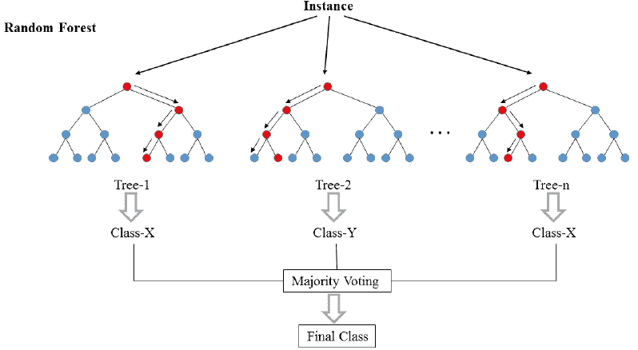

________________________________________________________________________

# 升压算法(XGBoost & LightGbm)

**上市日期:**

*   **XGBoost:2014**([**https://arxiv.org/abs/1603.02754**](https://arxiv.org/abs/1603.02754)**)**
*   **light GBM:2016(**[**https://papers . nips . cc/paper/2017/hash/6449 f 44 a 102 FDE 848669 BDD 9 EB 6b 76 fa-abstract . html**](https://papers.nips.cc/paper/2017/hash/6449f44a102fde848669bdd9eb6b76fa-Abstract.html)**)**

**训练类型:**监督算法

**优势和局限:**

*   **强项:**
*   通常提供无可匹敌的预测准确性。
*   非常灵活——可以针对不同的损失函数进行优化，并提供多种超参数调整选项，使函数拟合非常灵活。
*   不需要数据预处理-通常适用于分类值和数值。
*   处理缺失数据——不需要插补。
*   **限制:**
*   Boosting 技术经常忽略数据集中的过拟合或方差问题
*   这增加了分类的复杂性
*   时间和计算可能有点昂贵
*   它对异常值很敏感，因为每个分类器都必须修复前一个分类器中的错误
*   这种方法几乎不可能扩大规模。这是因为每一个估计量的正确性都是建立在先前预测量的基础上的，因此使得这个过程很难简化。

**适用用法:**

*   提升和叠加将主要试图产生比它们的组件更少偏差的强模型(即使方差也可以被减少)
*   boosting 是一种技术，它包括以一种非常自适应的方式顺序拟合多个弱学习器:序列中的每个模型都被拟合，从而给予数据集中被序列中的先前模型处理得不好的观察值更多的重要性。直觉上，每个新模型**都将其努力集中在迄今为止最困难的观察**上，以便在过程结束时，我们获得一个具有较低偏差的强学习者(即使我们可以注意到增强也可以具有减少方差的效果)
*   像 bagging 一样，Boosting 可以用于回归以及分类问题。
*   Boosting 通常应用于**分类器稳定简单且具有高偏差的情况**

Boosting 是一种数据饥渴算法，特别适用于任务复杂且数据量大的情况

**包含该算法的库:**

*   GBM:GBMs 的实施
*   [xgboost](https://cran.r-project.org/web/packages/xgboost/index.html):Python 中一个快速高效的梯度提升框架
*   Light GBM:Light Gradient Boosting Machine，是一个免费开源的分布式梯度增强框架，最初由微软开发，用于机器学习。

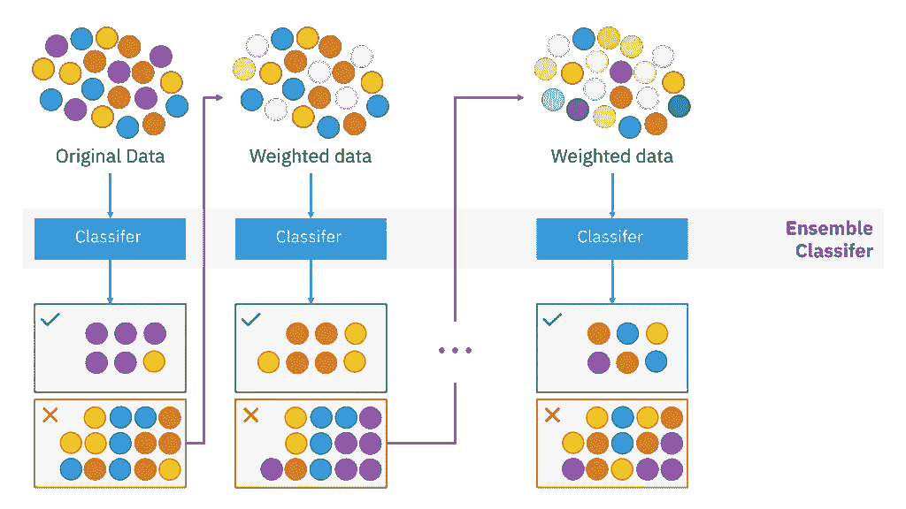

________________________________________________________________________

# k-最近邻

**上市日期:**

*   在 1951 年美国空军航空医学学校的一份未发表的报告中，Fix 和 Hodges 介绍了一种用于模式分类的非参数方法，该方法后来被称为 k-最近邻规则(Fix & Hodges，1951)。1967 年晚些时候，k 最近邻规则的一些形式性质被研究出来

**训练类型:**监督算法

**优势和局限性:**

*   **优势:**
*   K-NN 非常直观和简单:K-NN 算法非常容易理解，也同样容易实现。为了对新数据点进行分类，K-NN 算法遍历整个数据集以找出 K 个最近邻。
*   K-NN 没有假设:K-NN 是一个非参数算法，这意味着实现 K-NN 需要满足一些假设。像线性回归这样的参数模型在实现之前有大量的假设需要数据来满足，而 K-NN 不是这种情况。
*   没有训练步骤:K-NN 不显式地建立任何模型，它只是标记基于从历史数据学习的新数据条目。新的数据条目将被标记为最近邻中的多数类。
*   它不断进化:假设它是基于实例的学习；k-NN 是一种基于记忆的方法。当我们收集新的训练数据时，分类器会立即适应。它允许算法在实时使用期间快速响应输入的变化。
*   对于多类问题非常容易实现:大多数分类器算法对于二元问题很容易实现，对于多类问题需要努力实现，而 K-NN 无需任何额外的努力就可以适应多类问题。
*   既可以用于分类，也可以用于回归:K-NN 最大的一个优点就是 K-NN 既可以用于分类，也可以用于回归问题。
*   一个超参数:K-NN 在选择第一个超参数时可能需要一些时间，但在此之后，其余的参数都与它对齐。
*   多种距离标准:K-NN 算法使用户在建立 K-NN 模型时可以灵活选择距离。
*   欧几里得距离
*   汉娩距
*   曼哈顿距离
*   闵可夫斯基距离
*   **限制:**
*   K-NN 慢算法:K-NN 可能很容易实现，但随着数据集的增长，算法的效率或速度下降很快。
*   维数灾难:KNN 对少量输入变量工作良好，但随着变量数量的增加，K-NN 算法难以预测新数据点的输出。
*   K-NN 需要同类特征:如果您决定使用普通距离(如欧几里德距离或曼哈顿距离)构建 k-NN，则完全有必要使特征具有相同的尺度，因为特征的绝对差异权重相同，即特征 1 中的给定距离对于特征 2 来说必然意味着相同。
*   最佳邻居数量:K-NN 的最大问题之一是在对新数据条目进行分类时，选择要考虑的最佳邻居数量。
*   不平衡数据导致问题:k-NN 在不平衡数据上表现不佳。如果我们考虑两个类，A 和 B，并且大多数训练数据被标记为 A，那么模型最终将给予 A 很多偏好。这可能导致不太常见的 B 类被错误分类。
*   离群点敏感性:K-NN 算法对离群点非常敏感，因为它只是基于距离标准选择邻居。
*   缺失值处理:K-NN 天生没有处理缺失值问题的能力。

**适用用法:**

*   当很少或没有关于数据分布的先验知识时，它应该是分类研究的首选之一
*   KNN 算法可以与最精确的模型竞争，因为它做出高度精确的预测。因此，对于要求高精度但不需要人类可读模型的应用程序，可以使用 KNN 算法。
*   预测的质量取决于距离度量。因此，KNN 算法适用于具有足够领域知识的应用。这种知识支持选择适当的措施。
*   KNN 算法是一种懒惰学习，其中用于生成预测的计算被推迟到分类之前。尽管与其他算法相比，这种方法增加了计算成本，但对于不经常要求预测但准确性很重要的应用，KNN 仍然是更好的选择。

**包含该算法的库:**

*   Scikit 学习(Python 实现)
*   类包(R 实现)

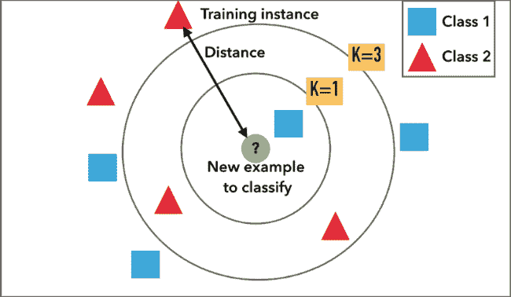

________________________________________________________________________

# 朴素贝叶斯

**上市日期:**

*   朴素贝叶斯基于贝叶斯定理，该定理是由托马斯·贝叶斯牧师在 18 世纪 60 年代提出的

**优势&局限:**

*   **实力:**
*   这个算法见效快，可以节省很多时间。
*   朴素贝叶斯适合解决多类预测问题。
*   如果它对特征独立性的假设成立，它可以比其他模型表现得更好，并且需要更少的训练数据。
*   朴素贝叶斯比数值变量更适合分类输入变量。
*   **限制:**
*   朴素贝叶斯假设所有的预测器(或特征)都是独立的，这在现实生活中很少发生。这限制了该算法在真实世界用例中的适用性。
*   这种算法面临“零频率问题”,它将零概率分配给一个分类变量，该变量在测试数据集中的类别在训练数据集中不可用。如果您使用平滑技术来克服这个问题，那将是最好的。

**适用用法:**

*   朴素贝叶斯适合解决多类预测问题。
*   如果它对特征独立性的假设成立，它可以比其他模型表现得更好，并且需要更少的训练数据。
*   朴素贝叶斯分类器成功地用于各种应用，例如**垃圾邮件过滤、文本分类、情感分析和推荐系统**
*   即使您正在处理具有数百万条数据记录的数据，推荐的方法也是朴素贝叶斯。当涉及到诸如情感分析的 NLP 任务时，它给出了非常好的结果

**包含该算法的库:**

*   Scikit 学习(Python 实现)
*   e1071 包(R 实施)

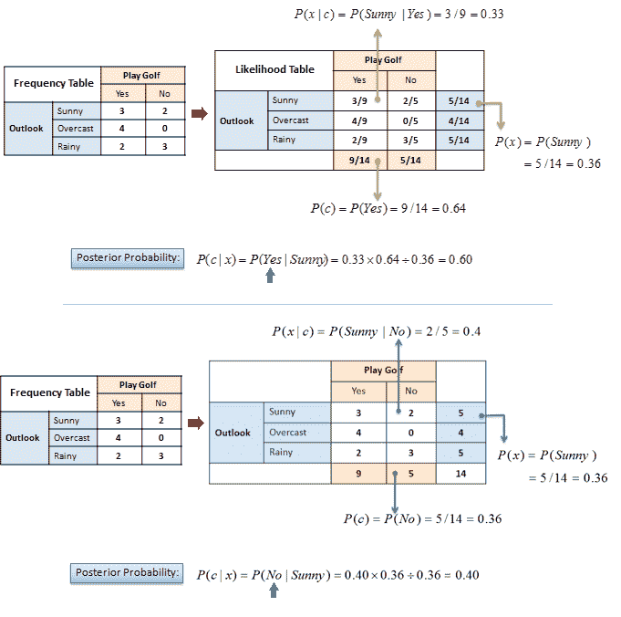

________________________________________________________________________

# 线性回归

**上市日期:**

*   **回归**基于最小二乘法或最小均方误差法。围绕最小二乘或平均误差的想法已经发展了近三个世纪。已知的第一份“平均法”出版物是德国天文学家托拜厄斯·迈耶在 1750 年发表的。

**训练类型:**监督算法

**优势&局限:**

*   **强项:**
*   线性回归易于实现，并且更容易解释输出系数。
*   当你知道自变量和因变量之间的关系是线性关系时，这种算法是最好的，因为它比其他算法的复杂度低。
*   线性回归易受过度拟合的影响，但可以使用一些降维技术、正则化(L1 和 L2)技术和交叉验证来避免。
*   **限制:**
*   线性回归的主要局限性是假设因变量和自变量之间是线性的。在现实世界中，数据很少是线性可分的。它假设因变量和自变量之间有一条直线关系，这在很多时候是不正确的。
*   容易产生噪声和过度拟合:如果观察值的数量少于特征的数量，则不应使用线性回归，否则可能会导致过度拟合，因为它在建立模型时就开始考虑这种情况下的噪声。
*   容易出现异常值:线性回归对异常值(异常)非常敏感。因此，在对数据集应用线性回归之前，应该分析并移除异常值
*   容易出现多重共线性:在应用线性回归之前，应该消除多重共线性(使用降维技术)，因为它假设自变量之间没有关系。

**适用用法:**

*   要进行简单的线性回归，必须对数据做出某些假设。这是因为它是一个参数测试。执行简单线性回归时使用的假设如下:
*   方差齐性-简单线性回归方法的主要预测之一是误差大小保持不变。这仅仅意味着在自变量的值中，误差大小永远不会发生显著变化。
*   观察值的独立性——观察值之间的所有关系都是透明的，这意味着没有隐藏任何东西，在收集数据时只使用有效的采样方法。
*   常态-在数据中有一个正常的流量。
*   如果数据符合上述标准，则适合使用线性回归

**包含此算法的库:**

*   Scikit 学习(Python 实现)
*   LM 函数(R 实现)

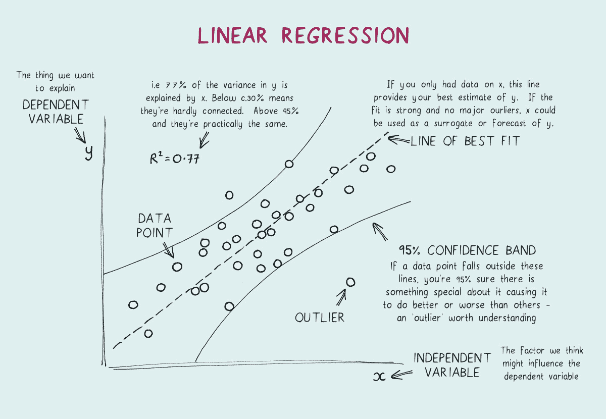

________________________________________________________________________

# 逻辑回归

**上市日期:**

*   逻辑回归是由统计学家考克斯博士在 1958 年发明的

**训练类型:**监督算法

**优势&局限:**

*   **优势:**
*   逻辑回归是最简单的机器学习算法之一，易于实现，但在某些情况下提供了很高的训练效率。同样由于这些原因，用这种算法训练模型不需要很高的计算能力。
*   预测的参数(训练的权重)给出关于每个特征的重要性的推断。也给出了关联的方向，即正或负。所以我们可以用逻辑回归找出特征之间的关系。
*   与决策树或支持向量机不同，这种算法允许模型很容易地更新以反映新数据。可以使用随机梯度下降来完成更新。
*   逻辑回归输出校准好的概率以及分类结果。这是相对于只给出最终分类结果的模型的一个优势。如果一个训练示例对于一个类有 95%的概率，而另一个对于同一类有 55%的概率，我们就可以推断出哪个训练示例对于公式化的问题更准确。
*   在具有足够数量的训练样本的低维数据集中，逻辑回归不容易过度拟合。
*   不是直接从复杂的模型开始，逻辑回归有时被用作衡量性能的基准模型，因为它相对快速且易于实现。
*   当数据集具有可线性分离的要素时，逻辑回归证明非常有效。
*   它与神经网络有着非常密切的关系。一个神经网络表示可以被理解为将许多小的逻辑回归分类器堆叠在一起。
*   由于其简单的概率解释，逻辑回归算法的训练时间远少于大多数复杂的算法，如人工神经网络。
*   这种算法可以很容易地扩展到使用 softmax 分类器的多类分类，这被称为多项式逻辑回归。
*   在训练逻辑回归模型后得到的结果权重被认为是高度可解释的。权重 w_i 可以被解释为如果 x_i 增加 1 并且所有其他 x 保持不变，对数几率将增加的量。这里的 I 指的是从 i = 0 到 n 的任何一个训练例子。
*   **限制:**
*   逻辑回归是一种统计分析模型，试图根据独立特征预测精确的概率结果。在高维数据集上，这可能会导致模型在训练集上过度拟合，这意味着夸大了训练集上预测的准确性，因此模型可能无法预测测试集上的准确结果。这种情况通常发生在模型根据具有大量特征的少量训练数据进行训练的情况下。因此，在高维数据集上，应考虑正则化技术以避免过度拟合(但这会使模型变得复杂)。非常高的正则化因子甚至可能导致模型在训练数据上欠拟合。
*   非线性问题不能用逻辑回归来解决，因为它有一个线性决策面。线性可分数据在现实世界中很少出现。因此，需要对非线性特征进行转换，这可以通过增加特征的数量来实现，使得数据在更高维度中变得线性可分。
*   使用逻辑回归很难捕捉复杂的关系。更强大和复杂的算法，如神经网络，可以轻松胜过这种算法。
*   训练特征被称为独立变量。逻辑回归要求自变量之间有中度或无多重共线性。这意味着如果两个独立变量有很高的相关性，那么只能使用其中的一个。在最小化成本函数期间，信息的重复可能导致参数(权重)的错误训练。多重共线性可以使用降维技术来消除。
*   在线性回归中，自变量和因变量应该是线性相关的。但 Logistic 回归要求自变量与对数比值呈线性相关(log(p/(1-p))。
*   只有重要且相关的特征才能用于构建模型，否则模型做出的概率预测可能不正确，并且模型的预测值可能会降低。
*   数据集中出现偏离预期范围的数据值可能会导致不正确的结果，因为该算法对异常值非常敏感。
*   逻辑回归需要一个大的数据集，还需要足够的训练样本来识别所有需要识别的类别。
*   要求每个训练示例独立于数据集中的所有其他示例。如果它们以某种方式相关联，那么模型将试图给予那些特定的训练示例更多的重要性。因此，训练数据不应来自匹配数据或重复测量。例如，一些科学研究技术依赖于对同一个人的多次观察。这种技术不能用在这种情况下。

**适用用法:**

*   当因变量为二分变量(二元变量)时，逻辑回归是进行回归分析的合适方法。逻辑回归用于描述数据，并解释一个因变量与一个或多个名义变量、序数变量、区间变量或比率级自变量之间的关系
*   在使用逻辑回归之前，应满足以下标准:
*   观察是独立的
*   解释变量之间不存在多重共线性
*   响应变量是二进制的
*   解释变量和响应变量的对数之间存在线性关系
*   样本量足够大

**包含该算法的库:**

*   Scikit 学习(Python 实现)
*   Glm 函数(R 实现)

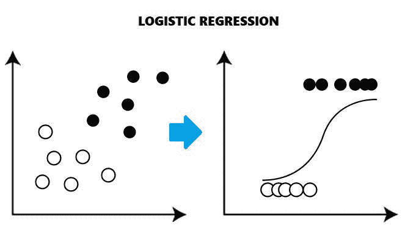

________________________________________________________________________

# 支持向量机

**上市日期:**

*   **支持向量机** ( **支持向量机**，也称**支持向量网络**)是[监督学习](https://en.wikipedia.org/wiki/Supervised_learning)模型，具有相关的学习[算法](https://en.wikipedia.org/wiki/Algorithm)，为[分类](https://en.wikipedia.org/wiki/Statistical_classification)和[回归分析](https://en.wikipedia.org/wiki/Regression_analysis)分析数据。由 [Vladimir Vapnik](https://en.wikipedia.org/wiki/Vladimir_Vapnik) 及其同事在& T 贝尔实验室开发(Boser 等人，1992 年，Guyon 等人，1993 年，Vapnik 等人，1997 年)

**训练类型:**监督算法

**优势&局限:**

*   **长处:**
*   当我们不知道数据的时候，SVM 是非常好的。
*   适用于文本、图像和树等非结构化和半结构化数据。
*   核心技巧是 SVM 的真正优势。有了合适的核函数，我们可以解决任何复杂的问题。
*   与神经网络不同，SVM 不是为局部最优解而求解的。
*   它对高维数据的伸缩性相对较好。
*   SVM 模型在实践中具有普适性，在 SVM 过度拟合的风险较小。
*   人们总是把 SVM 与安相比较。与人工神经网络模型相比，支持向量机给出了更好的结果。
*   **限制:**
*   选择一个“好”的内核函数并不容易。
*   大数据集训练时间长。
*   难以理解和解释最终模型、可变权重和个人影响。
*   由于最终的模型不容易看到，我们不能对模型进行小的校准，因此很难融入我们的业务逻辑。
*   SVM 超参数是成本-C 和伽玛。微调这些超参数并不容易。很难想象它们的影响
*   它不提供概率输出
*   **适用用法:**
*   SVM 可用于分类(区分几个组或类)和回归(获得一个数学模型来预测某事)。它们可以应用于线性和非线性问题。
*   如果我们有一个小的训练集，我们可以使用 svm，而不像神经网络那样需要大量数据
*   **为 SVM 特色工程奠基:**
*   这些集合必须是线性可分的。否则数据需要被转换(例如使用内核)。这不是由算法本身完成的，可能会耗尽特征的数量。
*   SVM 的性能受到影响，因为我们增加维数的速度比其他方法(树集成)更快。这是由于支持支持支持向量机的约束优化问题。有时特征约简是可行的，有时不可行，这就是我们不能真正为 svm 的有效使用铺平道路的时候
*   svm 可能会在特征数量远大于观察数量的数据集上苦苦挣扎。这也可以通过研究约束优化问题来理解。
*   svm 算法不能开箱即用地处理分类变量。
*   非概率性:由于分类器通过将对象放置在分类超平面的上方和下方来工作，因此对于组成员没有直接的概率解释。然而，确定分类“有效性”的一个潜在度量是新点离决策边界有多远。

**包含该算法的库:**

*   Scikit 学习(Python 实现)
*   SVM 函数(R 实现)

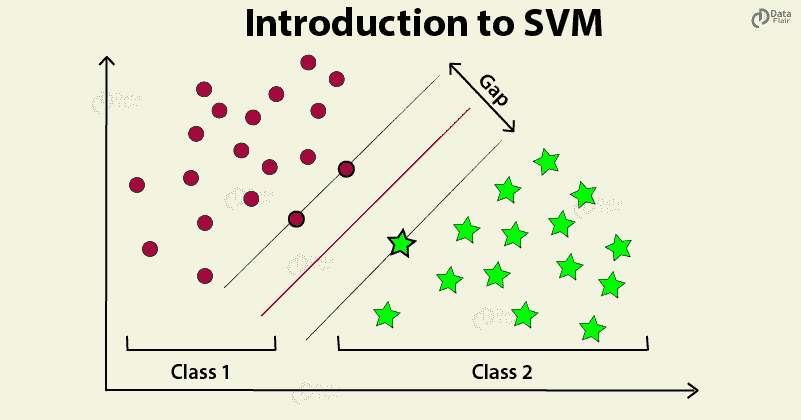

________________________________________________________________________

# k 均值聚类

**上市日期:**

*   詹姆斯·麦克奎恩在 1967 年首次使用了“k”这个词，尽管这个想法可以追溯到雨果·施泰因豪斯在 1956 年。标准算法最初是由贝尔实验室的斯图尔特·劳埃德于 1957 年提出的，作为一种脉冲编码调制技术，尽管直到 1982 年才作为期刊文章发表。1965 年，Edward W. Forgy 发表了基本相同的方法，这就是为什么它有时被称为 Lloyd-Forgy 算法

**训练类型:**无监督算法

**优势&局限:**

*   **强项:**
*   实现起来相对简单。
*   扩展到大型数据集。
*   保证趋同。
*   可以热启动质心的位置。
*   容易适应新的例子。
*   推广到不同形状和大小的星团，如椭圆星团**。**
*   **限制:**
*   手动选择 k
*   依赖于初始值。
*   k-means 很难对不同大小和密度的数据进行聚类
*   质心可能会被离群值拖动，或者离群值可能会得到自己的聚类，而不是被忽略。考虑在聚类之前移除或剪切离群值。
*   随着维数的增加，基于距离的相似性度量在任何给定的例子之间收敛到恒定值。通过对特征数据使用 [PCA](https://wikipedia.org/wiki/Principal_component_analysis) 或者通过使用“谱聚类”来修改聚类算法来降低维数，如下所述。

**适用用法:**

*   k-means 通常适用于维数较少、数值型且连续的数据。想象一个场景，你想从一个随机分布的东西集合中，把相似的东西组成一组；k-means 非常适合这样的场景。
*   它适用于没有任何输出标签或者很难手动创建标签的问题

**包含该算法的库:**

*   Scikit 学习(Python 实现)
*   K-Means 函数形式的集群包(R 实现)

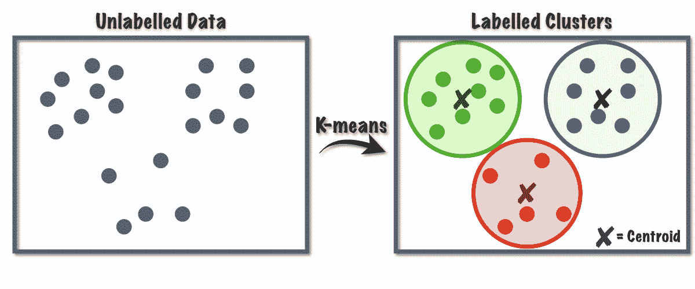

________________________________________________________________________

# 均值漂移聚类

**上市日期:**

*   均值漂移法通常被认为是由 Fukunaga 和 Hostetler 在 1975 年提出的。然而，这让人想起了 Schnell 在 1964 年的早期工作

**训练类型:**无监督算法

**优势&局限:**

*   **优势:**
*   与 K 均值相比，均值漂移相对简单
*   整个最终结果由一个参数控制——内核带宽值，而在 K means 中，需要指定多个集群作为输入。
*   均值漂移巧妙地利用了点的密度，试图生成合理数量的聚类
*   它还可以模拟具有非凸形状的复杂团簇。
*   离群值不会产生问题
*   不存在像 K-means 中那样的局部最小值问题。
*   **限制:**
*   它是缓慢的。对于多点问题，可能需要很长时间来执行
*   Mean-shift 算法在高维数的情况下效果不佳，在这种情况下，聚类数目会突然变化。
*   我们不能直接控制集群的数量，但是在某些应用中，我们需要特定数量的集群。
*   它不能区分有意义和无意义的模式。

**适用用法:**

*   关键区别在于均值漂移不需要用户指定聚类数(k)。在某些情况下，猜测要使用的集群的正确数量并不容易。在 k-Means 中，输出结果可能是聚类太少或太多。这可能导致扭曲的结果。以较大的时间复杂度为代价，Mean Shift 确定适合所提供数据集的聚类数。
*   另一个常见的区别是 k-Means 只能学习圆形或椭圆形簇。均值漂移可以学习任意形状的原因是因为这些特征通过核被映射到另一个更高维的特征空间
*   这种算法也用在没有标签的情况下，我们希望根据可用的数据建立一些组

**包含该算法的库:**

*   Scikit 学习(Python 实现)
*   meanShiftR 包(R 实现)

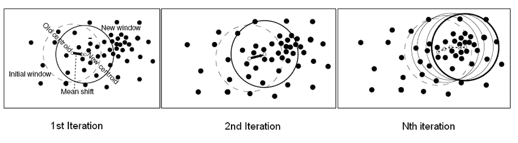

________________________________________________________________________

# 基于密度的聚类

**上市日期:**

*   **带噪声应用的基于密度的空间聚类** ( **DBSCAN** )是由 [Martin Ester](https://en.wikipedia.org/wiki/Martin_Ester) 、 [Hans-Peter Kriegel](https://en.wikipedia.org/wiki/Hans-Peter_Kriegel) 、rg Sander 和徐小薇在 1996 年提出的一种[数据聚类](https://en.wikipedia.org/wiki/Data_clustering)算法

**训练类型:**无监督算法

**优势&局限:**

*   **优势:**
*   与 [k-means](https://en.wikipedia.org/wiki/K-means_algorithm) 相反，DBSCAN 不需要先验地指定数据中的聚类数。
*   DBSCAN 可以找到任意形状的集群。它甚至可以找到一个完全被另一个集群包围(但没有连接)的集群。由于 MinPts 参数，减少了所谓的单链接效应(由细线点连接的不同簇)。
*   DBSCAN 具有噪声的概念，并且对[异常值](https://en.wikipedia.org/wiki/Anomaly_detection)具有鲁棒性。
*   DBSCAN 只需要两个参数，并且对数据库中的点的顺序不敏感。(然而，如果点的排序被改变，位于两个不同聚类边缘的点可能交换聚类成员资格，并且聚类分配仅在同构时是唯一的。)
*   DBSCAN 设计用于可以加速区域查询的数据库，例如使用 [R*树](https://en.wikipedia.org/wiki/R*_tree)。
*   如果数据很好理解，参数 minPts 和ε可以由领域专家设置。
*   **限制:**
*   DBSCAN 不完全是确定性的:可以从多个集群到达的边界点可以是任何一个集群的一部分，这取决于处理数据的顺序。对于大多数数据集和域，这种情况不会经常出现，并且对聚类结果几乎没有影响:在核心点和噪声点上，DBSCAN 都是确定性的。DBSCAN*是一种将边界点视为噪声的变体，这种方式实现了完全确定性的结果以及对密度相关分量的更一致的统计解释。
*   DBSCAN 的质量取决于函数 regionQuery(P，ε)中使用的[距离度量](https://en.wikipedia.org/wiki/Metric_(mathematics))。最常用的距离度量是[欧几里德距离](https://en.wikipedia.org/wiki/Euclidean_distance)。特别是对于[高维数据](https://en.wikipedia.org/wiki/Clustering_high-dimensional_data)，由于所谓的“[维数灾难](https://en.wikipedia.org/wiki/Curse_of_dimensionality#Distance_functions)”，很难找到一个合适的ε值，这种度量可以被渲染成几乎无用。然而，这种效应也存在于任何其他基于欧几里德距离的算法中。
*   DBSCAN 不能很好地对密度差异大的数据集进行聚类，因为 minPts-ε组合不能被适当地选择用于所有的聚类
*   如果没有很好地理解数据和比例，选择有意义的距离阈值ε可能会很困难。
*   **适用用法:**
*   DBSCAN 算法应该用于查找数据中的关联和结构，这些关联和结构很难手动找到，但对于查找模式和预测趋势可能是相关的和有用的。
*   分区方法(K-means，PAM 聚类)和层次聚类用于寻找球形聚类或凸形聚类。换句话说，它们只适用于紧密且分离良好的集群。此外，它们还受到数据中存在的噪声和异常值的严重影响。
*   现实生活中的数据可能包含不规则性，例如
*   **i)** 聚类可以是任意形状 **ii)** 数据可能包含噪声。
*   在这种情况下，数据库扫描是首选

**包含该算法的库:**

*   Scikit 学习(Python 实现)
*   Dbscan 包(R 实现)

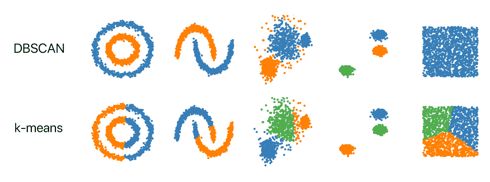

________________________________________________________________________

# CNN —(卷积神经网络)

**上市日期:**

*   卷积神经网络，也称为 ConvNets，由 Yann LeCun 于 20 世纪 80 年代首次提出

**训练类型:**监督算法

**优势&局限:**

*   **强项:**
*   CNN 会自动学习过滤器，而不会明确提及。这些过滤器有助于从输入数据中提取正确的相关特征
*   [CNN](https://courses.analyticsvidhya.com/courses/convolutional-neural-networks-cnn-from-scratch?utm_source=blog&utm_medium=cnn-vs-rnn-vs-mlp-analyzing-3-types-of-neural-networks-in-deep-learning) 从图像中捕捉空间特征。空间特征是指图像中像素的排列以及像素之间的关系。它们帮助我们准确地识别对象、对象的位置以及它与图像中其他对象的关系
*   CNN 也遵循参数共享的理念。将单个过滤器应用于输入的不同部分以生成要素地图:
*   CNN 的计算效率也很高。它使用特殊的卷积和池操作，并执行参数共享。这使得 CNN 模型可以在任何设备上运行，使它们具有普遍的吸引力
*   **限制:**
*   卷积神经网络(CNN)在对与数据集非常相似的图像进行分类时具有很好的性能。然而，如果图像包含某种程度的倾斜或旋转，那么 CNN 通常难以对图像进行分类
*   在卷积层，所有微小细节的识别都是由高级神经元完成的。这些高级神经元然后检查是否所有特征都存在。检查特征是否存在的过程是通过跨越图像来完成的。在此过程中，ConvNet 完全丢失了关于组件的组成和位置的所有信息，并且它们将信息进一步传输到可能无法对图像进行分类的神经元。
*   如果 CNN 拍摄了带有一些噪声的图像，它会将该图像识别为完全不同的图像，而人类视觉系统会将其识别为带有噪声的相同图像。这也证明了为了识别图像，CNN 使用了与常规视觉系统非常不同的信息
*   如果 CNN 有几个层次，那么如果计算机不是由一个好的 GPU 组成，训练过程会花费很多时间。
*   ConvNet 需要大型数据集来处理和训练神经网络。

**适用用法:**

*   CNN 最常见的用途是图像分类，例如识别包含道路的卫星图像或对手写字母和数字进行分类。还有其他相当主流的任务，如图像分割和信号处理，CNN 在这些方面表现良好
*   使用 CNN 的好处是它们能够开发二维图像的内部表示。这允许模型学习数据中的位置和比例不变结构，这在处理图像时很重要。
*   人们可以有效地将卷积神经网络用于:
*   图像数据
*   分类预测问题
*   回归预测问题
*   一般来说，CNN 可以很好地处理具有空间关系的数据。
*   CNN 输入传统上是二维的，一个场或矩阵，但也可以变成一维的，允许它开发一维序列的内部表示。
*   这允许 CNN 更广泛地用于具有空间关系的其他类型的数据

**包含该算法的库:**

*   Tensorflow、Keras、Pytorch (Python 实现)
*   用于 R (R 实现)的 Tensorflow 和 Keras

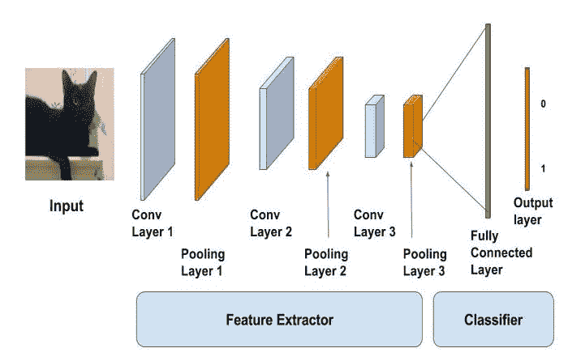

________________________________________________________________________

# RNN —(递归神经网络)

**上市日期:**

*   递归神经网络是基于[大卫·鲁梅尔哈特](https://en.wikipedia.org/wiki/David_Rumelhart)在 1986 年的工作。霍普菲尔德网络——一种特殊的 RNN——是由约翰·霍普菲尔德[于 1982 年发现的。1993 年，一个神经历史压缩器系统解决了一个“非常深度学习”的任务，该任务需要在 RNN 中及时展开 1000 多个后续的](https://en.wikipedia.org/wiki/John_Hopfield)[层](https://en.wikipedia.org/wiki/Layer_(deep_learning))。

**训练类型:**监督算法

**优势&局限:**

*   **优势:**
*   RNN 可以处理任意长度的输入。
*   一个 RNN 模型被建模来记住整个时间中的每个信息，这在任何时间序列预测器中都是非常有用的。
*   即使输入大小更大，模型大小也不会增加。
*   权重可以跨时间步长共享。
*   RNN 可以使用它们的内部存储器来处理任意系列的输入，这与前馈神经网络的情况不同。
*   **限制:**
*   梯度消失和爆炸问题。
*   训练 RNN 是一项非常艰巨的任务。
*   如果使用 tanh 或 relu 作为激活函数，它不能处理很长的序列。

**适用用法:**

*   递归神经网络(RNN)是一种神经网络，其中前一步的输出作为输入馈送到当前步骤。RNN 主要用于序列分类——情感分类和视频分类
*   递归神经网络不适合您在 CSV 文件或电子表格中看到的表格数据集。它们也不适于图像数据输入。
*   将 RNNs 用于:
*   文本数据
*   语音数据
*   分类预测问题
*   回归预测问题
*   生成模型

**包含该算法的库:**

*   Tensorflow、Keras、Pytorch (Python 实现)
*   用于 R (R 实现)的 Tensorflow 和 Keras

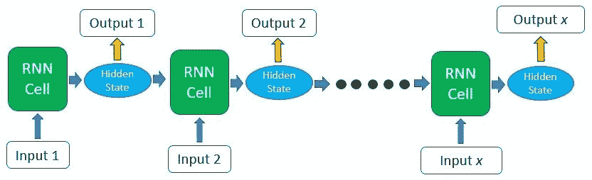

________________________________________________________________________

# LSTM —(长短期记忆)

**上市日期:**

*   **1995–1997:**LSTM 由[塞普·霍克雷特](https://en.wikipedia.org/wiki/Sepp_Hochreiter)和[于尔根·施密德胡贝尔](https://en.wikipedia.org/wiki/J%C3%BCrgen_Schmidhuber)提出。通过引入恒定误差转盘(CEC)单元，LSTM 处理了[消失梯度问题](https://en.wikipedia.org/wiki/Vanishing_gradient_problem)。LSTM 模块的最初版本包括单元、输入和输出门。

**训练类型:**监督算法

**优势&局限:**

*   **优势:**
*   LSTMs 的明确设计是为了避免长期依赖问题。长时间记忆信息实际上是他们的默认行为，而不是他们努力学习的东西！
*   所有其他优势与 RNN 单位相同
*   **限制:**
*   LSTMs 变得流行是因为它们可以解决渐变消失的问题。但结果是，他们没能完全去除它。问题在于，数据仍然需要从一个单元移动到另一个单元进行评估。此外，随着附加功能(如忘记门)的引入，单元现在变得相当复杂。
*   他们需要大量的资源和时间来接受培训，并为现实世界的应用做好准备。用技术术语来说，它们需要高存储带宽，因为每个单元中都存在线性层，而系统通常无法提供这种带宽。因此，在硬件方面，LSTMs 变得非常低效。
*   随着数据挖掘的兴起，开发人员正在寻找一种能够比 LSTMs 更长时间地记住过去信息的模型。这种模型的灵感来源于人类习惯于将给定的信息分成小部分，以便于记忆。
*   LSTMs 受到不同随机权重初始化的影响，因此表现得非常类似于前馈神经网络。他们更喜欢小权重初始化。
*   LSTMs 易于过拟合，并且很难应用丢弃算法来抑制这个问题。放弃是一种正则化方法，在训练网络时，从激活和权重更新中概率性地排除了到 LSTM 单元的输入和递归连接。
*   LSTM 网络仍然会受到爆炸梯度问题的困扰

**适用用法:**

*   给定未知持续时间的时间滞后，LSTM 非常适合于分类、处理和预测时间序列。对间隙长度的相对不敏感性使得 LSTM 优于替代的 RNNs、隐马尔可夫模型和其他序列学习方法
*   如果您有依赖于或与序列中的前一项相关的顺序数据，如语言数据或某些时间序列数据，则这种方法很适用

**包含该算法的库:**

*   Tensorflow、Keras、Pytorch (Python 实现)
*   用于 R (R 实现)的 Tensorflow 和 Keras

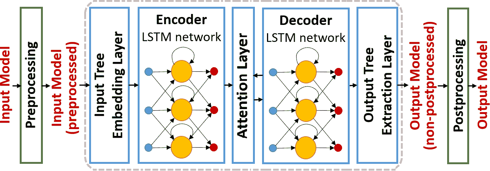

________________________________________________________________________

# q 学习

**上市日期:**

*   它是由理查德·贝尔曼于 1954 年在 T4 发明的

**训练类型:**强化学习

**优势&局限:**

*   **优势:**
*   强化学习用于解决传统技术无法解决的复杂问题。
*   这种技术是实现长期结果的首选，而长期结果是很难实现的。
*   这种学习模式与人类的学习非常相似。因此，它接近达到完美。
*   **限制:**
*   过多的强化学习会导致状态过载，从而降低结果。
*   这种算法不适合解决简单的问题。
*   这种算法需要大量数据和大量计算
*   维数灾难限制了真实物理系统的强化学习

**适用用法:**

*   Q-Learning 是一种基于值的强化学习算法，用于使用 Q 函数来寻找最优的动作选择策略。我们的目标是最大化价值函数 Q。Q 表帮助我们找到每个状态的最佳行动。

**包含该算法的库:**

*   KerasRL，PyQLearning (Python 实现)
*   iqLearn 包(R 实现)

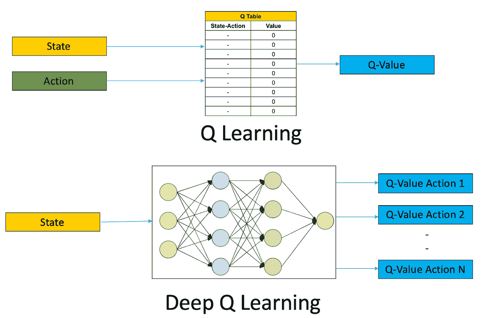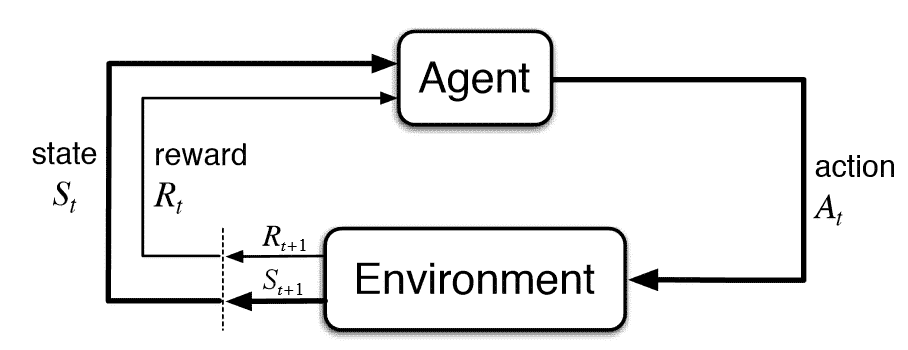

________________________________________________________________________

# 主成分分析

**上市日期:**

*   卡尔·皮尔逊于 1901 年在 T21 发明了 PCA，

**训练类型:**降维

**优势&局限:**

*   **长处:**
*   移除相关要素
*   它可以提高算法性能
*   减少过度拟合:
*   改善可视化
*   **限制:**
*   自变量变得更难解释
*   PCA 之前必须进行数据标准化
*   由于列数减少而导致的信息丢失

**适用用法:**

*   PCA 最重要的用途是将多变量数据表表示为一个较小的变量集(汇总指数),以便观察趋势、跳跃、聚类和异常值。这种概述可以揭示观察值和变量之间的关系，以及变量之间的关系
*   PCA 应该主要用于强相关的变量。如果变量之间的关系很弱，主成分分析就不能很好地减少数据
*   如果我们想去掉相关变量，我们也可以用它

**包含该算法的库:**

*   Sklearn (Python 实现)
*   FactoMine 包(R 实现)

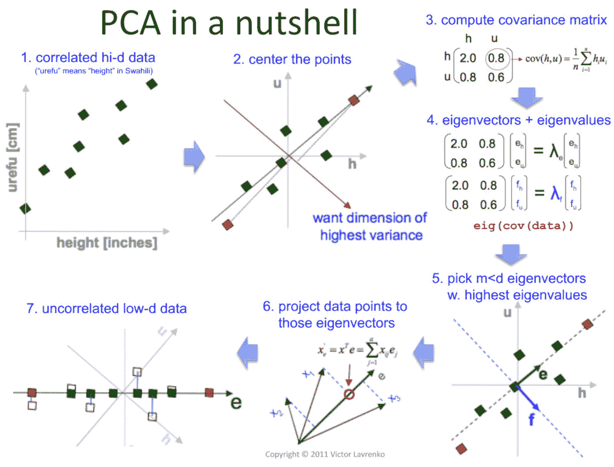

________________________________________________________________________

# TSNE (t 分布随机邻居嵌入)

**上市日期:**

*   它是由劳伦斯·范德·马滕斯和杰弗里·辛顿于 2008 年**T5 开发的**

**训练类型:**降维

**优势&局限:**

*   **优势:**
*   高效处理非线性数据:PCA 是一种线性算法。它创建的主成分是现有特征的线性组合。因此，它不能解释特征之间复杂的多项式关系。所以，如果变量之间的关系是非线性的，它表现很差。另一方面，t-SNE 在非线性数据上工作得很好。这是一种非常有效的非线性降维算法。
*   保留局部和全局结构:t-SNE 能够保留数据的局部和全局结构。粗略地说，这意味着高维数据集中彼此接近的点在低维中将倾向于彼此接近。另一方面，主成分分析发现了解释数据中大部分差异的新维度。所以，它不像 SNE 霸王龙那样关心附近的邻居。
*   **限制:**
*   计算复杂:t-SNE 涉及大量的计算和运算，因为它为每个数据点计算成对的条件概率，并试图最小化更高维度和更低维度的概率差之和
*   不确定性:有时，具有相同超参数的不同运行可能会产生不同的结果。因此，虽然结果很可能是相似的，但是每次运行时，您不会得到完全相同的输出。
*   需要超参数调整:与 PCA 不同，t-SNE 涉及要调整的超参数(没有任何超参数)。不正确地处理超参数可能会导致不希望的结果。
*   噪声模式:在随机噪声中也可能发现模式，因此在决定数据中是否存在模式之前，必须检查具有不同超参数集的算法的多次运行。

**适用用法:**

*   TSNE 主要用于**理解高维数据并将其投影到低维空间**(如 2D 或 3D)
*   如果我们的数据有一些非线性，那么 TSNE 是降维和可视化的一个很好的选择
*   如果你的数据有一些异常值，那么 TSNE 可以比主成分分析更好地工作

**包含该算法的库:**

*   Sklearn (Python 实现)
*   TSNE 一揽子计划(R 实施)

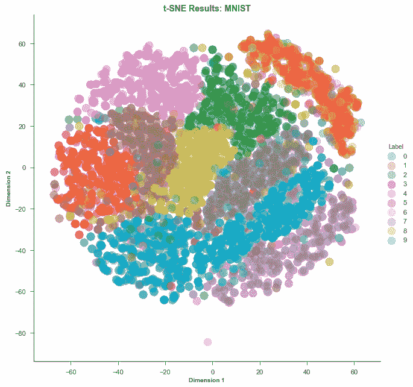

________________________________________________________________________