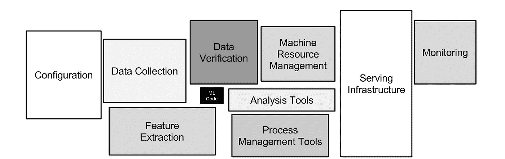
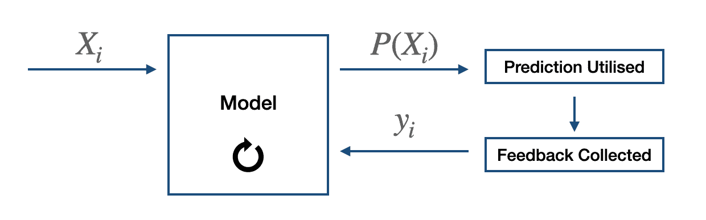

# ML 清单——成功模型部署的最佳实践

> 原文：<https://medium.com/analytics-vidhya/ml-checklist-best-practices-for-a-successful-model-deployment-2cff5495efed?source=collection_archive---------10----------------------->

机器学习模型部署是复杂的，并且通常模型因此项目的旅程在到达部署阶段之前就结束了。VentureBeat [报道称](https://venturebeat.com/2019/07/19/why-do-87-of-data-science-projects-never-make-it-into-production/)87%的模型从未投入生产。我相信 ML / DS 团队可以通过在项目的不同阶段问这些**五个**问题来增加部署他们模型的机会。

机器学习基础设施——来源——NIPS 2015，Scully。

## 1.您希望优化什么业务指标？

**在确定项目范围之前**，探索整个组织或领域中常见的不同业务度量是很重要的。这些业务指标应该作为机器学习指标(ROC — AUC、RMSE 等)之间的桥梁。)，并且业务主张也应该与业务增长直接相关。例如，YouTube 可能希望最大化每个用户的参与时间或点击率(CTR)。同样，贷款公司可能会将贷款拖欠率降至最低。

仔细选择指标可以让你对你的 ML 系统有一个更广泛的了解。另外，请注意，您可以选择多个指标进行跟踪。例如，Medium 可以跟踪每个故事的参与时间以及每个故事的鼓掌率，同时向用户推荐故事。

## 2.启发式解决你的目标有多好？

一个机器学习项目的成功取决于你在项目开始前如何阐述和评估你的问题**。适当而广泛的 EDA 可以让您深入了解数据。很多时候，我们在开始 ML 模型开发的时候甚至没有考虑启发式。我认为，为了获得一个好的基线，最好采用简单的启发式方法，而不是复杂的黑盒模型。例如，Zillow 可以通过对卧室数量和位置制定一个简单的规则来显示房价，Android 可以按字母顺序列出应用程序，而不是在用户层面进行推荐。**

请注意，一个机器学习模型将优于一套以启发式为名的复杂规则。

**3。你想如何为你的 ML 系统服务？**

有多种方式为你的 ML 模型服务，通常你需要在训练你的模型之前决定服务架构**。两种最常见的架构是—**

## 预计算模型预测

这是服务于机器学习模型的最早使用和最简单的架构之一。这是一种为模型服务的间接方法，我们预先计算输入变量的所有可能组合的预测，并将它们存储在数据库中。这种架构通常用在推荐系统中——推荐被预先计算和存储，并在用户登录时显示给用户。

模型服务的架构—预先计算的预测。

即使我们不直接公开我们的模型，这种类型的架构也有很多优点。

**优点**:

*   **推理时延迟低**。
*   **轻松生产**——重新训练模型并将其投入生产非常简单，耗时更少。
*   **经济高效** —您只需要一个数据库，不需要特殊的基础设施。

**缺点**:

*   **被迫使用有界数据** —由于我们想要预计算所有可能组合的预测，我们需要保持独立变量空间离散且有界。因此，**不能直接使用连续的**变量。
*   **每一个新的变量都是痛苦—** 增加一个新的变量会增加推理潜伏期、存储量等。指数增长。

## 基于微服务的模型服务

在这里，模型独立于应用程序提供服务，并且根据请求实时提供预测。这种类型的体系结构在模型训练和部署方面提供了灵活性。

基于微服务的模型服务架构

**优点**:

*   **实时预测** —在线提供实时预测，并为许多应用提供目的。
*   **部署灵活** —作为一项独立的服务，该模型可以轻松部署，可以是内部部署、云部署或用户端部署。
*   **高度可扩展** —模型是一个独立的服务，可以独立扩展。

**缺点**:

*   **基础设施成本** —云、GPU、DB 等。因此，根据模型的要求，成本可能会很高。
*   **低延迟优化—** 根据模型的复杂性，需要在推理优化方面做一些额外的工作来最小化延迟。

## 4.您应该何时重新培训您的模型？

机器学习模型的性能[在生产中会随着时间的推移而降低](https://mudittiwari255.medium.com/my-machine-learning-model-failed-learnings-2291af3c5434)，建议在模型服务之前评估再培训要求**。基于用例、模型监控和评估，人们可以决定何时重新训练模型。决定再培训时间的一个好方法是在不同的时间窗口使用超时分析。**

这里，模型性能在 2 个月后下降了 5%，因此可以决定每两个月重新训练一次。

上述示例仅用于说明目的，根据使用情况，再训练时间可以从几秒钟到几年不等。

## 5.您希望如何重新培训您的模型？

再培训是必不可少的，它有助于保持模型的更新。大致有两种方式来重新训练机器学习模型——在线**&离线** **训练**。

## 在线培训

顾名思义，模型是在生产时重新训练的。真实标签以一定的时间间隔循环回模型，以更新/重新训练模型。这需要一个独立的架构，并且通常很难实现。

用于在线模型再训练的广泛架构

例如，当我们预测广告点击概率时，我们可以获得反馈(点击或未点击)，这些反馈可用于在线更新模型。

## 离线培训

在离线训练中，模型是从头开始重新训练的，我们可以完全控制要训练的新模型和数据。使用 A/B 测试或影子测试将新模型推入生产环境。

## **结论**

部署机器学习模型并不容易，需要考虑多种因素才能成功部署。我相信对这五个问题进行头脑风暴可以帮助确定问题，并可以使你的机器学习系统变得更好。

感谢阅读。

和平:)

## 参考

1.  *D. Sculley —* [机器学习系统中隐藏的技术债务](https://papers.nips.cc/paper/2015/file/86df7dcfd896fcaf2674f757a2463eba-Paper.pdf)。
2.  斯坦福 MLSys 研讨会第 5 集:*奇普胡延*
3.  ML 系统设计—斯坦福— [第二讲](https://docs.google.com/document/d/15vCMf7SbDuxST9Q-rWtx8o7qHJQN2pE5urCDFTYI1zs/edit)