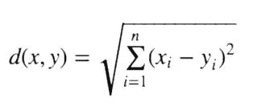
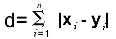
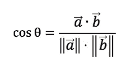
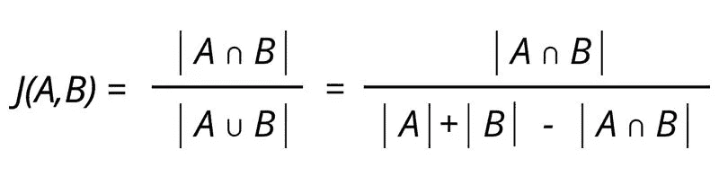
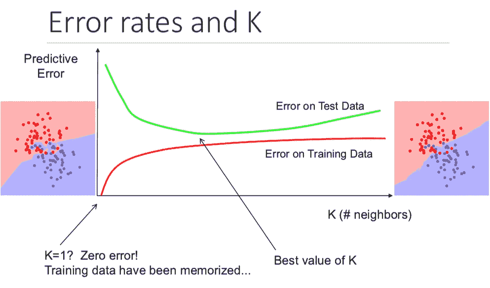

# ML 代码潜水:K-最近邻

> 原文：<https://medium.com/analytics-vidhya/ml-code-dive-k-nearest-neighbors-c183e3349ddd?source=collection_archive---------7----------------------->

*ML Code Dive 是在没有任何 ML 库的情况下，深度挖掘机器学习算法的系列文章。纯粹用 Python 和 numpy！它不仅可以让你更好地了解 ML 模型的细节，还可以帮助你在数据科学家/机器学习工程师面试中胜出！你可以在这里* *找到所有的* [*。*](https://github.com/Lou1sWang/MLCodeDive)

k 近邻，又名 KNN，是最简单的机器学习模型之一。距离计算需要数值，并且模型不需要训练，因为它只是使用距离来获得 k 个最相似的数据点或最近邻，并基于它们将标签分配给未观察到的样本。

KNN 具有很多优点:高精度、对异常值不敏感、对数据没有任何假设。然而，对于较大的数据集，计算量很大，并且需要大量内存。它适用于数值和标称值。

说到它的工作原理，它只有三个步骤。

*   距离计算。
*   最低 k 距离投票
*   对投票结果进行排序

## 距离计算

距离公式有不同的选项可供选择:

欧几里德距离:它是欧几里德空间中两点间真实直线距离的度量。



曼哈顿距离:两点之间的距离是它们的笛卡尔坐标的绝对差之和。**当我们遇到高维度的情况时，该距离优于欧几里德距离。**



余弦距离:这个距离度量主要用于计算两个向量之间的相似性。它通过两个向量之间的夹角余弦来测量，并确定两个向量是否指向同一方向。



Jaccard 距离:Jaccard 系数是一种与余弦相似性相似的比较方法，因为这两种方法都比较分布在所有数据中的一种属性。



让我们用欧几里德距离编码。我们可以使用 numpy 中的 array 来表示数据集，并使用 numpy.tile 来获取输入(未观察到的)数据和所有其他数据点之间的距离

```
import numpy as npdef getDistance(x, dataset): rows = dataset.shape[0]
    diff = np.tile(x, (dataset,1)) - dataset
    distances = (diff**2.sum(axis=1)) **0.5
    return distances
```

值得注意的一点是，我们应该归一化数据集，因为如果要素处于不同的比例，一些较大的数字将在距离计算中占主导地位。这是最小-最大归一化的代码，我们减去最小值，然后除以范围

```
def minMaxNorm(dataset):
    minVals = dataset.min(0)
    maxVals = dataset.max(0)
    ranges = maxVals - minVals
    normDataset = np.zeros(dataset.shape)
    rows = dataset.shape[0]
    normDataset = dataset - np.tile(minVals,(m,1))
    normDataset = normDataset/np.tile(ranges,(m,1))
    return normDataset
```

## 最低 k 距离投票和排序

获得所有距离后，我们只选择 k 个最近的数据点，并根据这 k 个点的标签分配标签。输入 k 应该总是正整数。然后我们返回投票最多的标签。

```
def getVote(distances, labels, k):
    # sort the distances and get The index with argsort
    sortedDisIndex = distances.argsort() # count the class for the k points
    classCount = {}
    for i in range(k):
        voteLabel = labels
        classCount[voteLabel] = classCount.get(voteLabel,0) + 1
    sortedClassCount = sorted(classCount.items(), key = lambda x:x[0], reverse = True) # return the first result after voting
   return sortedClassCount[0][0]
```

## 关于选择 K 的一些讨论

在机器学习中，我们应该始终考虑偏差-方差权衡，在 KNN，k 对模型的性能起着非常重要的作用。当 k=1 时，方差很高，因为模型“记忆”数据，这导致过度拟合。随着 k 的增加，偏差增加，而方差减少。该模型对于未观察到的(测试)数据变得更加稳健。



差错率和 k . Credit:[http://sameersingh.org/courses/gml/fa17/sched.html](http://sameersingh.org/courses/gml/fa17/sched.html)

# 摘要

KNN 是一种简单有效的数据分类方法。这是一个实例学习的例子，其中你需要手头有数据实例来执行机器学习算法。它是一种*****的非参数懒惰学习，并且不需要对数据分布的假设。*** 因此，对于大型数据集来说，存储成本很高。**

***你可以在*[*LinkedIn*](https://www.linkedin.com/in/yu-feng/)*联系我，觉得文章有用就给文章鼓掌！***