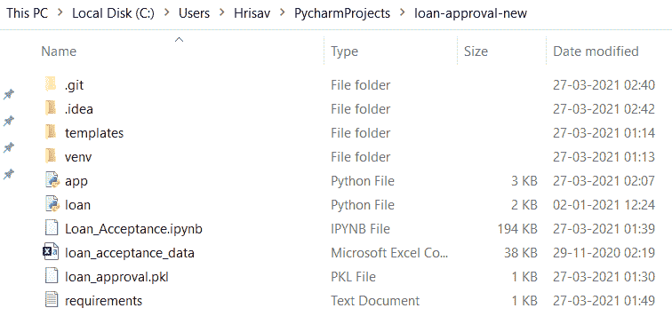
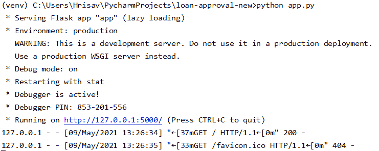
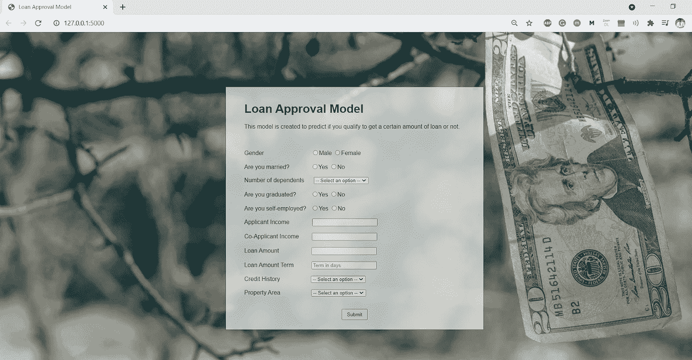

# 在本地主机上用 Flask 部署 ML 模型——第一部分

> 原文：<https://medium.com/analytics-vidhya/ml-model-deployment-with-flask-on-local-host-part-i-300694542d68?source=collection_archive---------1----------------------->

在这个 2 篇文章的系列中，我们将讨论如何在 localhost(使用 Python localhost 服务器)和 webhost(使用 Amazon-EC2)上使用 Flask 部署机器学习模型。在第一部分中，我们将展示如何构建模型、设计 HTML/CSS 页面并最终在 localhost 上运行它。

# 1.建立机器学习模型

该问题的目标是根据客户提供的信息(如性别、婚姻状况、教育程度、受抚养人人数、收入、贷款金额、信用记录等)来确定有资格获得房屋贷款的客户。

数据集为*' loan _ acceptance _ data . CSV '*。我们将使用 PyCharm IDE 来完成整个项目。首先，创建一个虚拟环境，并给出一个项目名称。我们的情况是*‘贷款-审批-新建’*。现在，创建一个 python 文件，其中将完成模型构建部分。

将文件保存为*‘loan . py’*。

我们在这里执行的步骤是:

*   输入缺失值
*   特征工程
*   标记分类列
*   选择所需功能
*   列车测试分离
*   使用逻辑回归建立模型
*   创建 pickle 文件

```
file = open('loan_approval.pkl', 'wb')
pickle.dump(model, file)
```

上面两行代码将创建一个名为*‘loan _ approval . pkl’*的 pickle 文件。

# 2.制作 HTML/CSS 前端文件

设计的 HTML 文件将有内容将在网站上显示。CSS 部分也可以添加到同一个文件中，为网页提供一些设计。

在这里，我们创建一个表单，用户将提供他的输入细节。

将文件另存为 *'index.html'* 。

# 3.创建 Python/Flask 后端文件

在这里，我们将创建一个 Python 文件，它将从 HTML 文件中获取值，并根据输入执行操作，最后预测结果。我们需要在系统中安装 Flask 来运行它。

下面是初始化 Flask 应用程序的代码片段。

```
from flask import Flask, render_template, request
import pickle
import numpy as npmodel = pickle.load(open('loan_approval.pkl', 'rb'))  # read modeapp = Flask(__name__)  # initializing Flask app
```

通过下面的代码片段获取 index.html 的详细信息。

```
@app.route("/",methods=['GET'])
def hello():
    return render_template('index.html')
```

现在是我们做预测的最后一部分。

注意最后一行。要在本地系统上运行，应启用以下代码。

```
app.run(debug=True)
```

将文件另存为 *'app.py'* 。

# 4.安装依赖项

在 Pycharm 终端中，安装 pip。如果已经安装，请强制重新安装。

```
> python -m pip install -U --force-reinstall pip
```

安装运行项目所需的依赖项或库。

```
> python -m pip install Flask
```

像这样做所有的图书馆，如 sklearn，pandas，numpy 等。

一旦安装了所有的库，确保生成一个 *'requirements.txt'* 文件，该文件将包含运行项目所需的所有库的名称和版本。

```
> pip freeze > requirements.txt
```

# 4.在本地主机上运行

确保本地 PyCharm 目录如下所示。



*' Loan _ acceptance . ipynb '*可以忽略。这基本上是 EDA 和模型比较部分完成的笔记本文件。 *'index.html'* 文件存储在 templates 文件夹中。忽略其余的文件夹，因为它们是在 PyCharm 中创建虚拟环境时自动生成的。

最后在 Pycharm 终端，运行 app。

```
> python app.py
```

输出屏幕将显示如下:



点击蓝色链接，在浏览器上运行 web 应用程序。或者复制粘贴链接并在浏览器上运行:

```
http://127.0.0.1:5000/
```

如果在整个过程中没有出现错误，浏览器的输出屏幕将显示网页。



# 结论

因此，我们终于成功地在 Chrome 浏览器上运行了该应用程序。一旦我们输入值，并点击提交按钮，屏幕将显示输出，如果贷款将为用户批准与否。

在第二部分中，我们将使用 Amazon EC2 在 webhost 上运行我们的模型。

感谢阅读我的文章！如果你喜欢我的文章吗👏。

该项目的完整代码，请查看 [Github 链接](https://github.com/hrisav/loan-acceptance)。

通过[链接](https://www.linkedin.com/in/hrisav/)与我联系，了解更多更新或如果你被困在任何地方。