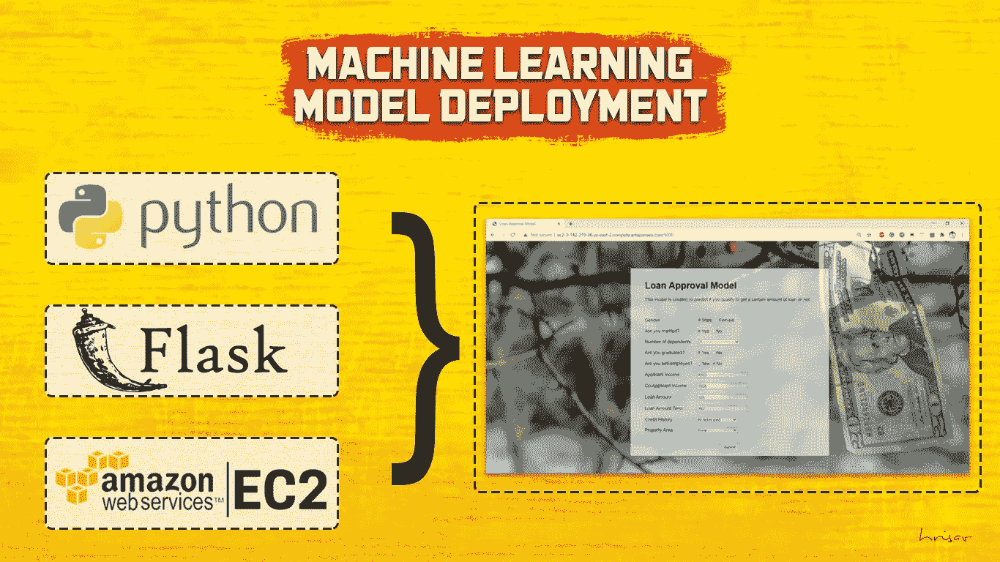
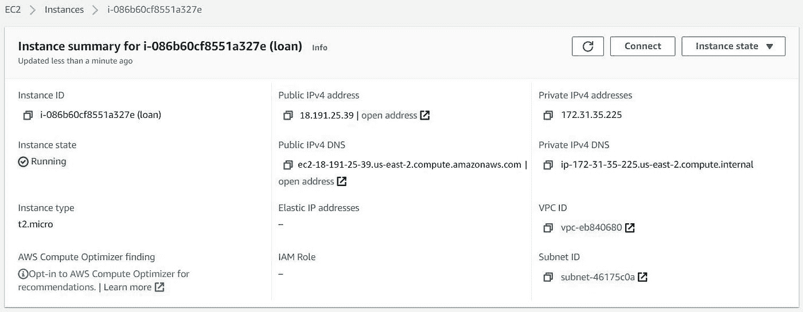

# 使用 AWS EC2 的带烧瓶的 ML 模型部署-第二部分

> 原文：<https://medium.com/analytics-vidhya/ml-model-deployment-with-flask-using-aws-ec2-part-ii-38ca941e0c4b?source=collection_archive---------4----------------------->

在第一部分中，我们已经看到了如何构建模型、设计 HTML/CSS 页面并最终在 localhost 上运行它。在第二部分中，我们将展示如何通过 10 个简单的步骤在 webhost 上部署它(使用 Amazon EC2)。



先决条件是，您必须在完成第一部分后创建以下内容:

*   *'loan.py'* (这将构建模型并生成 pickle 文件)
*   *'loan_approval.pkl'* (泡菜文件)
*   *'index.html'* (前端文件)
*   *'app.py'* (后端文件，构成 Flask app)
*   *'requirements.txt'* (拥有运行项目所需的所有库的列表)

# 1.**在 EC2 上创建实例**

*   转到 [EC2 仪表板](https://us-east-2.console.aws.amazon.com/ec2/v2/home?region=us-east-2)。
*   单击实例。
*   单击启动实例。
*   第一步，选择一个亚马逊机器镜像**(**AMI)——选择 Ubuntu Server 18.04。单击下一步。


*   在步骤 2 中选择实例类型—*‘T2 . micro’*。单击下一步。


*   忽略第 3、4 步，在第 5 步单击添加标签。关键:*‘贷款’*，数值:*‘贷款标签’*。单击下一步。


*   在第 6 步中，将安全组名称更改为*‘sgloantag’*。单击查看并启动。

# 2.**投放实例**

*   单击启动。创建密钥对名称- *'kploantag'* 。下载密钥对。将 PEM 文件保存在桌面上的新文件夹(名称:deploy)中。单击启动实例。


*   转到查看实例并为实例添加一个名称-*‘loan’*。它应该显示运行。


*   现在单击实例 id。转到安全选项卡。单击安全组链接。编辑入站规则->添加规则:自定义 TCP |端口:5000 |源:0.0.0.0/0 |保存规则。


# 3.**准备好目录**

*   转到包含项目文件的文件夹(名称:loanproject)。它应该包含:dataset，app.py，requirements.txt，pkl 文件，包含 html 文件的模板文件夹。将项目文件夹压缩为 loanproject.zip。


*   转到保存 PEM 文件的文件夹(名称:deploy)。复制 loanproject.zip 并将其粘贴到 PEM 文件所在的同一文件夹中。


# 4.**检查连接环节**

*   转到 EC2 上的实例页面，选择实例，然后选择连接。下面的屏幕将出现。


上面图像的最后一行将用于连接到服务器。

第四行将用于在浏览器上查看项目 UI。

# 5.**检查实例摘要**

*   单击实例名称，检查实例摘要详细信息是否良好(如图所示)。



# 6.**连接到实例**

*   从该文件夹打开 PowerShell，方法是转到地址栏并键入 Powershell，在它启动后，运行以下命令:

```
> scp -i kploantag.pem loanproject.zip ubuntu@ec2-18-191-25-39.us-east-2.compute.amazonaws.com:
```

上述命令会将我们的文件发送到 web 服务器。我们也可以使用 WinSCP/FileZilla/PuTTY 来代替`scp`命令。

```
> ssh -i "kploantag.pem" ubuntu@ec2-18-191-25-39.us-east-2.compute.amazonaws.com
```

这将有助于连接到服务器。

# 7.**获取服务器上的文件**

运行以下命令。

```
> dir> sudo apt install zip unzip> unzip loanproject.zip> cd loanproject
```


# 8.准备好**环境**

```
> sudo apt-get update> sudo apt-get install -y python3-pip> pip3 install -r requirements.txt
```

“requirements.txt”包含运行项目所需的所有库。


如果在运行最后一段代码时出现任何错误，请检查哪个库安装失败，然后手动安装，如下所示:

```
> pip3 install numpy
```

在我的例子中，我必须手动安装 flask 和 sklearn 以及 numpy。这主要是由于版本兼容性问题。

# 9.运行脚本

*   最后运行 python 文件 app.py:

```
> python3 app.py
```


服务器已启动并正在运行。如果它失败了，就会抛出错误。

# 10.**运行在浏览器上**

*   通过连接到实例转到 SSH 客户端页面，并复制链接以运行。这个网址对于不同的用户是不同的。


*   转到浏览器，粘贴连接到实例后得到的链接。注意，我们需要在末尾追加 port->:5000/

粘贴并在浏览器上运行:

```
http://ec2-18-191-25-39.us-east-2.compute.amazonaws.com:5000/
```

下面是正在运行的 web 应用程序和用户输入的一些内容:


这是底部的结果:


# 结论

因此，我们终于成功部署了该应用程序。一旦我们输入值，并点击提交按钮，屏幕将显示输出，如果贷款将为用户批准与否。

感谢阅读我的文章！如果你喜欢我的文章吗👏。

该项目的完整代码，请查看 [Github 链接](https://github.com/hrisav/loan-acceptance)。

通过[链接的](https://www.linkedin.com/in/hrisav/)与我联系，获取更多更新，或者如果你被困在任何地方。