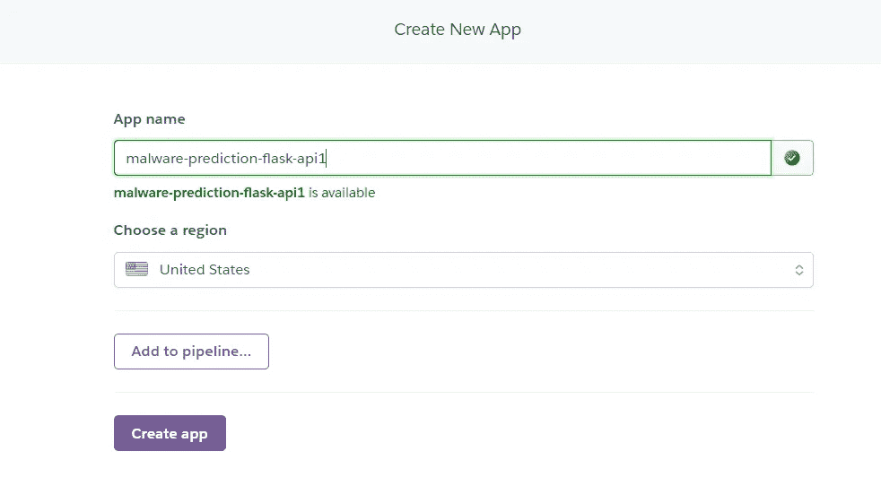
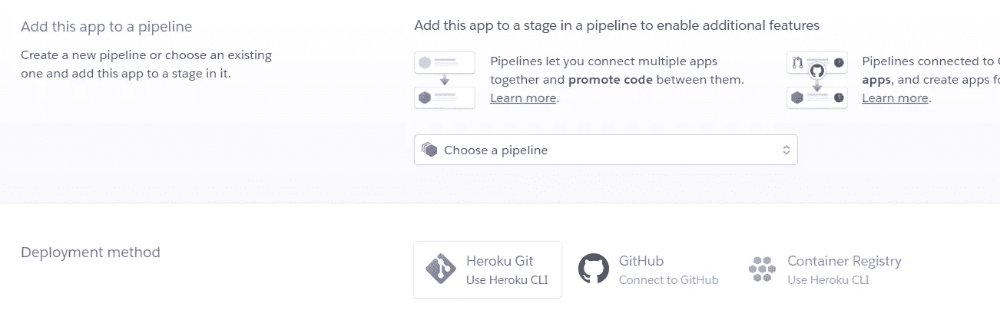
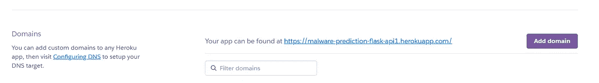

# 使用 Heroku 的 ML 模型生产

> 原文：<https://medium.com/analytics-vidhya/ml-model-productionization-using-heroku-a809afd51d93?source=collection_archive---------9----------------------->

Heroku 是一个自 2007 年以来一直在开发的平台即服务，由 James Lindenbaum、Adam Wiggins 和 Orion Henry 创建，最初只支持 Ruby 编程语言，但现在支持 Java、Node.js、Scala、Clojure、Python、PHP 和 GO，使开发人员能够构建、运行和操作应用程序。


Heroku@Twitter

在这篇博客中，我将向你解释使用基本的 Flask API 在 Heroku 上生产任何 ML 模型的步骤，这些 API 是我在进行微软恶意软件预测的自我案例研究后部署的。我希望你已经了解了[烧瓶](https://www.tutorialspoint.com/flask/index.htm)、[吉特](https://www.tutorialspoint.com/git/index.htm)和[蟒蛇](https://docs.anaconda.com/anaconda/user-guide/getting-started/)的基本知识。

关于案例研究的更多详细信息，你可以关注我下面的博客，我已经详细解释了我是如何解决这个问题的。

[](/swlh/microsoft-malware-prediction-using-classical-machine-learning-algorithms-5ade962ca73a) [## 使用经典机器学习算法的微软恶意软件预测

### 作为自我案例研究的一部分，我选择了一个问题陈述微软恶意软件预测从 Kaggle 这是一个…

medium.com](/swlh/microsoft-malware-prediction-using-classical-machine-learning-algorithms-5ade962ca73a) 

起初，我创建了名为 Malware_Prediction 的虚拟环境，以便管理 python 包和在 Heroku 上轻松部署我的应用程序。

我使用 anaconda 开发 flask api，所以我使用 anaconda 创建了[虚拟环境](https://uoa-eresearch.github.io/eresearch-cookbook/recipe/2014/11/20/conda/)并激活了该环境。

一旦虚拟环境被激活，我安装了运行 flask 应用程序所需的各种包。

然后，我将目录更改为 app 目录，其中整理了部署 app 所需的配置文件和 app.py。

文件夹结构将是这样的:

```
Malware_Prediction
|- Templates
    |- index.html
|- app.py
|- binary.npz
|- categorical.npz
|- highly_correlated_binary_features.npz
|- highly_correlated_categorical_features.npz
|- highly_correlated_numerical_features.npz
|- lightgbm_best_model_after_feature_selection.pkl 
```

App.py 是实际的 flask 应用程序代码文件，它将在 Heroku 上部署后执行。

模板文件夹将包含运行应用程序所需的所有模板。

在更改目录并整理了 app 目录中所有需要的文件后，尝试在本地运行 app 并检查 app 是否运行良好，我也这样做是为了在 Heroku 上顺利部署并且没有任何问题。

在本地运行和验证应用程序后，现在是生成 requirements.txt 文件的时候了。

Requirements.txt 文件是用于指定运行项目所需的 python 包的文件。

有两种方法生成 requirements.txt 文件:

1.  手动指定需要哪些包
2.  通过在虚拟环境中执行命令，在虚拟环境中专门安装了那些包来运行项目。

因此，我使用第二种方法来生成 requirements.txt 文件。

生成 requirements.txt 文件后，为了在 Heroku 上部署应用程序，还需要创建一个重要文件，即 Procfile。

Procfile 指定了应用程序在启动时要执行的命令。Procfile 始终是一个没有任何扩展名的简单文本文件。所以如果 Procfile 是用扩展名。txt，那么我们的应用程序将不会启动，所以请确保创建没有任何扩展名的 Procfile。

Procfile 具有以下格式:

```
<process type>: <command>
```

因此，我在我的 windows 10 操作系统中使用下面的命令创建了 Procfile。

```
echo web: gunicorn app:app > Procfile
```

以上命令将创建名为 Procfile 的新文件，内容为 **web: gunicorn app:app**

在上面的命令**中，web** 指定了进程类型，该进程类型指定必须通过互联网访问应用程序。而 [**gunicorn**](https://gunicorn.org/) 是基于 WSGI 的 HTTP 服务器，用于并行化流量。因此，它将使用 **gunicorn app** 来执行，而不是执行 flask API。最后一个**应用**是将要运行的实际应用文件名。

所以在创建 requirements.txt 和 Procfile 之后，文件夹结构现在是:

```
Malware_Prediction
|- Templates
    |- index.html
|- app.py
|- binary.npz
|- categorical.npz
|- highly_correlated_binary_features.npz
|- highly_correlated_categorical_features.npz
|- highly_correlated_numerical_features.npz
|- lightgbm_best_model_after_feature_selection.pkl
|- requirements.txt
|- Procfile
```

之后，登录 [Heroku](https://www.heroku.com/) 并创建新的应用程序，您可以选择一个区域来部署您的应用程序。我选择了美国。



创建应用程序后，我们可以将此应用程序添加到 pipeline，或者使用各种其他选项(如 Heroku CLI、GITHUB 和容器注册表)部署此应用程序。我使用 Heroku CLI 部署了这个应用程序。



对于要使用 Heroku CLI 部署的 app，Git 是一个先决条件，需要安装 Git 才能将本地 repo 推送到远程。

下面是 Heroku CLI 和 GIT 的链接，可以下载不同的操作系统。

[](https://git-scm.com/downloads) [## 下载

### Git 是软件自由保护协会的成员，该协会处理该项目的法律和财务需求。保护…

git-scm.com](https://git-scm.com/downloads) [](https://devcenter.heroku.com/articles/heroku-cli) [## Heroku CLI

### Heroku 命令行界面(CLI)使得直接从终端创建和管理您的 Heroku 应用程序变得非常容易…

devcenter.heroku.com](https://devcenter.heroku.com/articles/heroku-cli) 

安装 Git 和 Heroku CLI 后，我通过执行 Git bash 中的命令创建了 Git 存储库。

创建 git 存储库之后，现在使用下面的命令登录 Heroku。

然后，它会要求按任意键在浏览器中打开登录提示，然后输入详细信息，之后您就可以登录并执行 Heroku CLI 命令了。

成功登录后，将我创建的本地回购添加到远程回购，即我们的应用程序中。推给了 heroku。

将存储库推送到 heroku 需要一些时间，这取决于要安装的包。

推送成功后，现在 app 部署在 Heroku 上。因此，为了检查你的应用程序的工作情况，在你的 Heroku 仪表盘的设置中，下拉到域部分，在那里你可以找到应用程序的 URL。



这就是我如何在 heroku 上部署和生产我的 ML 模型。这是我部署的应用程序的[链接](https://malware-prediction-flask-api.herokuapp.com/)。

这里是我的[仓库](https://github.com/jugaloza/Malware-prediction-Heroku)，在这里你可以找到在 Heroku 上部署我的 ML 模型的代码和必要文件。

如果你喜欢我的博客，别忘了鼓掌并关注我的更多更新。

欢迎提出改进这个博客的建议。

你可以在 [LinkedIn](https://www.linkedin.com/in/jugal-oza-974048109/) 上和我联系。

感谢您的阅读。