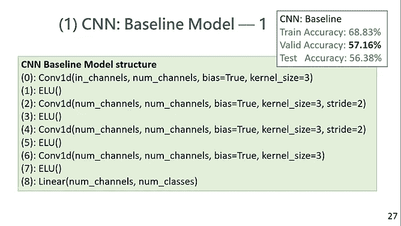
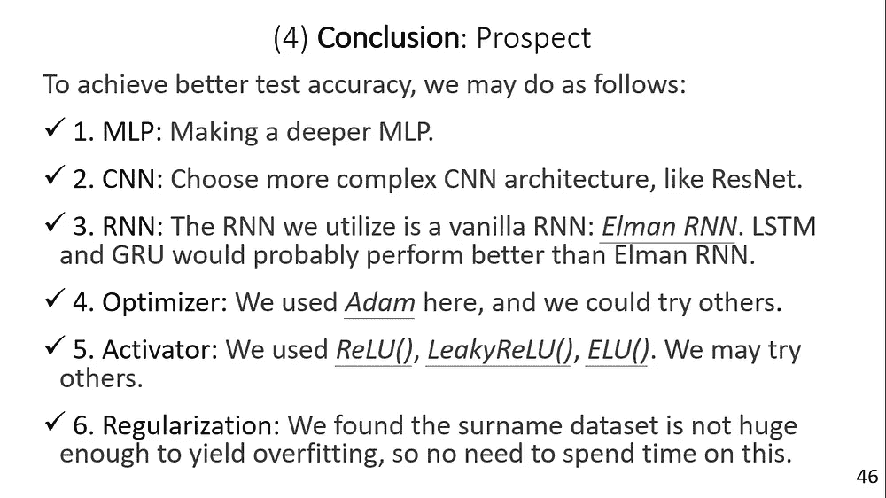

# ML18: NLP —姓氏分类

> 原文：<https://medium.com/analytics-vidhya/ml18-6e9b1b66c30e?source=collection_archive---------19----------------------->

## 一个迷你项目实现 MLP，有线电视新闻网，RNN 与 PyTorch

**关键词**:自然语言处理(NLP)、文本挖掘、分类、多层感知器(MLP)、卷积神经网络(CNN)、递归神经网络(RNN)

> ***完整 PPT&WORD on GitHub****:*[https://bit.ly/3VLcxYp](https://bit.ly/3VLcxYp)***完整 Python code on Colab****:
> 1 .预处理:*[https://bit.ly/3hGWYhs](https://bit.ly/3hGWYhs) *2。*[https://bit.ly/3nTLxpf](https://bit.ly/3nTLxpf) *MLP 3。CNN:*[https://bit.ly/3rwRCKr](https://bit.ly/3rwRCKr) *4。*https://bit.ly/3ptfcG8[RNN](https://bit.ly/3ptfcG8)

代码主要来源于本书 ***Rao，D. & McMahan，B. (2019)。用 PyTroch 进行自然语言处理。加利福尼亚州:奥莱利媒体*** 。在此基础上，我调整了模型并可视化了结果。

这篇文章实际上是我在 *NCCU* 的 *PyTorch 和机器学习*课程的最终项目。

图 1: Rao，d .和 McMahan，B. (2019 年)。用 PyTroch 进行自然语言处理。加利福尼亚州:奥赖利媒体。

> ***大纲*** *(1)*[*数据介绍&数据预处理*](#aefc) *(2)*[*神经网络调优技巧*](#b4a9)**[*模型介绍&基线模型*](#a76f)**

# **(1)* 数据介绍&数据预处理*

## *1.数据介绍*

*姓氏数据集，是作者从互联网上不同的姓名来源收集到的 18 个不同国籍的 10000 个姓氏的集合。我们将数据分成 70%的训练数据、15%的验证数据和 15%的测试数据。*

## *2.数据预处理*

*首先，我们将姓氏数据集分成 70%的训练数据、15%的验证数据和 15%的测试数据。*

*接下来，我们使用*一键编码*对姓氏进行矢量化。我们利用两种变体——“折叠的独热向量”和“独热矩阵”我们在 MLP 使用“折叠的热点向量”来节省运行时间，在 RNN 使用 CNN &的“热点矩阵”。简而言之，“折叠的独热向量”不保留顺序信息，只给出字符出现或不出现的布尔值，而“独热矩阵”记录顺序信息。*

# *(2)神经网络调谐提示*

*检查 ML17 的神经网络调谐提示。*

* [## ML17:调整深层网络

### 活化剂、优化剂、时期、小批量、BN、漏失和重量衰减

medium.com](/analytics-vidhya/ml17-a2f9315e5f1a)* 

# *(3)模型介绍&基线模型*

## *1.模型介绍*

***神经元**:神经网络的最小单元。
**感知器**:单层神经网络。
**FNN(前馈神经网络)** : MLP(多层感知器，也叫“全连接”网络)，CNN(卷积神经网络)。
**RNN(递归神经网络)** : RNN，LSTM(长短期记忆)，GRU(门控递归单元)。*

## *2.基线模型*

*我们使用从书中检索的 MLP 和 CNN 的完全相同的模型分别作为 MLP 和 CNN 的基线模型。至于 RNN，我们做了同样的事情，但略微调整了*下降概率*从 50%到 0%,因为 0%产生更好的性能。*

# **MLP**

## *1.基线 MLP 模型*

******

*图 2、3 和 4:基线 MLP 模型的细节。*

## *2.最佳 MLP 模特*

****

*图 5 和图 6:最佳 MLP 模型的细节。*

## *3.MLP 摘要*

**

*图 7:MLP 模型总结。*

# *(5)美国有线电视新闻网*

## *1.基线 CNN 模型*

******

*图 8、9 和 10:基线 CNN 模型的细节。*

## *2.最佳 CNN 模式*

******

*图 11 & 12 & 13:最佳 CNN 模型的细节。*

## *3.CNN 摘要*

**

*图 14:CNN 模型总结。*

# *(6) RNN*

## *1.基线 RNN 模型*

******

*图 15 & 16 & 17:基线 RNN 模型的细节。*

## *2.最佳 RNN 模特*

******

*图 18 & 19 & 20:最佳 RNN 模型的细节。*

## *3.RNN 摘要*

**

*图 21:RNN 模型的总结。*

# *(7)结论*

****

*图 22 和 23:“MLP 对 CNN”和“CNN 对 RNN”*

****

*图 24 和 25:“集成学习”和“前景”*

# **(8)参考文献**

*1.Géron，A. (2019)。使用 Scikit-Learn、Keras 和 TensorFlow 进行机器学习(第二版。).加利福尼亚州:奥赖利媒体。*

*2.Rao d .和 McMahan b .(2019 年)。用 PyTroch 进行自然语言处理。加利福尼亚州:奥赖利媒体。*

*3.萨卡尔博士(2019)。用 Python 进行文本分析(第二版。).印度卡纳塔克邦:新闻。*

*4.t . ganegedara(2018 年)。用张量流进行自然语言处理。英国伯明翰:Packt 出版公司。*

*5.Subramanian，V. (2018)。用 PyTorch 进行深度学习。英国伯明翰:Packt 出版公司。*

*6.j .帕特森和 a .吉布森(2017)。一个实践者的方法。加利福尼亚州:奥赖利媒体。*

*7\. 斎藤康毅 (2016). ゼロから作るDeep Learning ―Pythonで学ぶディープラーニングの理論と実. Japan, JP: O’Reilly Japan.*

*8.郭，男(2021)。ML16:动手文本预处理。检索自*

* [## ML16:动手文本预处理

### 自然语言处理的第一步&文本挖掘

medium.com](/analytics-vidhya/ml16-ef6105b5bb34)*