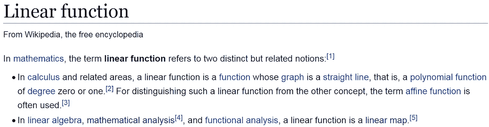
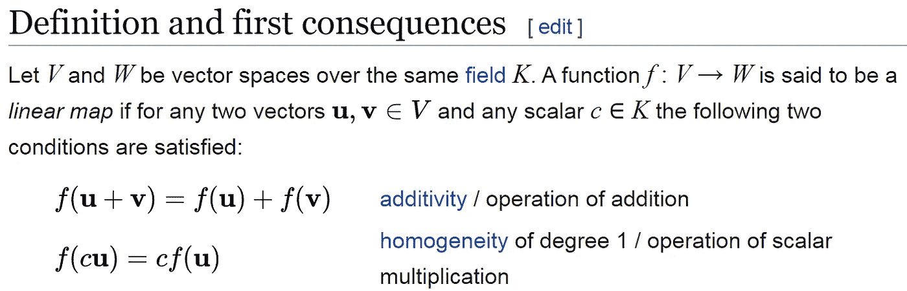
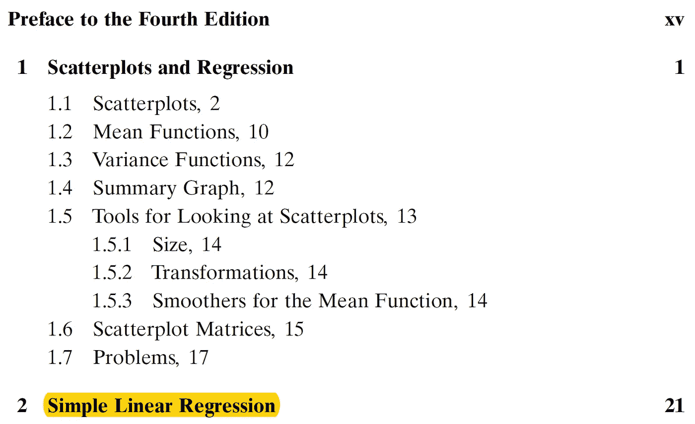
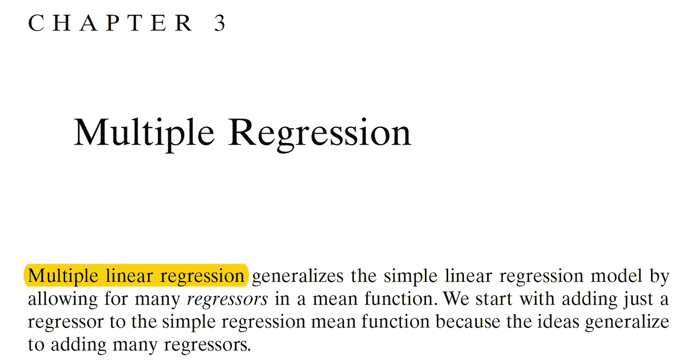
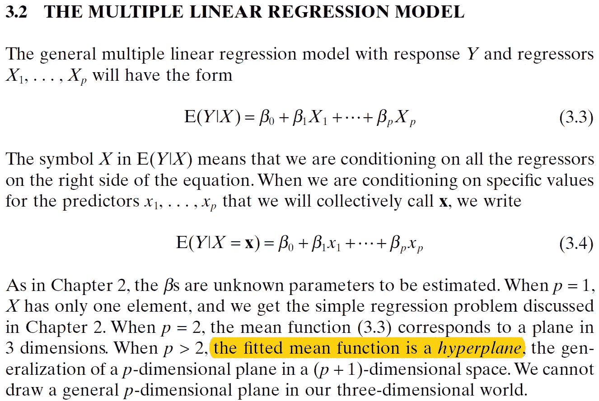

# ML19:线性回归中的“线性”

> 原文：<https://medium.com/analytics-vidhya/ml19-4069a5f7a552?source=collection_archive---------22----------------------->

## 这个“线性”是代表线性函数还是线性映射？

**关键词**:线性回归，线性函数，微积分，线性映射，线性变换，线性代数

具有*高次项(次数> 1)、相互作用项、正则化、*和*逐步过程*的线性回归是**廉价、省时、可解释且性能良好的**。对于所有 ML/DS 项目来说，这是一个很好的起点**和基准模型**。****

> ***大纲*** *(1)*[*简介*](#249b) *(2)*[*关键证据*](#4451) *【3】*[*答案:线性映射*](#d27b) *(4)*[*线性回归:一个便宜、省时的*](#c11e)

# (1)引言

## 1.线性函数

*   *微积分*中的一个概念。
*   指 1 次或 0 次多项式，例如 y = ax + b。
*   注意，在某些上下文中，一个*线性映射*也被称为*线性函数*【1】，尽管这实际上很少见。



图 1:来自维基百科的“线性函数”。[2]

## 2.线性地图

*   *线性代数*中的一个概念。
*   *线性映射*(也称为*线性映射*、*线性变换*或在某些上下文中的*线性函数*)是两个模块(例如，两个向量空间)之间的映射 V → W，它保留加法和标量乘法的操作。如果一个*线性映射*是一个双射，那么它被称为线性同构。[1]
*   我们从图 1 中看到,“线性”在数学中有双重含义。那么，线性回归中的“线性”代表什么？



图 2:来自维基百科的“线性地图”。[1]

# (2)关键证据

让我们查一下世界各地统计系毕业生的著名教材——*****(第 4 版。)*【3】—求解答。令人扫兴的是，就连这本教材也没有对线性回归中的“线性”是线性函数还是线性映射给出明确的解释；然而，我们可以在教科书中找到一些线索。****

## ****1.证据 1****

********

****图 3:应用线性回归(第 4 版。)，第 vii 页。[3]****

****在目录中，第 2 章的标题是“简单线性回归”****

## ****2.证据 2****

********

****图 4:应用线性回归(第 4 版。)，第 51 页。[3]****

****这里我们看到的“多元回归”实际上是“多元线性回归”注意在微积分中没有所谓的“多元线性函数”这个术语。****

## ****3.证据 3****

********

****图 5:应用线性回归(第 4 版。)，第 55 页。[3]****

****这里的描述和线性地图是完全一样的概念。****

# ****(3) *答案:线性地图*****

****因此，我们得到的答案是，线性回归中的“线性”正是线性代数中的线性映射！****

****此外，线性回归有两个分支——简单线性回归和多元线性回归。****

# ****(4) *线性回归:一种廉价、省时、高效的模型*****

## ****1.含高阶项(阶数> 1)和交互项的线性回归****

****网上相当一部分 ML/DS 的书和文章误解线性回归，把它当成直线，即 1 次或 0 次的多项式；因此，他们错过了线性回归的力量。****

****事实上，线性回归*可以有更高阶的项(degree > 1)和交互项*，这有助于比简单的直线更精确地拟合数据。****

## ****2.便宜、省时、可解释且性能良好****

****具有高阶项(阶数> 1)和交互项的线性回归是一个*便宜、省时、可解释且性能良好的模型*。线性回归是 ML/DS 项目中最基本也是最好的开始模型。****

## ****3.起点和基线模型****

****以线性回归为起点，我们可以*在建立更复杂的模型(例如 SVM、RF、XGBT、ANN、CNN、RNN)之前，发现数据的特征并选择关键特征*，这可能比线性回归花费更多。****

****此外，我们可以*以上面这个复杂的线性回归模型作为基线模型来评估每个复杂模型*(例如 SVM、RF、XGBT、ANN、CNN、RNN)的性能。毕竟，根据奥卡姆剃刀定律(简约法则)，为什么要费心去使用复杂而耗时的模型，其精确度接近普通模型——线性回归？****

****另外，利用正则化(套索、脊、弹性网)可以帮助我们减轻线性回归的过度拟合，并产生更好的线性回归模型。****

# ****(5)书籍误解了线性回归中的“线性”****

****可惜网上的 ML/DS 书籍和文章大多只讨论简单的线性回归。其中，有几本书“明确地”误解了线性回归(我高度怀疑许多作者只是简单地认为线性回归是一条直线，但我没有足够的证据)，它们的描述如下:****

```
**1\. **Kane, F. (2017). Hands-on Data Science and Python Machine Learning. Birmingham, UK: Packt Publishing.**
"All it (linear regression) is, is fitting a straight line to a set of data points."2\. **Joshi, P. (2016). Python Machine Learning Cookbook. Birmingham, UK: Packt Publishing.**
"You might say that there might be a curvy line out there that fits these points better, but linear regression doesn't allow this."**
```

****另一方面，有书“明确地”认识到线性回归的真正威力，提到线性回归中的高阶项(degree>1)或交互项:****

```
**1\. **Albon, C. (2018). Machine Learning with Python Cookbook: Practical Solutions from Preprocessing to Deep Learning. California, CA: O’Reilly Media.**2\. **VanderPlas, J. (2017). Python Data Science Handbook: Essential Tools for Working with Data.** **California, CA: O’Reilly Media.**3\. **Hackeling, G. (2017). Mastering Machine Learning with scikit-learn (2nd ed.).  Birmingham, UK: Packt Publishing.****
```

# ****(6)结论****

1.  ****线性回归中的“线性”是指*线性代数*中的 ***线性映射*** 而不是*微积分*中的*线性函数*(1 或 0 次多项式)。****
2.  ****具有*高次项(次数> 1)、相互作用项、正则化、*和*逐步过程*的线性回归**肯定优于**线性回归，例如 z = ax + by + c****
3.  ****具有*高阶项(degree > 1)、交互项、正则化、*和*逐步过程*的线性回归**便宜、省时、可解释且性能良好**。对于所有的 ML/DS 项目来说，在建立更复杂的模型(例如 SVM、RF、XGBT、ANN、CNN、RNN)之前发现数据的特征并选择关键特征是一个很好的起点。****
4.  ****而且，我们可以*以上面这个复杂的线性回归模型作为* ***基线模型*** *来评估各个复杂模型*(如 SVM、RF、XGBT、ANN、CNN、RNN)的表现。所谓的基线模型不应该是像 z = ax + by + c 或 y= ax + b 这样过于普通的模型。****
5.  ****读者可以查看 ML20 和 ML21，分别使用 R & Python 进行实际的线性回归实现。****

****[](/analytics-vidhya/ml21-8fb43cc5082d) [## ML21:使用 Python 进行线性回归

### 更高级的术语和交互

medium.com](/analytics-vidhya/ml21-8fb43cc5082d) [](/analytics-vidhya/ml20-abb54a435b3) [## ML20:带 R 的逐步线性回归

### 更高级的术语和交互

medium.com](/analytics-vidhya/ml20-abb54a435b3) 

# (7)参考文献

[1]维基百科(身份不明)。线性地图。从 https://en.wikipedia.org/wiki/Linear_map[取回](https://en.wikipedia.org/wiki/Linear_map)

[2]维基百科(身份不明)。线性函数。从 https://en.wikipedia.org/wiki/Linear_function[取回](https://en.wikipedia.org/wiki/Linear_function)

[3]韦斯伯格，S. (2014 年)。应用线性回归(第 4 版。).新泽西州，约翰·威利父子公司。

[4]阿尔邦，C. (2018)。机器学习与 Python 食谱:从预处理到深度学习的实用解决方案。加利福尼亚州:奥赖利媒体。

[5]范德普拉斯，J. (2017 年)。Python 数据科学手册:处理数据的基本工具。加利福尼亚州:奥赖利媒体。

[6]哈克林，G. (2017)。用 scikit-learn 掌握机器学习(第 2 版。).英国伯明翰:Packt 出版公司。

[7]凯恩，F. (2017)。动手数据科学和 Python 机器学习。英国伯明翰:Packt 出版公司。

[8]乔希，P. (2016)。Python 机器学习食谱。英国伯明翰:Packt 出版公司。****