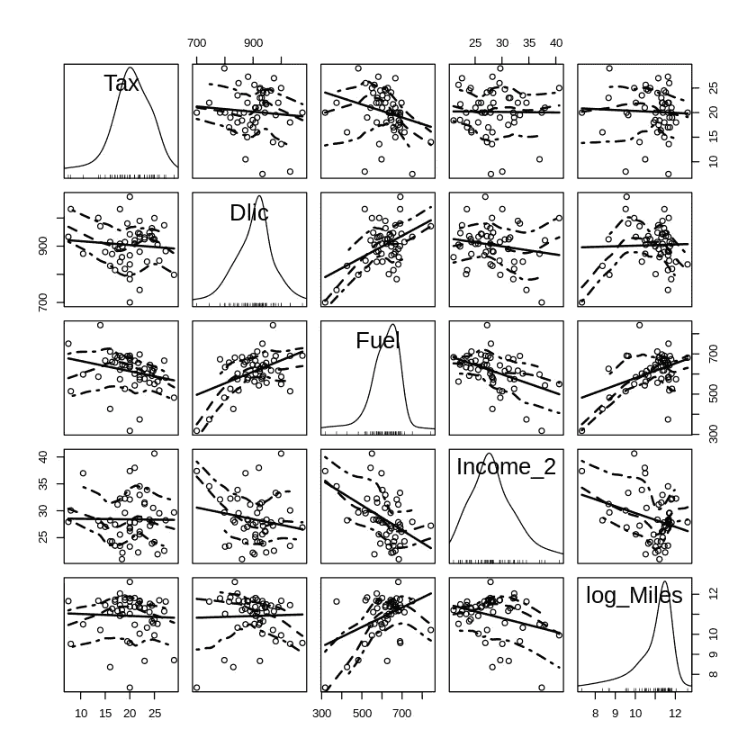

# ML20:带 R 的逐步线性回归

> 原文：<https://medium.com/analytics-vidhya/ml20-abb54a435b3?source=collection_archive---------25----------------------->

## 更高级的术语和交互

**关键词**:逐步线性回归，高次项，相互作用，AIC，BIC，相关热图，散点图

在 Colab 上完成 R 代码:【https://bit.ly/3oRq3cR】T4

*   线性回归是最大似然法中一个重要但经常被低估的模型。
*   LR 提供了一个快速演练**，为**实现更复杂的 ML 建模和更复杂的分析做准备。
*   此外，LR 可以作为基准模型**来评估更复杂的 ML 模型的性能。**

在 ML19 的基础上，我们现在向前迈进，更仔细地看看使用 R 处理玩具数据集“fuel2001”(燃料数据)的线性回归。)【③】。在第 1 章&第 3 章，这本著名的教科书利用这个玩具数据集简明地演示了 ***散点图矩阵******汇总统计******相关矩阵*** 和 ***多元线性回归***

[](/analytics-vidhya/ml19-4069a5f7a552) [## ML19:线性回归中的“线性”

### 这个“线性”是代表线性函数还是线性映射？

medium.com](/analytics-vidhya/ml19-4069a5f7a552) 

> ***轮廓******(1)****[***在 Colab 中使用 R***](#b151)*
> 
> ****(2)***[***数据来源:油耗***](#d6a1)*
> 
> ****【3】****[***数据预处理***](#a552) *3–1 删除一列
> 3–2 转换
> 3–3 保留需要的列***
> 
> *****(4)***[***数据探索***](#7b6f) *4–1 描述性统计
> 4–2 相关矩阵
> 4–3 散点图矩阵
> 4–4 散点图***
> 
> *****(5)****[***线性回归***](#614d) *5–1 信息标准:AIC vs BIC
> 5–2 LR
> 5–3 LR 有交互
> 5–4 LR 有交互&高次项
> 5–5 逐步 LR 使用 lm()
> 5–6 逐步 LR 使用 lm()&BIC
> 5–7****
> 
> *****(6)****[***概要***](#abd5)***(7)***[***参考文献***](#793f)***

# **(1)在 Colab 中使用 R[4]**

**对于新的 R-notebook，使用[此链接](https://colab.research.google.com/notebook#create=true&language=r)。(速记是[colab.to/r](https://colab.to/r))**

**可以从 IRkernel 的演示中学习，比如 [demo.ipynb](https://colab.fan/IRkernel/IRkernel/example-notebooks/Demo.ipynb) 。**

# **(2)数据来源:燃料消耗[3][6]**

**读者可以下载下面的“fuel2001.csv”数据集。
[http://users.stat.umn.edu/~sandy/alr4ed/data/](http://users.stat.umn.edu/~sandy/alr4ed/data/)**

> *****油耗*** *这个例子的目的是了解美国 50 个州和哥伦比亚特区的油耗如何变化
> (联邦公路管理局，2001)。表 1.1 描述了本例中使用的变量；数据在文件 fuel2001 中给出。这些数据是由美国联邦公路管理局收集的。***

*   **1.形状:7 个变量的 51 个观察值**
*   **2.目标:“燃料”**
*   **3.功能:“司机”、“收入”、“里程”、“MPC”、“Pop”、“税收”**

# **(3)数据预处理**

## **3–1 删除列**

```
**fuel2001 = read.table("fuel2001.csv",sep=",",header = T)
head(fuel2001, n = 4)fuel2001_2 = fuel2001[,c(-1)]
names(fuel2001_2)**
```

****

**我们发现一个奇怪而无用的列，所以我们删除它。**

## **3–2 转换**

```
**fuel2001_3 <- transform(fuel2001_2,
Dlic=1000 * Drivers/Pop,
Fuel=1000 * FuelC/Pop,
Income_2 =Income/1000,
log_Miles = log(Miles))**
```

**我们做特征工程，通过 *transform()* 添加新的变量。**

## **3–3 保留所需的列**

```
**fuel2001_4 = fuel2001_3[, c(7,8,9,10,11)]
names(fuel2001_4)fuel2001_4 = fuel2001_3[, -c(1:6)]
names(fuel2001_4)**
```

**现在“燃料 2001_4”的信息如下:**

*   **1.形状:5 个变量的 51 个观察值**
*   **2.目标:“燃料”**
*   **3.特征:“税”、“Dlic”、“收入 _2”、“对数 _ 英里”**

# **(4)数据探索[1]**

## **4–1 描述性统计**

```
**str(fuel2001_4)attributes(fuel2001_4)mode(fuel2001_4$Tax)
class(fuel2001_4$Tax)
typeof(fuel2001_4$Tax)summary(fuel2001_4)colnames(fuel2001_4)
names(fuel2001_4)
rownames(fuel2001_4)
nrow(fuel2001_4)head(fuel2001_4, n = 3)
tail(fuel2001_4, n = 3)dim(fuel2001_4)
length(fuel2001_4)round(cor(fuel2001_4), 4)
round(var(fuel2001_4), 4) # OR cov(fuel2001_4)**
```

****

## **4–2 相关矩阵**

```
**corrgram(round(cor(fuel2001_4), 4), order=TRUE, upper.panel=panel.cor)**
```

********

## **4–3 散点图矩阵**

************

## **4–4 散点图**

********

# **(5)线性回归**

## **5-1 信息标准:AIC 对 BIC [3][8]**

*   **AIC = n log(RSSpc/n) + 2 Pc**
*   **BIC = n log(RSSpc/n) + log(n) Pc**
*   **AIC 是坂本等人(1986)给出的；BIC 是由施瓦茨(1978)给出的。**
*   **AIC 和 BIC 首选较小的值。**
*   **信息标准通过复杂性术语在 ***缺乏拟合*** 和 ***复杂性*** 之间提供平衡，本质上是防止模型过度拟合的惩罚。**

**显然，当 ***样本量 n*** 增加时，AIC 的惩罚会相对较小，因而不能降低模型的复杂度。在这种情况下，BIC 运行得更好。**

## **5–2 个左后轮**

```
**LR_fuel = lm(Fuel ~ Tax  + Dlic + Income_2 + log_Miles, data=fuel2001_4)
summary(LR_fuel)
cat("AIC = ", AIC(LR_fuel), sep = "")**
```

****

*   **AIC = 577.086**
*   **BIC = 588.6769**

## **带交互的 5–3 LR**

```
**LR_fuel = lm(Fuel ~ Tax + Dlic + Tax:Dlic + Income_2 + log_Miles, data=fuel2001_4)
summary(LR_fuel)
cat("AIC = ", AIC(LR_fuel), sep = "")**
```

*   **AIC = 575.6349**
*   **BIC = 589.1577**

## **5–4 LR，带交互和更高阶项**

```
**LR_fuel = lm(formula = Fuel ~  Tax + Dlic + Tax:Dlic + Income_2 + log_Miles + Tax:Dlic + I(log_Miles**2), data = fuel2001_4)
summary(LR_fuel)
cat("AIC = ", AIC(LR_fuel), sep = "")**
```

*   **AIC = 574.9257**
*   **BIC = 592.3121**

## **使用 lm() [7]的 5–5 逐步 LR**

```
**null_model = lm(Fuel ~ 1, data=fuel2001_4)
full_model = lm(Fuel ~ Tax + Dlic + Income_2 + log_Miles + Tax:Dlic + Tax:Income_2 + Tax:log_Miles + Dlic:Income_2 + Dlic:log_Miles + Income_2:log_Miles + I(Tax^2) + I(Tax^3) + I(Tax^4) + I(Dlic^2) + I(Dlic^3) + I(Dlic^4) + I(Income_2^2) + I(Income_2^3) + I(Income_2^4) + I(log_Miles^2) + I(log_Miles^3) + I(log_Miles^4), data=fuel2001_4)model_step = step(null_model, 
                  scope = list(lower=null_model, upper=full_model),
                  direction = "both", k= 2) 
                  # direction = c("both", "backward", "forward")
                  # k=2 for AIC; k=log(nrow(train_data)) for BIC**
```

*   ***步骤()*的默认信息标准是 AIC。**
*   **k 是用于惩罚的自由度的倍数。只有 k = 2 给出了真正的 AIC；k = log(n)有时被称为 BIC 或 SBC。**

**经过反复试验，逐步线性回归给出了如下模型:**

> ***lm(公式= Fuel ~ I(Income _ 2)+Dlic+log _ Miles+I(Tax)+I(Dlic)，data = fuel2001_4)***

****

*   **AIC = 573.7994**
*   **BIC = 587.3221**

## **使用 lm() & BIC 的 5–6 逐步 LR**

```
**null_model = lm(Fuel ~ 1, data=fuel2001_4)
full_model = lm(Fuel ~ Tax + Dlic + Income_2 + log_Miles + Tax:Dlic + Tax:Income_2 + Tax:log_Miles + Dlic:Income_2 + Dlic:log_Miles + Income_2:log_Miles + I(Tax^2) + I(Tax^3) + I(Tax^4) + I(Dlic^2) + I(Dlic^3) + I(Dlic^4) + I(Income_2^2) + I(Income_2^3) + I(Income_2^4) + I(log_Miles^2) + I(log_Miles^3) + I(log_Miles^4), data=fuel2001_4)model_step = step(null_model, 
                  scope = list(lower=null_model, upper=full_model),
                  direction = "both", k= log(nrow(fuel2001_4)) ) 
                  # direction = c("both", "backward", "forward")
                  # k=2 for AIC; k=log(nrow(train_data)) for BIC**
```

**经过反复试验，逐步线性回归给出了如下模型:**

> ***lm(公式= Fuel ~ I(Income _ 2)+Dlic+I(Tax)+I(Dlic)，data = fuel2001_4)***

*   **AIC = 575.0315**
*   **BIC = 586.6225**

## **使用 glm() & BIC 的 5–7 步线性回归**

```
**null_model = glm(Fuel ~ 1, data=fuel2001_4, family = gaussian(link = "identity"))full_model = glm(Fuel ~ Tax + Dlic + Income_2 + log_Miles + Tax:Dlic + Tax:Income_2 + Tax:log_Miles + Dlic:Income_2 + Dlic:log_Miles + Income_2:log_Miles + I(Tax^2) + I(Tax^3) + I(Tax^4) + I(Dlic^2) + I(Dlic^3) + I(Dlic^4) + I(Income_2^2) + I(Income_2^3) + I(Income_2^4) + I(log_Miles^2) + I(log_Miles^3) + I(log_Miles^4), data=fuel2001_4, family = gaussian(link = "identity"))model_step = step(null_model, 
                  scope = list(lower=null_model, upper=full_model),
                  direction = "both", k= log(nrow(fuel2001_4)) ) 
                  # direction = c("both", "backward", "forward")
                  # k=2 for AIC; k=log(nrow(train_data)) for BIC**
```

***glm()* 只是 *lm()* 的一般形式。 *glm()* 启用逻辑回归。**

**经过反复试验，逐步线性回归给出了如下模型:**

> ***glm(公式= Fuel ~ I(Income _ 2)+Dlic+I(Tax)+I(Dlic)，family = gaussian(link = "identity ")，data = fuel2001_4)***

*   **AIC = 575.0315**
*   **BIC = 586.6225**

# **(6)总结**

1.  **我们探讨了一个玩具数据集“fuel2001”所给出的“*应用线性回归(第 4 版。)*“使用 r 实现线性回归。我们不仅重现了第 1 章&第 3 章中的结果“*应用线性回归(第 4 版。)*”，同时也将这个玩具例子扩展为一个完整的数据分析过程。**
2.  **一般来说，数据分析过程[2]的步骤包括**

*   **思维能力**
*   **检索**
*   **准备**
*   **探测**
*   **建模**
*   **介绍会；展示会**
*   **生殖**

**从预处理、探索到逐步线性回归。换句话说，我们在这篇文章中从检索、准备、探索、建模到演示。**

**3.我们用交互作用和更高次项(degree > 1) 来体验**逐步回归的力量，这在 ML/DS 的书或网上的文章中很少提到。****

**这正是 R 盛行 Python 的地方。我们可以**快速选择期望的特征**用于解释或预测，通过这种具有相互作用和更高次项(度> 1)的逐步线性回归。然后，这些选择的特征可以放入更复杂的模型，如 SVM，随机森林，XGBoost，节省了大量的时间。**

**读者可以使用 Python 在 ML21 中进行相同的分析来检查相应的文章。**

**[](/analytics-vidhya/ml21-8fb43cc5082d) [## ML21:使用 Python 进行线性回归

### 更高级的术语和交互

medium.com](/analytics-vidhya/ml21-8fb43cc5082d)** 

# **(7)参考文献**

**[1]兰德公司 J.P. (2017)。人人共享:高级分析和图形(第 2 版。).马萨诸塞州:艾迪生-韦斯利专业公司。**

**[2] Heydt，M. (2017 年)。学习熊猫:Python 中的高性能数据操作和分析(第 2 版。).英国伯明翰:Packt 出版公司。**

**[3]韦斯伯格，S. (2014 年)。应用线性回归(第 4 版。).新泽西州，约翰·威利父子公司。**

**[4]科拉科特(2019)。如何将 R 与 Google Colaboratory 配合使用？检索自**

**[](https://stackoverflow.com/questions/54595285/how-to-use-r-with-google-colaboratory) [## 如何将 R 与 Google Colaboratory 配合使用？

### 感谢贡献一个堆栈溢出的答案！请务必回答问题。提供详细信息并分享…

stackoverflow.com](https://stackoverflow.com/questions/54595285/how-to-use-r-with-google-colaboratory) 

[5]身份不明(身份不明)。散点图矩阵-R 底图。检索自

[](http://www.sthda.com/english/wiki/scatter-plot-matrices-r-base-graphs) [## 散点图矩阵- R 基础图

### 之前，我们描述了 R 编程的要点，并提供了将数据导入 R 的快速入门指南

www.sthda.com](http://www.sthda.com/english/wiki/scatter-plot-matrices-r-base-graphs) 

[6]文件(身份不明)。燃料 2001:燃料消耗。检索自

 [## 2001 年燃料

### 2001 年汽车燃料消耗和相关变量的燃料消耗数据。单位是国家在…

www.rdocumentation.org](https://www.rdocumentation.org/packages/alr4/versions/1.0.5/topics/fuel2001) 

## (中文)

[7] 陳景祥 (2018)。R 軟體：應用統計方法 (第二版)。台北：東華書局。

[8] 钱魏 Way (2020)。最优模型选择准则：AIC 和 BIC。取自
[https://www.biaodianfu.com/aic-bic.html](https://www.biaodianfu.com/aic-bic.html)**