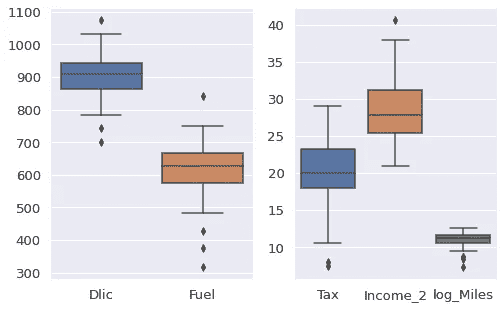

# ML21:使用 Python 进行线性回归

> 原文：<https://medium.com/analytics-vidhya/ml21-8fb43cc5082d?source=collection_archive---------24----------------------->

## 更高级的术语和交互

**关键词**:线性回归，高次项，相互作用，AIC，BIC，相关热图，散点图

**在 Colab 上完成 Python 代码**:【https://bit.ly/39CEuve】T4

*   线性回归是最大似然法中一个重要但经常被低估的模型。
*   LR 提供了一个快速演练**，为**实现更复杂的 ML 建模和更复杂的分析做准备。
*   此外，LR 可以作为基准模型**来评估更复杂的 ML 模型的性能。**

在 ML20 的基础上，用 R 做一系列的分析，最后得到逐步线性回归，我们尝试用 Python 再现 ML20 的结果。此外，读者可以检查 ML19 更多的先验知识。

我们可以在 Python 中找到大部分对应的函数；然而， ***在 Python***【5】【8】【10】【11】【12】【13】【14】【15】【17】【20】中我们找不到一个好用的阶梯式 LR 函数。

我们使用 Python 处理玩具数据集“fuel2001”(燃料数据)由“*应用线性回归(第 4 版)给出。)*【④】。在第 1 章&第 3 章，这本著名的教科书利用这个玩具数据集简明地演示了 ***【散点图矩阵】******汇总统计******相关矩阵*** 和 ***多元线性回归***

[](/analytics-vidhya/ml20-abb54a435b3) [## ML20:带 R 的逐步线性回归

### 更高级的术语和交互

medium.com](/analytics-vidhya/ml20-abb54a435b3) [](/analytics-vidhya/ml19-4069a5f7a552) [## ML19:线性回归中的“线性”

### 这个“线性”是代表线性函数还是线性映射？

medium.com](/analytics-vidhya/ml19-4069a5f7a552) 

> ***概要***
> 
> ***(1)***[***数据来源:油耗***](#b141)
> 
> ***【2】****[***数据预处理***](#bdac) *2–1 删除一列
> 2–2 转换
> 2–3 保留需要的列**
> 
> ****(3)***[***数据探索***](#f638) *3–1 描述性统计
> 3–2 散点图矩阵
> 3–3 相关矩阵&热图
> 3–4 散点图
> 3–5 方框图&支线图**
> 
> ****(4)****[***线性回归***](#124e) *4–1 信息标准:AIC vs BIC
> 4–2lr
> 4–3lr 有交互
> 4–4lr 有交互&高次项
> 4–5 运行 ML20* 中 R 的 step()给出的最佳模型**
> 
> *****(5)****[***概要***](#c850)***(6)***[***参考文献***](#0bcd)***

# **(1)数据来源:油耗[4]**

**读者可以下载下面的“fuel2001.csv”数据集。
[http://users.stat.umn.edu/~sandy/alr4ed/data/](http://users.stat.umn.edu/~sandy/alr4ed/data/)**

> *****油耗*** *这个例子的目的是了解美国 50 个州和哥伦比亚特区(联邦公路管理局，2001)的油耗如何变化。表 1.1 描述了本例中使用的变量；数据在文件 fuel2001 中给出。这些数据是由美国联邦公路管理局收集的。***

*   **1.形状:7 个变量的 51 个观察值**
*   **2.目标:“燃料”**
*   **3.功能:“司机”、“收入”、“里程”、“MPC”、“Pop”、“税收”**

# **(2)数据预处理[3]**

# **2–1 删除列**

```
**fuel2001 = pd.read_csv("fuel2001.csv")fuel2001_2 = fuel2001.drop(['Unnamed: 0'], axis = 1)
fuel2001_2.head(n=3)**
```

****

**我们发现一个奇怪而无用的列，所以我们删除它。**

# **2–2 转换**

```
**import numpy as npDlic= 1000 * fuel2001_2.Drivers / fuel2001_2.Pop
Fuel= 1000 * fuel2001_2.FuelC / fuel2001_2.Pop
Income_2 = fuel2001_2.Income / 1000
log_Miles = np.log(fuel2001_2.Miles)fuel2001_2['Dlic'] = Dlic
fuel2001_2['Fuel'] = Fuel
fuel2001_2['Income_2'] = Income_2
fuel2001_2['log_Miles'] = log_Miles**
```

**我们做特征工程，增加新的变量。**

# **2–3 保留所需的列**

```
**fuel2001_3 =  fuel2001_2.iloc[ : , [6,7,8,9,10] ] # new data frame**
```

**现在“燃料 2001_4”的信息如下:**

*   **1.形状:5 个变量的 51 个观察值**
*   **2.目标:“燃料”**
*   **3.特征:“税”、“Dlic”、“收入 _2”、“对数 _ 英里”**

# **(3)数据探索**

# **3–1 描述性统计[9][19]**

```
**print(fuel2001_3.shape)
print(len(fuel2001_3))print(fuel2001_3.index)
print(fuel2001_3.columns)print(fuel2001_3.head(n=3))
print(fuel2001_3.tail(n=3))print(fuel2001_3.info())summary = fuel2001_3.describe()
print(summary)type(summary_2) # type()# Display all columns 
pd.set_option('display.max_columns', None)
# Display all rows
pd.set_option('display.max_rows', None)summary_2 = fuel2001_3.describe().transpose()
print(summary_2)**
```

****

# **3–2 散点图矩阵[1][7]**

```
**import matplotlib.pyplot as plt
import seaborn as snssns.set(font_scale=1.2)
sns.pairplot(fuel2001_3, kind= 'scatter', height= 2) 
plt.show();sns.set(font_scale=1.2)
sns.pairplot(fuel2001_3, kind= 'reg', height= 2)  # sns.pairplot(df, hue='class')  
plt.show();**
```

********

```
**sns.set(font_scale=1.2)
sns.pairplot(fuel2001_3, diag_kind= 'kde', height= 2) 
plt.show();sns.set(font_scale=1.2)
sns.pairplot(fuel2001_3, diag_kind= 'kde', plot_kws={'alpha':0.2}, height= 2) 
plt.show();**
```

********

# **3–3 关联矩阵和热图[6]**

```
**plt.subplots(figsize=(10,8))
sns.set(font_scale=1.9) 
matrix = np.triu(fuel2001_3.corr())
sns.heatmap(fuel2001_3.corr(), annot=True, mask=matrix, cmap= 'rocket');plt.subplots(figsize=(10,8))   
sns.set(font_scale=1.9) 
mask = np.tril(fuel2001_3.corr())
sns.heatmap(fuel2001_3.corr(), annot=True, mask=mask, cmap= 'viridis');**
```

********

# **3–4 散点图**

```
**plt.subplots(figsize=(6,5))   
sns.regplot(x='Dlic', y='Fuel', data = fuel2001_3);
plt.title('Scatter plot & regression');
plt.show();**
```

****

# **3-5 盒剧情和支线剧情**

```
**plt.figure(figsize=(2.5,5)) 
sns.boxplot(data= fuel2001_3[['Dlic','Fuel']])
plt.show();plt.subplots(figsize=(4,5)) 
sns.boxplot(data= fuel2001_3[['Tax','Income_2','log_Miles']])
plt.show();plt.subplots(figsize=(8,5))
plt.subplot(121)
sns.boxplot(data= fuel2001_3[['Dlic','Fuel']])
plt.subplot(122)
sns.boxplot(data= fuel2001_3[['Tax','Income_2','log_Miles']])
plt.show();**
```

************

# **(4)线性回归**

# **4-1 信息标准:AIC 对 BIC**

*   **AIC = n log(RSSpc/n) + 2 Pc**
*   **BIC = n log(RSSpc/n) + log(n) Pc**
*   **AIC 是坂本等人(1986)给出的；BIC 是由施瓦茨(1978)给出的。**
*   **AIC 和 BIC 首选较小的值。**
*   **信息标准通过复杂性术语在 ***缺乏拟合*** 和 ***复杂性*** 之间提供平衡，本质上是防止模型过度拟合的惩罚。**

**显然，当 ***样本量 n*** 增加时，AIC 的惩罚会相对较小，因而不能降低模型的复杂性。在这种情况下，BIC 运行得更好。**

# **4–2lr[2]**

```
**import pandas as pd
import statsmodels.formula.api as smLR_fuel2001 = sm.ols(formula = " Fuel ~  Tax + Dlic + Income_2 + log_Miles", data = fuel2001_3)
print(LR_fuel2001.fit().summary())AIC = np.round(LR_fuel2001.fit().aic, decimals=4)
BIC = np.round(LR_fuel2001.fit().bic, decimals=4)print("AIC = {}".format(AIC))
print("BIC = {}".format(BIC))**
```

****

*   **AIC = 575.086**
*   **BIC = 584.7451**

# **带交互的 4–3 LR**

```
**LR_fuel2001 = sm.ols(formula = " Fuel ~  Tax + Dlic + Tax:Dlic + Income_2 + log_Miles", data = fuel2001_3)
print(LR_fuel2001.fit().summary())AIC = np.round(LR_fuel2001.fit().aic, decimals=4)
BIC = np.round(LR_fuel2001.fit().bic, decimals=4)print("AIC = {}".format(AIC))
print("BIC = {}".format(BIC))**
```

*   **AIC = 573.6349**
*   **BIC = 585.2259**

# **4–4 LR，具有交互和更高阶项**

```
**LR_fuel2001 = sm.ols(formula = " Fuel ~  Tax + Dlic + Tax:Dlic + Income_2 + log_Miles + log_Miles +  I(log_Miles**2) + I(log_Miles**3)", data = fuel2001_3)
print(LR_fuel2001.fit().summary())AIC = np.round(LR_fuel2001.fit().aic, decimals=4)
BIC = np.round(LR_fuel2001.fit().bic, decimals=4)print("AIC = {}".format(AIC))
print("BIC = {}".format(BIC))**
```

*   **AIC = 573.6349**
*   **BIC = 585.2259**

# **4–5 运行 ML20 中 R 的步骤( )给出的最佳模型**

```
**LR_fuel2001 = sm.ols(formula = "Fuel ~ I(Income_2**3) + Dlic + log_Miles + I(Tax**3) + I(Dlic**2)", data = fuel2001_3)
print(LR_fuel2001.fit().summary())AIC = np.round(LR_fuel2001.fit().aic, decimals=4)
BIC = np.round(LR_fuel2001.fit().bic, decimals=4)print("AIC = {}".format(AIC))
print("BIC = {}".format(BIC))**
```

****

*   **AIC = 571.7994**
*   **BIC = 583.3903**
*   ****Python** **不像 R**那样有一个方便的逐步 LR 函数，所以我个人愿意向 R 求助[5][8][10][11][12][13][14][15][19][20]。**
*   **这里我们运行 ML20 中 R 的 step()给出的最佳模型:
    [https://merscliche.medium.com/ml20-abb54a435b3](https://merscliche.medium.com/ml20-abb54a435b3)**
*   **R 的 step()的这个最佳模型确实比我们之前得到的要好，尽管 Python 的 AIC 和 R 的 AIC 背后的计算是不兼容的。**

# **(5)总结**

1.  **总的来说，我们在 Python 中再现了与 ML20 在 r 中相同的结果。**
2.  **一般来说，数据分析过程[2]的步骤包括**

*   **思维能力**
*   **检索**
*   **准备**
*   **探测**
*   **建模**
*   **介绍会；展示会**
*   **生殖**

**从预处理、探索到逐步线性回归。换句话说，我们在这篇文章中从检索、准备、探索、建模到演示。**

**3.我们没有体验到带有交互和高阶项(degree > 1) 的**逐步回归的强大功能，这在 ML/DS 书籍或互联网上的文章中很少提及，因为 **Python 不像 R**那样有方便的逐步 LR 函数，所以我个人在进行线性回归时会向 R 求助[5][8][10][11][12][13][14][15][19][20]。****

# **(6)参考文献**

**[1]麦金尼，W. (2017)。用于数据分析的 Python:与 Pandas、NumPy 和 IPython 的数据争论(第 2 版。).加利福尼亚州:奥赖利媒体。**

**[2]兰德公司 J.P. (2017)。人人共享:高级分析和图形(第 2 版。).马萨诸塞州:艾迪生-韦斯利专业公司。**

**[3] Heydt，M. (2017 年)。学习熊猫:Python 中的高性能数据操作和分析(第 2 版。).英国伯明翰:Packt 出版公司。**

**[4]韦斯伯格，S. (2014 年)。应用线性回归(第 4 版。).新泽西州，约翰·威利父子公司。**

**[5]拉姆库马尔，A. (2020 年)。逐步多元线性回归初学者指南。检索自**

**[](/analytics-vidhya/a-beginners-guide-to-stepwise-multiple-linear-regression-e81df82b9f9e) [## 逐步多元线性回归初学者指南

### 几乎每个数据科学爱好者都将线性回归作为他们的第一个算法。虽然看起来可能…

medium.com](/analytics-vidhya/a-beginners-guide-to-stepwise-multiple-linear-regression-e81df82b9f9e) 

[6]安妮塔·奥(2019)。Seaborn 热图:定制相关矩阵可视化的 13 种方法。检索自

[](https://heartbeat.fritz.ai/seaborn-heatmaps-13-ways-to-customize-correlation-matrix-visualizations-f1c49c816f07) [## Seaborn 热图:定制相关矩阵可视化的 13 种方法

### 使用 Seaborn 定制热图

heartbeat.fritz.ai](https://heartbeat.fritz.ai/seaborn-heatmaps-13-ways-to-customize-correlation-matrix-visualizations-f1c49c816f07) 

[7]科尔森，W.(2018 年)。用 Python 中的 Pairs Plots 可视化数据。检索自

[](https://towardsdatascience.com/visualizing-data-with-pair-plots-in-python-f228cf529166) [## 使用 Python 中的 Pairs 图可视化数据

### 如何快速创建一个强大的探索性数据分析可视化

towardsdatascience.com](https://towardsdatascience.com/visualizing-data-with-pair-plots-in-python-f228cf529166) 

[8] 1313e (2016)。基于 reg 值选择回归模型的最佳变量组合。检索自

[](https://stackoverflow.com/questions/48071753/selecting-the-best-combination-of-variables-for-regression-model-based-on-reg-sc) [## 基于 reg 值选择回归模型的最佳变量组合

### 感谢贡献一个堆栈溢出的答案！请务必回答问题。提供详细信息并分享…

stackoverflow.com](https://stackoverflow.com/questions/48071753/selecting-the-best-combination-of-variables-for-regression-model-based-on-reg-sc) 

[9]t .赫普纳(2016 年)。R summary()等价于 numpy。检索自

[](https://stackoverflow.com/questions/33889310/r-summary-equivalent-in-numpy/33917585) [## R summary()等价于 numpy

### 感谢贡献一个堆栈溢出的答案！请务必回答问题。提供详细信息并分享…

stackoverflow.com](https://stackoverflow.com/questions/33889310/r-summary-equivalent-in-numpy/33917585) 

[10]舒马赫，A. (2015)。Python 中的逐步回归。检索自

[](https://stackoverflow.com/questions/15433372/stepwise-regression-in-python) [## Python 中的逐步回归

### python 中如何进行逐步回归？在 SCIPY 中有 OLS 的方法，但是我不能一步一步地做。任何…

stackoverflow.com](https://stackoverflow.com/questions/15433372/stepwise-regression-in-python) 

[11][身份不明] (2015)。使用 stats 模型的正向选择。检索自

 [## 使用“statsmodels”向前选择

### Python 的 statsmodels 没有通过正向选择选择线性模型的内置方法。幸运的是，它不是…

planspace.org](https://planspace.org/20150423-forward_selection_with_statsmodels/) 

[12] Prettenhofer，P. (2014 年)。使用统计模型的多元回归。检索自

[](https://www.datarobot.com/blog/multiple-regression-using-statsmodels/) [## 使用 Statsmodels | DataRobot 进行多重回归

### 前面我们介绍了单变量的普通最小二乘回归。在本帖中，我们将在此基础上…

www.datarobot.com](https://www.datarobot.com/blog/multiple-regression-using-statsmodels/) 

[13] PyPI(身份不明)。逐步回归法。检索自

[](https://pypi.org/project/stepwise-regression/) [## 逐步回归

### 可以导入一个 python 包，该包向前和向后执行线性回归

pypi.org](https://pypi.org/project/stepwise-regression/) 

[14] DataSklr(身份不明)。使用 Python 进行要素选择。检索自

[](https://www.datasklr.com/ols-least-squares-regression/variable-selection) [## 基于 Python-DataSklr 的要素选择方法

### 讨论 Sci-Kit(sk learn . feature _ selection)中可用的特征选择方法，包括交叉验证…

www.datasklr.com](https://www.datasklr.com/ols-least-squares-regression/variable-selection) 

[15] jcrouser(身份不明)。Python 中的子集选择。检索自

 [## 实验 Python 中的子集选择

### 首先，我们注意到一些球员的薪水变量是缺失的。isnull()函数可用于…

www.science.smith.edu](http://www.science.smith.edu/~jcrouser/SDS293/labs/lab8-py.html) 

[16]文件(身份不明)。燃料 2001:燃料消耗。检索自

 [## 2001 年燃料

### 2001 年汽车燃料消耗和相关变量的燃料消耗数据。单位是国家在…

www.rdocumentation.org](https://www.rdocumentation.org/packages/alr4/versions/1.0.5/topics/fuel2001) 

[17][身份不明](身份不明)。Python 中的逐步回归。检索自

[](https://www.xspdf.com/resolution/58254152.html) [## Python 中的逐步回归

### 逐步回归 GitHub 主题 GitHub，逐步回归-Python 自动向后和向前选择…

www.xspdf.com](https://www.xspdf.com/resolution/58254152.html) 

## (中文)

[18] 钱魏 Way (2020)。最优模型选择准则：AIC 和 BIC。取自
[https://www.biaodianfu.com/aic-bic.html](https://www.biaodianfu.com/aic-bic.html)

[19] shangyj17 (2018)。python-长数据完整打印方法。取自

[](https://blog.csdn.net/qq_17753903/article/details/84947089) [## python-长数据完整打印方法 _shangyj17 的博客-CSDN 博客

### python 中的长数据在打印的时候，往往为了方便阅读会进行省略操作,但这会对我们查看数据带来不便。本文主要介绍完整显示长数据的方法。 1.numpy 数据 不同类型的数据的完整显示方法各有不同，我们先介绍 numpy 数组的输出设置方法：…

blog.csdn.net](https://blog.csdn.net/qq_17753903/article/details/84947089) 

[20] pku_xfy (2017)。请问 python 可以做逐步回归（stepwise regression）吗？取自 [https://bit.ly/3oX92Os](https://bit.ly/3oX92Os)**