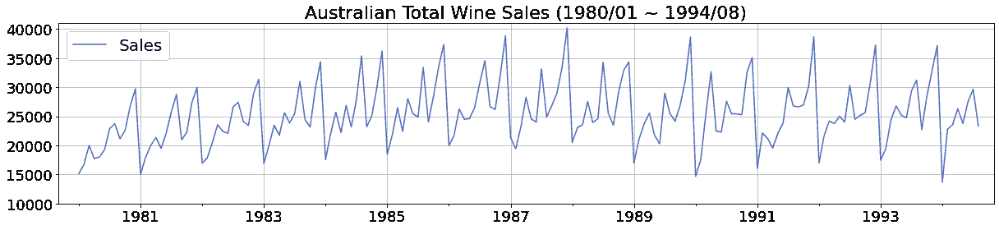
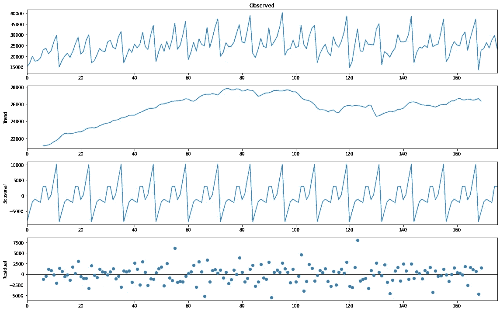
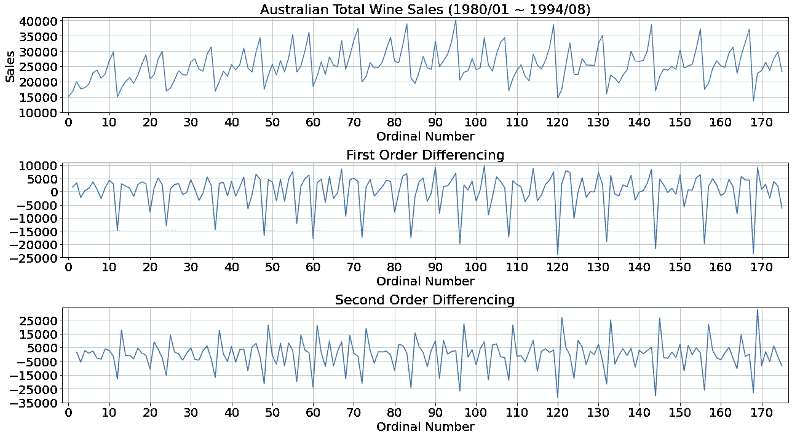
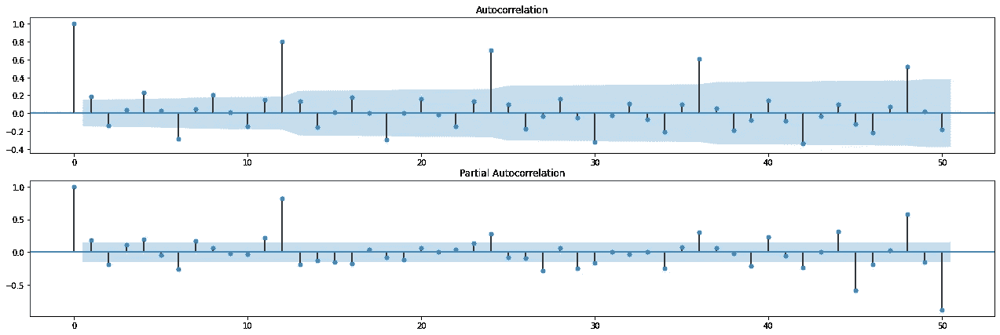
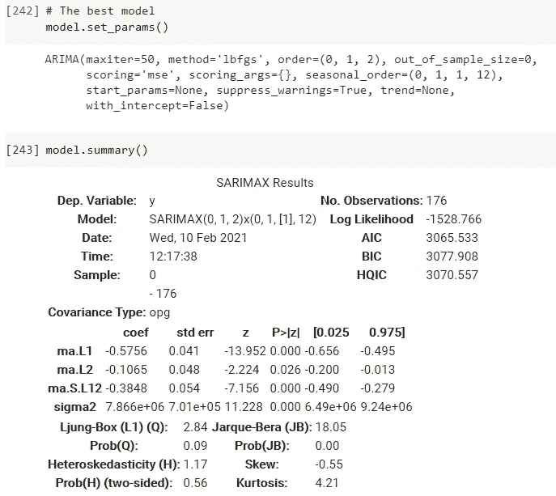
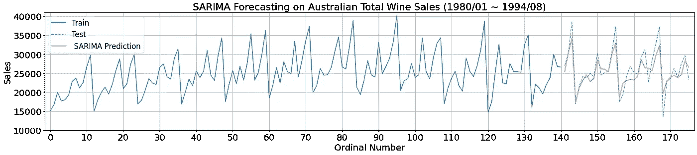
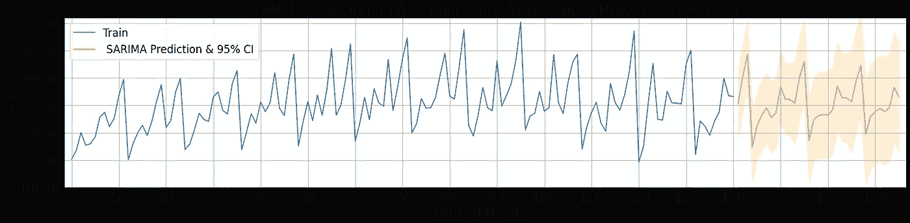
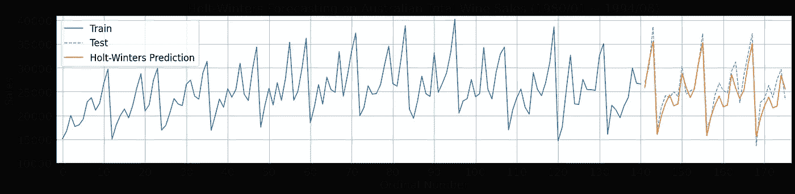
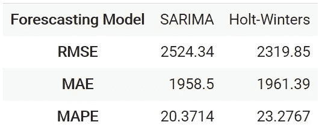

# ML22:使用 Python 进行预测和时间序列分析

> 原文：<https://medium.com/analytics-vidhya/ml22-6318a9c9dc35?source=collection_archive---------6----------------------->

## 霍尔特-温特斯、萨里玛、ARIMA 汽车、ACF、PACF 和差异

**关键词:** Holt-Winters，指数平滑，SARIMA，自动 ARIMA，Pmdarima，ACF，PACF，差分，季节分解

**Colab 上的完整 Python 代码**:[https://bit.ly/371pUN5](https://bit.ly/371pUN5)

我们假设读者已经熟悉时间序列理论，包括 SARIMA 和 Holt-Winters；如果没有，查看参考文献[3][5][7][9][13]以了解更多细节。因此，我们主要强调如何用 Python 进行预测和时间序列分析。我们开始吧！

在传统的时间序列领域(比较 RNN、LSTM、GRU 等前沿预测方法)，Python 仍然像一个青少年，而 R 已经像一个成年人了。幸运的是，有一些像`**pmdarima**`这样的新兴 Python 模块，从 2017 年开始，由*泰勒 G 史密斯*等人开发，帮助将 R 的时间序列代码转换成 Python 代码。

> ***概要*** *(1)新模块:pmdarima
> (2)玩具数据集:澳大利亚葡萄酒总销量
> (3)使用移动平均值的季节分解
> (4)平稳性:一阶和二阶差分
> (5) AR 和 MA: ACF & PACF
> (6)使用来自 pmdarima
> 的自动 arima 函数的 SARIMA(7)使用 SARIMA&Holt-的预测*

# *(1)新模块:pmdarima*

`**pmdarima**`将 R 钟爱的`**auto.arima**`引入 Python，更有力地证明了为什么数据科学不需要 R。`**pmdarima**`是 100% Python + Cython，不利用任何 R 代码，但在一组功能强大但易于使用的函数&类中实现，scikit-learn 用户将熟悉这些类。[11]

# (2)一个玩具数据集:澳大利亚葡萄酒总销售额

澳大利亚酿酒商瓶装葡萄酒总销售额<= 1 liter. This time series records monthly wine sales by Australian winemakers between Jan 1980 — Aug 1994\. This dataset is found in the R 【 package. [12]

```
import numpy as np
import matplotlib.pyplot as plt
import pandas as pd
import pmdarima as pmy = pm.datasets.load_wineind()datetime_1 = pd.period_range('1980-01', periods=176, freq='M')
dataset_wine = pd.DataFrame(data={'sales': y}, index=datetime_1)
```



# (3) Seasonal Decomposition using Moving Averages [1][6]

A time series is said to be comprised of the following three major components:

> *1。季节性
> 2。趋势
> 3。残留*

在下面的代码片段中，我们利用`**statsmodels**`将澳大利亚葡萄酒总销售额时间序列分解为三个组成部分，并绘制它们。



现在，因为我们得到了时间序列分析的鸟瞰图，我们接着分解澳大利亚葡萄酒总销售额的时间序列分析。

# (4) *平稳性:一阶和二阶差分*

一个萨里玛模型看起来像 **ARIMA(1，1，2)(0，0，0)[12]** ，可以用一般形式 **ARIMA(p，D，q)(P，D，Q)[s]** 来表示。

> *1。平稳性术语:****d*** *2。AR 术语:****p*** *3 .马术语:* ***问***

首先，我们需要通过检查序列是平稳的还是非平稳的来决定上面模型中的 **d** 的值。为此，我们首先想到的是一阶和二阶差分。尽管如此，很难主观地判断在哪个图表上序列从非平稳转变为平稳，因为许多人仅仅通过检查下图就可以确定 **d** = 0 或 1 或 2。



因此，有简单而精确的方法来确定 **d** 的值。下面是片段和我们得到的。

```
# Stationarity
from pmdarima.arima import ndiffs as ndiffs# test =  (‘kpss’, ‘adf’, ‘pp’)print('KPSS: d =', ndiffs(dataset_wine_array, alpha=0.05, test='kpss', max_d=2)) # d = 1\. Indicating non-stationary sequence
print('ADF: d =', ndiffs(dataset_wine_array, alpha=0.05, test='adf', max_d=2)) # d = 0\. Indicating stationary sequence
print('PP: d =', ndiffs(dataset_wine_array, alpha=0.05, test='pp', max_d=2)) # d = 0\. Indicating stationary sequence
```

> *KPSS:****d****= 1
> ADF:****d****= 0
> PP:****d**= 0***

然后我们选择 KPSS 的结果，d=1，因为 KPSS 是一个相对更先进的技术。然而，您稍后会知道，一旦我们在新的 Python 模块`**pmdarima**`中利用了`**auto.arima**`函数，这里的分析就无关紧要了。

# (5)应收账款和并购:ACF 和 PACF

手头有了 **d** = 1，然后我们继续寻找**p**(AR)&**q**(MA)。

```
import pandas as pd
import matplotlib.pyplot as plt
import statsmodels.api as smfig, ax = plt.subplots(2,1,figsize=(22,6), sharex=False)
sm.graphics.tsa.plot_acf(dataset_wine_array, lags=50, ax=ax[0])
sm.graphics.tsa.plot_pacf(dataset_wine_array, lags=50, ax=ax[1])
plt.show()
```



我们可以通过上图确定**p**(AR)**&**q**(MA)的值就像你从一些时间序列的文章中看到的一样，不过还是有点主观。因此，在接下来的段落中，解决方案——从 r 派生的新 Python 模块`**pmdarima**`中的`**auto.arima**`函数**

# **(6) *SARIMA 使用 pmdarima 的自动 ARIMA 功能【11】【13】***

```
# Fit the model
model = pm.auto_arima(dataset_wine_array, seasonal=True, m=12, 
                      information_criterion='aic', test='kpss',
                      suppress_warnings=True, trace=True)# The best model
model.set_params()model.summary()
```

****

**最后，通过`**pm.auto_arima()**`我们得到最佳模型 **ARIMA(0，1，2)【0，1，1】【12】**相当毫不费力与 **p(AR)** =0， **d** =1， **q(MA)** =2。**

# ***(7)* *用萨里玛预测&霍尔特-温特斯***

## **7–1 使用 SARIMA 进行预测[3][11][13]**

```
## SARIMA
from pmdarima.pipeline import Pipeline
from pmdarima.preprocessing import BoxCoxEndogTransformer
import pmdarima as pm

# Fit the model
model = pm.auto_arima(train, seasonal=True, m=12, 
                      information_criterion='aic', test='kpss',  
                      maxiter=150,
                      suppress_warnings=True, trace=True, verbose=1)pred_SARIMA_conf_int = model_SARIMA.predict(test.shape[0], return_conf_int=True)[1]# Make forecasts
pred_SARIMA = model_SARIMA.predict(test.shape[0])  # predict N steps into the future# Confidence interval
pred_SARIMA_conf_int = model_SARIMA.predict(test.shape[0], return_conf_int=True)[1]
lower_limits = [k[0] for k in pred_SARIMA_conf_int]
upper_limits = [k[1] for k in pred_SARIMA_conf_int]
```

********

## **7–2 使用霍尔特-温特斯进行预测[3][7]**

```
## Holt-Winters
from statsmodels.tsa.holtwinters import ExponentialSmoothingmodel_HW = ExponentialSmoothing(train,  trend='add', seasonal='add', seasonal_periods=12, damped_trend=True).fit(optimized=True, use_boxcox=False, remove_bias=False)pred_HW = model_HW.predict(start=train.shape[0], end=dataset_wine_array.shape[0]-1)
```

****

**迄今为止，`**ExponentialSmoothing**`还没有像`**pm.auto_arima**`那样产生 95%置信区间的参数。[2]**

## **7–3 模型评估— RMSE、缅因州、MAPE**

****

**霍尔特-温特斯在 RMSE 方面胜过萨里玛。**

# **(8)参考文献**

**[1]布朗利，J. (2020)。如何将时间序列数据分解为趋势性和季节性。从 https://bit.ly/2N9yRgi[取回](https://bit.ly/2N9yRgi)**

**[2]瑞安·博奇(2020)。预测区间指数平滑统计模型。从 https://bit.ly/3rEMqmT[取回](https://bit.ly/3rEMqmT)**

**[3] tutorialspoint (2019)。时间序列。从 https://bit.ly/39WaDiw[取回](https://bit.ly/39WaDiw)**

**[4] QuantStats (2019)。在 jupyter 笔记本中并排显示 statsmodels plot_acf 和 plot_pacf。从 https://bit.ly/3cTEfz5[取回](https://bit.ly/3cTEfz5)**

**[5] Hyndman，R.J .，& Athanasopoulos，G. (2018)预测:原则与实践(第二版。).澳大利亚墨尔本。从 https://otexts.com/fpp2/[取回](https://otexts.com/fpp2/)**

**[6]萨卡尔博士，巴厘岛 r .和 t .夏尔马(2018 年)。使用 Python 的实用机器学习:构建真实世界智能系统的问题解决者指南。印度卡纳塔克邦:新闻。**

**[7]艾汉(2018)。基于 stats 模型的霍尔特-温特斯时间序列预测。从 https://bit.ly/3cTKP8K[取回](https://bit.ly/3cTKP8K)**

**[8] cel (2015)。使用 statsmodel 更改 fig 大小。从 https://bit.ly/3pWB2SW[取回](https://bit.ly/3pWB2SW)**

**[9]w .麦金尼、j .佩克托尔德和 s .西博尔德(2011 年)。用 Python 和 statsmodels 进行时间序列分析。从 https://bit.ly/3utCUW1[取回](https://bit.ly/3utCUW1)**

**[10]pypi.org(身份不明)。pmdarima。从 https://bit.ly/3aQrdjk[取回](https://bit.ly/3aQrdjk)**

**[11] Smith，T.G .等人(身份不明)。pm darima:Python 的 arima 估值器。从[https://bit.ly/2N5RgKO](https://bit.ly/2N5RgKO)取回**

**[12] Smith，T.G .等人(身份不明)。pmdarima.datasets.load_wineind。从 https://bit.ly/2N5XZVc[取回](https://bit.ly/2N5XZVc)**

**[13] Smith，T.G .等人(身份不明)。使用 auto_arima 的提示。从 https://bit.ly/3cZXreE[取回](https://bit.ly/3cZXreE)**

**[14] statsmodels(身份不明)。statsmodels v0.12.1。从[https://bit.ly/2NaDzKD](https://bit.ly/2NaDzKD)检索**

# **(中文)**

**[15] 陳景祥 (2018)。R 軟體：應用統計方法 (第二版)。台北：東華書局。**

**[16] yuxiangyu (2017)。在 Python 中如何差分时间序列数据集。取自 [https://bit.ly/36SXrsU](https://bit.ly/36SXrsU)**