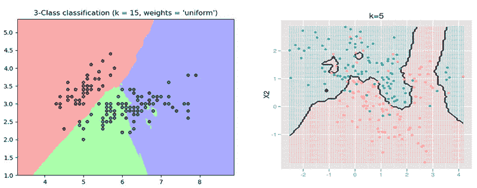
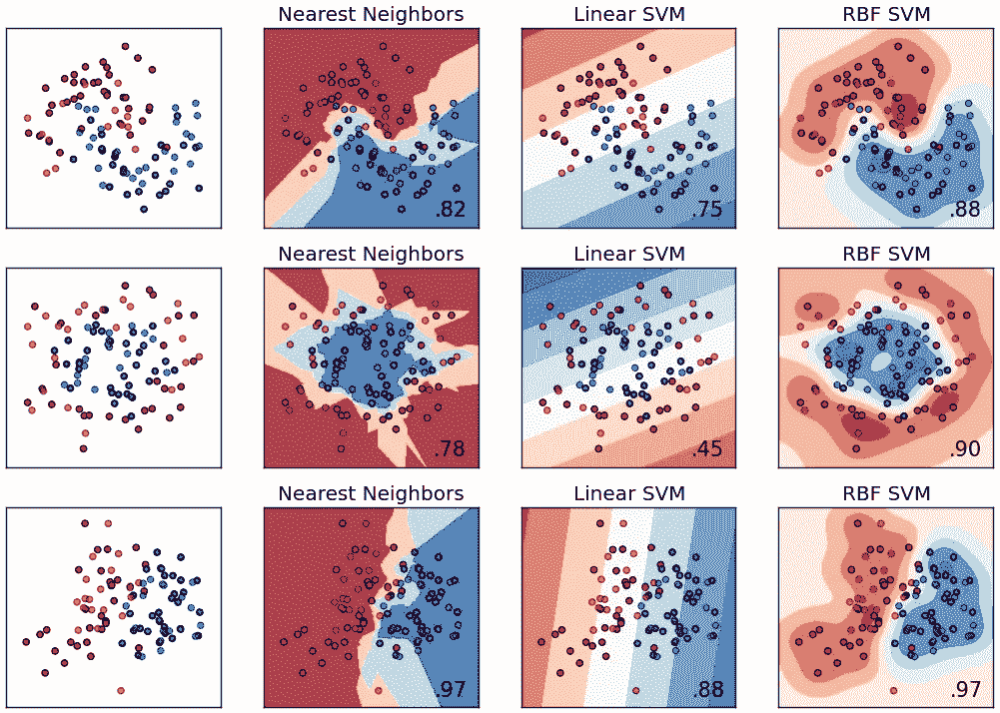
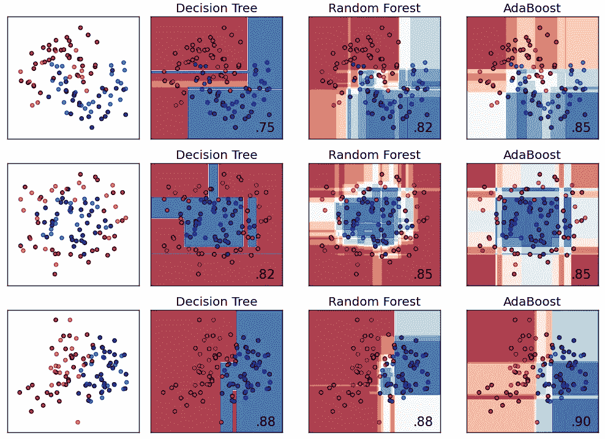
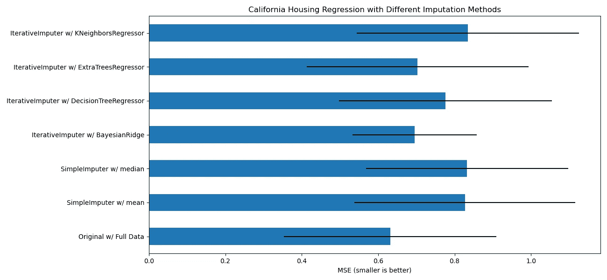

# ML23:处理缺失值

> 原文：<https://medium.com/analytics-vidhya/ml23-1b08fb0dd4b0?source=collection_archive---------16----------------------->

## 除了输入平均值、中间值或众数之外的方法

处理缺失值的常见方法包括丢弃和输入均值、中值或众数。还有类似 ***随机森林*** & ***贝叶斯岭*** 的高级方法。那么，如何确保处理缺失值的最佳实践避免欠拟合&过拟合？

> ***大纲*** *(1)*[*前提条件*](#7d5d) *(2)*[*两种缺失值*](#fcb1) *(3)*[*缺失值的处理方法*](#afa2) *(4)*[*插补在实践中*](#dd0f)

# (1)先决条件

## 1-1 术语[1][2]

**1。NA** =一个缺失值。代表*不可用*或*不适用*。

> 熊猫对象中缺失数据的表示方式有些不完美，但对很多用户来说是有用的。对于数字数据，pandas 使用浮点值 **NaN** (不是数字)来表示缺失的数据。我们称之为易于检测的标记值:
> 
> 在 pandas 中，我们采用了 R 编程语言中使用的一种约定，即**将丢失的数据称为 NA** ，表示**不可用**。在统计应用程序中，NA 数据可能是不存在的数据，也可能是存在但未被观察到的数据(例如，通过数据收集问题)。清理数据进行分析时，对缺失数据本身进行分析**通常很重要**以识别数据收集问题或由缺失数据导致的数据中的潜在偏差。[1]

2.**特征** = ML-specific term，统计学和经济学中又称为预测因子、自变量、解释变量、回归变量、外生或输入。
3。**目标** = ML 专用术语，在统计学和经济学中也称为响应、因变量、回归变量、内生变量或输出变量。
4。**数据点** = ML 专用术语，统计学上也叫观察或案例。数据点是数据帧中的一行。
5。**数据集/数据帧** =许多数据点组成一个数据集/数据帧。

## 1–2 数据类型[3]

一般来说，我们将数据分为两类:

[i] **数值数据**:连续&离散
【ii】**分类数据**:顺序&名义

此外，我们可以将数据分类为:

[i] **数值数据**:比率水平&区间水平
【ii】**分类数据**:序数水平&名义水平

然后，让我们探究这四个级别的数据:

1.  **比率级**:可以分类、排序，也可以加减乘除。*如收入。*
2.  **区间层次**:可以分类、排序以及加减。*不能乘除。*如摄氏温度。这种类型的数据很少，只有摄氏度，华氏度，很少有李克特量表。**
3.  ***序数级**:可以分类，排序。 ***不会*** 加减乘除。*如，一个调查的问题有 5 个选项，分别为 1~5 分。**
4.  ***标称等级**:只能分类。*例如，汽车的颜色。**

# *(2)两种缺失值[4][5]*

*实际上有三种:完全随机缺失(MCAR)、随机缺失(MAR)和非随机缺失(MNAR) [4][5]。但为了简单起见，我们重点介绍其中的两种: ***随机缺失*** & ***系统缺失*** ，即***MCAR******MNAR***分别。*

*问题来了:如何识别 NAs 是 MCAR 还是 MNAR？Zumel 和 Mount (2014)[5]指出:*

> *“如果您不知道缺失值是随机的还是系统的，我们建议假设差异是系统的，而不是尝试根据错误的传感器假设将值输入变量。”*

*简而言之，不失一般性，我们应该假设 NAs 是 MNAR。基于这个建议，我们现在深入研究数字数据和分类数据。*

*{A} **分类数据**:假设 NAs 是 MNAR，我们可以简单的将所有 NAs 归为一个特殊的类别。*

*{B} **数字数据**:假设 NAs 是 MNAR，那么我们的选择就很少了，这些方法会大大减少数字数据包含的信息，例如，将数字数据转换为类别数据，然后执行上面的过程。因此，在实际操作中，我们 ***往往假设数值型数据中的 NAs 在某种程度上是随机缺失的，并将其作为 MCAR*** ，然后我们可以用*均值*、*中位数*、*众数*或其他 ML 方法如*贝叶斯岭* & *随机森林*来估算 NAs。*

# *(3)缺失值的处理方法*

*让我们看一下缺失值插补方法。请记住，大多数方法*都假设 NAs 在某种程度上是随机缺失的*，并且可以被视为 MCAR。*

## *1.丢弃 NAs*

*这是最简单和最直观的方法，删除所有包含 NA 的数据点(所有行)。然而，这是一种毁灭性的方式，因为它削减了数据集的信息，并在数据集中产生偏见。*

## *2.均值/中值/众数插补*

*与丢弃包含任何 NA 的所有数据点相比，这种方法更好。一些缺点是减少方差，扭曲分布和减少观察到的关系。*

*[A] **数字数据**:平均值/中位数插补。*

*[B] **分类数据**:模式插补。*

## *3.热卡插补*

*很像 kNN [6]。平均优于均值/中值/众数插补。*

## *4.回归插补*

***优点**:比均值/中值/众数插补更精确。*

*缺点:低估方差，强化现有关系，减少一般化，变量必须有相关性才能产生有效值，估算值可能超出合理范围。*

## *5.多重插补*

> ***多重插补**是解决缺失数据问题的一种通用方法，可用于几个常用的统计软件包。它旨在通过创建几个不同的貌似合理的**估算**数据集并适当组合从每个数据集获得的结果，来考虑缺失数据的不确定性。[7]*

## *6.ML 算法插补*

*kNN，决策树，随机森林，BayesianRidge 等等。*

## *7.其他估算方法*

***7–1 创建“NAs”类别***

*如前所述，如果我们确定 NAs 是 MNAR，我们可以按如下方式处理分类数据和数值数据的 NAs:*

*{A} **分类数据**:假设 NAs 是 MNAR，我们可以简单地将所有 NAs 归为一个特殊的类别。*

*{B} **数字数据**:假设 NAs 是 MNAR，那么我们的选择就很少，这些方法会极大地减少数字数据包含的信息，例如，将数字数据转换为类别数据并执行上述过程。因此，在实践中，我们 ***往往假设数值型数据中的 NAs 在某种程度上是随机缺失的，并将其作为 MCAR*** ，然后我们可以用*均值*、*中位数*、*众数*或其他 ML 方法如*贝叶斯岭* & *随机森林*来估算 NAs。*

***7–2 将 NAs 转换成某个数字***

*这是针对数字数据的。如果你能够发现某种洞察力，例如，那些特征“收入”缺失的人大多是家庭主妇和学生，那么我们可以合理地将这些 NAs 转换为“0”。进一步，我们可以创建一个新的特征“income_NA”(称为屏蔽变量)，将那些“income”缺失的归类为“1”，其余的归类为“0”。*

# *(4)实践中的归责*

*接下来，我们现在从不同的来源进一步了解实际中缺失值的插补方法。*

## ***4–1 删除 NAs &均值/中值/众数插补***

*虽然处理缺失值是数据预处理中的一个重要步骤，但许多流行的 Python & R 书籍，如 McKinney (2018)、VanderPlas (2017)、Wickham 和 Grolemund (2016)以及 James G .等人(2013) [1][8][9][10]仅讨论了丢弃 NAs、均值/中值/众数插补和插值插补，而没有提及其他方法。*

## ***4–2 kNN***

**

*图 kNN 的决策边界[11]*

> *…我们可以使用机器学习来预测缺失数据的值。为此，我们将具有缺失值的特征视为**目标向量**，并使用剩余的特征子集来预测缺失值。虽然我们可以使用各种各样的机器学习算法来估算值，但最受欢迎的选择是 KNN 。[12]*

*Albon(2018) [12]指出，kNN 是缺失值插补的流行选择。然而，就我而言，kNN 是一种懒惰的学习方法，耗时，只适合小规模数据集。此外，我不认为 kNN 会优于 RF，RF 更有效，工作方式相似，平均而言，参考以下两幅图中描述的 kNN、SVM(线性)、SVM (RBF)、决策树、随机森林、AdaBoost 的决策边界。*

****

*图 2 & 3:不同模型的决策界限[13]*

## *4–3 毫升插补方法*

*sk learn . impute . iterative imputr 的文档介绍了一种测试，用于测量著名的“加州住房”数据集上各种插补方法的均方误差[14]。以下排名展示了意想不到的发现:*

*BayesianRidge ≈树外回归因子>决策树回归因子>近邻回归因子≈平均值≈中值*

**

*图 4:插补方法的比较[14]*

1.  ***BayesianRidge** :根据文档，这可以视为贝叶斯多重插补+正则项(lasso & ridge)。*
2.  ***extractreesregressor**:类似于 r 中的 *missForest( )* ，另外 *missForest( )* 接近使用 *rf* 的*mice()*；然而， *missForest( )* 的文档指出“它可以并行运行以节省计算时间。”因此， *missForest( )* 可以看作是使用 *rf* 的 *mice( )* 的高效版本。*
3.  *决策树回归器:决策树。*
4.  ***KNeighborsRegressor**:kNN。*

# *(5)结论*

*在 Python 中，***Bayesian ridge***&***extractreesregressor*of****sk learn . impute . iterative import*可能是输入缺失值的最佳选择。在 R 中， ***missForest( )*** 包***miss forest***&包***mouse 或者 VIM*** 中的贝叶斯相关方法都是必须尝试的方法。**

# **(6)参考文献**

**[1]麦金尼，W. (2018)。*用于数据分析的 Python:与 Pandas、NumPy、IPython 的数据角力*。加利福尼亚州:奥赖利媒体。**

**[2]程，T. C .(身份不明)。NCCU 统计系研究生水平课程*应用回归分析*讲义。**

**[3]奥兹德米尔，s .，&苏萨拉，D. (2018)。*特色工程变得简单*。英国伯明翰:Packt。**

**[4]阿尔邦，C. (2018)。*使用 Python 的机器学习食谱:从预处理到深度学习的实用解决方案*。加利福尼亚州:奥赖利媒体。**

**[5]新泽西州祖梅尔和新泽西州芒特(2014 年)。*实用数据科学带 R* 。纽约州谢尔特岛:曼宁。**

**[6] Kowarik，a .，& Templ，M. (2016 年)。*用 R 包 VIM 进行插补*。统计软件杂志，74 卷 7 期。从 https://bit.ly/3cqv7Qy[取回](https://bit.ly/3cqv7Qy)**

**[7] Sterne，J.A.C .，R . White I . R .等人(2009 年)。*流行病学和临床研究中缺失数据的多重插补:潜力和陷阱*。从 https://bit.ly/30EFmv6[取回](https://bit.ly/30EFmv6)**

**[8]范德普拉斯，J. (2017 年)。 *Python 数据科学手册:处理数据的基本工具*。加利福尼亚州:奥赖利媒体。**

**[9]韦克汉和格罗勒蒙德(2016 年)。 *R 为数据科学*。加利福尼亚州:奥赖利媒体。**

**[10]詹姆斯等人(2013 年)。统计学习介绍:在 R 中的应用。纽约州纽约市:斯普林格。**

**[11]亚马逊(2018)。*亚马逊 SageMaker 支持 kNN 分类和回归*。从 https://amzn.to/2Oy6nhp[取回](https://amzn.to/2Oy6nhp)**

**[12]与[4]相同**

**[13]托马斯，M. (2016 年)。比较分类器。从 https://bit.ly/2OPx5lw[取回](https://bit.ly/2OPx5lw)**

**[14]scikit-learn.org(身份不明)。用迭代输入器的变量输入缺失值。从 https://bit.ly/3qLx4fu[取回](https://bit.ly/3qLx4fu)**