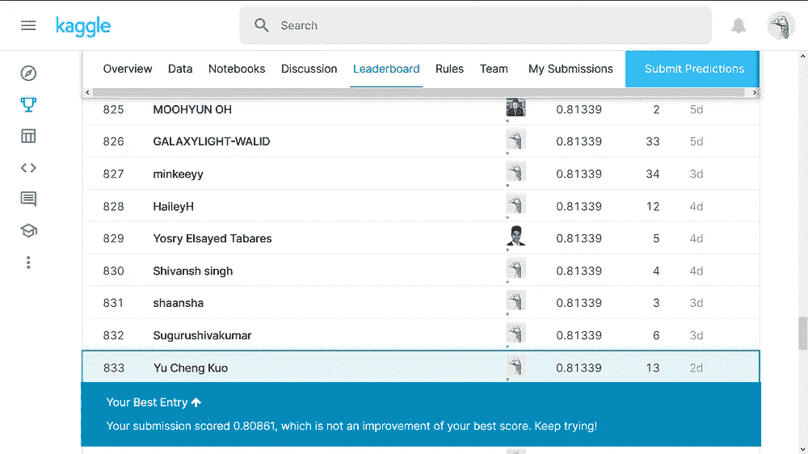
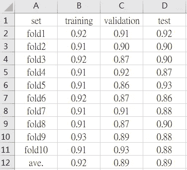
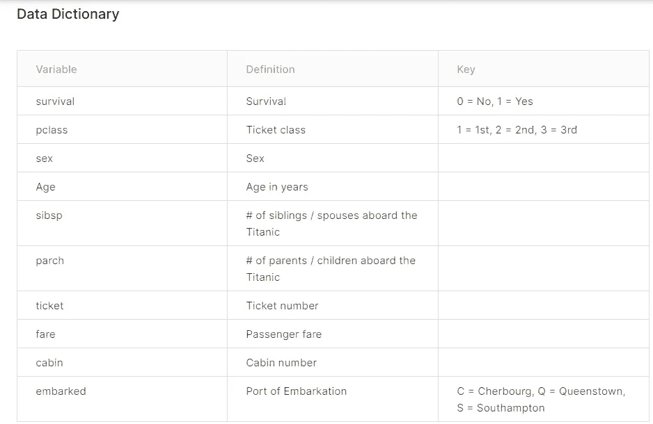

# ML24:Kaggle 上《泰坦尼克号》的前 4%

> 原文：<https://medium.com/analytics-vidhya/ml24-7f32a79eb024?source=collection_archive---------23----------------------->

## 将交互添加到随机森林

查看 GitHub 上的库以获得完整的细节。

*   在 2020/05 年的[泰坦尼克号:机器从灾难中学习](https://www.kaggle.com/c/titanic)中排名前 4 % (833/22219)，这是 Kaggle 上一个标志性的入门级比赛。这个项目是*和 R* 一起进行的。
*   这实际上是 NCCU CS 系*研究生层次*课程*“数据科学】*的一个作业。另外我这门课考了 ***96 (A+)*** 。



图 1 和 2:在 Kaggle 上泰坦尼克号的公共排行榜上排名前 4%。

我在三向分割下使用 10 倍随机森林得到了 0.89 的测试数据准确性。



图 Kaggle 给出的整个数据集的分数。

> ***概要*** *(1)特征简介
> (2)缺失值插补
> (3)特征工程
> (4)特征提取
> (5)模型选择*

# (1)特性介绍



图 4:特性的细节。

这张快照拍摄于 2021 年 3 月。特征“名称”在这一点上已经被删除。在这 10 个变量中，“生存”显然是目标，其余 9 个变量都是特征。所以在我做这个项目的时候(2020/05 ),我有 10 个特点。

# (2)缺失值插补

```
mice.data <- mice(Raw,
                  m = 1,            
                  maxit = 50,      # max iteration
                  method = "rf", 
                  seed = 188,
                  print=FALSE)
```

缺失值填补作为预处理中的一个重要步骤，却常常被搁置一旁。读者可以查看 [ML23:处理缺失值](https://morton-kuo.medium.com/ml23-1b08fb0dd4b0)，了解为什么正确处理缺失值会非常有帮助。

当然，我们可以用均值、中值或众数来估算缺失值；然而，有先进的 ML 算法插补方法可能会产生更好的结果。所以我用 r 中的*小鼠()*选择了*随机森林*。

# (3)特征工程

读者可以在 GitHub 上查看[资源库，了解这里的完整细节。通过分别检查目标“survival”和每个特征的交叉表，我能够揭示如何将非数字数据分成可由“survival”区分的类别。](https://github.com/mortonkuo/Top_4_pct_Titanic_Kaggle)

至于数字数据，实际上，我已经尝试过对数转换和将数字数据转换成分类数据，但都不起作用。

# (4)特征提取

利用高阶术语和交互的逐步线性回归(使用 stepwise())，我能够选择一些有影响的特性。

我认为 ***这一部分可能是我仅仅使用一个模型*** (随机森林)而没有利用堆叠获得前 4%排名的原因。*在随机森林*中加入互动，这是一个颇具创意的举动，可能会导致成功。

# (5)型号选择

然后，我将这些有影响的特征输入到模型中，并在每个模型中尝试这些特征的组合。我尝试的模型从朴素贝叶斯、线性回归、SVM、随机森林、XGBoost 到神经网络。最终，我发现随机森林产生了最好的结果。

这里有几个我见过的最好的模特。请注意，我*甚至没有采用堆叠*但已经获得了令人满意的前 4% (833/22219)排名。

```
fold1_rf   = randomForest( Survived ~ Title + Family_size:Sex_Survival + Fare + Embarked , data= Titanic_train , ntree = 1000, importance = F)fold1_rf01 = randomForest( Survived ~ Title + Family_size:Sex_Survival + Fare + Embarked , data=Titanic_train , ntree = 1000, importance = F)fold1_rf02 = randomForest( Survived ~ Title + Family_size:Sex_Survival + Fare:Age + Embarked + Ticket_02 , data=Titanic_train , ntree = 1000, importance = F)
```