# ML25:Kaggle 上“给我一些奖励”排名前 7 %

> 原文：<https://medium.com/analytics-vidhya/ml25-d954b17a349a?source=collection_archive---------12----------------------->

## 利用两层堆叠的 LR、RF、XGBoost

*   ***这条是高度简化的*** 。查看[GitHub 上的知识库获取完整信息](https://github.com/mortonkuo/Top-7-pct_Give-Me-Some-Credit_Kaggle)。
*   在彻底的特性工程之后，我利用了 LR、RF & XGBoost，然后做了一个双层堆叠。最后，我在公开排行榜上得到了***14.83%(17/924)****，在私人排行榜*上得到了***6.82%(63/924)****，相当于在这场漫长的封闭比赛中得到了一枚 ***铜牌*** 。*

> ***轮廓*** *(1)简介
> (2)特色工程
> (3)选型:LR、RF&XGBoost*
> *(4)两层叠加
> (5)成果&排名
> (6)结论
> (7)参考文献*

# (1)引言

*   这是 2011 年 Kaggle 上的一场[封闭比赛](https://www.kaggle.com/c/GiveMeSomeCredit/overview)。竞争者被要求根据目标为(0，1) = (93.32%，6.68%)的不平衡数据集预测信用违约。因此，模型评估指标是 AUC。
*   我在 2020/06 年做了这个项目，作为 NCCUMIS*部门*研究生水平*课程“商业数据分析的 R 计算”的最终项目。另外我这门课考了 ***97 (A+)*** 。*

# *(2)特征工程*

*   调整异常值。
*   取所有特征的 log()，因为它们大多是正偏斜的。

## 特征工程之前的 2-1 EDA

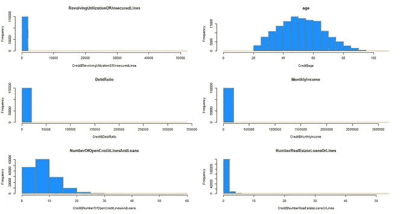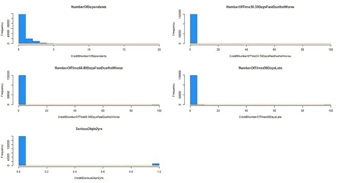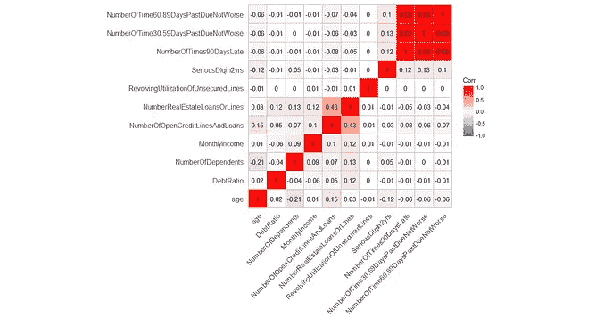

## 特征工程后的 2–2 EDA

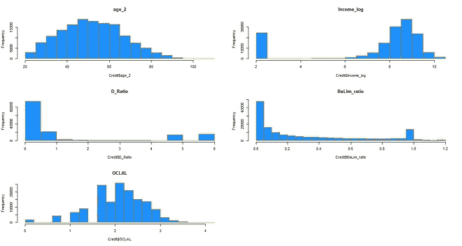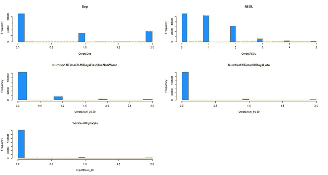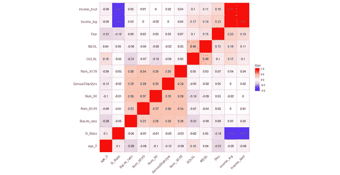

# (3)型号选择:LR、RF 和 XGBoost

## 3–1 逻辑回归

生成更高阶的术语以及交互作用，然后利用逐步逻辑回归(双向)来选择有影响的特征。然后，基于 AIC、BIC 和特征的 p 值选择特征。

## 3-2 个树状方法:RF 和 XGBoost

从 XGBoost 优于 RF 这一事实，我们得出结论，该数据集的*噪声可以忽略不计*。确认噪声存在与否可能会对调整产生完全不同的影响。

# *(4)两层堆叠*

采用两层堆叠。先用 mean 分别得到 *LR* 、 *RF* & *XGBoost* 车型的叠加。接下来，把几个 ***LR_stacking*** ，***RF _ stacking***&***XGBT _ stacking***放在一起，用 mean 再做一次堆叠。然后，我们获得最终的 AUC 结果。

# (5)结果 *&排名*

在这里显示结果。

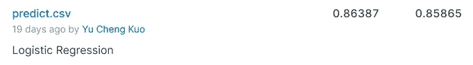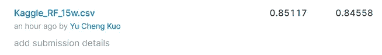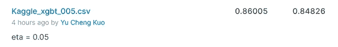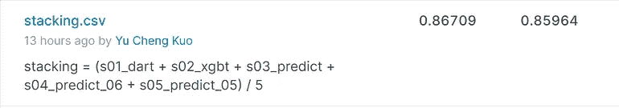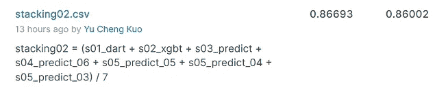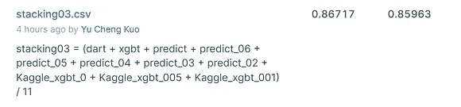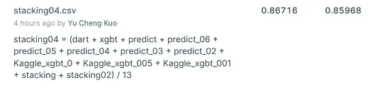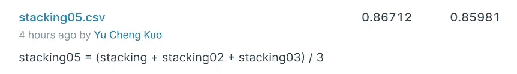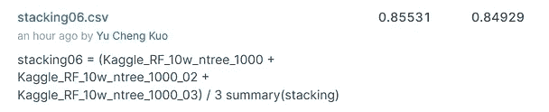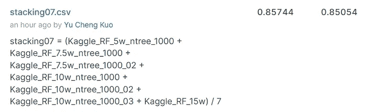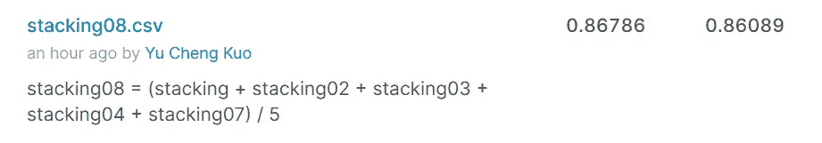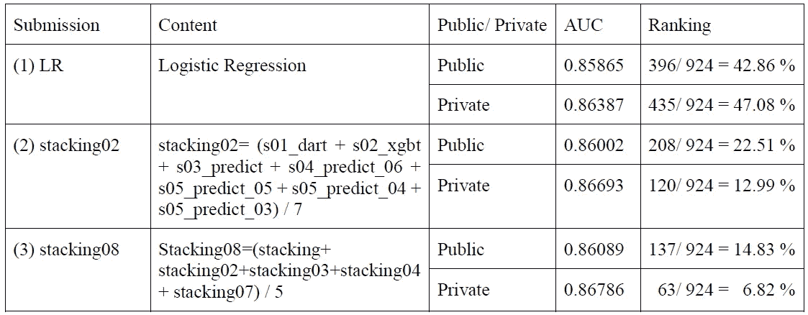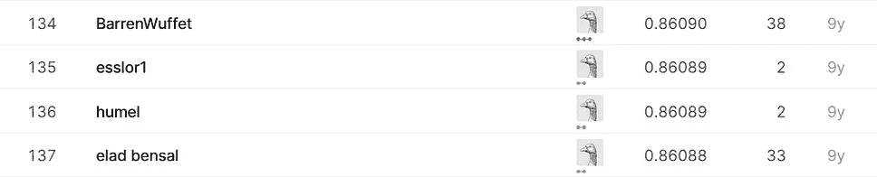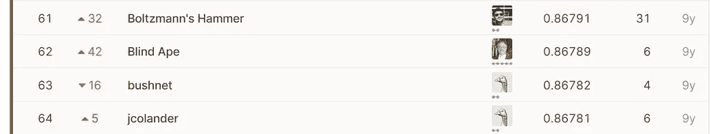

*   在彻底的特性工程之后，我利用了 LR、RF & XGBoost，然后做了一个双层堆叠。最后我在公开排行榜上得了 14.83% (17/924)，在私人排行榜上得了 6.82% (63/924)，相当于在这个漫长的封闭比赛中得了一枚铜牌。

# (6)结论

*   我们选择公共排行榜上 **14.83% (137/924)** 的公共成绩最好的一个，对应在私人排行榜上达到 **6.82% (63/924)** ，相当于在这场漫长的封闭比赛中获得一枚铜牌。
*   我们*可能会在 RF & XGBoost 模型中添加交互*以获得更好的性能。

# (7)参考文献

1.  奥兹德米尔，s .，苏萨拉，D. (2018)。使特征工程变得容易。
2.  郑，a，卡萨瑞 A. (2018)。机器学习的特征工程。
3.  Bonaccorso，G. (2017 年)。机器学习算法(第二版。).英国伯明翰:Packt 出版公司。
4.  马萨诸塞州布鲁纳托的巴蒂蒂(2017 年)。学习加智能优化平装本。意大利特伦托:特伦托大学 LIONlab。
5.  n . Mount，J. (2014)实用数据科学与 r。
6.  Kaggle 上数据集“给我一些信任”(2011)的在线论坛。从 https://bit.ly/3eWviGl[取回](https://bit.ly/3eWviGl)